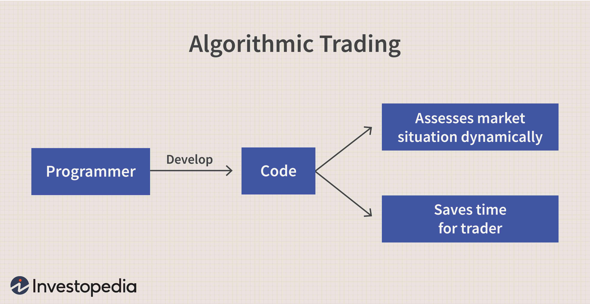

Algorithmic trading has fundamentally transformed the financial markets over the past few decades. By leveraging the power of computers and sophisticated algorithms, trades can now be executed at speeds impossible for human traders and on a scale that significantly enhances market liquidity and efficiency. As technology continues to advance, the understanding and optimization of these algorithms have become essential skills in navigating today's markets.

Algorithmic trading, often termed 'algo trading', involves the use of automated instructions to execute trades based on predetermined criteria. These criteria commonly include timing, price, quantity, or any combination thereof, rooted in complex mathematical and statistical models. Consequently, the need to distinguish these trades from conventional, human-driven trades has become increasingly important. Identifying specific algorithmic trades involves recognizing high-speed executions and large quantities that are often beyond human capabilities.



This article focuses on the nuances of identifying algorithmic trading activities, setting them apart from other trading methods within the expansive landscape of algorithmic trading. We examine what characterizes algorithmic trades and highlight the distinguishing features that allow insider knowledge of their presence in the market. Recognizing such activities is crucial in understanding their significance and impact in contemporary trading environments.

Spotting these trades can provide insights into market dynamics and assist traders and regulators in making more informed decisions. It also helps in identifying possible market manipulations that could influence market stability. Moreover, understanding algorithmic trading patterns and their prevalence is key to managing market risks associated with sudden volatility and liquidity fluctuations.

As we continue to explore these aspects, the focus will remain on how algorithmic trading fits within the broader scope of financial activities and the measures employed to identify and understand its implications in today's fast-paced markets.

## Table of Contents

## What is Algorithmic Trading?

Algorithmic trading, commonly known as 'algo trading,' leverages computerized systems to execute trades based on pre-set criteria and algorithms. These criteria often involve the assessment of timing, price, and quantity, alongside various mathematical models that aim to forecast market movements and optimize trade execution. 

Algorithms used in trading can range from simple rules and triggers to complex strategies that incorporate elements of statistical and [machine learning](/wiki/machine-learning) models. For instance, a basic algorithm might initiate a buy order if a particular stock falls below a certain price threshold, whereas more sophisticated systems might analyze a confluence of technical indicators, market conditions, and historical data patterns to predict future price movements and determine the precise moment to execute a trade.

The rapid decision-making capabilities of [algorithmic trading](/wiki/algorithmic-trading) systems have markedly increased market efficiency by facilitating higher volumes of trades, reducing bid-ask spreads, and providing [liquidity](/wiki/liquidity-risk-premium). These systems operate at speeds beyond human capability, often executing trades in microseconds. This high-frequency trading ([HFT](/wiki/high-frequency-trading-strategies)), a subset of algorithmic trading, epitomizes the velocity and [volume](/wiki/volume-trading-strategy) at which algo trading can operate.

A fundamental aspect of algorithmic trading is that it is not limited to equity markets but is widely prevalent across a variety of financial markets including foreign exchange ([forex](/wiki/forex-system)), commodities, and bonds. As algo trading systems become more sophisticated, they are increasingly credited with enhancing the overall efficiency of financial markets by enabling faster execution and by contributing to price discovery and stability.

Understanding the fundamentals of algorithmic trading is crucial for identifying specific algorithmic trades. These fundamentals include recognizing the inputs that drive the algorithms — be it price trends, volume, or market sentiment — and understanding how these inputs are processed by the algorithm’s logic to make trade decisions. With a firm grasp of these elements, it becomes feasible to discern algorithmic trades and differentiate them from regular human-initiated trades.

## Distinguishing Algorithmic Trades from Regular Trades

Algorithmic trading has become a cornerstone of financial markets, characterized by its ability to execute trades with high speed and precision. Distinguishing these trades from regular, human-initiated trades requires an understanding of several key indicators.

One primary indicator of algorithmic trades is the speed at which they are executed. Unlike human traders, who require time to analyze and implement trading decisions, algorithms can execute trades in fractions of a second. This speed is often achieved through direct market access and high-frequency trading technology, allowing for swift responses to market conditions. 

In addition to speed, algorithmic trades are frequently executed in large volumes, often split into smaller orders to minimize market impact and reduce transaction costs. This fragmentation can be an indication of an algorithm at work, as the trades are designed to be less noticeable on the [order book](/wiki/order-book-trading-strategies).

Data patterns are another crucial element in spotting algorithmic trading. Unusual price movements or spikes in trading volume may suggest the operation of an algorithm. These anomalies typically occur when algorithms react to market conditions or events with a frequency and volume beyond typical trading ranges.

Repetition and precision are behaviors commonly associated with algorithmic trades. Algorithms can systematically execute trades following specific patterns or criteria, consistently across various securities or time frames. This contrasts with human trading, which might be more sporadic or intuitive.

The differences between human-initiated and algorithm-driven trades can be further highlighted through comparative analysis. Human traders often rely on qualitative analysis and personal intuition, whereas algorithms operate strictly on quantitative data and predefined rules. This fundamental difference affects the decision-making process, execution speed, and the ability to react to fleeting market opportunities.

These distinctions allow market participants to better comprehend and possibly predict the impact of algorithmic activities, thereby crafting more informed trading strategies. Spotting algorithmic trading involves recognizing these traits and utilizing analytical techniques to monitor and discern patterns that might not be evident through a casual observation of market data.

## Tools and Techniques to Spot Algorithmic Trading

Algorithmic trading detection has become an essential aspect of the modern financial landscape, given the significant role algorithmic trades play in today's markets. Identifying these trades involves utilizing various tools and techniques, ranging from sophisticated software to advanced statistical analyses and machine learning models.

One of the primary methods to detect algorithmic trading patterns is through specialized software. These tools analyze large datasets in real-time, identifying patterns indicative of automated trading activities. Platforms such as Trade Surveillance Systems and Real-time Market Monitoring Solutions are designed to flag unusual trading behaviors, high-frequency trades, and other anomalies.

Statistical analysis techniques play a critical role in spotting algorithmic trading. Correlation analysis helps identify the relationship between different securities or market factors, which can indicate coordinated trading strategies used by algorithms. For instance, if two securities consistently move together beyond normal market relations, it might suggest an algorithmic strategy. Regression analysis, on the other hand, can model the expected behavior of stock prices and volumes, helping detect deviations that may result from algo trades.

Machine learning models have emerged as powerful tools to predict and identify algorithmic trading. By training models such as Decision Trees, Random Forests, or Neural Networks on historical trading data, these systems can learn to recognize the subtle indicators of algorithmic operations. A common approach involves using supervised learning methods, where models are trained on labeled datasets containing identified algorithmic trades. Once trained, these models can process new data to detect similar trading patterns.

Artificial intelligence (AI) is a key contributor to the development of algorithms capable of tracking other algorithms. With AI, systems can be designed not only to recognize existing algorithmic trading patterns but also to adapt to new and evolving strategies. For example, anomaly detection can be enhanced by AI to continuously adapt to the normal trading behavior and identify anything that deviates significantly, potentially flagging it as algorithmic.

In Python, a simplified version of implementing a Machine Learning model might look like this:

```python
from sklearn.ensemble import RandomForestClassifier
from sklearn.model_selection import train_test_split
from sklearn.metrics import accuracy_score

# Sample data loading
data = ... # pandas DataFrame containing trading data
features = data.drop('target', axis=1)
target = data['target']

# Splitting data
X_train, X_test, y_train, y_test = train_test_split(features, target, test_size=0.3, random_state=42)

# Initializing and training the model
model = RandomForestClassifier(n_estimators=100, random_state=42)
model.fit(X_train, y_train)

# Making predictions
predictions = model.predict(X_test)

# Evaluating model
accuracy = accuracy_score(y_test, predictions)
print(f"Model Accuracy: {accuracy * 100:.2f}%")
```

This code outlines the process of using a Random Forest classifier to detect patterns representative of algorithmic trading. While this is a basic demonstration, actual implementations would require extensive feature engineering and model optimization to handle the complexity and volume of real trading datasets.

The evolution of these detection methods underscores the need for constant adaptation in the face of advancing algorithmic strategies. As algorithms become more sophisticated, the tools and techniques to identify them will continue evolving, integrating new technological and methodological innovations.

## The Significance of Identifying Algorithmic Trading

Algorithmic trading's critical role in modern financial markets necessitates understanding its identification. Open identification of algorithmic trades can offer numerous advantages for traders and regulators by enhancing market transparency and integrity.

Firstly, algorithmic trading presents potential market manipulation concerns. Algorithms can execute trades at speeds beyond human capability, leading to activities like spoofing, where large orders are placed and canceled to manipulate prices. Open identification can deter such practices by making them easier to detect and penalize, thereby fostering a fair trading environment. The Commodity Futures Trading Commission (CFTC) and other regulatory bodies continuously monitor these activities, highlighting the importance of transparent reporting mechanisms to prevent malpractices.

Secondly, algorithmic trading significantly impacts market [volatility](/wiki/volatility-trading-strategies) and liquidity. While these trades can enhance liquidity by facilitating faster transactions and tighter spreads, they can also exacerbate volatility during periods of instability. For example, the Flash Crash of 2010 demonstrated how algorithmic trades could rapidly destabilize markets, causing abrupt price swings. Identifying and monitoring these trades enables market participants to better anticipate and mitigate such risks, contributing to a more stable trading environment.

Furthermore, spotting algorithmic trades can substantially improve strategic trading decisions. Traders equipped with knowledge of algorithmic patterns can adapt their strategies to either align with or counteract these trades. For instance, if a trader identifies a repetitive algorithmic pattern influencing stock prices, they might adjust their buying and selling tactics accordingly to optimize profit margins. By capturing the nuances of algorithm-driven movements, traders can enhance their capability to predict market trends and make informed decisions.

Overall, the identification of algorithmic trades supports a transparent, efficient, and competitive marketplace that benefits multiple stakeholders. As algorithmic trading continues to evolve, so too should the tools and methodologies that facilitate its monitoring, ensuring markets that are both dynamic and secure.

## Challenges in Spotting Algorithmic Trading

Algorithmic trading represents a complex interplay of advanced technologies and sophisticated strategies designed to outpace human capabilities in financial markets. These algorithms often operate on intricate mathematical models, posing significant challenges in detection and analysis. Given their sophistication, identifying such trades requires overcoming several hurdles.

**Complexity and Sophistication of Modern Algorithms**

Modern trading algorithms incorporate a variety of complex techniques, including machine learning, [artificial intelligence](/wiki/ai-artificial-intelligence), and high-frequency trading. These systems are not only capable of executing trades at incredible speeds but also adaptively optimize strategies in real-time based on market conditions. The rapid evolution of these technologies means that what was once considered a cutting-edge approach can quickly become outdated. This continuous progression necessitates a deep understanding of both the financial markets and the underlying computational methods.

**Limitations and Issues in Detection**

A primary limitation in spotting algorithmic trades is the prevalence of false positives. Traditional detection systems may flag normal market activities as being algorithmic in nature due to coincidental patterns or anomalies. This can occur when algorithms mimic human trading behaviors or when human traders inadvertently create algorithm-like patterns. Distinguishing these from genuine algorithmic trades requires advanced statistical and analytical techniques, but even these may not be infallible.

**Market Fragmentation and Data Accessibility**

Market fragmentation introduces its own set of challenges. With trading activities spread across various platforms and geographies, piecing together a comprehensive view of algorithmic trading activity is daunting. Each market may have differing regulations, data formats, and accessibility options, making it difficult to achieve a unified, coherent analysis. Moreover, the data required for thorough detection is often voluminous and may not be readily accessible due to privacy concerns or proprietary restrictions.

**Adaptation to Evolving Strategies**

Algorithms are constantly being refined and improved. Their developers continually tweak them to exploit new patterns and opportunities in the market. Consequently, detection systems must also evolve at a similar pace to remain effective. This requires investment in research and development, as well as the integration of emerging technologies like artificial intelligence to anticipate and identify the latest algorithmic strategies proactively.

In conclusion, spotting algorithmic trading is a multifaceted challenge that requires sophisticated tools and methodologies. Continuous innovation and adaptation are essential to cope with the dynamic nature of these trading algorithms and to ensure effective monitoring and regulation in financial markets.

## Future Trends in Algorithmic Trading Detection

The detection of algorithmic trading is poised for significant transformation as technology continues to evolve. Advances in artificial intelligence and machine learning are expected to enhance pattern recognition capabilities, enabling better identification of algorithmic trading activities. These technologies can process large volumes of data quickly, identifying complex patterns and anomalies that human analysts might miss. Machine learning algorithms can be trained to detect specific trading behaviors, adapting to new patterns as they emerge. This adaptability is crucial in a landscape where trading algorithms are continuously evolving.

Moreover, we anticipate a shift towards more stringent regulatory requirements aimed at ensuring transparency within algorithmic trading. Regulatory bodies might mandate comprehensive reporting of algorithmic strategies and the parameters guiding these trades. This development would necessitate the creation of more sophisticated detection tools to comply with these regulations, ultimately contributing to a fairer trading environment. Clearer regulatory guidelines can also foster innovation in developing compliance-based algorithms that automatically adhere to the standards set by oversight authorities.

Blockchain technology, with its inherent transparency and immutability, may offer promising solutions for identifying and tracking algorithmic trades. By recording trades on a decentralized ledger, blockchain can provide a permanent, verifiable record of each transaction. This transparency can deter manipulation and make it easier to audit and verify trading activities. Additionally, smart contracts could automate regulatory compliance checks, ensuring that trades follow predefined rules and flagging any deviations in real-time.

The future of algorithmic trading detection is also likely to be shaped by the increasing use of natural language processing (NLP) in analyzing news and market sentiment. Algorithms capable of parsing and interpreting vast amounts of textual data can provide insights into market psychology, complementing traditional data-driven detection methods. Such insights can offer valuable context, highlighting potential market events that could drive unusual trading activities.

In conclusion, the landscape of algorithmic trading detection is rapidly changing, driven by technological advancements and evolving regulatory demands. Embracing these innovations holds the promise of improved transparency and fairness in trading, reducing the likelihood of market abuse and enhancing the overall stability of financial markets. Continuous research and adaptation will be crucial for staying ahead of sophisticated trading algorithms and ensuring robust detection mechanisms in the future.

## Conclusion

In the ever-evolving framework of financial markets, spotting algorithmic trading amidst the broader scope of algo trading is a task of paramount significance. By examining key factors such as high-speed execution, large volumes, and distinctive trading patterns, traders and analysts can better understand and potentially leverage algorithmic behaviors. A profound grasp of algorithmic trading's nuances enhances strategic decision-making and contributes to market integrity.

Technological advancements play a crucial role in shaping the landscape of algorithmic trading. Continuous adaptation to these changes is essential for traders, analysts, and regulatory bodies. As the sophistication of trading algorithms grows, so must our approaches to identifying and understanding their impact. Tools such as machine learning models, statistical analysis techniques, and AI-driven platforms are pivotal in improving detection capabilities.

Further research and education in this field are highly encouraged. As markets become more complex and technology extensively integrated, staying informed and educated is vital. This commitment to knowledge fosters skill development and enhances our capability to safeguard market systems from potential manipulations.

A key takeaway is the inherent value of transparency and understanding in promoting healthier financial markets. As trading strategies become more automated, ensuring clarity and insight into trading mechanisms helps maintain fairness and efficiency. As we look to the future, a collective effort toward transparency and collaboration will be instrumental in nurturing robust and resilient financial markets.

## References & Further Reading

[1]: Bergstra, J., Bardenet, R., Bengio, Y., & Kégl, B. (2011). ["Algorithms for Hyper-Parameter Optimization."](https://dl.acm.org/doi/10.5555/2986459.2986743) Advances in Neural Information Processing Systems 24.

[2]: Lopez de Prado, M. (2018). ["Advances in Financial Machine Learning."](https://www.amazon.com/Advances-Financial-Machine-Learning-Marcos/dp/1119482089) Wiley.

[3]: Aronson, D. R. (2007). ["Evidence-Based Technical Analysis: Applying the Scientific Method and Statistical Inference to Trading Signals."](https://onlinelibrary.wiley.com/doi/book/10.1002/9781118268315) Wiley.

[4]: Jansen, S. (2020). ["Machine Learning for Algorithmic Trading."](https://github.com/stefan-jansen/machine-learning-for-trading) Packt Publishing.

[5]: Chan, E. P. (2008). ["Quantitative Trading: How to Build Your Own Algorithmic Trading Business."](https://github.com/ftvision/quant_trading_echan_book) Wiley.