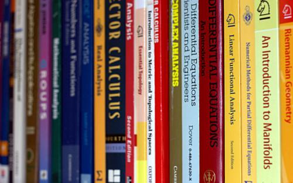

## Table of Contents

## What are the foundational concepts of mathematics that one should master first?

The foundational concepts of mathematics that one should master first include numbers and basic operations. Numbers are the building blocks of math, and it's important to understand different types of numbers like whole numbers, fractions, and decimals. Basic operations such as addition, subtraction, multiplication, and division are essential because they allow you to work with numbers in different ways. Once you're comfortable with these, you can start solving simple equations and word problems, which helps you apply math to real-life situations.

Another key concept is understanding patterns and relationships. This involves recognizing sequences, like counting by twos or threes, and seeing how numbers relate to each other. For example, knowing that 2 times 3 equals 6 helps you understand multiplication. Patterns and relationships are important because they help you predict outcomes and make sense of more complex math problems. By mastering these basics, you lay a strong foundation for learning more advanced topics like algebra and geometry.

Lastly, it's crucial to develop a good grasp of measurement and geometry. Measurement involves understanding units like inches, centimeters, and liters, and being able to measure length, area, volume, and weight accurately. Geometry deals with shapes and their properties, such as the angles and sides of triangles or the area of circles. These concepts are not only useful in everyday life but also essential for progressing to higher levels of math. By mastering these foundational areas, you build the skills needed to tackle more challenging mathematical concepts with confidence.

## How can one access quality resources for learning mathematics online?

You can find good math resources online by checking out websites like Khan Academy and Coursera. Khan Academy has free videos and practice problems that cover many math topics, from basic arithmetic to advanced calculus. Coursera offers online courses from universities, and you can learn at your own pace. Both of these websites are easy to use and have lots of helpful information.

Another place to look is YouTube, where many teachers and math experts share their knowledge. Channels like 3Blue1Brown and Math Antics have fun and clear videos that explain math concepts in a way that's easy to understand. You can also join online communities like Reddit's r/learnmath, where you can ask questions and get help from other math learners and experts. These communities can be very supportive and helpful as you learn.

Lastly, don't forget about math apps like Photomath and Desmos. Photomath lets you take a picture of a math problem and shows you how to solve it step by step. Desmos is great for graphing and exploring math visually. These apps can make learning math more interactive and fun. By using these different resources, you can find the ones that work best for you and keep improving your math skills.

## What are some effective self-study techniques for learning advanced mathematics?

To learn advanced math on your own, it's important to set clear goals and make a study plan. Decide what topics you want to learn and break them into smaller parts. This makes it easier to focus on one thing at a time. Use a calendar to schedule your study time, and stick to it. Make sure to review what you've learned regularly, so you don't forget it. It's also helpful to find a quiet place to study where you can concentrate without distractions.

Another good technique is to use different resources to learn the same topic. For example, you can watch videos on Khan Academy, read textbooks, and use online problem sets. This helps you see the math from different angles and understand it better. Practice is key, so solve lots of problems. Start with easy ones and slowly move to harder ones. If you get stuck, don't be afraid to ask for help online or join a study group. Learning with others can make it more fun and keep you motivated.

Lastly, try to connect what you're learning to real-life situations or other subjects you enjoy. This makes math more interesting and helps you remember it better. For example, if you like physics, see how the math you're learning applies to it. Keep a notebook to jot down important formulas and concepts, and review it often. By using these techniques, you can make your self-study more effective and enjoyable.

## How important is it to join a study group or online community for learning math?

Joining a study group or online community is very important when learning math. When you learn with others, you can ask questions and get help when you're stuck. Sometimes, hearing how someone else explains a problem can make it easier to understand. Plus, you can share what you know and help others too. This makes learning more fun and less lonely. It also keeps you motivated because you're not studying alone.

Being part of a group also lets you learn from different people. Everyone has their own way of thinking about math, and you can learn new ways to solve problems. Online communities like Reddit or math forums are great places to find people who are learning the same things as you. You can post questions and get answers quickly. This support can make a big difference in how well you learn and how much you enjoy math.

## What are the best books or textbooks for learning advanced mathematics on your own?

When learning advanced math on your own, "Calculus" by Michael Spivak is a great book to start with. It's known for being clear and thorough, and it helps you understand the big ideas behind calculus. The book has lots of problems to solve, which is important for learning math. Another good book is "Linear Algebra Done Right" by Sheldon Axler. It's perfect if you want to learn linear algebra well. The book explains things in a way that's easy to understand and has many examples and exercises to practice.

For more advanced topics, "Abstract Algebra" by David S. Dummit and Richard M. Foote is a top choice. It covers a lot of ground and is used by many universities. The book is detailed and has plenty of examples to help you learn. If you're interested in number theory, "A Course in Number Theory" by Henryk Iwaniec and Emmanuel Kowalski is excellent. It's a bit challenging but very rewarding. These [books](/wiki/algo-trading-books) are all well-respected and can help you learn advanced math on your own if you're willing to put in the time and effort.

## How can one use software and tools to enhance their understanding of advanced math concepts?

Using software and tools can really help you understand advanced math concepts better. One great tool is GeoGebra, which lets you see math in action. You can make graphs, play with equations, and see how changing one thing affects everything else. This makes it easier to understand things like calculus and geometry because you can see them visually. Another helpful tool is Mathematica, which is great for solving complex problems and doing calculations quickly. It's like having a super smart calculator that can do things you might not be able to do by hand.

Another useful software is MATLAB, which is perfect for learning about matrices and other advanced math topics. It has a lot of functions that let you explore math in different ways and solve problems step by step. You can also use online platforms like Wolfram Alpha, where you can type in a math problem and get a step-by-step solution. This is really helpful when you're stuck and need to see how to solve something. By using these tools, you can make learning advanced math more interactive and easier to understand.

## What are the key areas of advanced mathematics one should focus on for self-learning?

When you're learning advanced math on your own, it's good to start with calculus. Calculus is important because it helps you understand how things change and how to work with limits and derivatives. You'll learn about integrals, which are useful for finding areas and volumes. Calculus is used in many fields like physics and engineering, so it's a key area to focus on. Make sure to practice a lot and use resources like textbooks and online videos to help you understand it well.

Another important area is linear algebra. Linear algebra deals with vectors and matrices, which are important for solving systems of equations and understanding transformations. It's used a lot in computer science and data analysis, so it's very useful to learn. You can use software like MATLAB to practice and see how linear algebra works in real situations. By focusing on linear algebra, you'll build a strong foundation for more advanced topics.

Lastly, you should also look into abstract algebra and number theory. Abstract algebra helps you understand structures like groups and rings, which are important in many areas of math. Number theory is all about properties of numbers and can be really interesting if you like puzzles and patterns. Both of these areas can be challenging, but they're rewarding to learn. Use books like "Abstract Algebra" by Dummit and Foote or "A Course in Number Theory" by Iwaniec and Kowalski to guide your learning. By focusing on these key areas, you'll have a solid understanding of advanced math.

## How can one apply advanced mathematical concepts to real-world problems to deepen understanding?

Applying advanced math to real-world problems can make learning more interesting and help you understand it better. For example, if you're studying calculus, you can use it to figure out how fast a car is speeding up or slowing down. This is important for engineers who design cars and need to make sure they're safe. Or, if you're learning about linear algebra, you can use it to help with computer graphics. Animators use linear algebra to create smooth movements in movies and video games. By seeing how math is used in real life, you can see why it's important and remember it better.

Another way to apply advanced math is through number theory and cryptography. Number theory helps you understand how to keep information safe on the internet. For example, it's used to create codes that protect your online bank account. This can make learning about prime numbers and modular arithmetic more exciting because you know it's keeping your information secure. Also, abstract algebra can be used in coding and data analysis. Programmers use it to solve problems and make computer programs work better. By working on real-world problems, you can see how advanced math is useful and learn it more deeply.

## What strategies can be used to overcome common difficulties encountered in learning advanced math?

When learning advanced math, it's common to feel stuck or overwhelmed. One good strategy is to break big problems into smaller parts. Instead of trying to understand everything at once, focus on one piece at a time. This makes it easier to see how things fit together. Another helpful tip is to practice a lot. The more you solve problems, the better you'll get. Don't be afraid to make mistakes because they help you learn. If you're really stuck, try explaining the problem to someone else or even to yourself out loud. Sometimes, talking about it can help you see things differently.

Another strategy is to use different resources. If one book or video doesn't help, try another one. Sometimes, a different explanation can make things click. Joining a study group or an online community can also be a big help. You can ask questions and get support from others who are learning too. It's also important to take breaks and not get too frustrated. Math can be hard, but it's okay to step away for a bit and come back later with a fresh mind. By using these strategies, you can overcome the common difficulties and keep learning advanced math.

## How can one assess their progress and understanding in advanced mathematics without formal exams?

One way to check how well you're doing in advanced math without taking formal exams is by solving lots of practice problems. You can find these in textbooks or online. If you can solve them correctly, it means you're understanding the concepts. It's also helpful to try different types of problems, from easy to hard. This way, you can see if you can apply what you've learned in different situations. If you keep a notebook of the problems you solve and review it often, you'll see your progress over time.

Another good way is to explain the math to someone else. If you can teach it to a friend or family member, it shows you really understand it. You can also join online forums or study groups where you can ask questions and help others. Getting feedback from others can tell you what you're doing well and what you need to work on. By using these methods, you can keep track of your progress and make sure you're learning advanced math well.

## What are some advanced topics in mathematics that are particularly rewarding to learn independently?

Learning about topology on your own can be really fun and rewarding. Topology is like studying the shape of things, but in a way that doesn't care about exact sizes or angles. Think of it like playing with a rubber band—you can stretch it and twist it, but it's still the same shape. By learning topology, you can understand cool ideas like how a coffee mug and a donut are similar because they both have one hole. There are lots of online resources and books that can help you learn topology, and it's exciting to see how it's used in different areas like physics and computer science.

Another great topic to learn by yourself is differential geometry. This is all about understanding curves and surfaces, and it's used a lot in things like designing cars and airplanes. It's a bit like figuring out how to make a smooth path on a bumpy road. Differential geometry can be challenging, but it's very satisfying when you start to see how it works. You can use software like GeoGebra to see these ideas in action, which makes learning more interactive and fun. By exploring differential geometry on your own, you'll gain a deeper understanding of how math is used in the real world.

## How can one stay motivated and continue learning advanced mathematics over the long term?

Staying motivated to learn advanced math over the long term can be tough, but it's easier if you set small goals and celebrate when you reach them. Instead of trying to learn everything at once, break it into little pieces. For example, you could aim to understand one new concept each week. When you do, give yourself a pat on the back or treat yourself to something you enjoy. This way, you keep moving forward without feeling overwhelmed. Also, it's important to find math interesting and fun. Look for real-life examples of how math is used, like in sports or cooking. Seeing how math helps solve problems in the world can make it more exciting to learn.

Another way to stay motivated is to join a study group or online community. Learning with others can make math less lonely and more enjoyable. You can ask questions, share what you know, and help each other out. Sometimes, explaining something to someone else can help you understand it better yourself. Plus, being part of a group can keep you on track because you don't want to let your friends down. Lastly, don't forget to take breaks and be kind to yourself. Math can be hard, and it's okay to feel stuck sometimes. Taking a little time away can help you come back with a fresh mind and more energy to keep learning.

## What Mathematical Models and Algorithms are Used in Trading?

Several mathematical models form the backbone of effective trading algorithms, each providing unique insights into market behavior and aiding in decision-making. Among these, linear regression is a fundamental tool used to model the relationships between different trading variables. By fitting a linear equation to the observed data, traders can predict market trends and evaluate the potential impact of various factors on asset prices. The mathematical representation of a simple linear regression model is:

$$
y = \beta_0 + \beta_1 x + \epsilon
$$

where $y$ is the dependent variable (e.g., stock price), $x$ is the independent variable (e.g., time), $\beta_0$ and $\beta_1$ are the coefficients, and $\epsilon$ is the error term.

Time series analysis is another critical approach, particularly useful in understanding historical data patterns and forecasting future price movements. This method analyzes data points collected or recorded at specific time intervals to identify trends, seasonal patterns, and cyclic behaviors. The Autoregressive Integrated Moving Average (ARIMA) model is a common time series forecasting tool, expressed as:

$$
ARIMA(p, d, q)
$$

where $p$ is the number of lag observations incorporated into the model (autoregressive part), $d$ is the degree of differencing involved, and $q$ represents the size of the moving average window.

Stochastic calculus plays an essential role in modeling the random behavior of financial markets, particularly useful for derivative pricing and risk assessment. Techniques such as the Black-Scholes model and the use of Itô calculus help traders address these stochastic processes. The Black-Scholes model, for instance, formulates the pricing of options by assuming that stock prices follow a geometric Brownian motion. The model is defined by the equation:

$$
C = S_0 N(d_1) - X e^{-rt} N(d_2)
$$

where $d_1 = \frac{\ln(S_0/X) + (r + \sigma^2/2)t}{\sigma\sqrt{t}}$ and $d_2 = d_1 - \sigma\sqrt{t}$. Here, $C$ is the call option price, $S_0$ is the current stock price, $X$ is the strike price, $t$ is the time to expiration, $r$ is the risk-free interest rate, $\sigma$ is the volatility, and $N$ is the cumulative distribution function of the standard normal distribution.

Beyond linear regression and stochastic calculus, [machine learning](/wiki/machine-learning) models like decision trees, random forests, and neural networks are increasingly used to capture complex patterns in market data. These models can handle large sets of features and interactions, providing more nuanced insights than traditional statistical models.

Implementing these mathematical models requires expertise not only in mathematics but also in coding. For example, Python libraries like NumPy and pandas facilitate linear regression and time series analysis, while packages such as scikit-learn and TensorFlow offer robust tools for machine learning applications. Here's a simple example of how linear regression might be implemented in Python using scikit-learn:

```python
from sklearn.linear_model import LinearRegression
import numpy as np

# Example data
X = np.array([[1], [2], [3], [4], [5]])  # independent variable
y = np.array([1.2, 1.9, 3.1, 4.2, 5.1])  # dependent variable

# Create and fit the model
model = LinearRegression().fit(X, y)

# Predict a new value
predicted = model.predict(np.array([[6]]))
print(f"Predicted value: {predicted}")
```

Each mathematical model and algorithm provides a framework for developing robust trading strategies, enhancing predictive accuracy, and optimizing resource allocation. These tools collectively allow traders to make data-driven decisions, capitalizing on opportunities within the financial markets.

## References & Further Reading

[1]: Bergstra, J., Bardenet, R., Bengio, Y., & Kégl, B. (2011). ["Algorithms for Hyper-Parameter Optimization."](https://papers.nips.cc/paper/4443-algorithms-for-hyper-parameter-optimization) Advances in Neural Information Processing Systems 24.

[2]: ["Advances in Financial Machine Learning"](https://www.amazon.com/Advances-Financial-Machine-Learning-Marcos/dp/1119482089) by Marcos Lopez de Prado

[3]: ["Evidence-Based Technical Analysis: Applying the Scientific Method and Statistical Inference to Trading Signals"](https://www.amazon.com/Evidence-Based-Technical-Analysis-Scientific-Statistical/dp/0470008741) by David Aronson

[4]: ["Machine Learning for Algorithmic Trading"](https://github.com/stefan-jansen/machine-learning-for-trading) by Stefan Jansen

[5]: ["Quantitative Trading: How to Build Your Own Algorithmic Trading Business"](https://books.google.com/books/about/Quantitative_Trading.html?id=j70yEAAAQBAJ) by Ernest P. Chan