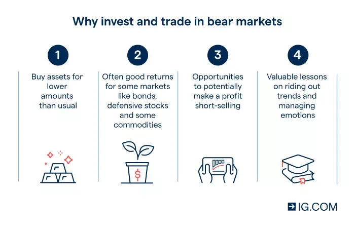

## Table of Contents

## What is a bear market and how does it affect investment strategies?

A bear market is when the stock market goes down a lot, usually by 20% or more, and stays down for a while. It's called a bear market because prices fall, kind of like how a bear swipes its paws downward. This happens when people are worried about the economy and start selling their stocks because they think prices will keep going down.

When there's a bear market, it can change how people invest their money. Some people might decide to be more careful and not buy as many stocks because they're scared the market will keep falling. They might put their money into safer things like bonds or savings accounts instead. Other people might see it as a chance to buy stocks at lower prices, hoping they'll go up again later. So, a bear market makes people think more about protecting their money and waiting for better times to invest.

## What are the safest investment options during a bear market?

During a bear market, one of the safest investment options is putting your money into cash or cash equivalents like savings accounts or money market funds. These options are very safe because they are not affected much by the ups and downs of the stock market. They might not make you a lot of money, but they help keep your money safe when the market is going down.

Another safe choice is investing in bonds, especially government bonds like U.S. Treasury bonds. These are considered safe because the government backs them, and they pay you interest over time. While their value can go up and down a little, they are much less risky than stocks during a bear market. They can provide a steady income and help protect your money until the market gets better.

Lastly, you might want to look into defensive stocks. These are stocks from companies that make things people always need, like food, utilities, or healthcare. Even in a bear market, people still need these things, so these companies tend to do better than others. While they are still stocks and can go down, they are generally safer than other stocks during tough times.

## How can dividend stocks help in making money during a bear market?

Dividend stocks can be a good way to make money during a bear market because they pay you money regularly, no matter what the stock market is doing. These payments are called dividends. Companies that pay dividends are usually big and stable, like those in the utilities or consumer goods sectors. Even when the stock price goes down, these companies keep paying dividends, which gives you a steady income. This can help you feel better about your investments when the market is falling.

Another way dividend stocks help is by giving you a chance to buy more shares. If you use the dividend money to buy more stock when prices are low, you can own more of the company. When the market gets better, the value of your investment can go up a lot. Plus, if the company keeps raising its dividends over time, you'll get more money each time, which can help you make money even when the market is not doing well.

## What role do bonds play in a bear market portfolio?

Bonds can be a big help in a bear market. They are like loans you give to a company or the government, and they pay you back with interest over time. When the stock market goes down a lot, bonds are safer because they don't lose value as much. This means if you have bonds in your portfolio, they can help keep your money safe when everything else is falling.

Having bonds in your portfolio during a bear market can also give you some money to live on. While stocks might not be paying out much, bonds keep sending you interest payments. This steady income can help you pay your bills and not have to sell your stocks at a low price. So, bonds act like a cushion, helping you get through tough times until the market gets better.

## How can one use short selling to profit from a bear market?

Short selling is a way to make money when the stock market is going down. You do this by borrowing shares of a stock from someone else, selling those shares right away, and then buying them back later at a lower price. If the stock price goes down like you expect, you can buy the shares back cheaper and return them to the person you borrowed them from. The difference between the price you sold them at and the lower price you bought them back at is your profit.

However, short selling can be risky. If the stock price goes up instead of down, you could lose a lot of money. You have to buy the shares back at a higher price than you sold them, and that means you'll have to pay more to return them. Also, there's no limit to how much a stock can go up, so your losses could be big. But if you're good at guessing which stocks will go down in a bear market, short selling can be a way to make money when others are losing it.

## What are put options and how can they be used to make money in a bear market?

Put options are like insurance for stocks. When you buy a put option, you're paying for the right to sell a stock at a certain price, called the strike price, before a certain date. If the stock's price goes down below the strike price, you can sell the stock at the higher strike price and make money on the difference. This can be really helpful in a bear market, where stock prices are falling.

In a bear market, you can use put options to make money by betting that a stock's price will go down. If you think a stock is going to drop, you can buy a put option on that stock. If the stock price does go down below the strike price, you can exercise your option and sell the stock at the higher strike price, making a profit. This way, even when the market is going down, you can still make money by using put options wisely.

## How can investing in defensive sectors help during a bear market?

Investing in defensive sectors can be a smart move during a bear market. Defensive sectors are parts of the economy that do well even when things are tough. These include companies that make things people always need, like food, medicine, and utilities. When the stock market is going down, people still need to eat, take their medicine, and keep their lights on. So, these companies tend to stay strong, and their stocks don't fall as much as others.

By putting your money into defensive sectors, you can protect your investments better during a bear market. These stocks might not go up a lot, but they are less likely to go down a lot, too. This can help you feel more secure and keep your money safer until the market gets better. Plus, some of these companies pay dividends, which means you can get a little bit of money back regularly, even when the market is not doing well.

## What are the benefits and risks of inverse ETFs in a bear market?

Inverse ETFs are a way to make money when the market goes down. They are designed to give you the opposite return of a certain index or sector. So, if the market drops by 1%, an inverse [ETF](/wiki/etf-trading-strategies) might go up by 1%. This can be really helpful in a bear market because you can make money even when everything else is losing value. It's like betting against the market, and if you guess right, you can earn a profit while others are losing money.

But, inverse ETFs can also be risky. They use complicated financial tools to get their opposite returns, and this can make them more volatile. If the market doesn't go down like you expect, you could lose a lot of money quickly. Also, they are usually meant for short-term trading, not for holding onto for a long time. If you keep them too long, their value might not match the market's movements as well, and you could end up losing money even if the market does eventually go down. So, while they can be a good tool in a bear market, you need to be careful and know what you're doing.

## How can dollar-cost averaging be an effective strategy in a bear market?

Dollar-cost averaging is a way to invest money little by little over time instead of all at once. It can be really helpful during a bear market because you buy stocks when they are cheaper. When the market is going down, you keep putting the same amount of money into your investments each month. This means you end up buying more shares when prices are low, which can be a good thing. Over time, as the market gets better, those shares you bought at a low price can go up in value, helping you make money.

This strategy also helps you not worry too much about the ups and downs of the market. Instead of trying to guess when the market will hit its lowest point, you just keep investing the same amount regularly. This can make investing less scary during a bear market because you're not putting all your money in at one time. It's like slowly building up your investments, and it can pay off big when the market starts to recover.

## What advanced hedging techniques can be used to protect and grow wealth in a bear market?

One advanced hedging technique you can use in a bear market is options strategies like buying protective puts. A protective put is like insurance for your stocks. You buy a put option for the stocks you own, which gives you the right to sell them at a certain price even if the market falls. This way, if the stock price drops a lot, you can still sell at the higher price you set with the put option, limiting your losses. It's a way to keep your money safe while still holding onto your stocks, hoping they'll go up again later.

Another technique is using inverse ETFs or short selling to make money when the market goes down. Inverse ETFs are designed to move in the opposite direction of the market, so if the market drops, they go up. Short selling means borrowing stocks, selling them, and then buying them back later at a lower price to make a profit. Both methods can help you earn money in a bear market, but they're risky. If the market doesn't go down as expected, you could lose a lot. It's important to understand these strategies well before using them to protect and grow your wealth during tough times.

Lastly, you can use a strategy called pairs trading, which involves taking a long position in one stock and a short position in another stock from the same sector. The idea is to profit from the relative performance of these two stocks. If you think one stock will do better than the other, you can buy the one you think will rise and short the one you think will fall. This can help you make money even when the overall market is down, as long as your prediction about the relative performance of the two stocks is correct.

## How can one identify undervalued assets to buy during a bear market?

Finding undervalued assets during a bear market means looking for things that are cheaper than they should be. One way to do this is by looking at a company's price-to-earnings (P/E) ratio. This number tells you how much you're paying for each dollar of the company's earnings. If the P/E ratio is lower than usual for the company or compared to other companies in the same industry, it might mean the stock is undervalued. You can also look at other numbers like the price-to-book (P/B) ratio, which shows how much the market value of the company is compared to its book value. If the P/B ratio is low, it could be another sign that the stock is undervalued.

Another way to find undervalued assets is by doing a lot of research on the company. Read their financial reports to see if they are making money and if they have a strong balance sheet. Look at what experts are saying about the company and its future. Sometimes, a company might be undervalued because people are too worried about short-term problems, but if the company has a good long-term plan, it could be a great buy. Also, paying attention to the overall market and economy can help. If everyone is selling because they're scared, it might be a good time to buy undervalued assets that will go up in value when things get better.

## What are the psychological aspects of investing during a bear market and how can they be managed?

Investing during a bear market can be tough on your mind because it's scary to see your money going down. A lot of people feel worried and might want to sell everything to stop losing more money. This feeling is called "panic selling," and it can make you sell your investments at a low price, which is not good. Another thing that happens is called "loss aversion," where people feel the pain of losing money more than the joy of making money. This can make you too scared to keep investing or to buy more when prices are low, even though it might be a good time to do so.

To manage these feelings, it's important to stay calm and not make quick decisions based on fear. One way to do this is by having a plan before the bear market starts. Decide how much risk you're okay with and stick to that plan, no matter what the market does. It can also help to talk to a financial advisor who can give you good advice and remind you that bear markets don't last forever. Another thing that can help is to focus on the long term. Remember that markets go up and down, but over many years, they usually go up. By keeping this in mind, you can feel better about holding onto your investments and maybe even buying more when prices are low.

## What are the strategic steps for profiting in bear markets?

To effectively generate profits in bear markets, traders must prioritize the [backtesting](/wiki/backtesting) of their strategies, ensuring proficiency in both bullish and bearish conditions. Backtesting serves as a critical step in validating an algorithm's performance by simulating trades against historical data. By doing so, traders can ascertain the viability of their approaches in varied market environments, thereby enhancing the reliability of their strategies. 

Diversification emerges as a vital component in risk management. By trading both long and short positions, traders can achieve a balanced exposure to market movements, capitalizing on gains from falling prices while simultaneously being prepared for periods of upward [momentum](/wiki/momentum). This balance mitigates potential losses from an overexposed position and enhances the probability of profitable trades across diverse scenarios.

Robust risk management protocols are fundamental during the heightened [volatility](/wiki/volatility-trading-strategies) that characterizes bear markets. Strategies such as setting stop-loss orders, using protective puts, or implementing position sizing can preserve capital. For example, position sizing involves adjusting the [volume](/wiki/volume-trading-strategy) of trades in accordance with risk tolerance and market conditions, a practice encapsulated in the formula:

$$
\text{Position Size} = \frac{\text{Total Portfolio Value} \times \text{Risk Per Trade}}{\text{Trade Entry Price} - \text{Stop Loss Price}}
$$

This formula ensures that the potential loss from any single trade does not exceed a predetermined threshold, thereby safeguarding the trader's capital base.

A thorough exploration of proven strategies that have historically performed well during bear markets further augments a trader's toolkit. Trend-following strategies, which aim to profit from sustained market movements by identifying and aligning with prevailing directions, have been shown to be effective. Additionally, mean reversion strategies can exploit temporary price divergences as markets typically return to average price levels over time. Successful application of these strategies requires not only precise identification of trends or reversions but also disciplined execution devoid of emotional interference.

Algorithmic trading can facilitate the execution of these strategies by automating decision-making processes and ensuring consistency. Below is a simple implementation of a trend-following strategy in Python using moving averages:

```python
import numpy as np
import pandas as pd

def trend_following_strategy(data, short_window=40, long_window=100):
    data['Short_MA'] = data['Close'].rolling(window=short_window).mean()
    data['Long_MA'] = data['Close'].rolling(window=long_window).mean()
    data['Signal'] = 0.0
    data['Signal'][short_window:] = np.where(
        data['Short_MA'][short_window:] > data['Long_MA'][short_window:], 1.0, 0.0
    )
    data['Position'] = data['Signal'].diff()
    return data

# Assume 'data' is a DataFrame with 'Close' prices
data = pd.read_csv('historical_prices.csv')
processed_data = trend_following_strategy(data)
```

This code calculates short and long moving averages of a stock's closing price, generating buy signals when the short moving average crosses above the long moving average and sell signals for the opposite crossing. 

By integrating these strategic steps—rigorous backtesting, diversification, robust risk management, and proven trading strategies—traders can effectively navigate bear markets and seize opportunities for profit in downward trending environments.

## References & Further Reading

[1]: Bergstra, J., Bardenet, R., Bengio, Y., & Kégl, B. (2011). ["Algorithms for Hyper-Parameter Optimization."](https://proceedings.neurips.cc/paper/2011/file/86e8f7ab32cfd12577bc2619bc635690-Paper.pdf) Advances in Neural Information Processing Systems 24.

[2]: ["Advances in Financial Machine Learning"](https://www.amazon.com/Advances-Financial-Machine-Learning-Marcos/dp/1119482089) by Marcos Lopez de Prado

[3]: ["Evidence-Based Technical Analysis: Applying the Scientific Method and Statistical Inference to Trading Signals"](https://www.amazon.com/Evidence-Based-Technical-Analysis-Scientific-Statistical/dp/0470008741) by David Aronson

[4]: ["Machine Learning for Algorithmic Trading"](https://github.com/stefan-jansen/machine-learning-for-trading) by Stefan Jansen

[5]: ["Quantitative Trading: How to Build Your Own Algorithmic Trading Business"](https://books.google.com/books/about/Quantitative_Trading.html?id=j70yEAAAQBAJ) by Ernest P. Chan