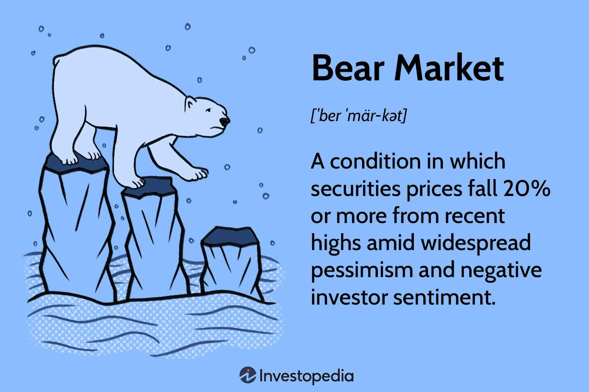

Bear markets are typically characterized by increasing uncertainty and risk, as asset prices decline and investor sentiment turns negative. However, for practitioners of algorithmic trading, these market conditions can be seen as opportunities to exploit systematic trading strategies. Algorithmic trading enables traders to manage large volumes of data and execute trades swiftly, without the emotional interference that often plagues human decision-making during turbulent times.

This article aims to illustrate how traders can harness the power of algorithmic strategies to take advantage of downward trends common in bearish environments. By understanding the foundational aspects of bear markets, traders can develop algorithms that not only survive but thrive when markets are in decline. Key principles of bear market trading will be highlighted, along with common pitfalls that traders should avoid.



Algorithmic trading in bear markets also involves addressing the psychological aspects of trading. Even algorithms are designed by humans, and understanding how cognitive biases can influence algorithmic adjustments is crucial for maintaining an edge. With careful preparation and a disciplined approach, algorithms can be adapted to incorporate protective mechanisms against both emotional and market volatility.

The right combination of strategy development, thorough backtesting, and disciplined execution can transform the inherent challenges of bear markets into profitable opportunities. This article will cover actionable strategies tailored for such conditions, ensuring that traders are well-equipped to convert potential financial downturns into profitable ventures.

## Table of Contents

## Understanding Bear Markets

A bear market is generally defined as a condition where securities prices fall 20% or more from recent highs, often accompanied by widespread pessimism and negative investor sentiment. The psychological impact of declining prices often prompts a self-reinforcing cycle of pessimism and reduced consumer confidence, which can exacerbate the decline.

Bear markets are characterized by increased volatility, as evidenced by significant daily price swings. This volatility results from heightened uncertainty and nervousness among investors. Selling pressure becomes prevalent as investors seek to limit losses or reposition their portfolios. This environment makes it particularly difficult for [fundamental analysis](/wiki/fundamental-analysis) to predict market movements due to erratic investor behavior.

Frequency and duration are critical aspects of understanding bear markets. Historically, bear markets can be triggered by various factors, including economic recessions, geopolitical events, or changes in monetary policy. According to historical data, bear markets occur approximately every 3 to 5 years, although this interval is not fixed and can vary significantly. The duration of a bear market is also variable, with some lasting only a few months while others extend over several years. On average, bear markets tend to persist for about 14 to 16 months, although there are notable exceptions, such as the brief but severe bear market during the 2008 financial crisis.

The time markets spend in bear phases can greatly differ, influenced by the underlying causes and economic conditions. For example, structural bear markets, typically caused by long-term secular changes in the economy, can last longer than event-driven bear markets, which might be triggered by temporary shocks.

Understanding these dynamics is essential for traders aiming to develop strategies that can withstand and profit from challenging times. By analyzing historical patterns and identifying key indicators of market downturns, traders can tailor their approaches to mitigate risks and seize opportunities during bear markets. This knowledge not only aids in preserving capital but also opens avenues for strategic investments that can offer significant returns once market conditions stabilize.

## Algorithmic Trading in Bear Markets

Algorithmic trading offers significant advantages in bear markets by enabling traders to execute predefined strategies without the influence of emotional biases. One of the key benefits of using algorithms in trading is their capacity for speed and precision in executing trades. Algorithms can process vast amounts of data in real-time, allowing traders to respond swiftly to market changes. Additionally, [algorithmic trading](/wiki/algorithmic-trading) permits the [backtesting](/wiki/backtesting) of strategies across various market conditions which is essential for robust strategy development.

Two types of algorithms particularly effective in bear markets are trend-following and mean reversion strategies. Trend-following algorithms are designed to identify and exploit the direction of market movements. In a bear market, these algorithms systematically detect downward price trends and initiate trades that align with the prevailing market direction. By filtering out market noise, trend-following strategies can help traders capitalize on sustained declines.

Mean reversion strategies operate on the principle that prices tend to revert to a mean or average over time. In bearish conditions, these algorithms identify overextended downward movements and predict that prices will eventually rebound towards their historical average. For execution, traders might utilize statistical measures like the moving average convergence divergence (MACD) to determine entry and [exit](/wiki/exit-strategy) points.

Implementing short-selling into automated strategies is a viable approach to capitalize on declining markets. Short-selling involves borrowing securities to sell them at the current market price, with the intention of buying them back at a lower price. In algorithmic trading, this can be automated through scripts designed to identify short-selling opportunities based on specific market signals. For example, a script in Python using the `pandas` library might look like this:

```python
import pandas as pd
import numpy as np

# Fetch historical stock data
data = pd.read_csv('stock_data.csv')
prices = data['Close']

# Calculate 20-day moving average
moving_average = prices.rolling(window=20).mean()

# Short-sell condition: Price below moving average
short_signals = np.where(prices < moving_average, 1, 0)

# Execute short-sell strategy
def execute_trade(signal):
    if signal == 1:
        print("Initiating short-sell order")
    else:
        print("Holding position")

# Iterate and execute trades based on short-signals
for signal in short_signals:
    execute_trade(signal)
```

This script simplifies short-selling execution by generating trade signals whenever the stock price falls below its 20-day moving average. 

Ultimately, algorithmic trading not only simplifies the execution complexities but also mitigates the emotional responses which are often amplified in volatile bear markets. By leveraging algorithmic strategies, traders can maintain a systematic approach to profiting from market declines.

## Strategic Steps for Profiting in Bear Markets

To effectively generate profits in bear markets, traders must prioritize the backtesting of their strategies, ensuring proficiency in both bullish and bearish conditions. Backtesting serves as a critical step in validating an algorithm's performance by simulating trades against historical data. By doing so, traders can ascertain the viability of their approaches in varied market environments, thereby enhancing the reliability of their strategies. 

Diversification emerges as a vital component in risk management. By trading both long and short positions, traders can achieve a balanced exposure to market movements, capitalizing on gains from falling prices while simultaneously being prepared for periods of upward [momentum](/wiki/momentum). This balance mitigates potential losses from an overexposed position and enhances the probability of profitable trades across diverse scenarios.

Robust risk management protocols are fundamental during the heightened [volatility](/wiki/volatility-trading-strategies) that characterizes bear markets. Strategies such as setting stop-loss orders, using protective puts, or implementing position sizing can preserve capital. For example, position sizing involves adjusting the [volume](/wiki/volume-trading-strategy) of trades in accordance with risk tolerance and market conditions, a practice encapsulated in the formula:

$$
\text{Position Size} = \frac{\text{Total Portfolio Value} \times \text{Risk Per Trade}}{\text{Trade Entry Price} - \text{Stop Loss Price}}
$$

This formula ensures that the potential loss from any single trade does not exceed a predetermined threshold, thereby safeguarding the trader's capital base.

A thorough exploration of proven strategies that have historically performed well during bear markets further augments a trader's toolkit. Trend-following strategies, which aim to profit from sustained market movements by identifying and aligning with prevailing directions, have been shown to be effective. Additionally, mean reversion strategies can exploit temporary price divergences as markets typically return to average price levels over time. Successful application of these strategies requires not only precise identification of trends or reversions but also disciplined execution devoid of emotional interference.

Algorithmic trading can facilitate the execution of these strategies by automating decision-making processes and ensuring consistency. Below is a simple implementation of a trend-following strategy in Python using moving averages:

```python
import numpy as np
import pandas as pd

def trend_following_strategy(data, short_window=40, long_window=100):
    data['Short_MA'] = data['Close'].rolling(window=short_window).mean()
    data['Long_MA'] = data['Close'].rolling(window=long_window).mean()
    data['Signal'] = 0.0
    data['Signal'][short_window:] = np.where(
        data['Short_MA'][short_window:] > data['Long_MA'][short_window:], 1.0, 0.0
    )
    data['Position'] = data['Signal'].diff()
    return data

# Assume 'data' is a DataFrame with 'Close' prices
data = pd.read_csv('historical_prices.csv')
processed_data = trend_following_strategy(data)
```

This code calculates short and long moving averages of a stock's closing price, generating buy signals when the short moving average crosses above the long moving average and sell signals for the opposite crossing. 

By integrating these strategic steps—rigorous backtesting, diversification, robust risk management, and proven trading strategies—traders can effectively navigate bear markets and seize opportunities for profit in downward trending environments.

## Psychological Considerations

Trading in a bear market can pose significant psychological challenges, even for those utilizing algorithmic trading systems. The emotional stress associated with declining markets often leads to cognitive biases and impulsive decisions, which can compromise trading strategies.

One of the most common cognitive biases is loss aversion, where the pain of losing is more impactful than the pleasure of gaining. Traders experiencing loss aversion might irrationally hold onto losing positions longer than advisable, hoping for a market rebound. In algorithmic trading, adherence to a predefined strategy can counter such biases, as it facilitates objective decision-making based on data rather than emotion.

Additionally, the phenomenon of confirmation bias—the tendency to seek out information that confirms existing beliefs—can be particularly detrimental during volatile market conditions. Traders might focus on data that confirms a false sense of market recovery, ignoring indicators that suggest otherwise. Algorithmic systems can mitigate this by executing trades based on comprehensive datasets rather than selective interpretations, ensuring a balanced view of market conditions.

Emotion-driven decisions often arise due to short-term volatility, leading traders to deviate from long-term strategies. This is where maintaining discipline is crucial. Traders can set specific rules within their algorithms to handle unusual market conditions, such as tight stop-loss orders or volatility filters, which help automatize responses to rapid market changes.

To withstand the psychological pressures of bear markets, traders can benefit from regular performance reviews of their algorithmic strategies. This involves assessing both the qualitative and quantitative aspects of trading performance, ensuring strategies are aligned with market trends without succumbing to momentary fluctuations.

Understanding market psychology can also aid in maintaining composure. Recognizing that bear markets are cyclical and historically followed by recoveries can help traders maintain a long-term perspective. This understanding can prevent impulsive exits from market positions that are designed for extended investment horizons.

Finally, continuous improvement and learning are essential. By evaluating historical data and refining algorithms, traders can adapt to evolving market conditions, enhancing their capacity to manage the emotional challenges of trading in bearish environments.

In summary, while bear markets present psychological demands, algorithmic trading, when executed with discipline and a sound understanding of market psychology, can help traders adhere to their strategies and avoid the pitfalls of emotional decision-making.

## Conclusion

Bear markets, though formidable, can indeed hold significant opportunities for traders adept in their strategies and systems. First and foremost, the crux of success in such markets is rooted in robust strategy development. This involves crafting algorithms that are not just reactive but predictive, capable of adapting to volatile conditions and potential market anomalies. Emphasis on pattern recognition and the ability to anticipate market shifts are invaluable.

Comprehensive backtesting is imperative in this scenario. Traders must simulate their strategies against historical market data, ensuring that their algorithms are resilient across various cycles—not just thriving in bull runs but also navigating the treacherous terrains of bear markets. A well-backtested strategy can mitigate risks and buffer against unforeseen downturns, providing a safety net in tumultuous market climates.

Maintaining disciplined trading practices is equally pivotal. Bear markets can evoke psychological pressure, making it essential for traders to adhere strictly to their predefined rules and algorithms. Emotional trading, often triggered by sharp market declines or pronounced volatility, can lead to suboptimal decisions. Thus, a disciplined approach in executing and revising strategies fosters consistency and stability.

Algorithmic trading emerges as an advantageous tool in this environment. By executing trades with precision and speed far beyond human capability, algorithms can efficiently exploit market inefficiencies. They minimize emotional bias, allowing systematic and analytically-driven decisions to prevail.

In summary, traders who effectively combine strategic foresight, rigorous backtesting, and unwavering discipline in their algorithmic trading practices are well-positioned to leverage the opportunities presented by bear markets. These downturns, rather than being simple threats, can transform into profitable ventures, rewarding those who approach them with preparation and acuity.

## FAQ

**How often do bear markets occur?**

Bear markets traditionally occur less frequently than bull markets. Over the last century, the U.S. stock market has experienced a bear market approximately every 3.5 years on average. However, this frequency can vary significantly depending on economic conditions. For instance, modern financial markets have witnessed bear markets as a result of economic downturns, political instability, or sharp changes in fiscal and monetary policy.

**How can I start with algorithmic trading?**

Starting with algorithmic trading involves a few essential steps. Firstly, it is important to gain a foundational understanding of trading principles and financial markets. Several resources like Coursera, edX, or Khan Academy offer beginner courses in finance and trading.

Once you have a basic understanding, select a programming language commonly used in algorithmic trading, such as Python, due to its simplicity and extensive libraries like NumPy, pandas, and scikit-learn. 

It is also crucial to familiarize yourself with trading platforms that support automated trading. Popular platforms include MetaTrader, NinjaTrader, or even custom APIs connected to brokers. Use a simulated trading environment or "paper trading" to test your algorithms without financial risk.

**Python example for a simple moving average crossover strategy:**

```python
import pandas as pd

# Fetch historical price data
prices = pd.read_csv('historical_prices.csv')

# Calculate moving averages
prices['SMA_50'] = prices['Close'].rolling(window=50).mean()
prices['SMA_200'] = prices['Close'].rolling(window=200).mean()

# Define signals
prices['Signal'] = 0
prices['Signal'][prices['SMA_50'] > prices['SMA_200']] = 1
prices['Position'] = prices['Signal'].diff()

# Display positions
print(prices.loc[prices['Position'] == 1.0, ['Date', 'Close', 'Position']]) # Buy signals
print(prices.loc[prices['Position'] == -1.0, ['Date', 'Close', 'Position']]) # Sell signals
```

**How to incorporate risk management effectively?**

Effective risk management is critical in algorithmic trading to safeguard your capital against unforeseen market movements. Here are some key strategies:

1. **Diversification**: Spread investments across various assets or markets to reduce exposure to any single risk factor.
2. **Position Sizing**: Determine the amount of capital to allocate to a trade based on your total portfolio, risk tolerance, and confidence in the trade. A common rule is the "2% rule" where no more than 2% of total capital is risked on a single trade.
3. **Stop-Loss and Take-Profit Orders**: Set predefined price levels at which to exit trades. This can help in limiting losses and securing gains.
4. **Volatility Adjustments**: Use tools like the Average True Range (ATR) to adjust position sizes based on market volatility.

**Additional Resources:**

- Websites such as Investopedia provide comprehensive tutorials on algorithmic trading and risk management.
- Books like "Algorithmic Trading: Winning Strategies and Their Rationale" by Ernie Chan, provide deeper insights into developing robust trading algorithms.

By proactively addressing these common questions, traders can build a solid foundation for understanding bear markets and pursuing profitable algorithmic trading strategies. Additionally, appropriate risk management ensures sustained trading success amid market volatility.

## References & Further Reading

[1]: Bergstra, J., Bardenet, R., Bengio, Y., & Kégl, B. (2011). ["Algorithms for Hyper-Parameter Optimization."](https://proceedings.neurips.cc/paper/2011/file/86e8f7ab32cfd12577bc2619bc635690-Paper.pdf) Advances in Neural Information Processing Systems 24.

[2]: ["Advances in Financial Machine Learning"](https://www.amazon.com/Advances-Financial-Machine-Learning-Marcos/dp/1119482089) by Marcos Lopez de Prado

[3]: ["Evidence-Based Technical Analysis: Applying the Scientific Method and Statistical Inference to Trading Signals"](https://www.amazon.com/Evidence-Based-Technical-Analysis-Scientific-Statistical/dp/0470008741) by David Aronson

[4]: ["Machine Learning for Algorithmic Trading"](https://github.com/stefan-jansen/machine-learning-for-trading) by Stefan Jansen

[5]: ["Quantitative Trading: How to Build Your Own Algorithmic Trading Business"](https://books.google.com/books/about/Quantitative_Trading.html?id=j70yEAAAQBAJ) by Ernest P. Chan