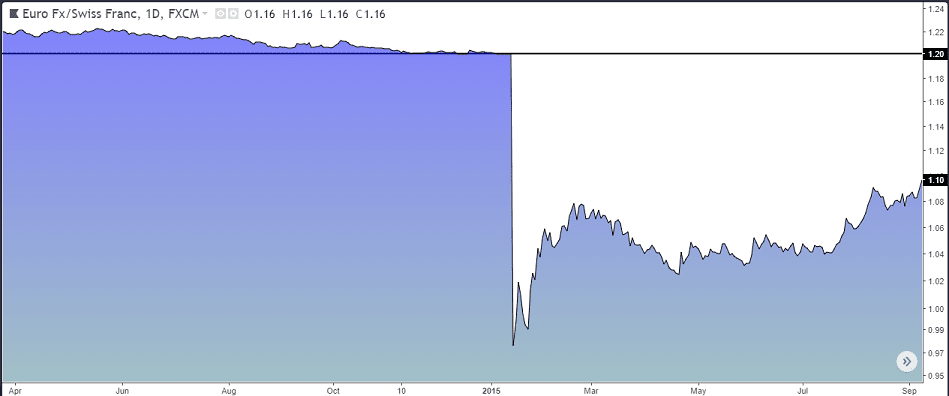

## Table of Contents

## What is a black swan event in the context of algorithmic trading?

A black swan event in the context of algorithmic trading is a rare and unexpected event that can have a huge impact on financial markets. These events are hard to predict and can cause big changes in stock prices, leading to big losses for traders who were not prepared. In algorithmic trading, where computers make trading decisions based on set rules and past data, these events can be especially challenging because the algorithms might not be programmed to handle such unusual situations.

For example, the 2008 financial crisis was a black swan event. Many trading algorithms were not set up to deal with the extreme market conditions that happened during the crisis. As a result, many traders faced big losses because their systems couldn't adapt quickly enough to the new situation. To manage the risks of black swan events, traders often use strategies like setting up safety measures in their algorithms and keeping some money aside to cover unexpected losses.

## How can black swan events impact algorithmic trading strategies?

Black swan events can really shake up algorithmic trading strategies because they are so unexpected and rare. These events can make stock prices move in ways that the algorithms were not prepared for. For example, if an algorithm is set up to buy or sell based on certain patterns, a black swan event can throw those patterns out the window. This can lead to big losses because the algorithm might keep trading as if nothing unusual is happening, even though the market is behaving in a totally different way.

To deal with these events, traders might add safety features to their algorithms. These features can help stop trading if the market starts to move too wildly. Traders might also keep some money aside just in case something unexpected happens. This way, if a black swan event does occur, they have a cushion to fall back on. But even with these precautions, black swan events are still tough to handle because they are so hard to predict and can cause such big changes in the market.

## What are some historical examples of black swan events in financial markets?

One famous black swan event was the 2008 financial crisis. It started with problems in the housing market in the United States. Many people couldn't pay back their home loans, which led to a lot of banks losing money. This caused a big panic in the financial markets around the world. Stock prices dropped a lot, and many people lost their jobs. It was a big shock because most people didn't see it coming.

Another example is the "Flash Crash" of May 6, 2010. In just a few minutes, the stock market in the United States dropped a lot and then quickly went back up. It was caused by a mix of high-frequency trading algorithms and a big sell order that set off a chain reaction. This event showed how fragile the market can be when computers are doing a lot of the trading. It was unexpected and showed how quickly things can go wrong in the stock market.

The COVID-19 pandemic in 2020 was also a black swan event. When the virus started spreading around the world, many countries had to shut down their economies to stop it. This led to a big drop in stock prices as people got scared about what would happen next. It was a surprise because nobody expected a global health crisis to cause such big problems in the financial markets.

## How can a beginner identify potential black swan events?

For a beginner, identifying potential black swan events can be tough because they are rare and hard to predict. One way to start is by staying informed about the world around you. Read the news, follow economic reports, and pay attention to what experts are saying. Sometimes, small signs like unusual changes in the economy or new global issues might hint at something bigger coming. By keeping an eye on these things, you might get a sense that something unexpected could happen.

Another way is to look at history. Black swan events have happened before, like the 2008 financial crisis or the 2010 Flash Crash. Studying these past events can help you understand what kinds of things can lead to big surprises in the market. While history doesn't repeat exactly, it can give you clues about what to watch out for. Remember, though, that even with all this knowledge, black swan events are still very hard to predict, so always be ready for the unexpected.

## What are the basic risk management techniques to prepare for black swan events?

One basic way to prepare for black swan events is to use stop-loss orders. This means setting a point at which you will automatically sell a stock if its price drops too much. It's like having a safety net that stops you from losing too much money if something unexpected happens. Another technique is to diversify your investments. Instead of putting all your money into one thing, you spread it out across different types of investments. This way, if a black swan event hits one area, you won't lose everything because you have other investments that might not be affected as much.

Keeping some money aside, or having a cash reserve, is also a good idea. This money can help you cover losses if a black swan event happens and your other investments go down in value. It's like having an emergency fund for your investments. Lastly, it's important to stay informed and keep learning. By reading the news and understanding what's happening in the world, you might be able to spot early signs of trouble and adjust your investments before a big event hits. While these steps can't stop black swan events from happening, they can help you be ready and protect your money when they do occur.

## How can stop-loss orders help in managing black swan situations?

Stop-loss orders can help manage black swan situations by setting a limit on how much you can lose. Imagine you buy a stock and set a stop-loss order at a certain price. If the stock price drops to that level because of a black swan event, your stock will be sold automatically. This means you won't lose more money than you planned, even if the market keeps going down. It's like having a safety net that catches you before you fall too far.

Using stop-loss orders is especially helpful in black swan situations because these events can make stock prices move in crazy ways. If you didn't have a stop-loss order, you might not be able to sell your stock fast enough to avoid big losses. But with a stop-loss order, your computer does the selling for you, protecting your money when the market goes wild. While stop-loss orders can't stop black swan events from happening, they can help you keep your losses small and give you peace of mind.

## What role does diversification play in mitigating the risks of black swan events?

Diversification is like not putting all your eggs in one basket. When you spread your money across different types of investments, like stocks, bonds, and real estate, you reduce the risk that a black swan event will wipe out all your money. If something unexpected happens and one type of investment goes down a lot, the other types might not be affected as much. This way, you can still have some money left even if one part of your portfolio takes a big hit.

For example, if you only invest in tech stocks and a black swan event causes the tech industry to crash, you could lose a lot. But if you also have money in other areas like healthcare or utilities, those might hold up better during the crisis. Diversification doesn't stop black swan events from happening, but it can help you weather the storm better by making sure you're not too dependent on any one investment.

## How can advanced traders use stress testing and scenario analysis to prepare for black swan events?

Advanced traders can use stress testing to see how their investments might do during really tough times. They pretend that a black swan event happens and then check how their portfolio would react. For example, they might imagine a big drop in the stock market and see if their investments can handle it. By doing this, they can find weak spots in their strategy and fix them before a real black swan event hits. It's like practicing for a big game so you know what to do when the pressure is on.

Scenario analysis is another tool that helps traders prepare. They create different stories about what might happen in the future, like a sudden economic crisis or a new global health scare. Then, they see how their investments would do in each of these stories. This helps them understand which risks they need to watch out for and how they can protect their money. By thinking through these different scenarios, traders can be ready for surprises and make better decisions when things get tough.

## What are the limitations of algorithmic models in predicting black swan events?

Algorithmic models have a hard time predicting black swan events because these events are so rare and unexpected. These models are built using past data and patterns, but black swan events don't follow those patterns. They come out of nowhere and can change the market in ways no one saw coming. So, when an algorithm tries to predict the future based on what happened before, it might miss these big surprises because it's looking for things that fit the usual patterns.

Another problem is that algorithmic models can't think like humans. They can't understand new information or big changes in the world in the same way we can. For example, if there's a sudden global crisis like a pandemic, an algorithm might not see it coming because it's focused on numbers and data, not on what's happening in the real world. While these models are good at spotting trends and making quick decisions, they struggle with the unexpected twists and turns that black swan events bring.

## How can machine learning and AI be utilized to enhance the detection of black swan events?

Machine learning and AI can help spot black swan events by looking at lots of data and finding patterns that humans might miss. These technologies can learn from past events and use that knowledge to watch for signs that something unusual might be about to happen. For example, AI can analyze news articles, social media, and economic reports to see if there are any early warnings of a big change coming. By doing this, AI can give traders a heads-up, so they can be ready before a black swan event hits.

But even with [machine learning](/wiki/machine-learning) and AI, it's still hard to predict black swan events because they are so rare and unexpected. These technologies can help by making better guesses and finding small clues that might lead to big surprises. However, they can't see everything, and sometimes the signs of a black swan event are too new or too different for AI to catch. So, while machine learning and AI can make us better at spotting these events, they can't predict them perfectly.

## What are the best practices for real-time monitoring and adjustment of trading algorithms during a black swan event?

During a black swan event, it's important to keep a close eye on your trading algorithms. You can do this by setting up real-time monitoring tools that watch the market and your trades every second. These tools can alert you if something unusual happens, like if the market starts moving too fast or if your trades are losing too much money. By watching things closely, you can see if your algorithm is working the way it should or if it's making mistakes because of the unexpected event.

Once you spot a problem, you need to act fast. You might need to adjust your algorithm's rules to fit the new situation. For example, if the market is dropping a lot, you might want to change your stop-loss orders to a lower price to protect your money. Or, you might need to pause your algorithm completely until things calm down. The key is to be ready to make quick changes and to have a plan for what to do if a black swan event happens. By staying alert and being ready to adjust, you can help protect your investments even when the market is acting in unexpected ways.

## How can an expert trader balance the need for algorithmic automation with human oversight during extreme market conditions?

An expert trader can balance algorithmic automation with human oversight during extreme market conditions by setting up systems that allow for quick human intervention. This means having real-time monitoring tools that alert the trader when the market starts behaving in unusual ways. If a black swan event happens, the trader can then step in and make adjustments to the algorithm's rules or even pause it completely. By being ready to take control when needed, the trader can protect their investments from big losses that the algorithm might not be able to handle on its own.

It's also important for the trader to have a good understanding of how their algorithms work and what they're meant to do. This knowledge helps the trader know when to trust the algorithm and when to override it. During extreme market conditions, the trader should keep a close eye on the market and be ready to make quick decisions based on their experience and gut feeling. By combining the speed and precision of [algorithmic trading](/wiki/algorithmic-trading) with the intuition and judgment of a human trader, they can navigate through black swan events more effectively and keep their portfolio safe.

## How can one develop robust trading algorithms?

Designing robust trading algorithms is essential for withstanding unpredictable market events and minimizing potential losses. The resilience of these algorithms is fundamental to their performance, especially during turbulent periods caused by unexpected financial anomalies. Here are some key approaches to enhancing their robustness:

### Diversification

Diversification is a core strategy in developing robust trading algorithms. By spreading investments across various asset classes, geographical regions, and market sectors, the overall portfolio risk is mitigated. This reduces the likelihood that a negative event affecting one segment of the market will substantially impact the overall performance. Diversification can be mathematically represented through portfolio variance, $\sigma^2_P$, which can be minimized by considering the covariance between asset returns:

$$
\sigma^2_P = \sum_{i=1}^n \sum_{j=1}^n w_i w_j \sigma_{ij}
$$

Here, $w_i$ and $w_j$ are the weights of assets $i$ and $j$ in the portfolio, and $\sigma_{ij}$ is the covariance between their returns.

### Stress Testing

Stress testing is another vital approach to reinforcing algorithmic robustness. It involves simulating extreme market scenarios to evaluate how trading strategies would perform under adverse conditions. By exposing algorithms to hypothetical black swan events, traders can identify potential vulnerabilities and make necessary adjustments. This ensures that trading systems are prepared for real-world market shocks.

### Integrating Risk Management Frameworks

Integrating comprehensive risk management frameworks is crucial for the development of robust trading algorithms. These frameworks should include various risk assessment tools and strategies, such as Value at Risk (VaR) and Conditional Value at Risk (CVaR), to quantify and manage potential risks. Additionally, setting predefined risk thresholds and implementing automatic stop-loss features can help protect against excessive losses.

Risk management frameworks should be dynamic, allowing for continuous adaptation and improvement based on new data and emerging market trends. For example, adaptive algorithms can adjust their risk parameters in real-time, based on the current market [volatility](/wiki/volatility-trading-strategies), ensuring they remain effective even when market conditions change rapidly.

By focusing on diversification, stress testing, and integrating robust risk management frameworks, traders can design algorithms capable of withstanding the unpredictable nature of financial markets. This proactive approach not only safeguards against potential losses but also enhances the overall effectiveness of algorithmic trading strategies.

## References & Further Reading

[1]: Taleb, N. N. (2007). ["The Black Swan: The Impact of the Highly Improbable"](https://www.amazon.com/Black-Swan-Improbable-Robustness-Fragility/dp/081297381X), Random House.

[2]: Chan, E. (2009). ["Algorithmic Trading: Winning Strategies and Their Rationale"](https://www.amazon.com/Algorithmic-Trading-Ernie-Chan-ebook/dp/B003XNTQ62), Wiley.

[3]: Lopez de Prado, M. (2018). ["Advances in Financial Machine Learning"](https://www.amazon.com/Advances-Financial-Machine-Learning-Marcos/dp/1119482089), Wiley.

[4]: Jansen, S. (2020). ["Machine Learning for Algorithmic Trading: Predictive Models to Extract Signals from Market and Alternative Data for Systematic Trading Strategies"](https://www.amazon.com/Machine-Learning-Algorithmic-Trading-intelligence/dp/1839217715), Packt Publishing.

[5]: Hull, J. C. (2012). ["Options, Futures, and Other Derivatives"](https://www.amazon.com/Options-Futures-Other-Derivatives-9th/dp/0133456315), Pearson.

[6]: Aldridge, I. (2013). ["High-Frequency Trading: A Practical Guide to Algorithmic Strategies and Trading Systems"](https://www.amazon.com/High-Frequency-Trading-Practical-Algorithmic-Investments/dp/1118343506), Wiley.

[7]: Kendall, M. & Hill, B. (2011). ["Risk Management in Trading: Techniques to Drive Profitability of Hedge Funds and Trading Desks"](https://www.amazon.com/Risk-Management-Trading-Techniques-Profitability/dp/1118768582), Bloombury Press.