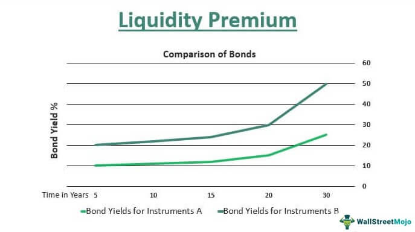

Liquidity premium is a critical concept in financial markets, referring to the additional return that investors demand for holding an asset with lower liquidity compared to a more liquid counterpart. Liquidity, in this context, pertains to the ease and speed with which an asset can be converted into cash without significantly affecting its price. The liquidity premium serves as a compensation for investors who are willing to take on the higher risk and potential transaction costs associated with illiquid assets.

Understanding the liquidity premium is essential, as liquidity is a key determinant of both asset pricing and investment risk. More liquid assets typically attract more investor interest due to their ability to be easily bought or sold in the market. Conversely, less liquid investments may present opportunities for higher returns due to the liquidity premium, but they also come with increased risk. This risk emanates primarily from the possibility of being unable to sell or from having to sell at a reduced price during times of market stress or in reaction to urgent need for cash.

The purpose of this article is to explore various methods to measure and leverage the liquidity premium effectively. By doing so, investors and financial analysts can better manage investment risks, enhance portfolio returns, and exploit opportunities presented by liquidity disparities across different markets. Understanding liquidity premium not only involves grasping its definition but also recognizing the complex interplay it has with numerous market factors such as investor sentiment, market conditions, and economic policies. Through this exploration, we aim to provide a comprehensive view of how liquidity considerations play a pivotal role in refined investment strategies.

## Table of Contents

## Understanding Liquidity Premium

Liquidity refers to the ease with which an asset can be bought or sold in the market without affecting its price. It matters to investors because highly liquid assets can be quickly converted into cash, allowing for flexibility and efficient capital allocation. Conversely, illiquid assets may require significant time or price concessions to sell, introducing uncertainty and potential financial loss. This leads to the emergence of a [liquidity](/wiki/liquidity-risk-premium) premium, which is the extra return investors demand for holding assets that are not easily sellable.

Several [factor](/wiki/factor-investing)s contribute to the existence of a liquidity premium. One key factor is the transaction costs associated with buying or selling an asset. High transaction costs can deter trading activity, thereby reducing liquidity and necessitating a premium to compensate for the risk and cost incurred. Additionally, market transparency plays a crucial role, as markets with low transparency often exhibit higher information asymmetry, leading to reduced trading activity and increased liquidity premiums.

A historical perspective reveals that liquidity premium has significantly influenced markets. During the 2008 financial crisis, for example, liquidity dried up across various asset classes, dramatically increasing liquidity premiums as investors scrambled to convert their holdings into cash. This led to sharp price declines and highlighted the importance of assessing liquidity risk. Historically, liquidity crises often result in investors reassessing the actual liquidity of their assets, prompting adjustments in asset valuation and risk management strategies.

In summary, understanding liquidity and the associated premium is crucial for investors seeking to manage risk and maximize returns. By recognizing the factors that affect liquidity premium and learning from historical instances, investors can make more informed decisions, better pricing illiquidity risk and positioning their portfolios to either mitigate or capitalize on liquidity conditions in financial markets.

## Measuring Liquidity Premium

Measuring liquidity premium involves understanding various techniques and models that aim to capture the premium investors demand for holding less liquid assets. Here, we discuss these approaches, key metrics used, and the inherent challenges in quantifying liquidity premium accurately.

### Techniques and Models for Quantifying Liquidity Premium

One commonly used model is the **Amihud Illiquidity Ratio**, introduced by Yakov Amihud in 2002. This model measures the impact of trading [volume](/wiki/volume-trading-strategy) on price movement and is defined as:

$$
ILLIQ_{i,t} = \frac{1}{D} \sum_{d=1}^{D} \frac{|R_{i,d,t}|}{Vol_{i,d,t}}
$$

where $ R_{i,d,t} $ is the return on asset $ i $ on day $ d $ of month $ t $, $ Vol_{i,d,t} $ is the trading volume in dollars for asset $ i $, and $ D $ is the number of days. A higher Amihud ratio implies greater illiquidity and thus a higher liquidity premium.

Another important model is the **Pastor-Stambaugh Model** which adds a liquidity risk factor to the Fama-French three-factor model. This model evaluates the relationship between liquidity shocks and excess returns, providing a structured approach to consider liquidity alongside market, size, and value factors.

Additionally, **Bid-Ask Spread** is a straightforward measure reflecting transaction costs. The spread between purchasing and selling prices indicates market liquidity, with larger spreads suggesting more illiquidity and thus a higher potential liquidity premium.

### Key Indicators and Metrics

Assessing liquidity in various markets demands a suite of indicators:
1. **Trading Volume**: High volumes generally indicate better liquidity conditions.
2. **Turnover Rate**: Calculated by dividing trading volume by the number of shares available, it provides insights into how often assets are traded.
3. **Market Impact Costs**: Measures how much prices move when large trades are executed. Lower costs indicate more liquid markets.
4. **Price Delay**: Captures the speed at which information is reflected in asset prices.

### Challenges and Limitations

A significant challenge in measuring liquidity premium is the varying liquidity characteristics across asset classes and market environments. For instance, real estate or private equity inherently have lower liquidity compared to public equities, complicating uniform measurement approaches.

Moreover, liquidity is not static; it changes with market conditions and sentiments. Economic events can trigger sudden changes, impacting the reliability of historical data in predicting future liquidity premiums.

Another limitation comes from the **model risk** itself. Assumptions underlying models like Amihud or Pastor-Stambaugh might not hold during periods of financial crises, causing potential misestimations of the premium.

In conclusion, while several techniques and models provide frameworks to quantify liquidity premium, the dynamic nature of markets, along with asset-specific characteristics, presents substantial challenges. Continuous refinement of models and inclusion of real-time data are essential to improve measurement accuracy and enhance investment decision-making.

## Factors Affecting Liquidity Premium

Market conditions continually shape liquidity levels, influencing the liquidity premium investors demand for holding less-liquid assets. Liquidity reflects the ease with which an asset can be traded without significantly affecting its price. When market conditions are volatile, liquidity tends to dry up, leading investors to require a higher premium to compensate for the increased risk of holding assets that are hard to sell quickly.

Economic events and policy decisions significantly affect liquidity premiums. For instance, central bank policies, such as changes in [interest rate](/wiki/interest-rate-trading-strategies)s or quantitative easing, can alter market liquidity by influencing borrowing costs and the availability of credit. An increase in interest rates might reduce liquidity as borrowing becomes more expensive, thus widening the liquidity premium. Conversely, accommodative monetary policies, like lower interest rates, can enhance liquidity, thereby reducing the liquidity premium.

Investor behavior and sentiment also play critical roles in determining liquidity premiums. During times of market stress or uncertainty, such as a financial crisis, investors may become risk-averse, leading to a withdrawal of funds from less-liquid markets in favor of more liquid ones. This shift in behavior increases the demand for liquidity, consequently raising the liquidity premium. Investor sentiment is often influenced by exogenous shocks or news events, which can exacerbate or mitigate liquidity constraints and their associated premiums.

Understanding these factors is crucial for investors aiming to exploit liquidity premiums as they navigate market dynamics to optimize their portfolios. Decisions by policymakers and the collective sentiment of investors are key variables that continuously reshape the landscape of market liquidity and the premiums tied to it.

## Exploiting Liquidity Premium

Exploiting the liquidity premium involves strategic incorporation into investment portfolios with the aim of enhancing returns. Investors can adopt several strategies to leverage this premium effectively:

### Strategies for Incorporating Liquidity Premium

1. **Asset Diversification:**
   Investors can diversify across asset classes, such as equities, bonds, real estate, or alternative investments, where liquidity varies significantly. This diversification can capture the liquidity premium by balancing the less liquid assets that potentially offer higher returns with more liquid ones. For instance, private equity or certain segments of the bond market often exhibit higher liquidity premiums compared to traditional equities.

2. **Tactical Asset Allocation:**
   By adjusting the portfolio allocation based on expected liquidity conditions, investors can exploit liquidity premiums. For example, during market stress when liquidity dries up, assets such as high-yield bonds or emerging market securities may offer higher premiums. Investors can increase exposure to these asset classes in anticipation of a market recovery, thereby potentially capturing higher returns.

3. **Hold-to-Maturity Strategy:**
   Emphasizing a hold-to-maturity approach allows investors to benefit from the liquidity premium without being affected by short-term market fluctuations. For instance, investing in long-dated bonds or illiquid real estate assets and holding them until maturity or market conditions improve can yield a liquidity premium payoff.

### Risk Management Approaches

1. **Liquidity Stress Testing:**
   Conduct regular stress tests to evaluate how changes in market liquidity can affect the portfolio. This helps in understanding potential liquidity-induced losses and preparing mitigation strategies.

2. **Portfolio Liquidity Buffers:**
   Maintain a portion of the portfolio in highly liquid assets such as cash or treasury securities. This buffer supports liquidity needs during times of market stress, allowing the investor to capitalize on liquidity premiums without being forced to sell illiquid investments at a loss.

3. **Dynamic Rebalancing:**
   Implement dynamic rebalancing strategies to adjust exposure to liquidity premiums based on changing market conditions. This involves closely monitoring market trends and investor sentiment to optimize the balance between liquid and illiquid assets.

### Examples of Successful Exploitation

1. **Real Estate Investment Trusts (REITs):**
   Traditionally, REITs have provided an attractive liquidity premium due to the illiquid nature of underlying real estate assets. By carefully selecting REITs with strong fundamentals and growth prospects, investors have successfully captured significant liquidity premiums.

2. **High-Yield Corporate Bonds:**
   These bonds often offer a higher yield due to their lower liquidity compared to investment-grade bonds. Investors who have strategically targeted high-yield bonds during periods of economic optimism have exploited the liquidity premium to achieve substantial returns.

3. **Private Equity Funds:**
   By investing in these funds, investors can capture the illiquidity premium associated with private, non-publicly traded companies. The long-term nature of private equity investments aligns well with strategies focused on liquidity premium exploitation.

Leveraging liquidity premium requires a nuanced understanding of market dynamics, asset liquidity conditions, and investor behavior. By applying sound risk management practices and strategic asset allocation, investors can exploit liquidity premiums across various asset classes to enhance overall portfolio performance.

## Risks and Considerations

Targeting liquidity premium can offer significant gains, but it comes with specific downsides and risks that investors must acknowledge and manage. Understanding these risks is critical for effectively incorporating liquidity premiums into investment strategies.

One of the primary risks associated with targeting liquidity premiums is that they often involve investing in assets or markets that are intrinsically less liquid. This reduced liquidity can result in higher transaction costs and the possibility of being unable to [exit](/wiki/exit-strategy) positions quickly at favorable prices. In times of market stress, the gap between buy and sell prices can widen significantly, further impacting returns.

Additionally, liquidity premiums can be highly sensitive to economic events and changes in market conditions. For instance, monetary policy shifts, regulatory changes, or geopolitical tensions can rapidly alter liquidity levels, thereby affecting the liquidity premiums. Investors must be vigilant in monitoring these variables and adjusting their strategies accordingly to mitigate risk. This risk highlights the importance of considering macroeconomic trends and event-driven scenarios in liquidity-focused investment strategies.

Diversifying exposure to liquidity premiums is another important consideration. By spreading investments across various asset classes, geographical regions, and sectors, investors can potentially reduce the risk associated with any single liquidity shock. Diversification can also involve incorporating a mix of liquid and less liquid assets to balance the overall portfolio, thereby maintaining flexibility and reducing vulnerability to liquidity constraints.

Furthermore, the behavior and sentiment of other market participants can exacerbate or mitigate liquidity-related risks. A sudden shift in investor sentiment towards risk aversion, for instance, can lead to a rapid withdrawal of capital from less liquid assets, causing a sharp decrease in their prices and impacting the liquidity premium.

The impact of market liquidity changes on investment strategies cannot be overstated. In fluid market conditions, liquidity premiums may compress as assets become more interchangeable, potentially diminishing the returns from liquidity-focused strategies. Conversely, during periods of heightened uncertainty or reduced market liquidity, premiums may expand, presenting both opportunities and challenges. Investors must therefore remain adaptable, continuously evaluating their strategies in light of evolving market liquidity conditions.

In summary, while targeting liquidity premium offers potential rewards, it is crucial for investors to comprehend the inherent risks, diversify their exposure, and remain responsive to market liquidity changes. This approach helps in mitigating potential downsides and better positioning portfolios to exploit liquidity premiums under varying conditions.

## Case Studies

Real-world examples of measuring and exploiting liquidity premium provide valuable insights into strategic approaches and pitfalls. These case studies illustrate how market participants have navigated complexities to capitalize on liquidity disparities.

### Example 1: The U.S. Treasury Market
In the U.S. Treasury market, liquidity premiums are particularly evident between on-the-run and off-the-run securities. On-the-run Treasuries, being the most recently issued, tend to be more liquid and demand lower yields compared to older, off-the-run issues. Investors seeking a liquidity premium often target these older securities, accepting higher yields in return for reduced liquidity. Historical data suggests that during periods of market distress, the liquidity premium widens significantly as investors flock to the more liquid on-the-run issues, highlighting the impact of market conditions on liquidity premium.

*Lessons Learned:* Exploiting liquidity premium can offer yield enhancement, but timing is crucial. Understanding the dynamics of market stress and investor sentiment can inform entry and exit strategies for such trades.

### Example 2: Corporate Bonds
In the corporate bond market, liquidity premiums are influenced by the credit quality and size of the issuance. Smaller, lower-rated bonds often [carry](/wiki/carry-trading) higher liquidity premiums due to less frequent trading and relative difficulty in finding buyers. A notable instance occurred during the 2008 financial crisis when high-yield bonds faced extreme liquidity challenges, exacerbating the premium demanded by investors.

*Lessons Learned:* Liquidity premiums in corporate bonds can offer significant returns, but the associated credit risk must be managed carefully. Diversification and stress testing can mitigate potential downsides.

### Example 3: Leveraged Buyouts (LBOs)
Leveraged Buyouts provide another context where liquidity premium can be exploited. Investors in LBOs often require higher returns as compensation for locking up capital in relatively illiquid private investments. Firms that successfully execute LBOs often have sophisticated strategies to manage liquidity risk, balancing debt load with operational cash flows.

*Lessons Learned:* In LBOs, understanding the underlying cash flows and aligning them with debt obligations is critical. Illiquidity is a feature, not a bug, and should be factored into the overall risk-return assessment.

### Analysis of Approaches
Successful approaches to exploiting liquidity premium often involve a deep understanding of the asset class and market conditions. For example, systematic trading strategies that quantify liquidity metrics using historical data tend to outperform ad-hoc decision-making processes.

Conversely, unsuccessful approaches typically overlook the transient nature of liquidity premiums or misjudge market conditions. For instance, strategies that fail during liquidity crunches are usually those that do not incorporate robust risk management and hedging practices.

In summary, real-world case studies emphasize the importance of timing, diversification, risk assessment, and market sentiment analysis in successfully leveraging the liquidity premium in varying asset classes. Effective strategies involve a mix of data-driven insights and an adaptive approach to evolving market dynamics.

## Conclusion

Understanding and measuring the liquidity premium is crucial for informed investment decisions. The liquidity premium represents the additional return investors demand for holding less liquid assets, a critical factor influencing market dynamics and investment risk assessment. Recognizing its importance enables investors to make more strategic choices, balancing potential returns against associated risks.

Effectively exploiting the liquidity premium requires a nuanced approach. Investors can enhance portfolio performance by incorporating assets with varying liquidity levels, thus optimizing returns while managing overall risk exposure. However, leveraging this premium involves careful analysis of market conditions, investor sentiment, and economic policy impacts. By understanding the interplay of these factors, investors can position themselves to reap the rewards of the liquidity premium without succumbing to its pitfalls.

To remain competitive and innovative, continued research into liquidity premium measurement and exploitation strategies is essential. Emerging market trends and evolving economic landscapes dictate a need for adaptive approaches that align with changing liquidity dynamics. Investors and financial analysts should prioritize expanding their knowledge base to develop new methodologies for assessing liquidity premiums and devising tactics that capitalize on these insights for sustainable investment gains. This proactive engagement in research and strategy development will ensure that they are well-equipped to navigate the complexities of modern financial markets.

## References & Further Reading

[1]: Amihud, Yakov. (2002). ["Illiquidity and Stock Returns: Cross-Section and Time-Series Effects."](https://www.sciencedirect.com/science/article/abs/pii/S1386418101000246) Journal of Financial Markets, 5(1), 31-56.

[2]: Pastor, Lubos, and Stambaugh, Robert F. (2003). ["Liquidity Risk and Expected Stock Returns."](https://www.nber.org/system/files/working_papers/w8462/w8462.pdf) The Review of Financial Studies, 17(3), 379-408.

[3]: Acharya, Viral V., and Pedersen, Lasse H. (2005). ["Asset Pricing with Liquidity Risk."](https://www.sciencedirect.com/science/article/abs/pii/S0304405X05000334) Journal of Financial Economics, 77(2), 375-410.

[4]: Baker, Malcolm, and Stein, Jeremy C. (2004). ["Market Liquidity as a Sentiment Indicator."](https://www.sciencedirect.com/science/article/abs/pii/S1386418103000466) Journal of Financial Markets, 7(3), 271-299.

[5]: Brunnermeier, Markus K., and Pedersen, Lasse H. (2009). ["Market Liquidity and Funding Liquidity."](https://academic.oup.com/rfs/article-abstract/22/6/2201/1592184?redirectedFrom=fulltext) The Review of Financial Studies, 22(6), 2201-2238.