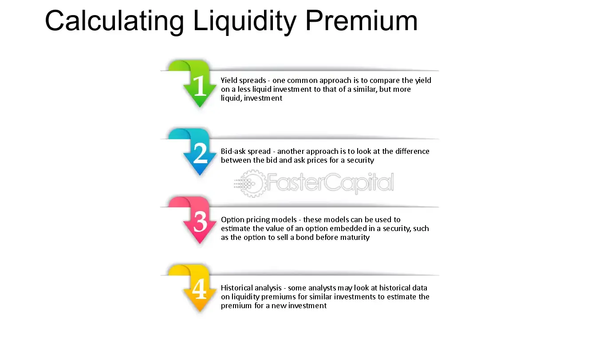

## Table of Contents

## What is the liquidity premium and why is it important?

The liquidity premium is the extra return that investors expect to get for holding an asset that is not easy to sell quickly. Imagine you have a choice between two investments: one you can sell anytime you want, and another that might take a long time to find a buyer. The second one is less liquid, so investors want a higher return to make up for the risk of not being able to sell it quickly.

This premium is important because it helps set prices in the market. If an asset is hard to sell, its price will be lower to attract buyers who are willing to accept the risk. This makes sure that investors are rewarded for taking on less liquid investments. Understanding the liquidity premium helps investors make better choices about which assets to buy and how much they should expect to earn from them.

## How can liquidity be defined and measured in financial markets?

Liquidity in financial markets means how easily you can buy or sell an asset without affecting its price too much. Think of it like selling a popular toy versus a rare collectible. If you want to sell a popular toy, you'll find lots of buyers quickly, so it's very liquid. But if you want to sell a rare collectible, it might take a long time to find someone willing to buy it, so it's less liquid. In markets, high liquidity means there are many buyers and sellers, and transactions happen smoothly and quickly.

To measure [liquidity](/wiki/liquidity-risk-premium), people look at different things. One common way is to check the trading volume, which is the total number of shares or contracts traded in a day. High trading volume usually means an asset is more liquid. Another way is to look at the bid-ask spread, which is the difference between the highest price a buyer is willing to pay and the lowest price a seller is willing to accept. A smaller spread means the asset is more liquid because it's easier to agree on a price. By looking at these and other measures, investors can get a sense of how liquid an asset is and make better decisions.

## What are the common indicators used to assess liquidity?

Liquidity in financial markets can be assessed using several common indicators. One key indicator is trading volume, which is the total number of shares or contracts traded in a day. When an asset has a high trading volume, it means there are many buyers and sellers, making it easier to buy or sell that asset quickly without affecting its price too much. Another important indicator is the bid-ask spread, which is the difference between the highest price a buyer is willing to pay and the lowest price a seller is willing to accept. A smaller bid-ask spread indicates higher liquidity because it's easier for buyers and sellers to agree on a price.

In addition to trading volume and bid-ask spread, market depth is another indicator of liquidity. Market depth shows how many buy and sell orders are waiting at different price levels. If there are lots of orders at various price levels, it means the market can handle big trades without big price changes, showing good liquidity. Finally, the turnover ratio, which is the ratio of the volume of shares traded to the total number of shares outstanding, can also be used to gauge liquidity. A higher turnover ratio suggests that the asset is more actively traded and therefore more liquid.

## How does the liquidity premium affect investment decisions?

The liquidity premium plays a big role in how investors make choices about where to put their money. When an investment is hard to sell quickly, investors want a higher return to make up for the risk of not being able to get their money out fast. This means they might choose to invest in less liquid assets if the expected return is high enough to cover the extra risk. For example, if a bond is not easy to sell but offers a much higher [interest rate](/wiki/interest-rate-trading-strategies) than a more liquid bond, an investor might decide it's worth the risk.

Understanding the liquidity premium helps investors balance their portfolios. They might mix some less liquid investments that offer higher returns with more liquid ones that are easier to sell. This way, they can aim for a good overall return while still having some money they can get to quickly if they need it. By considering the liquidity premium, investors can make smarter choices that match their need for quick access to cash with their desire for higher returns.

## What are the different methods to calculate the liquidity premium?

One way to calculate the liquidity premium is to compare the returns of a less liquid asset with a similar but more liquid asset. For example, you might look at the difference in yield between a corporate bond that's hard to sell and a government bond that's easy to sell. The extra yield on the corporate bond is the liquidity premium. This method helps investors see how much extra return they're getting for holding onto an asset that's not easy to turn into cash.

Another way to figure out the liquidity premium is by using financial models. These models take into account things like how often the asset trades and how big the bid-ask spread is. They use this information to estimate how much more return investors should expect from less liquid assets. These models can be complex, but they give a detailed look at what the liquidity premium might be for different investments.

Both methods have their uses. The comparison method is simpler and easier to understand, but it might not capture all the details. The financial models are more detailed but can be harder to use. By looking at both, investors can get a better idea of the liquidity premium and make smarter investment choices.

## How can investors identify assets with a high liquidity premium?

Investors can spot assets with a high liquidity premium by comparing them to similar but more liquid assets. For example, if you look at two bonds that are alike in every way except one is harder to sell, the one that's harder to sell will usually offer a higher return. That extra return is the liquidity premium. By checking the difference in returns, investors can see how much extra they're getting for holding onto an asset that's not easy to turn into cash.

Another way to find assets with a high liquidity premium is by using financial models. These models look at things like how often the asset trades and the size of the bid-ask spread. If an asset doesn't trade often and has a big bid-ask spread, it's probably less liquid. The models use this information to guess how much more return investors should expect from these less liquid assets. By using these models, investors can get a good idea of which assets have a high liquidity premium and make better investment choices.

## What are the risks associated with investing in less liquid assets?

Investing in less liquid assets can be risky because it might take a long time to sell them if you need your money back quickly. Imagine you want to sell a rare painting but can't find a buyer for months. During that time, you can't use that money for anything else. This is called liquidity risk. If something unexpected happens, like you need money for an emergency, being stuck with a less liquid asset can be a big problem.

Another risk is that less liquid assets might be harder to value correctly. Because they don't trade often, it's tough to know what they're really worth. This can lead to big surprises if you need to sell them in a hurry. For example, if you think your rare painting is worth a lot but can only sell it for much less, you could lose money. So, while less liquid assets might offer higher returns, they come with the trade-off of higher risk.

## How can the liquidity premium be exploited in portfolio management?

In portfolio management, the liquidity premium can be used to boost returns by carefully [picking](/wiki/asset-class-picking) less liquid assets. Investors might add some less liquid investments to their portfolio because these assets often offer higher returns to make up for the risk of being hard to sell. By mixing these with more liquid investments, investors can try to get the best of both worlds. They can aim for higher returns from the less liquid assets while still having some money they can get to quickly if they need it. This way, they can balance the risk and reward in their portfolio.

However, using the liquidity premium also means taking on more risk. If an investor needs to sell a less liquid asset quickly, they might have to do it at a lower price than they expected. This can be a problem if they need the money for something urgent. So, smart portfolio managers will think carefully about how much of their portfolio should be in less liquid assets. They will look at their need for quick access to cash and their comfort with risk. By doing this, they can use the liquidity premium to try to get higher returns while still managing the risks that come with less liquid investments.

## What are the advanced quantitative models used to estimate the liquidity premium?

Advanced quantitative models used to estimate the liquidity premium often include the Liquidity-Adjusted Capital Asset Pricing Model (LCAPM). This model builds on the traditional Capital Asset Pricing Model (CAPM) by adding a liquidity [factor](/wiki/factor-investing). The LCAPM looks at how the liquidity of an asset affects its expected return. It uses measures like trading volume and bid-ask spread to figure out how liquid an asset is. By including these measures, the LCAPM can estimate how much extra return investors should expect from holding a less liquid asset.

Another model is the Pastor and Stambaugh Liquidity Model. This model tries to capture how changes in liquidity over time affect asset returns. It uses a measure of liquidity that looks at how much returns go up or down when trading volume changes. The model shows that assets that are less liquid tend to have higher returns, especially during times when the market is less liquid overall. By using these advanced models, investors can get a better idea of the liquidity premium and make smarter investment choices.

## How do market conditions influence the size of the liquidity premium?

Market conditions can change how big the liquidity premium is. When the market is doing well and lots of people are buying and selling, it's easier to sell things quickly. This means the liquidity premium might be smaller because there's less risk of being stuck with an asset you can't sell. But if the market is not doing well, and people are scared to buy, it can be hard to find buyers. In these times, the liquidity premium gets bigger because investors want more money to make up for the risk of not being able to sell their assets quickly.

During times of big uncertainty, like a financial crisis, the liquidity premium can grow a lot. Investors get worried and want to hold onto cash or very safe assets that they can sell anytime. This makes less liquid assets even harder to sell, so the extra return they need to be attractive goes up. On the other hand, when things are calm and stable, the liquidity premium might shrink because investors feel more confident and are more willing to buy less liquid assets without needing such a high return.

## What are the regulatory considerations when exploiting the liquidity premium?

When investors want to use the liquidity premium to make more money, they need to think about the rules that governments and financial groups set. These rules are there to protect people and keep the market fair. For example, some rules might say how much money you need to keep in your account if you want to buy less liquid assets. This is to make sure you can handle the risk of not being able to sell them quickly. Also, there might be rules about telling people how risky these investments are, so they know what they're getting into.

Another thing to think about is how these rules can change. If the government or financial groups decide that too many people are taking big risks with less liquid assets, they might make new rules to slow things down. This could mean you can't buy as many of these assets or you need to keep even more money in your account. So, when you're trying to use the liquidity premium to make your investments better, you have to keep an eye on these rules and be ready to change your plans if they do.

## How can machine learning and big data enhance the measurement and exploitation of the liquidity premium?

Machine learning and big data can help investors understand and use the liquidity premium better. By looking at lots of data, like how often an asset trades and how big the difference is between buying and selling prices, [machine learning](/wiki/machine-learning) can find patterns that are hard for people to see. This can help guess how liquid an asset is more accurately. For example, a machine learning model might look at past data to predict how hard it will be to sell an asset in the future. This can help investors know how much extra return they should expect from holding onto a less liquid asset.

Using these tools, investors can also make smarter choices about their investments. Big data can show how the liquidity premium changes over time and in different market conditions. Machine learning can use this information to suggest when it's a good time to buy or sell less liquid assets. By doing this, investors can try to get the best returns while still managing the risks that come with less liquid investments. This way, they can use the liquidity premium to their advantage more effectively.

## How can we measure the liquidity premium?

Measuring liquidity premium involves understanding various techniques and models that aim to capture the premium investors demand for holding less liquid assets. Here, we discuss these approaches, key metrics used, and the inherent challenges in quantifying liquidity premium accurately.

### Techniques and Models for Quantifying Liquidity Premium

One commonly used model is the **Amihud Illiquidity Ratio**, introduced by Yakov Amihud in 2002. This model measures the impact of trading [volume](/wiki/volume-trading-strategy) on price movement and is defined as:

$$
ILLIQ_{i,t} = \frac{1}{D} \sum_{d=1}^{D} \frac{|R_{i,d,t}|}{Vol_{i,d,t}}
$$

where $ R_{i,d,t} $ is the return on asset $ i $ on day $ d $ of month $ t $, $ Vol_{i,d,t} $ is the trading volume in dollars for asset $ i $, and $ D $ is the number of days. A higher Amihud ratio implies greater illiquidity and thus a higher liquidity premium.

Another important model is the **Pastor-Stambaugh Model** which adds a liquidity risk factor to the Fama-French three-factor model. This model evaluates the relationship between liquidity shocks and excess returns, providing a structured approach to consider liquidity alongside market, size, and value factors.

Additionally, **Bid-Ask Spread** is a straightforward measure reflecting transaction costs. The spread between purchasing and selling prices indicates market liquidity, with larger spreads suggesting more illiquidity and thus a higher potential liquidity premium.

### Key Indicators and Metrics

Assessing liquidity in various markets demands a suite of indicators:
1. **Trading Volume**: High volumes generally indicate better liquidity conditions.
2. **Turnover Rate**: Calculated by dividing trading volume by the number of shares available, it provides insights into how often assets are traded.
3. **Market Impact Costs**: Measures how much prices move when large trades are executed. Lower costs indicate more liquid markets.
4. **Price Delay**: Captures the speed at which information is reflected in asset prices.

### Challenges and Limitations

A significant challenge in measuring liquidity premium is the varying liquidity characteristics across asset classes and market environments. For instance, real estate or private equity inherently have lower liquidity compared to public equities, complicating uniform measurement approaches.

Moreover, liquidity is not static; it changes with market conditions and sentiments. Economic events can trigger sudden changes, impacting the reliability of historical data in predicting future liquidity premiums.

Another limitation comes from the **model risk** itself. Assumptions underlying models like Amihud or Pastor-Stambaugh might not hold during periods of financial crises, causing potential misestimations of the premium.

In conclusion, while several techniques and models provide frameworks to quantify liquidity premium, the dynamic nature of markets, along with asset-specific characteristics, presents substantial challenges. Continuous refinement of models and inclusion of real-time data are essential to improve measurement accuracy and enhance investment decision-making.

## References & Further Reading

[1]: Amihud, Yakov. (2002). ["Illiquidity and Stock Returns: Cross-Section and Time-Series Effects."](https://www.sciencedirect.com/science/article/abs/pii/S1386418101000246) Journal of Financial Markets, 5(1), 31-56.

[2]: Pastor, Lubos, and Stambaugh, Robert F. (2003). ["Liquidity Risk and Expected Stock Returns."](https://www.nber.org/system/files/working_papers/w8462/w8462.pdf) The Review of Financial Studies, 17(3), 379-408.

[3]: Acharya, Viral V., and Pedersen, Lasse H. (2005). ["Asset Pricing with Liquidity Risk."](https://www.sciencedirect.com/science/article/abs/pii/S0304405X05000334) Journal of Financial Economics, 77(2), 375-410.

[4]: Baker, Malcolm, and Stein, Jeremy C. (2004). ["Market Liquidity as a Sentiment Indicator."](https://www.sciencedirect.com/science/article/abs/pii/S1386418103000466) Journal of Financial Markets, 7(3), 271-299.

[5]: Brunnermeier, Markus K., and Pedersen, Lasse H. (2009). ["Market Liquidity and Funding Liquidity."](https://academic.oup.com/rfs/article-abstract/22/6/2201/1592184?redirectedFrom=fulltext) The Review of Financial Studies, 22(6), 2201-2238.