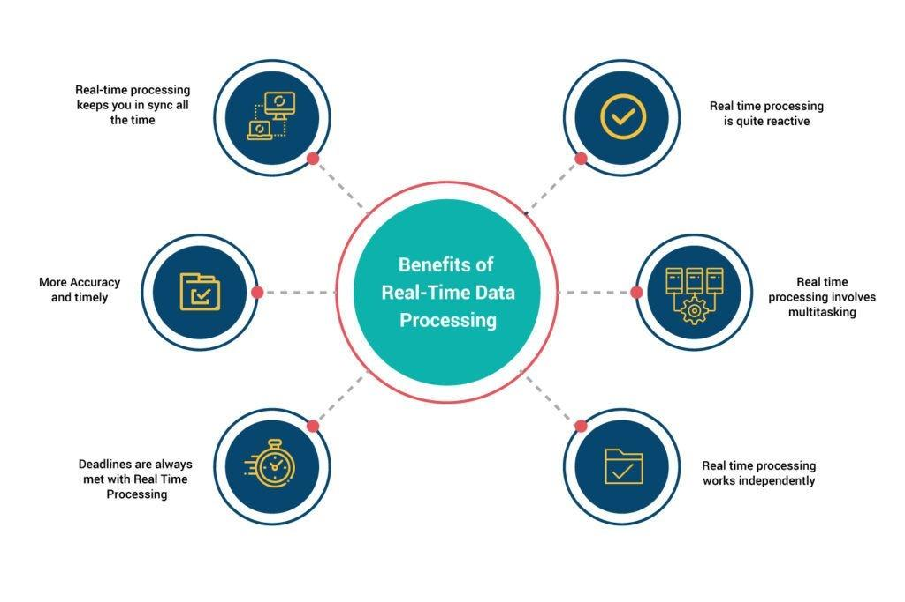

## Table of Contents

## What is real-time trading and why is data processing important in it?

Real-time trading is when people buy and sell things like stocks or cryptocurrencies instantly, as soon as they decide to do it. It's different from waiting until the end of the day or week to make trades. In real-time trading, everything happens very quickly, and the prices can change in just a few seconds.

Data processing is really important in real-time trading because it helps make sure that all the information is correct and up-to-date. When you're trading in real time, you need to know the current prices and other details right away. If the data is slow or wrong, you might make bad decisions and lose money. So, fast and accurate data processing helps traders make good choices and react quickly to changes in the market.

## What are the basic data processing requirements for real-time trading?

In real-time trading, you need data to be processed quickly and correctly. This means the computers and systems that handle the data must be fast. They need to take in new information about prices and trades as soon as it happens and update everything right away. If the data processing is slow, traders won't have the latest information they need to make good decisions.

Another important thing is that the data must be accurate. If the numbers are wrong, traders might buy or sell at the wrong time and lose money. The systems need to check the data carefully to make sure it's right before it's used. Also, the data should be easy to understand and use so traders can make quick decisions without getting confused.

## How can beginners start optimizing data processing for real-time trading?

Beginners can start optimizing data processing for real-time trading by focusing on using reliable and fast data sources. They should look for platforms or services that provide real-time data feeds without delays. This means choosing a good trading platform that can handle a lot of information quickly. It's also important to make sure the internet connection is strong and fast because slow internet can cause delays in getting the latest data.

Another way to optimize data processing is by learning to use trading software that can help manage and analyze data efficiently. There are many tools available that can automatically process data and give quick updates on prices and market trends. Beginners should take some time to learn how to use these tools properly. This can help them make better trading decisions without getting overwhelmed by too much information.

## What are the common data sources used in real-time trading?

In real-time trading, people often use data from stock exchanges. These are places where stocks are bought and sold, like the New York Stock Exchange or NASDAQ. The data from these exchanges includes the current prices of stocks, how many stocks are being traded, and other important details. This information is sent out in real-time, so traders can see it as soon as it happens. Many trading platforms connect directly to these exchanges to get this data quickly.

Another common data source is financial news services. These services provide news and updates about companies, the economy, and other things that can affect stock prices. News can come from places like Reuters or Bloomberg, and it's important because it can cause prices to change very quickly. Traders use this news to make decisions about buying or selling stocks. Some platforms also use data from social media and other online sources to get a sense of what people are thinking about certain stocks or the market in general.

Lastly, there are data feeds from market data providers. These are companies that collect and sell data about the markets. They gather information from many different places and put it together in a way that's easy for traders to use. Examples of these providers include Refinitiv and S&P Global. Traders can subscribe to these services to get a lot of detailed information about the markets, which helps them make better trading decisions.

## How does data latency affect real-time trading performance?

Data latency is how long it takes for information to get from one place to another. In real-time trading, if the data takes too long to reach the trader, it can cause big problems. When prices change quickly, even a small delay can mean a trader is looking at old information. This can lead to buying or selling at the wrong time, which might result in losing money. So, keeping data latency as low as possible is really important for making good trading decisions.

To handle data latency, traders use fast internet connections and choose trading platforms that can process information quickly. Some traders even pay to have their computers closer to the stock exchange to cut down on the time it takes for data to travel. By reducing latency, traders can react to market changes faster and have a better chance of making profitable trades. In real-time trading, every second counts, so managing data latency is key to success.

## What are the best practices for handling large volumes of data in real-time trading?

Handling large volumes of data in real-time trading means using strong computer systems that can process a lot of information quickly. Traders need to make sure their trading platforms can handle all the data without slowing down. This means using fast servers and good internet connections to keep everything running smoothly. It's also important to use data compression techniques, which make the data smaller and easier to handle. This helps the system work faster and use less storage space.

Another important practice is to use data filtering and prioritization. Not all data is equally important, so traders should focus on the most useful information first. This can be done by setting up rules to sort through the data and only show what's needed right away. This way, traders can make quick decisions without getting overwhelmed by too much information. Regularly cleaning and updating the data also helps keep the system running well, making sure that old or unnecessary data doesn't slow things down.

## How can data compression techniques be applied to optimize real-time trading?

Data compression techniques can help make real-time trading faster and more efficient. When data is compressed, it takes up less space and can be sent and processed more quickly. This is important in real-time trading because traders need to get the latest information as fast as possible. By using compression, the trading platform can handle more data without slowing down. This means traders can see the newest prices and make decisions without waiting, which can help them make better trades and possibly earn more money.

There are different ways to compress data in real-time trading. One way is to use algorithms that remove repeated information or use shorter codes for common data patterns. This makes the data smaller without losing important details. Another way is to only send the changes in the data instead of sending all the data every time. For example, if a stock price only changes a little bit, the system can just send the new price instead of sending all the information again. By using these techniques, traders can keep their systems running smoothly and react quickly to changes in the market.

## What role does data normalization play in optimizing real-time trading?

Data normalization is important in real-time trading because it makes different kinds of data easier to compare and use. When you trade, you look at many different pieces of information, like stock prices, trading volumes, and news updates. These pieces of information can be in different forms and sizes. Normalization changes all this data so it's on the same scale. This way, a trader can quickly understand and use the data without getting confused by different units or ranges.

By normalizing data, traders can make better decisions faster. In real-time trading, every second counts, so having data that's easy to work with helps a lot. When all the data is on the same scale, it's easier to spot trends and patterns. This can help traders react to changes in the market more quickly and accurately. So, data normalization is a key part of making sure the trading system works well and helps traders make the best choices.

## How can advanced algorithms improve data processing speed for real-time trading?

Advanced algorithms can make data processing faster in real-time trading by sorting and analyzing information more quickly. These algorithms can look at a lot of data at once and find the most important parts. They use smart math to do this, which means they can handle big amounts of data without slowing down. For example, an algorithm might use something called parallel processing, where it breaks the data into smaller pieces and works on them at the same time. This makes the whole process much faster, so traders can get the latest information right away.

Another way advanced algorithms help is by predicting what data will be needed next. They can learn from past trades and market patterns to guess what information will be important in the future. This means they can get that data ready before it's even asked for, which saves time. By doing this, the algorithms make sure that traders always have the most up-to-date information without any delays. This can help traders make better decisions and react to the market faster, which is really important in real-time trading.

## What are the benefits of using distributed systems for real-time trading data processing?

Using distributed systems for real-time trading can make things much faster and more reliable. A distributed system is when many computers work together to process data. This means that if one computer has a problem, the others can keep working, so the trading platform stays up and running. It also means that the work can be split up among many computers, which makes everything happen more quickly. In real-time trading, where prices can change in seconds, having a system that can handle a lot of data fast is really important.

Another big benefit of distributed systems is that they can handle a lot more data than a single computer. When lots of people are trading at the same time, there can be huge amounts of information coming in. A distributed system can take all this data and process it without slowing down. This helps traders get the latest prices and other important information right away, so they can make good decisions. By using distributed systems, traders can be sure their platform will work well even when the market is very busy.

## How can machine learning be integrated to enhance data processing in real-time trading?

Machine learning can help make data processing faster and better in real-time trading. It does this by learning from past data to predict what will happen next. For example, machine learning can look at how stock prices have changed in the past and use that information to guess what they might do in the future. This means traders can get ready for changes before they happen, which can help them make better decisions. Machine learning can also sort through huge amounts of data quickly, finding the most important information and showing it to traders right away. This makes the whole trading process smoother and more efficient.

Another way machine learning helps is by making the trading system smarter over time. As it gets more data, the machine learning model can learn and improve, getting better at predicting market trends and spotting patterns. This means the system can adapt to new situations and give traders more accurate information. By using machine learning, traders can have a tool that keeps getting better at helping them make quick and smart trading choices. This can be a big advantage in the fast-paced world of real-time trading.

## What are the latest technologies and trends in optimizing data processing for real-time trading?

The latest technologies for optimizing data processing in real-time trading include the use of cloud computing and edge computing. Cloud computing lets traders use powerful computers over the internet to process data quickly. This means they can handle a lot of information without needing big, expensive computers themselves. Edge computing is another trend where data is processed closer to where it's collected, like at the stock exchange. This cuts down on the time it takes for data to travel, making everything faster. Both of these technologies help traders get the latest information as soon as possible, which is really important in real-time trading.

Another big trend is the use of artificial intelligence (AI) and machine learning. These technologies can look at a lot of data and find patterns that humans might miss. They can also predict what might happen next in the market, which helps traders make better decisions. AI and machine learning can make the trading system smarter over time, learning from new data and getting better at helping traders. This can give traders an edge in the fast-moving world of real-time trading, where every second counts.

## How can we measure and evaluate performance?

To optimize data processing in real-time trading, accurately measuring and evaluating performance is crucial. Key performance indicators (KPIs) play a vital role in identifying strengths and areas for improvement within trading systems.

### Key Performance Indicators for Optimizing Data Processing

1. **Latency**: This KPI measures the time taken from receiving market data to executing a trade. Lower latency means faster trade execution, which is critical in high-frequency trading environments. It can be measured as:

$$
\text{Latency} = \text{Execution Time} - \text{Order Receipt Time}
$$

2. **Throughput**: This refers to the number of transactions a system can process within a given time frame. Higher throughput indicates more efficient data handling and trade execution capabilities.

3. **Trade Execution Accuracy**: This measures how closely execution prices match theoretical or expected prices. It is calculated as the deviation between the market and executed price, a critical metric for ensuring profitability.

4. **System Uptime**: Represents the percentage of time the trading system is operational and able to execute trades. High uptime is essential to leverage every market opportunity.

5. **Data Processing Rate**: This KPI quantifies the volume of market data processed per second. Faster processing allows for better decision-making and quicker trade placements.

### Methods for Testing and Benchmarking Trading Systems

1. **Simulated Trading Environments**: Utilize historical data to create simulation environments where trading strategies can be tested without risk, providing insight into the system's performance under real market conditions.

2. **Benchmarking Against Standard Performance Metrics**: Compare the system's performance against industry standards or competitors to determine relative efficiency.

3. **Load Testing**: Examine how the system performs under extreme conditions with increased market data input and trade volume to identify potential bottlenecks.

4. **Latency Measurements**: Utilize network time protocols and synchronized clocks to precisely measure system latency and pinpoint areas for optimization.

```python
# Example: Measuring latency in a Python trading system
import time

def measure_latency(order_function):
    start_time = time.time()
    order_function()
    end_time = time.time()
    return end_time - start_time
```

### Continuous Improvement Through Monitoring and Feedback Loops

1. **Real-Time Monitoring**: Use dashboards and alerts to continuously track system performance metrics like latency and throughput, enabling immediate identification and resolution of issues.

2. **Feedback Loops**: Implement mechanisms where outcomes of executed trades and system performance are analyzed to enhance strategies and system configurations.

3. **Regular Updates and Patches**: Continuously update software and hardware components to incorporate the latest optimizations and security enhancements.

4. **Analytical Reviews**: Periodic comprehensive reviews of trading algorithms and data processing methods can lead to insights for significant performance improvements.

By focusing on these KPIs, methods, and continuous improvement strategies, trading systems can be optimized to achieve superior performance, ensuring swift, accurate, and reliable execution of trade decisions.

## References & Further Reading

[1]: Aldridge, Irene. ["High-Frequency Trading: A Practical Guide to Algorithmic Strategies and Trading Systems."](https://www.amazon.com/High-Frequency-Trading-Practical-Algorithmic-Strategies/dp/1118343506) Wiley, 2nd Edition.

[2]: Apache Software Foundation. ["Apache Flink: Stream Processing with Apache Flink."](https://flink.apache.org/) An open-source platform for distributed stream and batch data processing.

[3]: Chan, Ernest P. ["Algorithmic Trading: Winning Strategies and Their Rationale."](https://www.amazon.com/Algorithmic-Trading-Winning-Strategies-Rationale/dp/1118460146) Wiley.

[4]: Grant, Brian R. ["High-Performance Trading: Performance Optimization Techniques for Traders."](https://www.amazon.fr/High-Performance-Trading-Strategies-Techniques/dp/1905641613) FT Press.

[5]: Prado, Marcos Lopez de. ["Advances in Financial Machine Learning."](https://www.wiley.com/en-us/Advances+in+Financial+Machine+Learning-p-9781119482087) Wiley.