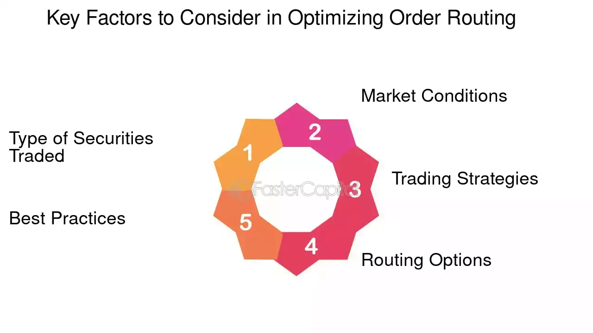

## Table of Contents

## What is order routing and why is it important?

Order routing is the process of sending a customer's order from one place to another until it reaches its final destination. Imagine you order a toy online. The toy starts at the warehouse, then goes to a shipping center, and finally arrives at your home. Order routing makes sure the toy takes the best path to get to you quickly and safely.

This process is important because it helps businesses deliver products on time and keep customers happy. If the order routing is done well, customers get their items faster and in good condition. This makes them more likely to shop with the same company again. Good order routing also saves money by choosing the most efficient routes, which can help lower shipping costs for both the business and the customer.

## How does order routing affect the efficiency of a business?

Order routing plays a big role in making a business run smoothly. When a business uses good order routing, it can send products to customers faster. This means less time waiting for things to arrive, which makes customers happier. Happy customers are more likely to come back and buy more, which is good for the business. Plus, when orders are sent out quickly, the business can handle more orders in less time, making it more efficient overall.

Efficient order routing also helps save money. By choosing the best paths for orders, a business can cut down on shipping costs. For example, if the system finds a shorter route or a cheaper way to ship something, the business spends less money. This can lead to lower prices for customers or more profit for the business. In the end, good order routing helps the business work better and be more successful.

## What are the basic principles of order routing optimization?

Order routing optimization is about finding the best way to send products from the start to the end. The main idea is to make the journey as short and cheap as possible. This means choosing the fastest routes and the least expensive ways to ship things. It's important to think about where the product is coming from, where it needs to go, and what options are available for getting it there.

Another key part of order routing optimization is making sure the system can handle a lot of orders without getting slowed down. This means using smart technology to keep track of everything and make quick decisions. The system needs to be able to change plans if something unexpected happens, like a delay or a problem with a shipment. By doing all of this, businesses can send out orders faster and save money, which makes everyone happier.

## What tools and technologies are available for order routing?

There are many tools and technologies that help with order routing. One common tool is a Transportation Management System (TMS). A TMS helps businesses plan the best routes for their shipments. It looks at things like distance, cost, and delivery time to find the best way to send products. Another useful technology is Geographic Information Systems (GIS). GIS uses maps and data to help plan routes. It can show the best paths to take and help avoid traffic or other problems.

Another important technology is real-time tracking and monitoring systems. These systems let businesses see where their shipments are at any time. This helps them make quick changes if something goes wrong, like a delay or a problem with a shipment. Also, many businesses use software that can handle a lot of orders at once. This software uses algorithms to find the best routes for many shipments, making the whole process faster and more efficient.

Lastly, there are tools like route optimization software and fleet management systems. Route optimization software helps find the shortest and cheapest routes for deliveries. Fleet management systems help businesses keep track of their vehicles and make sure they are used in the best way possible. All these tools and technologies work together to make order routing easier and more effective for businesses.

## How can data analysis improve order routing decisions?

Data analysis can make order routing better by looking at past orders and finding patterns. For example, it can see which routes are usually faster or cheaper. By using this information, businesses can choose the best paths for new orders. This helps them save time and money. Data analysis can also spot problems, like routes that often have delays. By fixing these issues, businesses can make their deliveries more reliable.

Another way data analysis helps is by predicting future needs. It can look at things like how many orders come in at different times of the year or what products are popular. With this information, businesses can plan their routes better. They can make sure they have enough trucks and drivers ready when they need them. This makes the whole process smoother and keeps customers happy.

## What are the common challenges faced in order routing and how to overcome them?

One common challenge in order routing is dealing with unexpected delays. Things like traffic, bad weather, or problems at shipping centers can slow down deliveries. To overcome this, businesses can use real-time tracking systems. These systems help them see where their shipments are and change plans quickly if something goes wrong. Another challenge is handling a lot of orders at once, especially during busy times like holidays. To manage this, businesses can use smart software that can handle many orders and find the best routes for all of them.

Another issue is making sure the routes are as cheap as possible. Shipping can be expensive, and businesses need to find ways to save money. They can use data analysis to look at past orders and see which routes were the cheapest. This helps them choose better paths for future orders. Also, keeping customers happy can be tough if deliveries are slow or late. To fix this, businesses can communicate well with customers, letting them know when their orders will arrive and keeping them updated if there are any changes. By using these strategies, businesses can make their order routing better and keep their customers happy.

## How can real-time tracking enhance order routing?

Real-time tracking helps make order routing better by letting businesses see where their shipments are at any time. This means they can quickly change plans if something goes wrong, like a delay or a problem with a shipment. For example, if a truck gets stuck in traffic, the business can find another route or send another truck to keep the delivery on time. This helps make sure customers get their orders faster and keeps them happy.

Also, real-time tracking helps businesses save money. By knowing exactly where shipments are, they can choose the best and cheapest routes. If a shipment is running late, they can find a faster way to get it to the customer without spending more money. This makes the whole process more efficient and helps the business run better.

## What role does machine learning play in optimizing order routing?

Machine learning helps make order routing better by learning from past orders. It can look at a lot of data and find patterns, like which routes are faster or cheaper. By using this information, businesses can choose the best paths for new orders. This saves time and money because the system gets smarter over time and makes better decisions.

Machine learning can also predict future needs. It can look at things like how many orders come in at different times of the year or what products are popular. With this information, businesses can plan their routes better. They can make sure they have enough trucks and drivers ready when they need them. This makes the whole process smoother and keeps customers happy.

## How can multi-modal transportation be integrated into order routing strategies?

Multi-modal transportation means using different ways to move goods, like trucks, trains, ships, and planes. To use this in order routing, businesses need to plan how to switch between these different ways of moving things. For example, a product might start on a truck, then go on a train, and finally be delivered by another truck. The key is to find the best mix of these methods to make the delivery fast and cheap. A good system will look at things like how long each part of the journey takes, how much it costs, and how reliable each method is.

Using multi-modal transportation can help businesses save money and be more flexible. If one way of moving goods is slow or expensive, they can switch to another way. For example, if there's a lot of traffic on the roads, they might use a train instead. This can make deliveries faster and keep customers happy. To make this work well, businesses need good technology to plan and track the whole journey. This way, they can make sure everything goes smoothly and the goods get to the customer on time.

## What are advanced algorithms used in order routing optimization?

Advanced algorithms help make order routing better by finding the best ways to send products. One type of algorithm is called the genetic algorithm. It works by trying lots of different routes and then [picking](/wiki/asset-class-picking) the best ones. It's like playing a game where the algorithm keeps trying new paths and gets better over time. Another type is the ant colony optimization algorithm. This one is based on how ants find food. It uses many small steps to figure out the best route, getting smarter with each try.

Another important algorithm is the dynamic programming algorithm. This one breaks down big problems into smaller parts and solves them one by one. It helps find the shortest and cheapest path by looking at all the options. Machine learning algorithms are also used a lot. They learn from past orders to make better choices for new ones. By using these advanced algorithms, businesses can make their deliveries faster and cheaper, which makes everyone happy.

## How can one measure the success of an order routing strategy?

Measuring the success of an order routing strategy is important to see if it's working well. One way to do this is by looking at how fast orders are delivered. If the time it takes to get products to customers is shorter, then the strategy is probably good. Another way is to check if the costs are lower. If the business is spending less money on shipping because of better routes, that's a sign of success. Also, looking at customer feedback helps. If customers are happy and say good things about the delivery, it means the routing strategy is working.

Another important measure is how many orders the business can handle without problems. If the system can manage a lot of orders at the same time without delays, that shows the strategy is effective. It's also good to look at how often things go wrong, like late deliveries or lost packages. If these problems happen less often, the strategy is doing well. By keeping an eye on these things, a business can tell if its order routing strategy is successful and make changes if needed.

## What future trends should be considered in the development of order routing systems?

In the future, order routing systems will get even smarter with new technology. One big trend is using more [artificial intelligence](/wiki/ai-artificial-intelligence) (AI) and [machine learning](/wiki/machine-learning). These tools can look at a lot of data and find the best ways to send products. They can learn from past orders and get better over time. This means deliveries can be faster and cheaper. Another trend is using more real-time data. This helps businesses see where their shipments are and change plans quickly if something goes wrong. This makes the whole process smoother and keeps customers happy.

Another important trend is using more green technology. Businesses will try to find ways to make deliveries that are good for the environment. This could mean using electric trucks or finding routes that use less fuel. Also, more businesses will use multi-modal transportation, which means using different ways to move goods, like trucks, trains, and ships. This can help save money and be more flexible. By keeping up with these trends, order routing systems can keep getting better and help businesses run more smoothly.

## References & Further Reading

[1]: Kearns, M., & Nevmyvaka, Y. (2013). ["Machine Learning for Market Microstructure and High-Frequency Trading."](https://www.cis.upenn.edu/~mkearns/papers/KearnsNevmyvakaHFTRiskBooks.pdf) Handbook of Financial Data and Risk Information.

