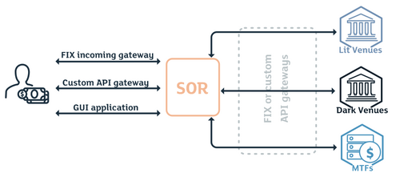

In today's fast-paced market environment, efficient order routing stands as a critical component for businesses aiming to minimize costs and maximize profits. The ability to strategically manage the distribution of orders across various channels ensures that delivery is not only swift but also cost-effective, which is essential in maintaining a competitive edge.

Optimizing order routing involves a multifaceted approach that includes the integration of advanced technologies, data analysis, and strategic planning. This optimization process helps businesses navigate the complexities of logistics and supply chain management. By ensuring that orders are routed through the most efficient paths and channels, companies can reduce shipping costs, improve delivery times, and enhance overall customer satisfaction.



As businesses increasingly shift towards a global market, the need for sophisticated order routing strategies becomes even more pronounced. Leveraging technologies such as artificial intelligence and machine learning allows for predictive analytics and dynamic decision-making, further enhancing the efficiency of order routing.

This article will explore various key strategies and technologies that businesses can implement to optimize their order routing processes. With insights into both theoretical and practical applications, the aim is to provide a comprehensive guide to achieving optimal results in the rapidly evolving market landscape.


## Table of Contents

## Understanding Order Routing

Order routing is a critical component of logistics and supply chain management, referring to the systematic process of directing customer orders to the most appropriate fulfillment center, supplier, or service provider. The primary goal of effective order routing is to enhance operational efficiency by ensuring that orders are processed and delivered in the fastest and most cost-effective manner. This involves a strategic alignment of multiple [factor](/wiki/factor-investing)s to achieve timely delivery, minimize shipping costs, and boost customer satisfaction.

At its core, order routing integrates various data points and logistical parameters to make optimal routing decisions. These parameters include inventory levels, geographic locations, shipping options, and delivery windows. By evaluating these factors, businesses can determine the best path for each order, effectively balancing speed and cost. This is achieved through advanced algorithms and decision-making models that prioritize orders based on predefined criteria, such as proximity to the fulfillment center and availability of stock.

In practice, the order routing process can be visualized as a dynamic decision tree, where each branch represents a potential routing option, and the leaves at the end of the branches are the outcomes—such as specific fulfillment centers or suppliers where the order can be routed. The decision-making process involves calculating the most efficient path through this tree structure, maximizing the probability of achieving desired outcomes like cost savings and timely delivery.

Implementing effective order routing techniques is crucial for businesses striving to maintain competitiveness in today's fast-paced market. Efficient routing not only reduces operational costs but also significantly enhances customer satisfaction by meeting or exceeding delivery expectations. With advancements in technology, businesses can now use sophisticated software tools and platforms that facilitate automated order routing. These solutions employ [artificial intelligence](/wiki/ai-artificial-intelligence) and machine learning algorithms to continuously assess and improve routing strategies.

In summary, order routing is an essential logistics function that directly influences a business's ability to deliver products promptly and cost-effectively. By directing orders to the appropriate channels, businesses can streamline their operations, reduce waste, and meet customer demands more efficiently. This capability is fundamental for optimizing supply chain performance and achieving sustainable growth in a competitive environment.


## Key Factors in Order Routing Optimization

Order routing optimization is a multifaceted process influenced by several critical factors, such as inventory levels, shipping costs, delivery times, and geographic location. Each factor plays a unique role in shaping an effective strategy that aligns with a company's operational goals and helps enhance overall efficiency.

Inventory levels are foundational in order routing, as they determine the availability of products at various fulfillment centers. Adequate inventory management ensures that orders are routed to locations where stock is readily available, minimizing delays and reducing the risk of stockouts. Poor inventory levels can result in prolonged delivery times and increased shipping costs, underscoring the importance of real-time inventory tracking and management.

Shipping costs are another crucial factor to consider. Businesses must evaluate different shipping carriers and methods to strike a balance between cost and speed. A dynamic pricing model allows companies to assess real-time shipping costs and select the most cost-effective option for fulfilling each order. By minimizing shipping expenses, businesses can maintain competitive pricing and improve profit margins.

Delivery times are directly linked to customer satisfaction. In today's fast-paced market, consumers expect quick and reliable delivery. Businesses must optimize their order routing processes to ensure that delivery times meet, or even exceed, customer expectations. This involves selecting fulfillment centers that can guarantee timely delivery based on their geographic proximity and available shipping options.

Geographic location plays a significant role in determining the efficiency of order routing. By strategically placing fulfillment centers closer to key markets, companies can reduce transit times and shipping costs. Geographic data analytics can aid in pinpointing optimal locations for distribution centers, ensuring that they are situated to serve the highest concentration of customers effectively.

To align with operational goals, businesses should integrate these factors into a comprehensive order routing strategy. This approach not only streamlines the decision-making process but also enhances the adaptability of the routing system to accommodate varying customer demands and market conditions. By focusing on these key factors, businesses can achieve an efficient order routing strategy that supports their growth and meets customer needs effectively.


## Leveraging Technology for Order Routing

Incorporating cutting-edge technologies such as artificial intelligence (AI) and [machine learning](/wiki/machine-learning) (ML) can considerably enhance the efficiency and effectiveness of order routing processes. These technologies facilitate automation and provide advanced analytics to optimize the flow of operations from order initiation to final delivery, reducing manual input and human error while increasing speed and accuracy.

AI and ML can analyze vast amounts of data to predict demand patterns, identify optimal routing paths, and monitor real-time variables that influence delivery timings. These predictive capabilities are essential in maintaining inventory levels that align closely with fluctuating demand, thus minimizing overstock and stockouts. For instance, AI algorithms can process historical sales data, seasonal trends, and current market conditions to forecast demand, thereby informing inventory and routing decisions. 

Advanced analytics further support order routing by evaluating multiple variables such as delivery costs, transit times, and geographic considerations in real time. These analytics tools can quickly calculate the most cost-effective and timely delivery routes, taking into account dynamic conditions like traffic, weather, and road closures. Automation in this context not only speeds up decision-making processes but also provides a higher degree of accuracy compared to manual assessments.

Technology platforms equipped with real-time monitoring capabilities can adjust routing dynamically when facing unavoidable disruptions such as sudden demand spikes or logistical setbacks, ensuring customer satisfaction by meeting delivery deadlines. Additionally, route optimization software leverages algorithms to arrange orders in a sequence that minimizes travel time and fuel consumption, aiding in both cost reduction and environmental sustainability.

Furthermore, integrating technological solutions like blockchain can add transparency and security to order routing processes. Blockchain ensures secure data exchange and traceability, which can be crucial in maintaining robust audit trails and enhancing trust with stakeholders.

In practice, businesses can harness cloud-based order management systems that integrate AI-driven analytics and machine-learning models to automate and enhance decision-making. These systems provide a unified platform for synchronizing different facets of order fulfillment, from inventory management and order processing to delivery execution.

By adopting such technologies, businesses can not only achieve more reliable and efficient order routing but also maintain a competitive edge in a rapidly evolving market landscape.


## Strategies for Optimizing Order Routing

Implementing a multi-carrier shipping strategy can significantly enhance flexibility and efficiency in order routing. By utilizing multiple carriers, businesses have the ability to choose the most cost-effective and time-efficient delivery options, thus minimizing shipping costs and transit times. This strategy also offers a buffer against disruptions in service from any single carrier, ensuring steadiness in supply chain operations.

Real-time data analytics allow businesses to monitor and adjust their routing strategies dynamically based on current conditions. By integrating data analytics tools, companies can assess real-time metrics such as carrier performance, delivery times, and cost fluctuations. For example, by analyzing shipping data, businesses can develop predictive models to forecast demand and optimize order distribution. Python libraries like pandas or NumPy can be instrumental in handling and analyzing such data.

```python
import pandas as pd

# Sample DataFrame representing shipment data
data = {'Carrier': ['Carrier A', 'Carrier B', 'Carrier C'],
        'Cost': [10.5, 8.75, 12.0],
        'DeliveryTime': [3, 2, 4]}

df = pd.DataFrame(data)

# Function to select the most cost-effective carrier
def select_best_carrier(df):
    # Weight factors for cost and delivery time
    cost_weight = 0.6
    time_weight = 0.4
    
    df['Score'] = df['Cost'] * cost_weight + df['DeliveryTime'] * time_weight
    return df.loc[df['Score'].idxmin()]

best_carrier = select_best_carrier(df)
print("Best carrier option:")
print(best_carrier)
```

Moreover, predictive analytics can enhance decision-making by providing insights into potential delays or cost variances, helping to preemptively adjust routing decisions.

A practical strategy businesses can employ is dynamic rerouting based on network conditions and external factors such as weather or political events. Establishing contingency plans, which include alternative routes or carriers, ensures that deliveries remain efficient, regardless of unexpected disruptions. Additionally, closer collaboration with carriers can allow real-time adjustments to be communicated swiftly, minimizing delivery delays.

Businesses can further optimize their processes by employing zone skipping. This involves consolidating shipments targeted for a particular geographic area and transporting them as a single unit to the nearest distribution center. Once at the center, these shipments are sorted and delivered locally, significantly reducing shipping distances and costs.

Ultimately, strategies that encompass flexibility, technological integration, and collaboration can transform the efficiency of order routing, helping businesses meet customer demands while maintaining competitive costs.


## Case Studies and Examples

## Case Studies and Examples

Real-world examples illustrate how strategic order routing optimization can dramatically improve operational efficiency and customer satisfaction. Here are several notable case studies of companies that have successfully enhanced their order routing systems:

### Amazon

Amazon, a leader in e-commerce, has pioneered the use of advanced technologies for optimizing order routing. With over 175 fulfillment centers worldwide, Amazon employs complex algorithms to determine the most efficient fulfillment center for every order. These algorithms take into account factors such as proximity to the customer, current inventory levels, and shipping costs. By leveraging machine learning and predictive analytics, Amazon can forecast demand and optimize its logistical operations, reducing delivery times and cutting shipping costs. This strategic approach to order routing has been critical in helping Amazon maintain its competitive edge and elevate customer satisfaction.

### Zara

Zara, a global fashion retailer, is known for its fast-fashion model that emphasizes quick response times to market trends. Operating an efficient order routing system is key to Zara’s ability to replenish stores quickly and meet consumer demand. Zara uses sophisticated software that integrates store sales data, inventory levels, and distribution center operations. By analyzing this data in real-time, Zara can reroute stock to stores with high demand and reduce overstock at locations with slower sales. This strategy not only minimizes inventory holding costs but also maximizes the availability of products, ensuring that popular items are always in stock.

### Walmart

Walmart has invested heavily in technology to refine its order routing process. Through its advanced logistics network and a strategy known as "ship from store," Walmart optimizes deliveries by routing online orders to be fulfilled from the nearest store with available inventory. This reduces both shipping time and cost. Walmart's use of machine learning algorithms also allows it to adapt to changing conditions, such as supply chain disruptions or shifts in consumer buying patterns. This flexible approach to order routing contributes significantly to Walmart's efficiency and ability to provide fast, affordable delivery options.

### DHL

DHL, a global logistics company, exemplifies how order routing optimization can enhance both operational efficiency and customer service. DHL employs a digital platform that harnesses big data and predictive analytics to optimize route planning and resource allocation. For instance, DHL's Route Optimization System (ROS) calculates the most efficient routes for delivery vehicles by considering traffic conditions, weather forecasts, and delivery priorities. By dynamically adjusting routes in real-time, DHL minimizes delivery times and reduces fuel consumption, leading to substantial cost savings and improved customer experience.

### Actionable Insights

Analyzing these examples offers several actionable insights for businesses seeking to improve their order routing processes. Implementing predictive analytics and machine learning technologies can significantly enhance decision-making by accurately forecasting demand and optimizing logistical operations. Additionally, adopting a flexible order fulfillment strategy, such as Walmart's "ship from store" model, can improve delivery speed and reduce costs. Finally, real-time data integration and adaptable systems can provide the agility needed to respond quickly to changing market conditions, ultimately leading to improved customer satisfaction and operational efficiency.

These case studies demonstrate that with the right strategies and technological investments, businesses can significantly enhance their order routing systems and achieve remarkable results.


## Challenges and Solutions

Order routing optimization presents several challenges that businesses must navigate to ensure efficient and cost-effective delivery processes. One of the primary challenges is integrating disparate systems. Companies often use multiple platforms for inventory management, order processing, and customer service. The lack of seamless integration can lead to inefficiencies and errors in order routing. To address this, businesses should adopt integrated systems or establish middleware solutions that facilitate smooth communication between different platforms.

Another significant challenge is managing unforeseen disruptions. These disruptions could range from sudden spikes in demand to logistical issues such as transportation delays or supply shortages. To mitigate these risks, businesses should develop robust contingency plans. This could include maintaining a buffer stock of high-demand products or having alternative suppliers and carriers ready to step in when needed. By employing predictive analytics, companies can forecast potential disruptions and plan accordingly, enhancing their resilience.

Moreover, the variability in shipping costs and delivery times across different regions poses a challenge for order routing. To optimize costs and delivery times, businesses should continuously analyze shipping data to identify patterns and optimize their carrier selection based on performance metrics such as cost, speed, and reliability. Implementing dynamic pricing models can also help businesses adjust their strategies in real-time to accommodate shifts in costs and demand.

Finally, ensuring data accuracy across all systems is crucial, as incorrect data can lead to misrouted orders and customer dissatisfaction. Regular audits and synchronized updates across platforms can help maintain high data accuracy. Investing in training programs for staff can also ensure they are well-versed in using new technologies and systems effectively.

In conclusion, while order routing optimization is fraught with challenges, businesses can overcome them through strategic planning, leveraging technology, and fostering adaptability. By doing so, they can enhance their operational efficiency and maintain a competitive edge in the market.


## Conclusion

Optimizing order routing is crucial for businesses to minimize costs, boost efficiency, and enhance customer satisfaction in today's competitive market. When businesses leverage advanced technologies like AI and machine learning, they can automate and refine their order routing processes, leading to more accurate and reliable outcomes. The ability to analyze vast datasets in real-time allows businesses to adjust their strategies dynamically, ensuring that orders are fulfilled in the most cost-effective and timely manner.

Considering key factors such as inventory levels, shipping costs, delivery times, and geographic location is essential for developing a robust order routing strategy. These elements directly impact the efficiency and effectiveness of order fulfillment, guiding businesses to make informed decisions that align with their operational and financial objectives.

Strategic solutions, including the implementation of multi-carrier shipping strategies and real-time data analytics, enable businesses to adapt to changing conditions and optimize their routing routines. Leading companies have demonstrated that by prioritizing these approaches, significant improvements in order routing processes are achievable.

In conclusion, a well-optimized order routing system not only reduces costs and enhances customer satisfaction but also provides a competitive edge in a rapidly evolving market. Businesses that invest in technology, account for key factors, and apply strategic methodologies position themselves for sustained success and operational excellence.


## References & Further Reading

[1]: Kearns, M., & Nevmyvaka, Y. (2013). ["Machine Learning for Market Microstructure and High-Frequency Trading."](https://www.cis.upenn.edu/~mkearns/papers/KearnsNevmyvakaHFTRiskBooks.pdf) Handbook of Financial Data and Risk Information.