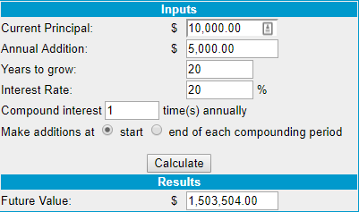

## Table of Contents

## What are the basic types of capital for trading?

When people talk about trading, they often mention different types of capital. The main types are financial capital, human capital, and social capital. Financial capital is the money you use to buy and sell things in the market. It's the most straightforward type because it's just about how much money you have to trade with. Human capital is a bit different. It's about the skills, knowledge, and experience that a trader brings to the table. A trader with good human capital can make better decisions and might be more successful.

Social capital is another important type of capital in trading. It's about the relationships and networks that a trader has. These connections can help traders get better information, find new opportunities, or even get help when they need it. All three types of capital are important for trading, but they work together in different ways. For example, having a lot of financial capital is great, but without good human capital, a trader might not know how to use it effectively. And without social capital, they might miss out on valuable insights from other traders.

## How can I start trading with a small amount of money?

Starting to trade with a small amount of money is possible and can be a good way to learn. You can begin by opening an account with a broker that allows you to trade with small amounts. Many online platforms offer low minimum deposits, sometimes as low as $10 or $20. Once you have your account set up, you can start by trading in small quantities. This way, you can practice and learn without risking a lot of money. It's important to start with a plan and set clear goals for what you want to achieve.

Another good approach is to focus on trading assets that have lower costs. For example, you might start by trading stocks that have low share prices or use a micro-lot in [forex](/wiki/forex-system) trading. This allows you to spread your small amount of money across different trades, reducing the risk. It's also a good idea to use a demo account first, where you can practice trading with virtual money. This can help you get comfortable with the platform and test your strategies before using real money. Remember, the key is to start small, learn as you go, and gradually increase your trading as you gain more experience and confidence.

## What are the common sources of capital for new traders?

New traders often start with their own savings. This is the most common source of capital because it's money they already have. They might save up for a while before they feel ready to start trading. Using their own money can be good because they won't owe anyone if they lose it. But it can also be scary because it's their own money at risk.

Another source of capital can be money from family or friends. Sometimes, people who know and trust the new trader might be willing to lend them money or invest in their trading. This can help the trader start with a bit more money than they have on their own. But it's important to be clear about the risks and make sure everyone understands that trading can lead to losses.

Some new traders might also look into getting a loan from a bank or using a credit card. This can give them more money to trade with, but it comes with the risk of having to pay back the loan, plus interest, even if they lose money trading. It's a big decision and should be thought about carefully.

## How do I create a trading plan to attract investors?

To create a trading plan that attracts investors, you need to start by clearly defining your trading goals and strategies. Explain what you want to achieve with your trading, like making a certain amount of money over a specific time. Then, describe the strategies you will use to reach these goals. This might include the types of assets you will trade, like stocks or forex, and the methods you will use, like technical analysis or following market trends. It's important to be specific and show that you have thought through your plan carefully.

Next, you should include details on risk management. Investors want to know that you won't lose all their money quickly. Explain how you will manage risks, like setting stop-loss orders to limit losses on each trade or only risking a small percentage of your capital on any single trade. Also, show your track record if you have one, or use demo account results to prove that your strategies can work. Finally, be honest about the potential risks and rewards. Investors will appreciate your transparency and be more likely to trust you with their money if they see that you understand the market's ups and downs.

## What are the risks involved in using borrowed capital for trading?

Using borrowed capital for trading can be risky. When you borrow money to trade, you have to pay it back no matter if you make money or lose money. If your trades don't go well, you could end up losing more than just the money you borrowed. You might also have to pay interest on the loan, which can add to your costs and make it harder to make a profit. If you can't pay back the loan, it could hurt your credit score or even lead to legal problems.

Another risk is that using borrowed money can make you take bigger risks than you should. When you're trading with someone else's money, you might try to make big wins to pay back the loan quickly. But this can lead to big losses if the trades don't work out. It's important to be careful and not let the pressure of owing money push you into making bad trading decisions.

## How can I use personal savings effectively for trading?

Using personal savings for trading can be a smart way to start if you do it right. You should first set aside some money that you can afford to lose. This means you won't be in big trouble if your trades don't work out. Next, you should start small and learn as you go. Don't put all your savings into trading right away. Instead, try trading with a small amount first to see how it goes. This way, you can practice and get better without risking too much money.

Another important thing is to have a clear plan. Decide what you want to achieve with your trading and how you will do it. Write down your goals and the steps you will take to reach them. This can help you stay focused and make better decisions. Also, think about how you will manage risks. You might set limits on how much you are willing to lose on each trade. By using your savings carefully and having a good plan, you can increase your chances of success in trading.

## What should I consider when seeking venture capital for trading?

When seeking venture capital for trading, it's important to think about what you can offer to investors. You need to show them that you have a good trading plan and that you know what you're doing. This means having a clear strategy, showing them your past results if you have any, and explaining how you will manage risks. Investors want to see that you have thought everything through and that you have a good chance of making money. They also want to know how much of their money you need and what they will get in return, like a share of the profits.

Another thing to consider is the kind of investors you are looking for. Some investors might be more interested in trading than others. You should look for people who understand the trading world and are willing to take the risks that come with it. It's also a good idea to build a relationship with them, so they trust you and feel good about investing in your trading. Remember, getting venture capital is not just about the money; it's also about finding the right partners who believe in what you're doing.

## How do I calculate the potential returns on my trading investments?

To calculate the potential returns on your trading investments, you need to know how much money you are putting in and how much you think you can make. Start by figuring out your initial investment. This is the amount of money you are using to buy stocks, forex, or whatever you are trading. Then, think about how much you expect to make from your trades. This can be tricky because the market can go up or down, but you can use your trading strategy to make a guess. For example, if you invest $1,000 and you think you can make $100, your potential return would be 10%.

It's also important to think about the costs of trading, like fees and taxes, because they can affect your returns. If you have to pay $20 in fees for your $1,000 investment, your actual return would be $80, or 8%. You can also use a percentage to figure out your returns. If you think your trading strategy can make a 5% return each month, and you invest $1,000, your potential monthly return would be $50. But remember, these are just guesses, and the real returns can be different because trading is risky.

## What are advanced strategies for raising capital in the trading market?

One advanced strategy for raising capital in the trading market is to use crowdfunding platforms. These platforms let you share your trading plan with a lot of people and ask them to invest small amounts of money. This can be a good way to get money from many different people instead of just a few big investors. You need to make a good pitch that explains your trading strategy and shows why people should trust you with their money. It's also important to keep your investors updated on how your trading is going, so they feel involved and happy with their investment.

Another strategy is to partner with other traders or trading firms. By working together, you can pool your money and share the risks and rewards. This can be a good way to get more capital because other traders might be willing to invest in your trading if they believe in your skills and strategy. You can also learn from each other and improve your trading. But it's important to have a clear agreement on how you will share the profits and make decisions, so everyone knows what to expect.

A third strategy is to use leverage, which means borrowing money to trade with. This can help you raise more capital, but it's very risky. When you use leverage, you can make bigger trades with less of your own money, but if the trades go badly, you could lose a lot more than you started with. It's important to understand the risks and have a good plan for managing them. Using leverage can be a powerful way to raise capital, but it's not for everyone and should be used carefully.

## How can I leverage my trading network to raise capital?

To leverage your trading network to raise capital, start by talking to the people you know in the trading world. These could be other traders, mentors, or even people you've met at trading events. Explain your trading plan to them and show them why you think it can make money. If they believe in your skills and strategy, they might be willing to invest some money in your trading. It's important to be honest about the risks and rewards, so they know what they're getting into. Building trust with your network is key, so keep them updated on how your trading is going and listen to their advice.

Another way to use your trading network is to find partners who want to work with you. You can pool your money together and share the risks and rewards. This can be a good way to raise more capital because other traders might be more willing to invest if they are part of the trading process. Make sure to have a clear agreement on how you will share the profits and make decisions. By working together, you can not only raise more capital but also learn from each other and improve your trading.

## What are the tax implications of raising capital for trading?

When you raise capital for trading, you need to think about taxes. If you make money from your trades, you will have to pay taxes on those profits. The amount of tax you pay can depend on how long you hold your investments. If you buy and sell quickly, it might be considered short-term capital gains, which are usually taxed at a higher rate than long-term gains. Also, if you get money from investors, you might need to report that as income, depending on how you set up your trading business.

Another thing to think about is the tax rules for different types of investments. For example, trading stocks might have different tax rules than trading forex or cryptocurrencies. It's a good idea to talk to a tax professional who knows about trading. They can help you understand the tax laws and make sure you are doing everything right. Keeping good records of your trades and the money you raise can also help when it's time to file your taxes.

## How can I optimize my trading strategy to maximize returns with raised capital?

To optimize your trading strategy and maximize returns with raised capital, start by setting clear goals and understanding your risk tolerance. Decide how much money you are willing to risk on each trade and stick to that limit. This helps you manage your money wisely and avoid big losses. Also, use a mix of different trading strategies, like technical analysis and following market trends. This can help you make better decisions and increase your chances of making money. Keep learning and adjusting your strategy based on what works and what doesn't.

Another important thing is to use the raised capital to diversify your trades. Instead of putting all the money into one trade, spread it across different assets like stocks, forex, or commodities. This can reduce your risk because if one trade goes bad, you still have others that might do well. Also, keep an eye on your performance and make changes if needed. If you see that a certain strategy is working well, you might want to put more money into it. But always be careful and don't let the pressure of using raised capital push you into making bad trading decisions.

## References & Further Reading

[1]: Bergstra, J., Bardenet, R., Bengio, Y., & Kégl, B. (2011). ["Algorithms for Hyper-Parameter Optimization."](https://papers.nips.cc/paper/4443-algorithms-for-hyper-parameter-optimization) Advances in Neural Information Processing Systems 24.

[2]: ["Advances in Financial Machine Learning"](https://www.amazon.com/Advances-Financial-Machine-Learning-Marcos/dp/1119482089) by Marcos Lopez de Prado

[3]: ["Evidence-Based Technical Analysis: Applying the Scientific Method and Statistical Inference to Trading Signals"](https://www.amazon.com/Evidence-Based-Technical-Analysis-Scientific-Statistical/dp/0470008741) by David Aronson

[4]: ["Machine Learning for Algorithmic Trading"](https://github.com/stefan-jansen/machine-learning-for-trading) by Stefan Jansen

[5]: ["Quantitative Trading: How to Build Your Own Algorithmic Trading Business"](https://books.google.com/books/about/Quantitative_Trading.html?id=j70yEAAAQBAJ) by Ernest P. Chan