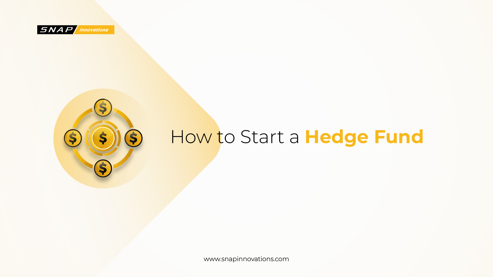

## Table of Contents

## What is a hedge fund and how does it differ from other investment vehicles?

A hedge fund is a type of investment fund that pools money from investors and uses different strategies to earn high returns. These strategies can include investing in stocks, bonds, commodities, and even using complex financial instruments like derivatives. Hedge funds are usually managed by professional investment managers who aim to make money whether markets are going up or down. They often charge higher fees than other investment vehicles because they promise to deliver better results.

Hedge funds differ from other investment vehicles like mutual funds and exchange-traded funds (ETFs) in several ways. First, hedge funds are typically only available to wealthy investors or institutions because they often require a large minimum investment. Second, hedge funds have more freedom in what they can invest in and how they manage their portfolios. This flexibility can lead to higher returns, but it also comes with more risk. In contrast, mutual funds and ETFs are more regulated and usually focus on more traditional investments like stocks and bonds, making them more accessible to the average investor.

## What are the legal requirements for starting a hedge fund?

Starting a hedge fund involves meeting several legal requirements that can vary depending on where you plan to operate. In the United States, you need to register with the Securities and Exchange Commission (SEC) if your fund manages more than $150 million in assets. If your fund manages less than that, you might be able to file for an exemption, but you still need to comply with certain rules. You also need to create a detailed offering memorandum that explains your fund's strategy, risks, and fees to potential investors. This document is crucial because it helps investors understand what they are getting into.

Besides the SEC, you may need to register with other regulatory bodies depending on your location and the type of investors you are targeting. For example, if you are planning to accept investors from Europe, you might need to comply with the Alternative Investment Fund Managers Directive (AIFMD). Additionally, you need to set up your fund as a legal entity, which could be a limited partnership or a limited liability company. This involves drafting legal documents like the partnership agreement or operating agreement, which outline how the fund will be managed and how profits and losses will be shared. It's a good idea to work with a lawyer who specializes in financial regulations to make sure you meet all the necessary legal requirements.

## How much capital is needed to start a hedge fund?

Starting a [hedge fund](/wiki/hedge-fund-trading-strategies) can cost a lot of money. You need enough capital to cover the costs of setting up the fund, like legal fees, registration fees, and the costs of hiring staff and setting up an office. Many experts say you need at least $1 million to start, but the exact amount can depend on where you are and what kind of fund you want to create.

Once your hedge fund is up and running, you also need to attract investors. Most hedge funds have a minimum investment amount, which can be anywhere from $100,000 to $1 million or more. This means you need to have enough money to show investors that your fund is worth investing in. In total, starting and running a successful hedge fund can require several million dollars.

## What are the key steps to launching a hedge fund?

To launch a hedge fund, you first need to come up with a clear investment strategy. This means deciding what you will invest in and how you will make money for your investors. Once you have your strategy, you need to write a detailed document called an offering memorandum. This document explains your strategy, the risks involved, and the fees you will charge. It's important because it helps potential investors understand what they are getting into. You also need to set up your fund as a legal entity, like a limited partnership or a limited liability company. This involves working with a lawyer to draft legal documents that outline how the fund will be managed and how profits and losses will be shared.

After setting up the legal structure, you need to register your hedge fund with the right regulatory bodies. In the United States, if your fund manages more than $150 million, you need to register with the Securities and Exchange Commission (SEC). If it's less than that, you might be able to file for an exemption, but you still need to follow certain rules. You also need to raise enough money to cover the costs of starting the fund, like legal fees and office expenses. Many experts say you need at least $1 million to get started. Once everything is in place, you can start attracting investors. Most hedge funds have a minimum investment amount, which can be anywhere from $100,000 to $1 million or more. With enough capital and the right investors, you can officially launch your hedge fund and start investing.

## How do you develop a hedge fund strategy?

Developing a hedge fund strategy starts with figuring out what you want to achieve. You need to decide if you want to make money by betting on stocks going up, or if you want to use more complex methods like short selling or using derivatives. It's important to think about what kind of risks you are willing to take and what kind of returns you want to offer your investors. You also need to consider the current market conditions and how they might affect your strategy. Talking to other experts and doing a lot of research can help you come up with a solid plan.

Once you have a basic idea, you need to test it out. This means using computer models and past market data to see how your strategy would have worked in the past. It's a good idea to try different versions of your strategy to see which one works best. After testing, you can refine your strategy and make it more detailed. You need to write down exactly how you will invest the money and how you will manage the risks. This detailed plan will go into your offering memorandum, which you will show to potential investors to explain what you are going to do with their money.

## What are the common types of hedge fund strategies?

Hedge funds use different strategies to make money. Some hedge funds focus on long/short equity strategies, where they buy stocks they think will go up in value and sell short stocks they think will go down. This way, they can make money no matter which way the market is moving. Another common strategy is [global macro](/wiki/global-macro-strategy), where the fund looks at big economic trends around the world and bets on things like currencies, interest rates, and commodities. Event-driven strategies involve betting on events like mergers and acquisitions, where the fund tries to profit from the outcomes of these events.

Other popular hedge fund strategies include market neutral, where the fund tries to remove the impact of general market movements by balancing long and short positions, and multi-strategy, where the fund uses a mix of different strategies to spread out risk and try to get the best returns. Some hedge funds also use [arbitrage](/wiki/arbitrage) strategies, which involve taking advantage of price differences between related securities. Each of these strategies has its own level of risk and potential reward, and choosing the right one depends on the fund's goals and the expertise of its managers.

## How do you attract and manage investors for a hedge fund?

Attracting investors to a hedge fund starts with having a strong track record and a clear investment strategy. You need to show potential investors that you know what you're doing and that you can make them money. This means having a good performance history, even if it's from managing money in a different way before starting your hedge fund. You also need to reach out to people who might want to invest, like wealthy individuals or big institutions. Networking at industry events, using social media, and working with financial advisors can help you find these investors. Once you have their attention, you need to explain your strategy in a way that's easy to understand, using your offering memorandum to show them the details.

Managing investors once they're in your fund is just as important as attracting them. You need to keep them informed about how their money is doing, usually by sending them regular reports and updates. It's also important to be open and honest about any risks or problems that come up. Good communication can help build trust and keep investors happy. If your fund does well, you might want to think about ways to keep your investors interested, like offering them new investment opportunities or giving them a chance to invest more money. Keeping your investors happy and informed is key to making sure they stay with your fund for the long term.

## What are the compliance and regulatory considerations for running a hedge fund?

Running a hedge fund means you have to follow a lot of rules to make sure you're doing things the right way. In the United States, if your fund has more than $150 million in assets, you need to register with the Securities and Exchange Commission (SEC). This involves filling out forms and following their rules. Even if your fund has less than that, you still need to follow certain rules and might need to file for an exemption. You also need to follow rules from other places if you have investors from those areas, like the Alternative Investment Fund Managers Directive (AIFMD) in Europe. Keeping up with all these rules can be hard, so it's a good idea to work with a lawyer who knows about financial regulations.

Besides registering, you need to make sure you're always following the rules. This means keeping good records of everything you do, like how you invest the money and how you talk to your investors. You also need to have rules in place to stop people from doing anything wrong, like insider trading. The SEC and other regulators can check your fund at any time to make sure you're following the rules, so it's important to always be ready for a check. If you don't follow the rules, you could get in big trouble, like having to pay fines or even going to jail. So, staying on top of compliance and regulatory requirements is really important for running a successful hedge fund.

## How do you manage risk in a hedge fund?

Managing risk in a hedge fund is all about making sure you don't lose too much money. One way to do this is by spreading out your investments, so you're not putting all your money into one thing. This is called diversification. Another way is by using stop-loss orders, which automatically sell a stock if it drops to a certain price. This can help limit how much you lose on a bad investment. Hedge funds also use something called hedging, where they make another investment that will go up if their main investment goes down. This can help balance out losses.

It's also important to keep an eye on how much risk you're taking. This means looking at things like how much the value of your investments can go up and down, which is called [volatility](/wiki/volatility-trading-strategies). You can use computer models to predict how risky your investments might be. Talking to other experts and doing a lot of research can help you understand the risks better. By always being aware of the risks and trying to manage them, you can help protect your investors' money and keep your hedge fund successful.

## What technology and infrastructure are needed to operate a hedge fund?

To run a hedge fund, you need good technology and infrastructure. This means having strong computers and software to help you keep track of your investments and make quick decisions. You'll need trading platforms to buy and sell stocks, bonds, and other things you invest in. You also need systems to manage your data, like keeping records of all your trades and how your investments are doing. Having a good internet connection and secure ways to communicate with your team and investors is also important.

Besides the tech stuff, you need a place to work from, like an office with desks and phones. You might also need to hire people to help you, like traders, analysts, and people to handle the money coming in and out. Keeping everything safe is key, so you'll need cybersecurity to protect your information from hackers. All these things together help you run your hedge fund smoothly and make sure you can focus on making money for your investors.

## How do you measure and report performance in a hedge fund?

Measuring and reporting performance in a hedge fund is about showing investors how their money is doing. You need to look at how much money the fund has made or lost over time. A common way to do this is by calculating the fund's return, which is usually done monthly or quarterly. You also need to compare your fund's performance to a benchmark, like a stock market index, to see if you're doing better or worse than the market. This helps investors understand if your strategy is working.

Once you have the numbers, you need to report them to your investors. This means sending them regular updates, usually in a report that shows the fund's performance over the last period. The report should be clear and easy to understand, with graphs and charts to help explain the numbers. It's important to be honest about any losses and to explain what you're doing to manage risks. Good communication helps build trust with your investors and keeps them informed about how their money is being managed.

## What are advanced techniques for scaling and optimizing a hedge fund?

To scale and optimize a hedge fund, you need to look at how you can handle more money and make your operations better. One way to do this is by using technology to help you make decisions faster and more accurately. This means using advanced computer models and algorithms to analyze data and find the best investment opportunities. You can also use automation to handle routine tasks, like keeping track of your investments and reporting to investors. This frees up your time to focus on making smart investment choices. Another important thing is to keep growing your team by hiring people with different skills and experience. This helps you cover more areas and come up with new ideas to make your fund better.

Another technique is to expand the types of investments you make. This means looking into new markets or using different strategies to spread out your risk and potentially make more money. For example, you might start investing in new types of assets like cryptocurrencies or real estate. You can also work with other hedge funds or financial institutions to share resources and ideas. This can help you learn from others and find new ways to grow your fund. Keeping an eye on how your fund is doing and always trying to improve is key to scaling and optimizing a hedge fund successfully.

## References & Further Reading

[1]: [*Hedge Funds: Structure, Strategies, and Performance*](https://www.amazon.com/Hedge-Funds-Strategies-Performance-Investments/dp/0190607378) - Edited by H. Kent Baker, Greg Filbeck.

[2]: [*More Money Than God: Hedge Funds and the Making of a New Elite*](https://www.amazon.com/More-Money-Than-God-Relations/dp/0143119419) - Sebastian Mallaby.

[3]: [*Inside the House of Money: Top Hedge Fund Traders on Profiting in the Global Markets*](https://www.amazon.com/Inside-House-Money-Traders-Profiting/dp/0471794473) - Steven Drobny.

[4]: [*The Mutual Funds Book: How to Invest in Mutual Funds & Earn High Rates of Returns Safely*](https://www.amazon.com/Mutual-Funds-Book-Invest-Returns/dp/1601380011) - Alan Northcott.

[5]: [*The Hedge Fund Book: A Training Manual for Professionals and Capital-Raising Executives*](https://www.amazon.com/Hedge-Fund-Book-Professionals-Capital-Raising/dp/0470520639) - Richard Wilson.

[6]: [*Hedge Fund Market Wizards: How Winning Traders Win*](https://www.amazon.com/Hedge-Fund-Market-Wizards-Winning-ebook/dp/B007YGGOVM) - Jack D. Schwager.

[7]: [*The Alpha Masters: Unlocking the Genius of the World's Top Hedge Funds*](https://www.amazon.com/Alpha-Masters-Unlocking-Genius-Worlds/dp/1118065522) - Maneet Ahuja.

[8]: [*Investment Funds: Jurisdictional Comparisons*](https://www.aima.org/sound-practices/aima-acc-fund-jurisdiction-comparison-matrix.html) - The European Lawyer.

[9]: [*Key Skills for Investment Professionals*](https://futureprofessional.cfainstitute.org/changing-skills-and-careers/skills-and-competencies-for-investment-professionals/) - CFA Institute.

[10]: [*Hedge Fund Risk Management*](https://rpc.cfainstitute.org/en/research/financial-analysts-journal/2001/risk-management-for-hedge-funds-introduction-and-overview) - CFA Institute.

[11]: [Bridgewater Associates' Research](https://www.bridgewater.com/research-and-insights/)

[12]: [*The Man Who Solved the Market: How Jim Simons Launched the Quant Revolution*](https://www.amazon.com/Man-Who-Solved-Market-Revolution/dp/073521798X) - Gregory Zuckerman.

[13]: [AQR Insights](https://www.aqr.com/Insights)

[14]: [*The Hedge Fund Mirage: The Illusion of Big Money and Why It's Too Good to Be True*](https://www.wiley.com/en-gb/The+Hedge+Fund+Mirage:+The+Illusion+of+Big+Money+and+Why+It's+Too+Good+to+Be+True-p-9781118164310) - Simon Lack.

[15]: [*Hedge Funds: Structure, Strategies, and Performance*](https://www.amazon.com/Hedge-Funds-Strategies-Performance-Investments/dp/0190607378) - H. Kent Baker and Greg Filbeck.

[16]: [*Investment Strategies of Hedge Funds*](https://www.amazon.com/Investment-Strategies-Hedge-Filippo-Stefanini/dp/0470026278) - Filippo Stefanini.