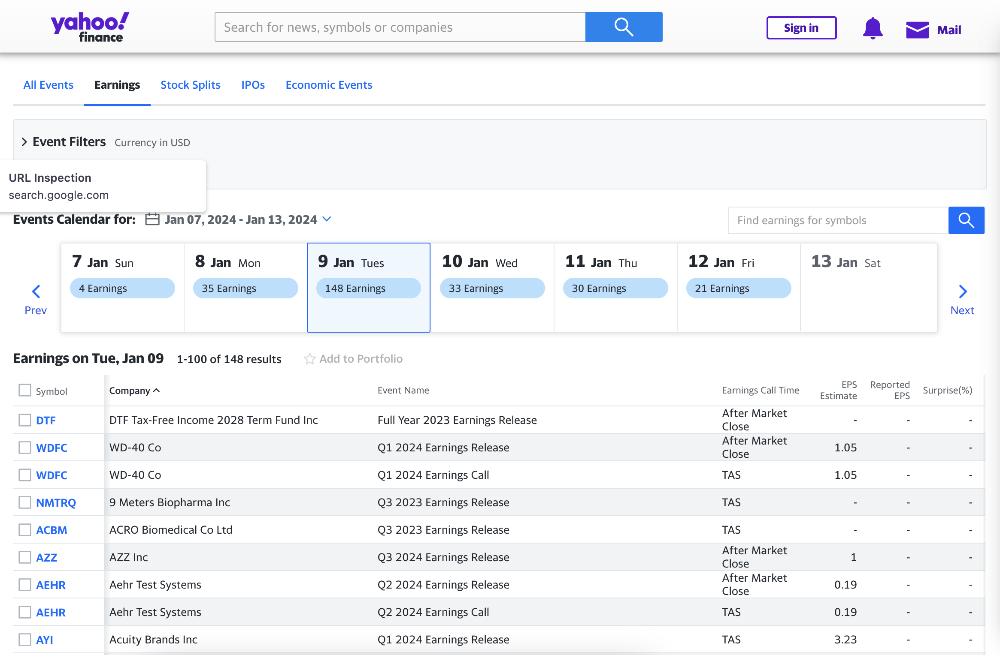
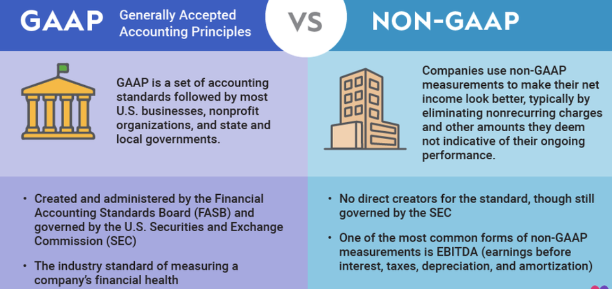

Earnings, in the context of stock trading, refer to the net income that a company reports on a quarterly basis, which is one of the most direct indicators of a company’s financial health. These figures are pivotal because they provide insight into a company's profitability, influencing investor sentiment and stock valuations. Investors and analysts scrutinize reported earnings against forecasts to gauge a company's performance, making them a critical driver of share price movements post-announcement.

Earnings season, occurring quarterly, is a period when a majority of publicly traded companies release their earnings reports. It's a significant time for traders and investors as the aggregated data from these reports can cause substantial volatility in the markets. During this time, earnings results are compared to analyst expectations, and deviations from these expectations often lead to swift reevaluations of stock value. The anticipation and reaction to these earnings reports can create opportunities for traders to capitalize on price movements.

Trading earnings effectively requires a nuanced understanding of not just the numbers reported but also the expectations set by market analysts and the strategic positioning of trades before and after the earnings are released. The ability to interpret the implications of earnings figures and forecast their impact on stock prices is what separates seasoned traders from the rest.

## Table of Contents

## Understanding Earnings and Their Market Impact

Earnings reports are the financial scorecards for companies, providing a summary of how much revenue and profit were generated over a specific period, typically a quarter. These reports are crucial for stakeholders as they reflect the company's performance and future potential. For investors and analysts, earnings are a measure of a company's success against market expectations and its own forecasts.

The timing of [earning](/wiki/earning-announcement)s seasons is pivotal. They occur in the weeks following the close of a fiscal quarter, and during these periods, a company's financial health is laid bare for investors. The majority of U.S. companies report earnings in January, April, July, and October, creating cyclical peaks of trading activity. It's a time when previously held valuations of companies can change overnight, making it a period of high trading [volume](/wiki/volume-trading-strategy) and [volatility](/wiki/volatility-trading-strategies).

The impact of earnings on stock prices can be immediate and dramatic. Stocks can surge or plunge based on not just the earnings numbers but also the guidance provided for future quarters. A company beating or missing analysts' expectations can significantly influence investor sentiment and thus, stock prices. Positive earnings reports can drive prices up, reflecting increased investor confidence, while negative reports can lead to sell-offs.

Market sentiment during earnings season can be highly reactive. Even anticipation of how a company will report can cause fluctuations in its stock price. A phenomenon known as the "earnings surprise" occurs when a company reports figures significantly above or below analysts' expectations, which can lead to rapid re-pricing of stocks.

For a comprehensive understanding of the relationship between earnings reports and market dynamics, "Financial Statement Analysis: A Practitioner's Guide" by Martin Fridson and Fernando Alvarez offers detailed insights. The book delves into how to interpret financial statements, analyze earnings, and understand their impact on investment decisions and stock valuations[1].

## Preparation for Earnings Trading

Preparation is paramount when trading earnings. Successful traders meticulously identify key companies and sectors with potential for volatility or steady performance post-earnings. They prioritize sectors exhibiting strong seasonal performance or those influenced by prevailing economic conditions.

Research is the bedrock of earnings trading. It involves delving into historical performance to discern patterns and trends in a company's earnings results. Traders scrutinize past earnings to predict future performance, understanding that while history doesn't always repeat itself, it often rhymes. Analyst forecasts are another critical component, providing a benchmark against which actual earnings are measured. Market expectations, which encompass more than just analysts' predictions, can significantly sway the market's reaction to an earnings report. If the majority of investors expect positive results, even meeting analyst forecasts can lead to a sell-off if the market had priced in more optimistic numbers.

Earnings calendars are indispensable tools in a trader's arsenal. These calendars list the dates when companies are scheduled to release their earnings. They enable traders to schedule their research and trading activities around these key announcements. By using an earnings calendar, traders can ensure they don't miss out on trading opportunities presented by the earnings season. An effective strategy might include monitoring a combination of large-cap stocks for stability and smaller, more volatile companies for significant earnings-driven price movements.

For a deeper understanding of how to prepare for earnings trading, "Investment Valuation: Tools and Techniques for Determining the Value of Any Asset" by Aswath Damodaran provides a comprehensive look at valuation models and how to apply them to forecast a company’s financial future. Damodaran's insights can help traders evaluate a company's potential ahead of earnings reports, making it a valuable resource for earnings season preparation[2].

## Analyzing Earnings Reports

Analyzing earnings reports is a multi-faceted process that goes beyond the surface-level figures. Revenue and earnings per share (EPS) are the headlines of any earnings report, providing a snapshot of a company's sales performance and profitability per share of stock. However, these figures only begin to tell the story. Guidance, or the outlook provided by a company’s management about future performance, can be just as critical. It sets the tone for what the company expects in the coming quarters and can often have a more significant impact on stock movement than past performance.

When dissecting earnings, traders need to understand the difference between **GAAP** (Generally Accepted Accounting Principles) and **non-GAAP** earnings. GAAP is the standard accounting method that includes all of the company’s financial information, while non-GAAP earnings are adjusted to exclude one-time expenses and may provide a different view of the company’s ongoing performance. While GAAP earnings offer a uniform way to compare companies, non-GAAP earnings can sometimes give a clearer picture of a company's operational efficiency. Deciding which to prioritize depends on the investor's focus—long-term fundamentals or short-term operational performance.

The numbers in an earnings report are a starting point for analysis, but the real insight often comes from reading between the lines. Earnings calls, where management discusses the results and provides additional context, can be a goldmine for qualitative insights. These discussions may reveal details about new product launches, market expansions, cost-saving measures, or challenges the company is facing.

Effective earnings analysis involves interpreting both quantitative data and qualitative information to forecast the potential impact on stock price. In "Financial Shenanigans: How to Detect Accounting Gimmicks & Fraud in Financial Reports" by Howard Schilit, traders can learn about the red flags in financial reports. Schilit’s expertise helps traders read beyond the numbers and understand the real financial health of a company, which is vital when trading earnings[3].

## Trading Strategies for Earnings

Developing a robust trading strategy for earnings season is crucial for capitalizing on the volatility and price movements that earnings reports can generate. A solid strategy involves a blend of technical and [fundamental analysis](/wiki/fundamental-analysis) to gauge the direction and magnitude of potential stock moves. Technical analysis can be particularly useful in identifying historical price patterns and setting technical indicators like support, resistance, and trend lines that may influence price action after an earnings announcement.

Fundamental analysis during earnings season goes beyond just reviewing the reported numbers. It involves a deep dive into a company's financial health, including revenue growth, profit margins, operational efficiency, and future guidance. This approach helps traders predict not just immediate reactions to an earnings report, but also longer-term trends based on the company's fundamental strengths or weaknesses.

Successful earnings trades often come from a well-balanced strategy that considers the expected versus the actual earnings, market sentiment, and broader economic indicators. Case studies of successful earnings trades reveal that timing, position sizing, and a clear understanding of market context are as important as the earnings numbers themselves. For instance, traders who accurately predict an earnings surprise can position themselves to enter and [exit](/wiki/exit-strategy) trades quickly to capture profits from sudden price movements.

For traders looking to study successful earnings trades and strategies in depth, the book "Trade Like a Stock Market Wizard: How to Achieve Super Performance in Stocks in Any Market" by Mark Minervini offers valuable insights. Minervini, a well-known stock trader, details his approach to trading and provides real-world examples of how a disciplined strategy can lead to significant profits, especially during the high-stakes period of earnings season[4].

## Options Strategies for Earnings

Options trading during earnings is a strategy used by many traders to capitalize on the expected volatility without the same level of risk involved in buying the stock outright. The premise is to leverage the dramatic price shifts that can occur when a company reports results that are significantly better or worse than the market expects.

Specific options strategies for earnings include playing the volatility crush with straddles and strangles. A straddle is where a trader buys a call and put option at the same strike price, anticipating a significant move in either direction. A strangle is similar but with the call and put options having different strike prices, which usually results in a lower premium cost compared to a straddle. These strategies can be profitable when a stock moves substantially, however, they can also lead to losses if the stock does not move enough to cover the cost of the options.

Spreads are another strategy, including vertical, calendar, and diagonal spreads. These involve buying and selling options with different strike prices or expiration dates. The idea is to profit from the difference in the price change of these options. For instance, a trader might use a bull call spread if they expect a stock to go up after earnings, buying a call option at a lower strike price, and selling another call option at a higher strike price.

Each of these strategies carries its own risk and reward profile. The potential for profit must be weighed against the risk of the options expiring worthless. The volatility implied by options prices often inflates before earnings announcements due to the uncertainty of the outcome, and deflates rapidly after the announcement, a phenomenon known as "volatility crush."

For a risk and reward analysis of options strategies for earnings, "Option Volatility and Pricing" by Sheldon Natenberg provides a foundational guide to understanding the complex interactions of time, volatility, and price movement in options trading. Natenberg’s work details how to evaluate the potential risks and rewards associated with different options strategies, making it a crucial resource for traders planning to navigate earnings season with options[5].

## Risk Management During Earnings Season

Risk management during earnings season is a critical component of a trader's strategy, as this period is often marked by increased market volatility. Traders must set realistic expectations, understanding that while earnings can provide opportunities for significant profit, they can also lead to substantial losses. It’s essential to approach each earnings report with a clear plan for when things don’t go as predicted.

Position sizing is a fundamental risk management tool. It involves determining the appropriate amount of capital to risk on any single earnings trade, which should be a small, predefined percentage of the total trading capital. This helps to mitigate the risk of a single bad trade significantly impacting the trader's portfolio.

Stop losses are another key risk management strategy. By setting stop loss orders at predefined levels, traders can limit their losses if the market moves against their position after an earnings report. Conversely, trailing stops can protect profits by allowing a position to remain open and continue to gain as long as the stock moves in a favorable direction, but close the trade if the stock’s price starts to decline.

Hedging strategies, such as using options, can also be employed to manage risk during earnings season. Options can provide a way to profit from the volatility without exposing the trader to the full risk of holding the underlying stock through earnings.

Common pitfalls during earnings season include overtrading, being swayed by emotions, and failing to adhere to a pre-established trading plan. Traders may also fall into the trap of confirmation bias, where they look for information that supports their preconceived notions about an earnings outcome instead of objectively assessing the data.

## Advanced Earnings Trading Concepts

Advanced earnings trading concepts involve a deeper analytical approach and the application of sophisticated strategies to leverage the information and market patterns that earnings reports can trigger. One such advanced concept is **utilizing analysts' forecasts and consensus estimates** to gauge market expectations. By comparing actual earnings outcomes with these estimates, traders can predict the magnitude of market reaction. Analysts' forecasts serve as a benchmark, and significant deviations from these can result in substantial price movements.

Understanding and capitalizing on **post-earnings drift** is another nuanced strategy. This phenomenon occurs when a stock continues to move in the direction of an earnings surprise over time, rather than immediately after the announcement. Traders can exploit this drift by taking positions that align with the direction of the drift, using the [momentum](/wiki/momentum) to generate profits.

Event-driven trading strategies revolve around trading on the occurrence of a scheduled event — in this case, an **earnings announcement**. These strategies can range from simple directional bets to complex multi-leg options trades. Traders can use event-driven strategies to position themselves before an earnings release, capitalizing on the increased volatility without a specific directional bias.

## Post-Earnings Trading

Post-earnings trading involves navigating the market after a company has announced its earnings, a period often characterized by price adjustments as the market assimilates the new information. **Traders look for opportunities where the market may have overreacted to earnings news, either positively or negatively**. This overreaction can create mispricings that astute traders can exploit.

**Strategy:**

A strategy for trading post-earnings involves analyzing the initial market reaction and looking for signs of an overreaction. If a stock experiences a significant surge or drop in price immediately following an earnings report but the underlying fundamentals of the company haven't changed to the same degree, it may indicate an overreaction. Traders might take a contrarian position, anticipating a correction as the market emotion subsides and rational assessment prevails.

Another post-earnings trading approach is to monitor the stock's behavior relative to its industry or the broader market. If a company reports solid earnings but its stock price declines due to a market downtrend, it may present a buying opportunity, assuming the market will later recognize the company's strong performance.

## Conclusion

In summary, trading company earnings requires a multifaceted approach combining diligent research, strategic planning, and robust risk management. Earnings reports are more than just figures; they are reflections of a company's health and indicators of future performance. Seasoned traders know the importance of understanding not just the numbers reported, but also the broader market expectations and the subtleties of company guidance.

Strategic preparation ahead of earnings announcements, backed by historical performance analysis and forecasting, sets the foundation for successful trades. Utilizing both fundamental and technical analysis enables traders to construct a well-rounded view of potential market movements and align their strategies accordingly. Options trading, with strategies like straddles and strangles, can provide flexibility and leverage in a trader’s portfolio, especially during the heightened volatility of earnings season.

Effective risk management, involving calculated position sizing and the use of stop losses, is critical to safeguarding investments during the unpredictable earnings periods. Advanced trading concepts like post-earnings drift and event-driven strategies can further enhance a trader's ability to profit from earnings announcements.

Continuous learning, aided by documenting each trade and reflecting on the outcomes, is what allows traders to evolve and refine their approach to earnings trading. Engaging with trading communities offers additional perspectives and support, enriching the learning process.

## References & Further Reading

[1]: ["Financial Statement Analysis: A Practitioner's Guide"](https://www.amazon.com/Financial-Statement-Analysis-Workbook-Practitioners/dp/1119457181) by Martin Fridson and Fernando Alvarez

[2]: ["Investment Valuation: Tools and Techniques for Determining the Value of Any Asset"](https://www.amazon.com/Investment-Valuation-Tools-Techniques-Determining/dp/111801152X) by Aswath Damodaran

[3]: ["Financial Shenanigans: How to Detect Accounting Gimmicks & Fraud in Financial Reports"](https://www.amazon.com/Financial-Shenanigans-Fourth-Accounting-Gimmicks/dp/126011726X) by Howard Schilit

[4]: ["Trade Like a Stock Market Wizard: How to Achieve Super Performance in Stocks in Any Market"](https://www.amazon.com/Trade-Like-Stock-Market-Wizard/dp/0071807225) by Mark Minervini

[5]: ["Option Volatility and Pricing"](https://www.barnesandnoble.com/w/option-volatility-and-pricing-sheldon-natenberg/1124321994) by Sheldon Natenberg