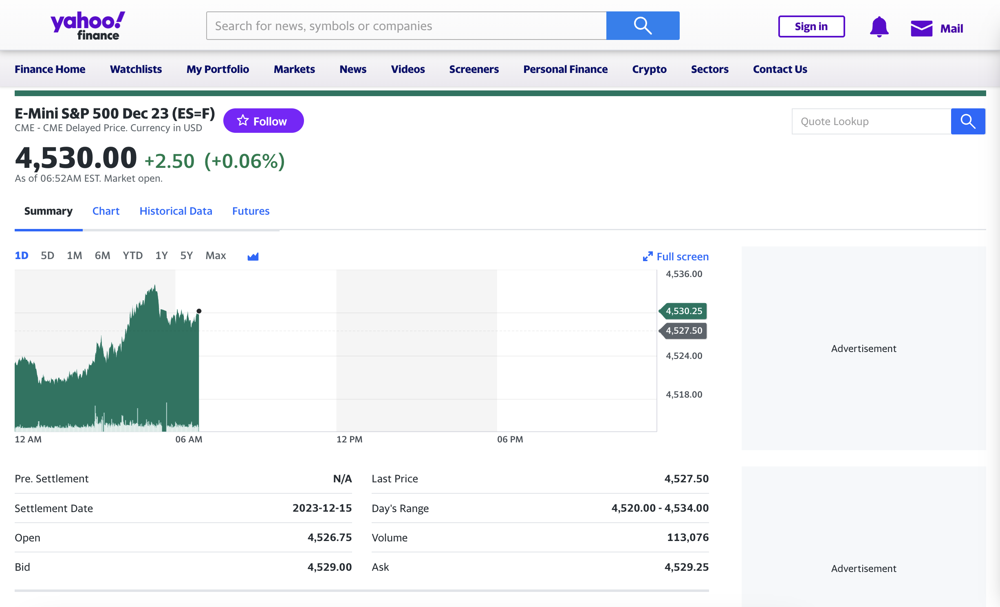
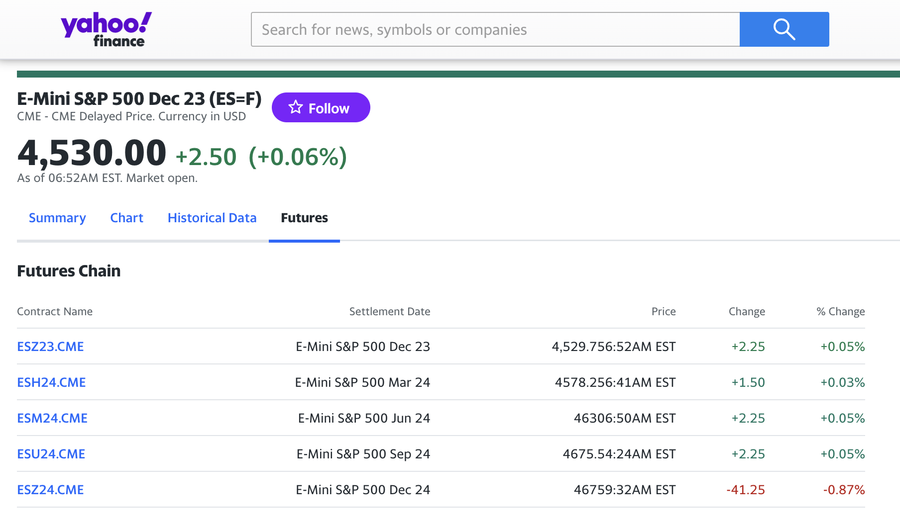

Emini futures, often simply termed as "E-minis", are standardized futures contracts that represent a fraction of the value of a corresponding standard futures contract. These financial instruments have become increasingly popular among traders, both novice and experienced, due to their lower cost and ease of access compared to their standard counterparts. Initially introduced by the Chicago Mercantile Exchange (CME) in 1997, E-minis were developed to cater to individual traders, allowing for electronic trading of the S&P 500 index futures. Since then, their array has expanded to cover several indexes, commodities, and currencies.

In the vast ecosystem of the financial market, E-minis have carved out a unique space. They not only offer traders a more accessible entry point into futures trading but also act as a barometer for market sentiment. Their importance is underscored by the immense trading volume they garner daily, often outpacing the volume of the larger standard futures. Given the potential for both profits and losses in this arena, a clear understanding of E-minis is paramount for anyone looking to participate in futures trading.

This guide aims to provide readers with a comprehensive overview of Emini futures—from their historical roots to advanced trading strategies. Whether you're a seasoned trader looking to diversify your portfolio or a beginner seeking to understand the basics, our objective is to equip you with the knowledge needed to navigate the world of E-mini futures trading with confidence.

## Table of Contents

## History & Origins of Emini Futures

The story of Emini futures, a transformative financial instrument in today's markets, begins in the mid-1990s. With the rapid growth of electronic trading and the pressing need for more accessible futures contracts for individual traders, the Chicago Mercantile Exchange (CME) pioneered the concept of the Emini futures. Introduced in September 1997, the first E-mini contract was for the S&P 500 index and quickly gained traction as a preferred instrument for traders worldwide[1].

This introduction marked a significant shift from the open outcry trading method, where human traders shouted and signaled their trades on exchange floors. Electronic trading via E-minis enabled swift, efficient, and more transparent transactions, leading to a broader acceptance and popularity among both institutional and individual traders. Over the years, the success of the E-mini S&P 500 contract prompted the development of other E-mini contracts, encompassing a range of commodities, indices, and currencies.

While both traditional futures and Emini futures serve as binding agreements to buy or sell a specific asset at a future date for a particular price, their main distinction lies in their size. Traditional futures contracts often represent a significantly larger financial commitment, rendering them more suitable for institutional traders or large investors. In contrast, Emini futures, as their name suggests, are miniaturized versions and represent a fraction of the value of standard contracts. This size difference has made Emini futures an attractive choice for individual traders, providing them an opportunity to participate in futures markets with a lower capital outlay.

Moreover, the evolution of Emini futures has not only simplified futures trading but also democratized it. The reduced size and cost, combined with the flexibility of electronic trading, have allowed a broader range of participants to access the futures markets, breaking the barriers that once restricted entry to only the largest financial players.

## Basics of Emini Futures

Emini futures, often simply referred to as "E-minis," are electronically traded futures contracts that represent a fraction of the value of standard futures contracts. Initially designed to accommodate individual investors who found the standard futures contracts too large or capital-intensive, E-minis offer a more manageable and cost-effective entry into futures trading.

The working mechanism of Emini futures, like their standard counterparts, is straightforward. When a trader buys an E-mini contract, they agree to buy or sell the underlying asset at a specified price on a future date. However, the contract doesn't usually culminate in the physical delivery of the asset. Instead, traders typically close out their positions before the expiration date, realizing either a profit or loss based on the price movement.

The most apparent difference between E-mini and traditional futures is their size. A standard futures contract on, say, the S&P 500 index, could have a multiplier of 250, meaning for every point movement in the index, the futures contract will move by $250. On the other hand, the E-mini S&P 500 contract, one of the most traded E-minis, has a multiplier of 50, translating to a $50 move for every point change in the S&P 500[2]. This reduced size allows for more granularity in trading and requires less capital commitment, making it more accessible to individual traders.

Furthermore, while both contract types serve the same fundamental purpose—allowing traders to speculate or hedge on the price movement of the underlying asset—their accessibility and required capital differ significantly. The lower margin requirements of E-minis enable traders to control a substantial amount of the asset for a fraction of its total value, enhancing leverage but also increasing potential risk. As such, while E-minis have democratized access to futures markets, they demand a clear understanding and prudent risk management from traders.

## Advantages of Trading Emini Futures

Emini futures, particularly those tracking major indices like the E-mini S&P 500, have rapidly gained popularity among traders, both novices and seasoned professionals. A significant reason behind this burgeoning interest lies in the numerous advantages that these contracts offer.

Starting with the financial benefits, Emini futures are designed to be **capital efficient**. Their smaller size compared to traditional futures means that traders can enter positions with less upfront capital. This reduced initial outlay allows for potentially higher returns on investment. Additionally, the lower margin requirements of Eminis make them particularly attractive for day traders and those who prefer a leveraged trading approach.

Another noteworthy aspect is their flexibility and **accessibility**. Emini futures are traded almost 24 hours a day, five days a week, providing traders the opportunity to respond to global events and news in real-time. This around-the-clock trading window is especially beneficial for those who may want to trade outside the traditional market hours or those in different time zones. Furthermore, being electronically traded, Emini futures are easily accessible to anyone with an internet connection and a brokerage account, removing many barriers to entry.

Risk management, a cornerstone of any successful trading strategy, is also enhanced when trading Emini futures. The smaller contract size gives traders the ability to more **precisely control exposure** and better manage potential losses. Moreover, since Emini futures are derivatives, they allow for hedging against other investment positions. For instance, an investor holding a diverse portfolio of stocks can use Emini futures to hedge against broad market downturns.

## Preparing to Trade

Entering the world of Emini futures trading requires more than just a keen interest. Proper preparation, both in terms of finances and mindset, is pivotal to navigate the ebbs and flows of this dynamic market.

Firstly, addressing the necessary capital for trading Emini futures is crucial. The initial margin requirement for Emini contracts, such as the E-mini S&P 500, typically ranges from $500 to $1,000 per contract, although this can vary based on the brokerage and market conditions[3]. It's important to note that while this initial margin allows traders to enter a position, it is prudent to have additional capital to cushion against potential losses and meet any maintenance margin requirements.

Next, determining your risk tolerance is paramount. Every trader, regardless of experience, has a unique risk profile. Factors such as your financial situation, investment goals, and psychological comfort with potential losses all play a role. Before delving into Emini trading, it's beneficial to assess how much of your capital you're willing to risk on a single trade or over a specific timeframe. Some traders might be comfortable risking 2% of their capital on one trade, while others might set that number at 1% or even less.

Lastly, crafting a solid trading plan can be the difference between success and setback. A well-thought-out plan defines the criteria for entering and [exit](/wiki/exit-strategy)ing trades, sets profit targets, and establishes stop-loss levels. But beyond these technical aspects, a trading plan also outlines how you'll handle potential drawdowns or a series of losing trades. Keeping emotions out of trading decisions is challenging, but a robust plan serves as a compass, especially during tumultuous market conditions[4].

Trading Emini futures can be rewarding, but like any investment, it comes with risks. By ensuring you have the necessary capital, understanding your risk profile, and sticking to a well-defined trading plan, you position yourself for a more informed and strategic approach to this market.

## Emini Trading Strategies

Emini futures, with their high [liquidity](/wiki/liquidity-risk-premium) and tight bid-ask spreads, offer traders multiple strategies to capitalize on market movements. Let's delve into some of the most prevalent strategies traders employ.

**Trend Gap Strategy**: One of the most widely recognized strategies is the Trend Gap Strategy. Often after a market closes, news and other information get processed, leading to potential price gaps at the opening of the next trading session. The idea is to identify these gaps that form in the direction of the prevailing trend and take a position expecting the price to continue in that direction. For instance, if the Emini S&P 500 closes at 3000 and opens the next day at 3010 in an existing uptrend, traders might consider buying, anticipating further upward movement.

**E-mini Futures Scalping Strategy**: Scalping is a short-term strategy where traders aim to profit from small price movements. It requires quick decision-making and execution. For Emini futures, scalpers might enter trades for price movements as little as one or two ticks. They rely heavily on real-time data and often use one-minute or even tick charts to make their decisions.

**Trend Determination Techniques**: Identifying the overarching market trend is foundational for many trading strategies. Techniques such as moving averages, trendlines, and channel formations can help traders discern whether the market is in an uptrend, downtrend, or range-bound. For instance, if the Emini's price consistently stays above a 50-period moving average, it could be an indication of an ongoing uptrend[5].

Using multiple time frames enhances the accuracy of trade signals. A trader might use a daily chart to determine the broader market trend and then use an hourly or 15-minute chart to pinpoint entry and exit points. This multi-timeframe approach offers a more holistic view of the market and reduces the likelihood of being misled by short-term noise.

Tick charts, which plot price after a certain number of trades (ticks) have been executed, are invaluable for day traders. Unlike time-based charts, tick charts offer insights into market activity and [momentum](/wiki/momentum). For example, during high [volatility](/wiki/volatility-trading-strategies), bars on a tick chart will form quicker, indicating strong buying or selling activity.

Example setups and signals for entry largely depend on the trader's chosen strategy. Using the Trend Gap Strategy, a signal might be the formation of the gap itself in conjunction with other technical indicators like RSI or MACD. For scalpers, a sudden surge in [volume](/wiki/volume-trading-strategy) combined with a breach of a short-term moving average might be an ideal entry signal.

Understanding and mastering these strategies requires time, practice, and continual learning. As always, practicing on a demo account and incorporating solid risk management techniques is advised before committing real capital.

## Technical Aspects

Technical analysis, when used effectively, can be a potent tool for traders. While there are countless indicators available, certain ones have proven particularly effective for Emini futures trading. Among these are:

**Better Sine Wave Indicator**: This tool helps traders identify areas of support and resistance by analyzing market cycles. The sine wave plots cyclic turning points, enabling traders to forecast potential pullbacks or breakouts. When the indicator and price are in sync, it can serve as a powerful confirmation tool for making trading decisions[6].

**Better Momentum Indicator**: Momentum is crucial for futures trading. This indicator highlights shifts in momentum, allowing traders to foresee potential market reversals. Unlike traditional momentum indicators, the Better Momentum measures buying and selling pressure rather than price velocity. Divergence between the indicator and price can often precede significant market reversals[7].

**Better Pro Am Indicator**: Professional and amateur activity can greatly affect market movements. The Better Pro Am Indicator identifies when professionals or amateurs are dominating trading, based on volume and price action. When professionals are active, larger price bars typically form, while amateur activity usually produces smaller bars. Recognizing who is in control can help traders align themselves with the dominant market force.

Setting up Emini charts correctly is crucial. Begin with selecting a timeframe appropriate for your trading strategy, whether it's intraday, daily, or weekly charts. Incorporate volume data, as it's invaluable for understanding market dynamics. Add key levels of support and resistance, and overlay your chosen indicators for a comprehensive view.

## Practical Trading Tips

In the fast-paced world of Emini futures trading, the right strategy can make all the difference between profit and loss. To give yourself the best chance at success, consider these practical tips.

**Market or limit orders**: Each has its advantages. Market orders ensure execution but can lead to potential slippage in volatile conditions. Limit orders, on the other hand, guarantee a specified price or better but may not always get filled if the market doesn't reach your set price. Understanding when to use which can optimize entry and exit points.

**Scaling in and out of positions**: By dividing entry or exit into multiple smaller trades, you can average your price over time. This method can reduce the risk of entering or exiting at an unfavorable price, especially during volatile market conditions.

**Setting profit targets and stop losses**: Decide in advance the price point at which you'll take profit or cut losses. This prevents emotion-driven decisions and locks in profits or limits losses effectively. Remember, consistency in approach often trumps attempts to 'beat the market.'

**When and how to re-enter in a strong trend**: If you exit a position and the trend continues in the anticipated direction, look for a minor pullback or consolidation as an opportunity to re-enter. Utilize technical indicators and chart patterns to identify optimal re-entry points.

**Handling the psychological stress of trading**: Trading is as much a mental game as it is a financial one. Develop a routine that includes regular breaks, maintain a trading journal to reflect on both successful and unsuccessful trades, and consider meditation or mindfulness exercises to stay centered. Surrounding yourself with a supportive trading community can also be beneficial, providing both camaraderie and different market perspectives[8].

## Trading Resources and Tools

Selecting the right tools and resources is paramount in Emini futures trading. While individual preferences and needs may vary, here are some generally recommended essentials to enhance your trading journey.

**Best futures broker recommendations**: A broker's reliability, platform, and fee structure play a significant role in your trading experience. Some top-rated futures brokers include TD Ameritrade, Interactive Brokers, and NinjaTrader. Ensure your chosen broker offers robust data feeds, comprehensive charting tools, and is well-regarded in the industry for customer support.

**Affordability of trading E-mini over ETFs**: While both E-mini futures and ETFs track indices, the E-mini often provides greater leverage, allowing for potentially higher returns with a smaller capital outlay. However, it's essential to recognize that higher leverage can also lead to larger losses. Trading E-mini futures typically incurs lower fees than ETFs, making it a more cost-effective option for many traders. Additionally, E-minis benefit from tax advantages over ETFs, as 60% of any gains can be treated as long-term capital gains regardless of the holding period.

**Yahoo Finance as a data source for E-mini Futures**: For traders seeking reliable and accessible market data for E-mini futures, Yahoo Finance emerges as a noteworthy option. Known for its comprehensive coverage of financial markets, Yahoo Finance offers historical data for trading E-mini contracts for free. Its integration with news and broader market analysis makes it a well-rounded source for those looking to stay informed about the factors influencing E-mini futures markets.

## Global Implications

The E-mini S&P 500 futures, often considered a barometer for the U.S. stock market, are not only influenced by domestic [factor](/wiki/factor-investing)s but also by a myriad of global forces. Central bank decisions, geopolitical events, and international economic indicators can cause ripples in the E-mini S&P 500 market. For instance, an announcement by the European Central Bank about its monetary policy can sway investor sentiment, leading to potential price fluctuations in E-mini contracts.

Emerging markets also hold substantial sway over E-mini S&P 500 futures. A slowdown in growth in significant emerging markets like China or India can dampen the outlook for U.S. companies with considerable exposure to these countries, subsequently affecting the E-mini S&P 500 futures prices.

Trade relations and policies play a crucial role too. Tariffs, trade wars, or new trade agreements can directly influence the profitability of companies listed in the S&P 500, and by extension, the direction of the E-mini S&P 500 futures. An example of this was the U.S.-China trade tensions, which saw periods of volatility in the futures market.

Regarding the relation of E-mini futures in the global marketplace, these contracts serve as a universally recognized benchmark, offering global traders a means to gain exposure to the U.S. stock market without having to directly invest in it. Additionally, because they trade nearly 24 hours a day, international traders can respond to global events in real-time, making the E-mini S&P 500 futures an essential tool for risk management and speculation on a global scale.

Foreign institutional investors, particularly those from countries with restrictions on direct foreign investments, often use E-mini futures as a way to gain exposure or hedge their positions against U.S. equities. Their accessibility, liquidity, and the leverage they provide make them an attractive instrument for global portfolio diversification.

## Micro E-mini Futures

Micro E-mini futures represent a smaller-sized version of their standard E-mini counterparts. Launched by CME Group in 2019, these contracts provide traders with a lower-cost way to gain exposure to popular indices such as the S&P 500, NASDAQ-100, Russell 2000, and Dow Jones Industrial Average.

While standard E-mini futures contracts, like the E-mini S&P 500, have a multiplier of 50 times the index value, the Micro E-mini S&P 500, for instance, has a multiplier of just 5 times the index value. This difference in size means that the margin requirements and overall capital outlay for micro E-mini contracts are significantly less than their standard E-mini equivalents, making them an accessible entry point for individual traders and those with smaller account sizes.

Despite the differences in contract size, both Micro and standard E-mini futures operate in a similar fashion. They are both traded electronically on the CME Globex platform and offer nearly 24-hour market access[9]. The price determinants, influenced by factors such as economic indicators, geopolitical events, and corporate earnings, remain the same for both types of contracts.

One of the notable similarities is their utility in hedging and speculation. Micro E-mini futures, like the standard E-minis, are used by traders to speculate on future index price movements or to hedge existing portfolio positions. Additionally, both contract types provide the benefits of futures trading, such as potential tax advantages and the ability to trade on margin.

However, it's essential to understand that while Micro E-mini contracts offer a reduced financial commitment, they also provide proportionally smaller profit and loss potential per contract. So, for traders seeking larger contract sizes for more significant exposure, the standard E-minis might be more appropriate.

## Conclusion

E-mini futures, with their origin rooted in providing traders an electronically traded option, have become a cornerstone in the financial markets. Their rise in popularity can be attributed not just to the technological shift, but also to the accessibility and flexibility they offer over traditional futures. Whether you're intrigued by their historical context, the basic mechanics, or the advanced trading strategies and technical aspects, one thing remains crystal clear: understanding these instruments is paramount.

The journey of trading isn't just about executing trades; it's about meticulous preparation, continuous learning, and adapting to the ever-evolving market conditions. As the financial world becomes more interconnected, the global implications on E-mini S&P 500 futures and their counterparts are more pronounced than ever. This highlights the significance of staying informed and being proactive in one's research and strategy development.

Yet, as with any form of trading or investment, the potential for profit is paralleled with the risk of loss. Tools, resources, and advanced strategies can certainly provide an edge, but they cannot eliminate risk. Hence, it's essential to approach E-mini futures trading with respect, a well-defined plan, and above all, responsibility. While the allure of potential profits might be enticing, it's the commitment to education, strategy, and risk management that distinguishes successful traders from the rest.

As you embark or continue on this trading journey, always prioritize understanding and preparation. Equip yourself with the necessary knowledge, remain adaptable, and remember: responsible trading isn't just a practice—it's a mindset.

## Frequently Asked Questions

**What are E-mini futures?**

E-mini futures are electronically-traded futures contracts that represent a fraction of the value of a standard futures contract. They are primarily traded on the Chicago Mercantile Exchange (CME) and are popular among individual traders due to their lower margin requirements and contract values compared to standard futures.

**How do E-mini futures differ from traditional futures?**

The primary difference is the contract size. E-mini contracts represent a smaller portion of the underlying index or commodity, leading to lower margin requirements and a lower overall capital commitment. This makes them more accessible for individual traders.

**Can beginners trade E-mini futures?**

Yes, but it's crucial for beginners to educate themselves thoroughly, practice with simulated trading, and understand the risks involved before trading with real money. The smaller contract size makes E-minis more accessible, but they still [carry](/wiki/carry-trading) significant risk.

**What is the margin requirement for E-mini futures?**

Margin requirements vary based on the specific contract and broker policies. Traders should check with their broker for up-to-date margin requirements and ensure they maintain adequate capital in their accounts to cover potential losses.

**Are E-mini futures only for day traders?**

No, while E-mini futures are popular among day traders due to their liquidity and lower costs, they are also suitable for longer-term traders and can be used for hedging purposes.

**How do global events impact E-mini futures?**

E-mini futures, especially those tracking major indices like the E-mini S&P 500, are influenced by global economic indicators, geopolitical events, and major announcements. Traders should stay informed about global events to make educated trading decisions.

**What's the difference between Micro E-mini and E-mini futures?**

Micro E-mini futures are an even smaller contract size than E-minis, with a multiplier of 5 times the index value, compared to the E-mini's multiplier of 50. They require a smaller capital outlay, making them suitable for traders with smaller account sizes.

**Are there specific trading strategies for E-mini futures?**

Yes, many strategies like the Trend Gap Strategy, E-mini [scalping](/wiki/gamma-scalping), and using tick charts are tailored to the characteristics of E-mini futures. As always, traders should backtest and practice any strategy before applying it with real capital.

**Which is more affordable: trading E-mini futures or ETFs?**

While both have their advantages, E-mini futures often offer more leverage and potential tax advantages compared to [ETF](/wiki/etf-trading-strategies)s. However, ETFs might provide more diversification. The affordability depends on the trader's strategy, capital, and risk tolerance.

**Where can I trade E-mini futures?**

E-mini futures are primarily traded on the CME Globex platform. To access this platform, you'll need to open an account with a futures broker that offers access to CME products.

## References & Further Reading

[1]: [CME Group - E-mini S&P 500 Future](https://www.cmegroup.com/trading/equity-index/us-index/e-mini-sandp500.html)

[2]: [Investopedia - E-mini Definition](https://www.investopedia.com/terms/e/emini.asp)

[3]: [CME Group - E-mini S&P 500 Margin Requirements](https://www.cmegroup.com/trading/equity-index/us-index/e-mini-sandp500_performance_bonds.html)

[4]: [TradingSim - The Importance of a Trading Plan](https://tradingsim.com/blog/trading-plan/)

[5]: [Technical Analysis Explained - Martin J. Pring](https://www.amazon.com/Technical-Analysis-Explained-Fifth-Successful/dp/0071825177)

[6]: [Technical Analysis of the Financial Markets - John J. Murphy](https://www.amazon.com/Technical-Analysis-Financial-Markets-Comprehensive/dp/0735200661)

[7]: [Momentum, Direction, and Divergence - William Blau](https://www.amazon.com/Momentum-Direction-Divergence-Applying-Technical/dp/0471027294)

[8]: [The Psychology of Trading - Brett N. Steenbarger](https://www.amazon.com/Psychology-Trading-Tools-Techniques-Management/dp/0471267619)

[9]: [Trading Hours for Micro E-mini Futures - CME Group](https://www.cmegroup.com/trading-hours.html)