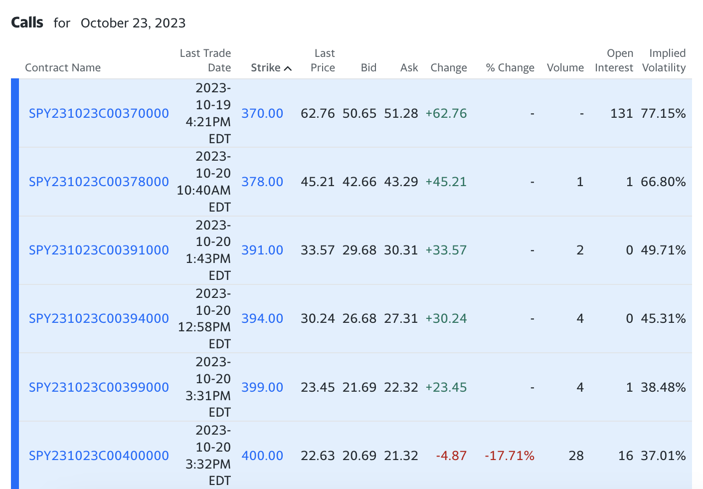

SPY options offer a gateway into the dynamic world of options trading, providing a derivative instrument linked to the performance of the S&P 500 Index. As one of the most liquid and heavily traded options in the market, SPY options serve as both a barometer for the broader U.S. equity market and a preferred tool for traders of all levels.

For the uninitiated, SPY options allow traders to bet on the future movements of the S&P 500 without having to buy or short the actual index. They provide a leveraged means to profit from the index's price fluctuations, whether bullish or bearish. Furthermore, their versatility means they can be used not just for speculative purposes but also as a hedge against existing equity positions.

Novice traders might find SPY options attractive due to their accessibility and the wealth of [educational resources](https://paperswithbacktest.com/course) available. They serve as a suitable starting point, granting newcomers an opportunity to learn the ropes of options trading with a relatively lower capital commitment.

On the other hand, experienced traders gravitate towards SPY options because of their unparalleled liquidity, which ensures tighter bid-ask spreads and more efficient entry and exit points. The transparency and predictability of SPY options, stemming from their connection to the well-studied S&P 500, also offer seasoned traders a reliable vehicle to execute [advanced trading strategies](https://paperswithbacktest.com/).


## Table of Contents

## What are SPY Options?

SPY options are financial derivatives tied to the performance of the S&P 500 Index. Specifically, they represent an agreement that gives the holder the right, but not the obligation, to buy or sell shares of the SPDR S&P 500 [ETF](/wiki/etf-trading-strategies) (SPY) at a predetermined price, known as the strike price, before a specified expiration date. The SPY ETF is designed to track the S&P 500 Index, making these options a popular tool for investors looking to gain exposure to the broader U.S. equity market without buying individual stocks or the index itself.


Introduced in January 2005, SPY options quickly grew in popularity due to their unique blend of versatility and [liquidity](/wiki/liquidity-risk-premium)[1]. As a result of the ETF's objective to mirror the S&P 500's performance, SPY options provide traders and investors with an efficient means to hedge, speculate, or diversify their portfolios. Over the years, the increasing [volume](/wiki/volume-trading-strategy) and open interest in these options have cemented their position as one of the primary instruments for those aiming to navigate the ebbs and flows of the U.S. stock market.

SPY options are also unique in their expiration cycle. Initially, like most equity options, they came with monthly expirations. However, recognizing the growing demand for more frequent trading opportunities, exchanges later introduced **weekly expirations**, catering to both short-term speculators and those seeking specific hedging timeframes.

## Basics of SPY Options

### Differentiating between SPX and SPY Options: A More In-depth Comparison

SPX and SPY options, both derived from the S&P 500 Index, are premier instruments within the options market. However, despite their similarities, they possess critical differences that shape the preferences of traders.

**Underlying Asset**: The core distinction between SPX and SPY options revolves around their respective underlying assets. SPX options are directly tied to the S&P 500 Index, which is an aggregate measure of 500 leading companies in the U.S. Conversely, SPY options are linked to the SPDR S&P 500 ETF, a tradable instrument that mirrors the performance of the S&P 500 Index[2].

**Settlement**: SPX options are cash-settled, meaning no actual assets are exchanged during the settlement process. Instead, traders receive or owe the cash difference between the option's strike price and the closing value of the S&P 500 Index. SPY options, being tied to an ETF, are physically settled. Exercising in-the-money SPY options results in the delivery of the corresponding ETF shares[3].

**Contract Size**: An SPX option contract typically represents a multiplier of the S&P 500 Index, commonly $100 times the index value. In contrast, one SPY option contract typically corresponds to 100 shares of the SPY ETF.

**Expiration**: While both SPX and SPY options offer weekly expirations, SPX also provides Monday and Wednesday weekly expirations, granting more flexibility for traders who want to align their strategies with specific market events.

**Tax Treatment**: SPX options might have more favorable tax treatments for some U.S. investors due to the 60/40 rule, wherein 60% of gains or losses are treated as long-term and 40% as short-term, regardless of the actual holding period. SPY options, on the other hand, adhere to standard capital gains tax rules.

**Trading Hours**: SPX options generally have extended trading hours, which can be beneficial for traders looking to hedge or respond to international market movements and news events outside the standard trading hours.

**Dividends**: Since SPY is an ETF, it distributes quarterly dividends, which can affect the option's price, especially if nearing its expiration. SPX options, being index-based, are not directly impacted by dividends.

**Liquidity**: SPY options often boast high liquidity, translating to narrow bid-ask spreads. This makes them particularly appealing for retail traders. SPX options, while also liquid, are more frequently used by institutional traders due to their larger contract size and different tax implications.

### How SPY Options Work: From Purchase to Expiration

SPY options function as contracts granting the holder the right, but not the obligation, to buy or sell the SPDR S&P 500 ETF (SPY) at a predetermined price, known as the strike price, before a specific date called the expiration date.

**Type of Options**: There are two main types of options:

1. **Call Options**: If you purchase a call option, you're anticipating the SPY ETF to increase in value. It gives you the right to buy the ETF at the strike price. If the ETF's market price exceeds the strike price plus the premium you paid, you can exercise the option to buy the ETF at the strike price and then sell at the market price for a profit.
2. **Put Options**: If you purchase a put option, you're expecting the SPY ETF to decrease in value. It provides the right to sell the ETF at the strike price. If the market price drops below the strike price minus the premium you paid, you can exercise the option to sell the ETF at the higher strike price.

**Option Premium**: When you buy an SPY option, you pay a price known as the premium. Factors like intrinsic value, time value, volatility, and interest rates influence this premium.

**Intrinsic and Time Value**: The intrinsic value of an option is the difference between the current price of the SPY ETF and the option's strike price (if the option is in-the-money). Time value is the part of the premium accounting for the remaining time until expiration. As expiration nears, time value diminishes, a phenomenon called time decay.

**Exercising the Option**: Options can be exercised in three ways:

1. **Physical Exercise**: The holder utilizes their right to buy (for call options) or sell (for put options) the SPY ETF shares.
2. **Offsetting**: The majority of options traders use this method, which involves selling the option contract before expiration, capturing the difference in the premium.
3. **Expiration**: If an option is in-the-money at expiration, it's automatically exercised. Out-of-the-money options expire worthless.

**Assignment Risk**: When you sell an option, there's a possibility you'll be assigned, meaning you must fulfill the option's obligations. For SPY call options, this entails selling the ETF at the strike price, while for put options, it involves buying the ETF.

**Expiration Date**: Every SPY option has a specified expiration date, after which the option is no longer valid. SPY options come in various expiration cycles, including daily, weekly, and monthly. The third Friday of the month marks the expiration date for monthly options.

Understanding the lifecycle of an SPY option, from purchase to expiration, is paramount for traders. Grasping how these contracts function empowers traders to make informed decisions, maximizing potential rewards while managing risks.

### The Significance of Dividends in SPY Options

Dividends play a pivotal role in the trading and valuation of SPY options. The SPDR S&P 500 ETF (SPY) mimics the performance of the S&P 500 and distributes quarterly dividends to its holders, reflecting the accumulated dividends of the index's constituents. Here's how these dividends impact SPY options:

1. **Early Exercise**: Call options, especially those that are deep in-the-money, might be exercised early in anticipation of an upcoming dividend, especially if the dividend amount surpasses the time value left in the option's premium. This is because, post-dividend, the ETF's price might fall by approximately the dividend amount, making it advantageous for option holders to capture the dividend by exercising early.
2. **Option Pricing**: Option pricing models, such as the Black-Scholes model, account for dividends. When a dividend is expected to be paid during the life of an option, it can reduce the present value of the expected future stock price, impacting the call and put option pricing accordingly.
3. **Ex-Dividend Date Impact**: The price of SPY typically decreases on the ex-dividend date by an amount close to the dividend paid. This price drop can affect the intrinsic value of options. Option traders should be aware of these dates, as they can lead to potential assignment risks for short call option holders.
4. **Volatility and Dividends**: In the days leading up to the ex-dividend date, there might be increased trading activity. Some traders aim to capitalize on the dividend distribution, which can lead to heightened volatility in SPY options.
5. **Impact on Covered Calls**: Investors using a covered call strategy with SPY need to be particularly vigilant around dividend dates. If the call is in-the-money as the ex-dividend date approaches, there's a heightened risk of early assignment. The call option holder might exercise to capture the dividend, leaving the covered call writer obligated to deliver the ETF shares.

In essence, dividends introduce an additional layer of consideration for SPY option traders.

### Regulation and Delivery Process

Trading SPY options, like other securities, is subject to regulatory oversight to ensure market integrity and protect investors. The primary regulatory body for options trading in the U.S. is the Securities and Exchange Commission (SEC), while the specific standards and practices for options trading are set by the Options Clearing Corporation (OCC) and self-regulatory organizations such as the Chicago Board Options Exchange (CBOE).

1. **Regulatory Environment**: The SEC, through the Securities Exchange Act of 1934, regulates options exchanges, broker-dealers, and other significant participants in the options market. Their aim is to maintain fair, orderly, and efficient markets while safeguarding investors from fraudulent activities.
2. **Clearing and Settlement**: The OCC acts as the central counterparty for all option transactions, which means it standardizes and guarantees the fulfillment of option contracts. When an option is exercised, the OCC ensures the seamless transfer of the underlying SPY shares or the cash equivalent between the parties.
3. **Delivery Process**: For SPY options, the settlement is typically in kind. When an in-the-money SPY call option is exercised, the option holder receives the corresponding number of SPY shares. Conversely, for in-the-money puts, the holder can sell the underlying SPY shares at the strike price. If an option is not exercised before its expiration date, it expires worthless, and no exchange of SPY shares occurs.
4. **Standardized Contracts**: All SPY option contracts are standardized, which means they have predefined terms such as strike prices and expiration dates. This standardization simplifies the trading process and enhances liquidity in the market.
5. **Exercise and Assignment**: When a holder decides to exercise an option, the OCC randomly assigns the exercise notice to one of its clearing members with a short position in that option, who then becomes obligated to fulfill the contract terms.
6. **Margin Requirements**: Brokerage firms and exchanges have specific margin requirements for option traders. These requirements are in place to ensure traders can cover potential losses and are based on the type of option strategy implemented.
7. **Risk Disclosures**: Federal regulations mandate brokers to provide option traders with a copy of the "Characteristics and Risks of Standardized Options" pamphlet before they can trade options. This document details the various complexities and risks associated with options trading.

### The Greeks to Understand: Delta, Gamma, Theta, Vega, and Rho

Options traders use "the Greeks" as a shorthand to describe various [factor](/wiki/factor-investing)s influencing the price movements of options. Each Greek measures a different dimension of risk in an options position and provides a means for traders to understand and quantify that risk. Here’s a breakdown:

1. **Delta (∆)**: Represents the sensitivity of an option's price to a $1 change in the underlying asset. For instance, if a call option has a delta of 0.50, the option's price will increase by $0.50 for every $1 rise in the underlying asset. Delta values range from -1 to 1. Call options have deltas between 0 to 1, and put options have deltas between 0 to -1.
2. **Gamma (Γ)**: Measures the rate of change in Delta for a $1 change in the underlying asset. Gamma indicates the stability of an option's delta. A high gamma suggests that the option's delta is volatile and can change significantly even with small price movements in the underlying asset.
3. **Theta (Θ)**: Illustrates the sensitivity of the option's price to the passage of time. It's often referred to as "time decay." A theta of -0.05 means the option's price will decrease by $0.05 for every day that passes, holding all other factors constant.
4. **Vega (ν)**: Shows the sensitivity of an option's price to changes in volatility of the underlying asset. If an option has a vega of 0.10 and the implied volatility increases by 1%, the option's price will rise by $0.10. Vega affects both call and put options.
5. **Rho (ρ)**: Represents the sensitivity of an option's price to changes in interest rates. For instance, if an option has a rho of 0.05, its price will increase by $0.05 for every 1% rise in interest rates. Rho is more relevant for long-term options since they are more affected by interest rate changes.

By monitoring the Greeks, traders can adjust their strategies to hedge risks and exploit opportunities in the market.

### A Practical Look at an Option Chain for Calls and Puts

An option chain is a graphical representation of all the available option contracts for a given security, listed by expiration date and strike price.



Traders utilize option chains to quickly scan and compare the specifics of options, aiding in decision-making. Here's what you need to know when examining an option chain for SPY calls and puts:

1. **Expiration Date**: At the top of an option chain, you'll find the expiration date. This is the date by which the option must be exercised, or it will expire worthless.
2. **Strike Price**: Listed vertically, the strike price is the predetermined price at which the option holder can buy (for call options) or sell (for put options) the underlying asset. As you move down the chain, you'll observe higher strike prices for calls and lower strike prices for puts.
3. **Bid and Ask Prices**: The bid price is the maximum amount a buyer is willing to pay for an option, while the ask price is the minimum a seller is willing to receive. The difference between these two prices is known as the bid-ask spread, reflecting the option's liquidity.
4. **Last Price**: This reflects the most recent price at which the option was traded. It can give you a ballpark of the option's current value but remember, the current bid or ask price may differ.
5. **Volume**: Represents the number of option contracts traded during the current session. A higher volume indicates more trading activity, which can be a sign of higher liquidity.
6. **Open Interest**: This is the total number of outstanding option contracts that are still active, neither exercised nor expired. A higher open interest suggests that the particular option has more activity and interest.
7. **Calls and Puts**: The left side of the option chain typically displays call options, and the right side shows put options. Call options give the holder the right, but not the obligation, to buy the underlying asset, while put options offer the right to sell.
8. **Implied Volatility (IV)**: This metric estimates the future volatility of the underlying asset over the duration of the option. Higher IV implies that the market expects significant price movement, impacting the option's premium.

When analyzing an option chain, it's essential to consider these metrics in the context of your trading strategy and market outlook. The option chain provides a snapshot of the market's current sentiment and expectations, making it an indispensable tool for SPY options traders.

## How are SPY Options Priced? Factors Influencing Option Premiums

The pricing of SPY options, like other options, is a combination of intrinsic and extrinsic value. The option's total premium is affected by several interconnected factors.

- **Intrinsic Value**: This is the amount by which an option is in-the-money. Mathematically, for calls, it is calculated as:
    
    $\text{Intrinsic Value (Call)} = \max(0, \text{SPY Current Price} - \text{Strike Price})$
    
    And for puts:
    
    $\text{Intrinsic Value (Put)} = \max(0, \text{Strike Price} - \text{SPY Current Price})$
    
- **Time Value**: Time value represents the extrinsic part of the option premium. As the option approaches expiration, the time value decreases.
- **Implied Volatility (IV)**: IV represents the expected volatility of SPY over the option's life. A higher IV will result in a higher option premium, and vice versa.
- **Interest Rates**: Generally, when interest rates increase, call premiums rise and put premiums decline.
- **Dividends**: Expected dividends decrease call premiums and increase put premiums, especially for near-term options.

One of the most famous models used to estimate the price (or premium) of an option is the Black-Scholes Model[4]. Below is a simplified Python implementation of the Black-Scholes formula for a European call option:

```python
import math
from scipy.stats import norm

def black_scholes_call(S, K, T, r, sigma):
    """
    S: Current stock price
    K: Option strike price
    T: Time to expiration (in years)
    r: Risk-free interest rate (annualized)
    sigma: Volatility of the underlying stock (annualized)
    """
    d1 = (math.log(S / K) + (r + 0.5 * sigma**2) * T) / (sigma * math.sqrt(T))
    d2 = d1 - sigma * math.sqrt(T)

    call_price = S * norm.cdf(d1) - K * math.exp(-r * T) * norm.cdf(d2)
    return call_price

## Example Usage:
S = 450  # Current SPY price
K = 460  # Strike price
T = 0.5  # 6 months until expiration
r = 0.01  # 1% risk-free interest rate
sigma = 0.2  # 20% annualized volatility

call_price = black_scholes_call(S, K, T, r, sigma)
print(f"The estimated call option price is: ${call_price:.2f}")
```

It's important to note that real-world option pricing can be more complex and might consider other factors or use variations of the Black-Scholes model.

## Strategies for SPY Options Trading

Trading SPY options can be a profitable endeavor when approached with well-defined strategies. While there are many strategies that traders can deploy, some of the most common and popular ones include [day trading](/wiki/day-trading-spy), swing trading, [scalping](/wiki/gamma-scalping), and various advanced option spreads.

### Day Trading SPY Options

Day trading involves entering and [exit](/wiki/exit-strategy)ing trades within the same trading session. The goal is to capture short-term price movements.

- **Tips**:
    - Use liquid near-the-money options for [better execution](https://blog.paperswithbacktest.com/p/execute-your-trades-at-lower-cost).
    - Consider using tight stop-loss orders to minimize losses.
    - Pay attention to the broader [market trend](https://paperswithbacktest.com/paper/does-trend-following-work-on-stocks) and intra-day SPY volume.
- **Techniques**:
    - Employ intraday charts, usually 1-minute to 15-minute timeframes.
    - Use technical indicators such as moving averages, MACD, and RSI to guide entry and exit points.

### Swing Trading and Scalping SPY Options

Swing trading involves holding a position for several days to weeks, capitalizing on anticipated short- to medium-term price moves. Scalping, on the other hand, seeks to profit from tiny price changes, often closing the trade within minutes.

- **Tips**:
    - For swing trading, choose options with at least 30 days to expiration to reduce the impact of time decay.
    - For scalping, focus on very liquid options and use limit orders to ensure proper execution.
- **Techniques**:
    - Swing traders should monitor daily charts and use technical patterns like flags, pennants, or breakouts to identify potential moves.
    - Scalpers can benefit from using Level 2 quotes and order flow information.

### Advanced Strategies

- **Credit Spread**: This involves selling one option and buying another, resulting in a net credit. The goal is to keep the credit when the spread narrows. For instance, in a bull put spread, you might sell a put at a particular strike and buy another put at a lower strike.
- **Iron Condor**: A neutral strategy where you sell an out-of-the-money call and put, while also buying a call and put further out-of-the-money to cap potential losses. The goal is to profit from low volatility.
- **Long Strangle**: Buy an out-of-the-money call and an out-of-the-money put with different strike prices but the same expiration date. This strategy profits when there's a significant price movement in either direction.
- **Straddle**: Purchase a call and put at the same strike price and expiration. This strategy is profitable when SPY moves significantly, regardless of the direction.
- **Iron Butterfly**: Similar to the Iron Condor but with sold call and put options at the same strike. The purchased call and put are further out-of-the-money. This strategy profits in a narrow price range but can have limited losses in case of significant movement.

In all these strategies, [risk management](https://blog.paperswithbacktest.com/p/[backtesting](/wiki/backtesting)-a-trading-strategy-on) is paramount. Position sizing, setting stop-losses, and understanding the maximum potential loss can prevent devastating blows to your trading account. And, as always, continuous l[earning](/wiki/earning-announcement) and practice will help refine these strategies for better outcomes.

## Advantages and Risks

SPY options have gained tremendous popularity among traders and investors alike. Their appeal can be attributed to several factors. Firstly, SPY options mirror the movement of the S&P 500 index, one of the most watched indices globally. This means traders have a direct avenue to speculate or hedge against the broader market's movement.

**Why are SPY options so popular?**

1. **Liquidity**: SPY options are among the most liquid options available. High liquidity ensures tight bid-ask spreads, making it easier for traders to enter and exit positions.
2. **Accessibility**: Unlike some other options, SPY options offer multiple expiration dates within a week, granting traders flexibility.
3. **Affordability**: Trading SPY options can be more [cost-effective](https://blog.paperswithbacktest.com/p/execute-your-trades-at-lower-cost) than trading individual stocks, especially when considering the diversification it offers, mirroring 500 top US companies.
4. **Diversification**: Since SPY tracks the S&P 500, it inherently offers diversification, which can reduce unsystematic risk.

**Potential benefits of trading SPY options:**

1. **Leverage**: Options allow traders to control a larger position with a relatively small amount of capital.
2. **Hedging**: SPY options can act as an insurance policy for a stock portfolio. For instance, buying SPY put options can help offset potential losses in a bear market.
3. **Income Generation**: By selling covered calls or employing credit spread strategies, traders can generate additional income on their holdings.
4. **Speculation**: Predicting short-term movements can lead to significant profits due to the leverage options provide.

**Associated risks and how to mitigate them:**

1. **Leverage Risk**: While leverage can amplify profits, it can also magnify losses. It's essential to use leverage judiciously and avoid overextending.
2. **Time Decay**: All options have an expiration date. As this date approaches, the time value of the option decreases, which can erode potential profits. To mitigate this, be mindful of the expiration date and consider strategies like rolling over the option.
3. **Volatility**: Sudden price swings can result in significant losses. Using stop-loss orders and diversifying strategies can help manage this risk.
4. **Complexity**: Options trading, especially [advanced strategies](https://paperswithbacktest.com/), can be complex. It's crucial to invest time in [education](https://paperswithbacktest.com/course) and start with basic strategies before advancing.

Trading SPY options, like any investment, requires a balance of knowledge, strategy, and [risk management](https://blog.paperswithbacktest.com/p/backtesting-a-trading-strategy-on). By understanding the inherent advantages and risks, traders can make informed decisions that align with their financial goals and risk tolerance.

## Setting up for SPY Options Trading

Before diving into the dynamic world of SPY options trading, one must establish a solid foundation. This entails selecting a suitable brokerage, navigating the registration process, and ensuring your account is properly funded.

**Choosing the right brokerage**: The choice of a brokerage is a critical decision for any trader. When evaluating potential brokers, consider factors such as commission structures, platform user-friendliness, research tools, and customer support. Some popular options brokers include Charles Schwab, Interactive Brokers, and E*TRADE. It's worth doing a side-by-side comparison to determine which broker aligns best with your trading style and needs.

**Registration and onboarding process**: Once you've chosen a brokerage, you'll need to complete a registration process. This typically involves providing personal identification information, answering questions about your trading experience, and outlining your financial situation. Brokers are required to gather this information due to regulatory requirements and to ensure they offer products suitable for your experience level and risk tolerance. After your application is approved, you might need to specifically request access to trade options, as not all general trading accounts automatically have this feature enabled.

**Funding your account and getting started**: With registration complete, the next step is to fund your account. Different brokers offer various funding methods, including bank transfers, wire transfers, or even mailing a check. It's essential to be aware of the minimum deposit requirements, which can vary among brokerages. Once funded, familiarize yourself with the trading platform by exploring its features or possibly using a paper trading (simulated trading) feature if available. This allows you to practice trading SPY options without risking real money, offering valuable experience before diving into live trades.

## Mastery and Success in SPY Options

The road to mastery in SPY options trading is paved with persistence, informed decision-making, and an appetite for continuous learning. While there's no one-size-fits-all blueprint for success, some shared traits can be observed among those who excel in this trading niche.

### Misconceptions about SPY options trading

The allure of significant returns often breeds myths. One of the most prevalent is the "millionaire overnight" myth. While it's possible to achieve sizable gains from trading SPY options, it's essential to recognize that large profits often come with substantial risks. Believing that one can consistently produce vast returns without commensurate risk can lead to dangerous over-leveraging and significant losses. In reality, consistent, moderate gains over time are generally a more sustainable objective than chasing the dream of instant riches.

### Characteristics of successful SPY option traders

1. **Risk Management**: Astute traders prioritize preserving their capital. They use stop-loss orders, allocate only a fraction of their portfolio to any single trade, and avoid putting all their money on one prediction.
2. **Emotional Discipline**: Trading, with its highs and lows, can be an emotional roller-coaster. Top traders remain [calm under pressure](https://blog.paperswithbacktest.com/p/developing-the-mindset-of-a-successful), avoid chasing losses, and stick to their strategies even when the market is unpredictable.
3. **Research and Analysis**: While intuition can play a part, consistent success often comes down to rigorous research and analysis, be it fundamental, technical, or both.
4. **Flexibility**: Markets change, and strategies that once delivered might not always do so. Adaptable traders stay open to new techniques, regularly re-evaluating and tweaking their approaches.

Remember, while the journey to mastery in SPY options trading can be challenging, the blend of the [right mindset](https://blog.paperswithbacktest.com/p/developing-the-mindset-of-a-successful), [continuous learning](https://paperswithbacktest.com/[course](/wiki/best-algorithmic-trading-courses)), and a commitment to informed decision-making can set you on the path to success.

## Conclusion

In the realm of SPY options trading, staying informed and committed to continuous learning can be the difference between success and costly missteps. This dynamic market presents numerous opportunities, but it also requires a nuanced understanding, consistent practice, and the ability to adapt to ever-evolving conditions. Just as every seasoned trader once started with an introductory understanding, your journey too will be defined by the patience you exhibit, the knowledge you amass, and the experiences you gain along the way.

It's tempting to rush into trading with high hopes of immediate rewards, but it's crucial to remember that mastering SPY options, like mastering any skill, is a process. Begin with modest investments, allowing yourself room to learn without risking substantial sums. Through consistent practice, you can refine your strategies, learn from any missteps, and gradually grow your confidence and capabilities. Happy trading!

## Frequently Asked Questions

**What are SPY options?**

SPY options are financial contracts that give the holder the right, but not the obligation, to buy or sell the SPY ETF at a predetermined price within a specified timeframe.

**How are SPY options different from SPX options?**

While both are derivatives of the S&P 500 index, SPY options settle in shares of the SPY ETF, while SPX options are cash-settled.

**How do dividends impact SPY options?**

Dividends can affect the price of SPY options, especially if they are unexpected. This is because the underlying SPY ETF price might adjust downward on ex-dividend dates.

**What are the 'greeks' in options trading?**

The 'greeks' refer to a set of five factors that determine the price movement of an option: Delta, Gamma, Theta, Vega, and Rho.

**When do SPY options expire?**

SPY options come in different expiration cycles: weekly options expire every Friday, while standard monthly options expire on the third Friday of the month.

**What are the tax implications of trading SPY options?**

SPY options are subject to regular capital gains tax. The exact tax treatment can vary based on factors like the duration of the investment and individual tax brackets.

**How do I start trading SPY options?**

You'll need to open an options trading account with a brokerage, complete the necessary paperwork, fund your account, and then start trading.

**Are there strategies specific to SPY options trading?**

Yes, there are several strategies like day trading, swing trading, and various advanced strategies like Iron Condors and Straddles, specifically tailored to SPY options.

**Can I exercise my SPY option before expiration?**

Yes, SPY options are American-style options, meaning they can be exercised before the expiration date.

**What are the primary risks associated with SPY options trading?**

Some of the main risks include market [volatility](/wiki/volatility-trading-strategies), the potential for significant financial loss, and the complexity of certain option strategies.

**How important is technical analysis in SPY options trading?**

Technical analysis is vital as it helps traders understand [market trends](https://paperswithbacktest.com/paper/does-trend-following-work-on-stocks), potential reversals, and key levels of support and resistance.

**Is it possible to get rich quickly with SPY options trading?**

While SPY options trading offers opportunities for significant returns, it also comes with substantial risks. It's essential to approach it with caution and not assume it's a guaranteed path to wealth.

**Do I need a significant amount of capital to start trading SPY options?**

Not necessarily. With some brokerages, you can start trading options with a modest initial deposit, but it's essential to consider [risk management](https://blog.paperswithbacktest.com/p/backtesting-a-trading-strategy-on).

**Can I lose more than my initial investment when trading SPY options?**

If you're buying options, your maximum loss is the premium paid. However, if you're writing or selling options, potential losses can exceed your initial investment.

Understanding the intricacies of SPY options trading is crucial. Ensure you do thorough research, consult with financial advisors, and continually educate yourself to make informed decisions.

## References & Further Reading

[1]: [CBOE - SPDR Options](http://www.cboe.com/products/stock-options/spdr-options)

[2]: [SPDR S&P 500 ETF](https://www.ssga.com/us/en/individual/etfs/funds/spdr-sp-500-etf-trust-spy)

[3]: [Options Basics Tutorial - Investopedia](https://www.investopedia.com/options-basics-tutorial-4583012)

[4]: [Black-Scholes Formula - Investopedia](https://www.investopedia.com/terms/b/blackscholes.asp)