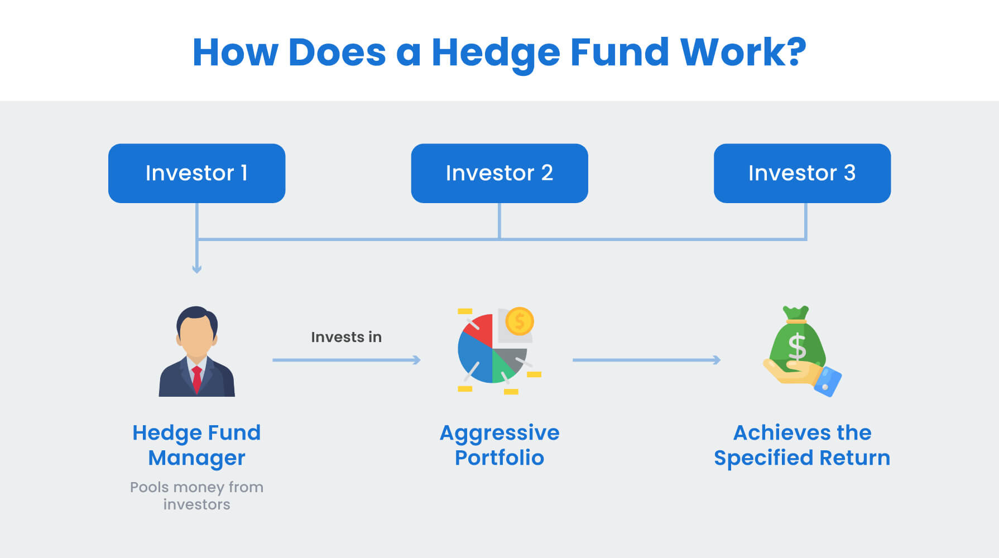

Hedge funds, with their promise of substantial returns and an aura of financial mastery, have long held a magnetic appeal for those keen to operate at the pinnacle of the investment world. Notoriously exclusive, these private investment vehicles combine a blend of traditional and non-traditional strategies to achieve significant profits, often regardless of market conditions. As the global financial landscape evolves, so too does the hedge fund industry. Today, careers within hedge funds aren't just about financial wizardry but also about adaptability, innovation, and navigating an industry in flux. Amidst challenges like increased regulatory scrutiny and demands for greater transparency, hedge funds are also leveraging cutting-edge technology, leading to a broader array of roles and an interdisciplinary approach to investment. For those considering a dive into this riveting pool, understanding both the allure and the shifting sands of hedge fund careers is the starting point.

# Understanding Hedge Funds

Hedge funds, often described as alternative investment vehicles, are private pools of capital that aim to generate high returns for their accredited investors. Unlike traditional investment funds, they employ a range of strategies to earn active returns for their clients. These strategies can include short selling, leverage, derivatives, and more[1]. This flexibility in approaches allows hedge funds to profit in both rising and falling markets, underlining their appeal to those seeking to maximize returns while potentially mitigating risks.

Over the years, the types of hedge funds have diversified, reflecting the ever-changing investment landscape. Broadly categorized, they span strategies such as long-short equity, market-neutral, event-driven, global macro, and fixed-income arbitrage, among others[2]. Each type represents a unique risk-reward profile, tailored to meet specific investment objectives and risk tolerances of its investors.

Tracing the history of hedge funds brings us back to the 1940s, with Alfred Winslow Jones credited as the pioneer. He introduced an innovative investment model that combined both long and short equity positions[3]. This was revolutionary for its time, as it aimed to neutralize market impact and focus purely on asset selection. From this starting point, hedge funds have evolved, adapting to various market crises and regulatory changes. Their rise to prominence in the 1980s and 1990s was driven by their ability to deliver impressive returns, outpacing more traditional investments. However, they've also faced scrutiny, particularly during the 2008 financial crisis, leading to calls for more transparency and regulatory oversight.

Understanding hedge funds requires more than just grasping their strategies or historical context. It's about recognizing their unique position in the financial ecosystem, where innovation meets investment, and flexibility often reigns supreme.

# Why Hedge Funds?

Hedge funds, with their sophisticated investment strategies and promise of high returns, have long captivated finance professionals. One of the primary advantages of working at a hedge fund is the opportunity to be at the forefront of financial innovation. Professionals often enjoy greater flexibility in investment strategies, allowing them to implement novel approaches and react swiftly to market dynamics.

In addition to this, the compensation structure in hedge funds can be highly lucrative. The typical "2 and 20" fee structure – a 2% management fee and a 20% performance fee – means that when the fund performs well, the payouts can be substantial[4]. This performance-driven environment can be exhilarating for those with a keen interest in the markets and a high tolerance for risk.

However, the hedge fund world is not without its challenges. The very factors that make it attractive – high rewards and a dynamic environment – also contribute to its high-pressure nature. The expectation for strong performance is constant, and during market downturns, hedge funds can face significant redemptions, adding to the stress. Additionally, the industry is known for its long hours, which can impede work-life balance for many professionals.

Comparatively, when assessing hedge funds against other financial career paths like investment banking or asset management, some differences emerge. Investment banks, for instance, offer a structured career path with a broader exposure to various financial services, but may not provide the depth of market immersion that hedge funds offer[5]. Asset management, on the other hand, might offer a more stable environment, but potentially with less aggressive compensation structures than hedge funds.

Ultimately, the choice to pursue a career in hedge funds is contingent upon individual preferences. For those driven by market dynamics, a desire for substantial financial rewards, and a penchant for risk, hedge funds represent an unmatched opportunity. But it's essential to weigh these attractions against the inherent challenges and pressures of the industry.

# Career Opportunities within Hedge Funds

Hedge funds are multifaceted entities that require a diverse array of talents to function effectively. As such, they offer a plethora of career opportunities for those keen to enter the industry.

Starting with core investment roles, **Analysts** are the backbone of any hedge fund. They delve deep into sectors, companies, or assets, harnessing data to generate insights and investment recommendations. Their work often lays the foundation for the fund's investment decisions.

Moving up the ladder, **Portfolio Managers** are the decision-makers. They determine the allocation of capital based on their analysis, analysts' inputs, and the fund's overarching strategy. A portfolio manager's role is crucial, as they bear the responsibility for the fund's performance and are thus remunerated handsomely for their expertise and judgment[6].

**Risk Managers** are the gatekeepers of the fund. Their primary responsibility is to identify, analyze, and mitigate potential risks that the fund might be exposed to. In an industry where the line between success and failure can be razor-thin, risk managers ensure that the fund doesn't stray into dangerous territories.

Beyond these core roles, hedge funds have a well-defined hierarchy. Entry-level positions, often occupied by recent graduates, include roles like **Research Associates** or **Junior Analysts**. As professionals gain experience, they can progress to Senior Analyst, then to Portfolio Manager, and potentially to Partner or even Founder if they decide to start their own fund[7].

Parallel to these investment-centric roles, hedge funds also require a range of service professionals to ensure smooth operations. **Legal** teams navigate the complex regulatory landscape, ensuring the fund's activities comply with global and local laws. The **Compliance** department is crucial in today's heavily regulated financial world, ensuring adherence to various rules set by regulatory bodies.

**IT professionals** in hedge funds aren't just about maintaining servers; they're often at the forefront of financial technology innovation, developing algorithms, tools, and platforms to give their fund a competitive edge. Meanwhile, **Human Resources (HR)** teams play an essential role in talent acquisition, management, and retention, ensuring that the fund attracts and nurtures the best in the business.

To summarize, hedge funds offer a wide array of career opportunities, each integral to the fund's success. Whether you're a budding analyst, a tech enthusiast, or someone with a keen eye for compliance, there's a place for you in the hedge fund world.

# Education and Skill Set

The hedge fund industry is notorious for its competitive nature. To gain an edge, aspiring professionals should not only possess the right educational background but also cultivate a distinct set of skills.

At the basic level, a bachelor's degree in finance, economics, business, or related fields is almost universally expected. This foundation equips candidates with fundamental knowledge in financial markets, analytics, and economic theory. However, as hedge funds deal with complex investment strategies, merely having an undergraduate degree might not suffice.

Advanced qualifications can elevate one's candidacy. The **Chartered Financial Analyst (CFA)** designation is highly respected in the investment world. It demonstrates a professional's ability to manage investment portfolios and a deep understanding of ethical and professional standards. **MBA** degrees, especially from top-tier institutions, can provide a broader business perspective and strategic thinking, often favored for higher managerial roles within hedge funds[8]. On the other hand, a **PhD**, particularly in quantitative disciplines like physics, mathematics, or engineering, can be a significant asset for quantitative hedge funds that rely heavily on sophisticated algorithms and models[9].

But qualifications alone won't land you the job. Hedge funds value a diverse skill set:

- **Analytical skills:** The ability to dissect financial statements, understand market dynamics, and interpret data is crucial.
- **Research skills:** This isn't just about crunching numbers. It involves understanding industries, geopolitical events, and even psychological market drivers.
- **Technical skills:** Proficiency in financial modeling, software such as Bloomberg Terminal or FactSet, and even programming languages like Python can be essential, especially in quant roles[10].
- **Coding:** As the industry leans more on algorithmic strategies, coding becomes increasingly vital. Knowledge in Python, R, or MATLAB can set you apart.
- **Soft skills:** Communication, teamwork, and resilience are often underlined. It's one thing to analyze data; it's another to explain your insights to a team or persuade a portfolio manager of your investment thesis.

Finally, the hedge fund industry is continuously evolving, driven by technological innovations, regulatory changes, and market dynamics. Continual learning is not just encouraged; it's imperative. Regularly attending industry seminars, taking relevant courses, and staying updated with financial news will ensure that professionals remain relevant and adaptive in this fast-paced industry.

# Setting the Foundation: Early Steps

Beginning a career in hedge funds is akin to building a house; the foundation is vital. Secure and robust groundwork significantly influences the trajectory of one's journey in the hedge fund universe.

Internships play a pivotal role in shaping one's understanding of the industry. They offer a practical, hands-on approach to the theoretical knowledge gained during academic pursuits. By working directly with seasoned professionals, interns garner insights into investment strategies, portfolio management, and the intricate workings of global markets[11]. Top hedge funds, such as Bridgewater Associates and Citadel, offer coveted internship programs. Additionally, platforms like eFinancialCareers and Wall Street Oasis are beneficial in scouting internship opportunities.

Engaging in personal investing can provide a unique edge. By establishing a personal portfolio, you're not just investing money but also your time and commitment to understanding market dynamics. This hands-on experience can be invaluable. Tools like Investopedia's stock simulator or platforms like Robinhood can help beginners initiate their investment journey. As you make investment decisions, track the performance, reflect on successes and mistakes, and adjust strategies accordingly.

Equipping oneself with knowledge is crucial. A plethora of books offer insights into hedge funds, investments, and the financial world. Some must-reads include "Hedge Fund Market Wizards" by Jack D. Schwager, which provides a deep dive into the strategies of successful hedge fund managers, and "More Money Than God" by Sebastian Mallaby, offering a historical perspective on the rise of hedge funds[12]. Journals such as the Journal of Finance and Financial Analysts Journal can be pivotal in keeping abreast with the latest research and trends in finance.

Starting early, grasping opportunities to learn, and continuously honing one's skills can lay a solid foundation for a remarkable career in hedge funds.

# Building Your Brand

In the competitive landscape of hedge funds, being good isn’t enough; you need to stand out. One’s unique value proposition (UVP) is essentially the distinguishing characteristic that makes an individual desirable to employers. Think of your UVP as a blend of your skills, experiences, and perspectives that others can't easily replicate. It could be your unique approach to analysis, a combination of interdisciplinary knowledge, or a specific kind of market insight. Tailor your UVP to showcase how you can add value to a hedge fund[13].

The Three-Circles Strategy simplifies brand building:

1. **Personal**: This circle encompasses personal strengths, values, and passions. It's about understanding oneself deeply, acknowledging strengths, and aligning them with one's career aspirations.
2. **Network**: Your professional relationships play a pivotal role in expanding opportunities. This circle stresses the quality of connections over quantity.
3. **Technical**: It covers hard skills, from financial modeling to coding. Mastery in these areas showcases your capability to perform specific hedge fund roles[14].

Networking isn’t just about attending events or joining online platforms; it's about fostering genuine, meaningful relationships. Industry events, seminars, and alumni networks are great places to start. Platforms like LinkedIn, combined with tools like RocketReach, can help you connect with industry professionals. Remember, the goal is not to sell yourself aggressively but to engage in meaningful conversations, ask questions, share insights, and learn[15].

Headhunters specialize in matching hedge fund talent with opportunities. Their deep industry connections and knowledge of the hiring landscape make them invaluable. To get on their radar, ensure your LinkedIn profile highlights your UVP and experiences. Also, consider joining databases such as Hedge Fund Research or Glocap, which many headhunters use to source candidates. Building a relationship with them can provide you with insights into the hiring needs of hedge funds, feedback on your skill set, and access to unadvertised roles.

By methodically building your brand and effectively leveraging resources, you not only increase your visibility but also position yourself as a sought-after talent in the hedge fund world.

# Application Process Demystified

## Researching and Screening Potential Hedge Funds

Just as hedge funds critically assess investments, you should evaluate potential employers to ensure a suitable match. The first step is to determine what type of hedge fund aligns with your interests and skills. There are various hedge funds, each with unique strategies such as long/short, macro, event-driven, and quant. Match your strengths and aspirations with these strategies.

Geography also plays a role. For instance, while New York City is undoubtedly a hedge fund hub, there are significant opportunities in places like London, Hong Kong, and even emerging markets. Aligning your location preference with hedge fund hubs can be beneficial.

Dive into the fund's performance history, looking beyond mere returns. Analyze the Sharpe ratio, drawdowns, and volatility to understand the risk-adjusted returns. Funds with consistent performance over different market conditions are often more stable.

Cultural fit is just as crucial as technical alignment. Research the fund's principles, team dynamics, and work culture. Some funds may have a more collaborative environment, while others might foster individualism. Leveraging platforms like Glassdoor can give insights into the employee experience[16].

Consider the size of the hedge fund. While a larger fund might offer more resources and established processes, a smaller fund could provide a more hands-on experience with varied responsibilities. Each has its advantages depending on one's career goals.

Finally, regulatory checks are paramount. Ensure the fund complies with regulations and hasn’t had significant disputes or litigations. The U.S. Securities and Exchange Commission (SEC) maintains records of registered hedge funds and any disciplinary actions taken against them.

In this research phase, leverage tools like Preqin, Hedge Fund Research, or BarclayHedge. They provide comprehensive data on hedge funds, aiding in making informed decisions[17].

Your due diligence will not only prepare you for potential interviews but also ensure you align yourself with a hedge fund that complements your professional aspirations.

## Crafting the Perfect Resume and Cover Letter

A powerful resume and cover letter can be your ticket into the elite world of hedge funds. Your resume should not merely list qualifications; it should tell a compelling story about your aptitude, experiences, and drive.

1. **Quantify Your Impact:** Hedge funds value precision and results. Whenever possible, quantify your achievements. Instead of writing "Managed a portfolio," specify, "Managed a $50 million portfolio that outperformed its benchmark by 5%."
2. **Tailor to the Fund:** Generic resumes often end up in the reject pile. Research the fund you're applying to and emphasize experiences and skills that resonate with their strategies or values.
3. **Highlight Relevant Skills:** Showcase skills like financial modeling, coding (e.g., Python, R), or any proprietary research methods you've employed or mastered.
4. **Educational & Certification Emphasis:** Highlight relevant degrees and certifications, especially if you've earned accolades like the CFA, MBA, or other specialized financial training.[18]
5. **Brief and Concise:** A resume should be a maximum of two pages, ensuring that every word adds value. Avoid fluff and focus on concrete achievements.

For the cover letter:

1. **Open Strongly:** Start with why you're deeply interested in the hedge fund world and this particular fund. Perhaps there's a specific trade they executed that you admired, or their risk management strategies align with your philosophy.
2. **Showcase Your Value:** Highlight one or two significant achievements that demonstrate your potential value to the fund. Maybe you developed a unique algorithm or led a team that managed a high-performing portfolio.
3. **Cultural Fit:** Hedge funds are often smaller operations where fit matters. Briefly touch upon why you believe you'd be an excellent cultural addition to their team.
4. **Close with Enthusiasm:** Reiterate your interest and express eagerness to discuss how your skills align with the fund's goals.
5. **Proofread Thoroughly:** A single error can cost you the opportunity, given the precision-driven nature of the industry. Ensure impeccable grammar, punctuation, and clarity.[19]

Above all, authenticity matters. While it's essential to present your best self, avoid exaggeration or misrepresentation. The hedge fund industry is tight-knit, and credibility is paramount.

## Sourcing Unadvertised Opportunities: The Hidden Job Market

The hedge fund industry, with its reputation for discretion and secrecy, often operates differently from traditional sectors when it comes to hiring. A significant number of roles never make it to public job boards. Tapping into this hidden job market can provide a distinct advantage in your hedge fund career pursuit.

1. **Networking is Paramount:** The importance of building and maintaining a robust professional network cannot be overstated. Regularly attend industry events, seminars, and conferences. Organizations like the CFA Institute and the Alternative Investment Management Association (AIMA) frequently hold events that can be goldmines for connections[20].
2. **Alumni Networks:** Your university's alumni network can be instrumental. Many institutions have finance or investment clubs that maintain ties with graduates working in hedge funds. Reaching out and expressing genuine interest can open doors.
3. **Engage with Headhunters:** The hedge fund industry heavily relies on recruitment firms to find the right talent discreetly. Building a relationship with these headhunters ensures you're in the loop for opportunities that might never be publicly advertised[21].
4. **Informational Interviews:** Approach professionals in the industry for informational interviews. It's not a direct job application but a chance to learn more about their experience and gain insights. These meetings can sometimes lead to referrals or tips about upcoming opportunities.
5. **Online Forums and Communities:** Websites like Wall Street Oasis or eFinancialCareers often have forums where members share leads or discuss openings[22]. While these aren't direct job listings, they can provide a starting point for further investigation.
6. **Proactive Outreach:** If there's a particular hedge fund you're interested in, don't wait for a job listing. Research the fund, craft a compelling message about your interest and value proposition, and reach out. The initiative is often appreciated.
7. **Stay Updated:** Regularly read industry publications, blogs, and news. Not only do they keep you informed about market trends, but they sometimes feature interviews or articles about funds that hint at expansion or new strategies, which might indicate hiring opportunities.

Remember, the hidden job market thrives on relationships, trust, and reputation. Consistent effort, genuine interest, and maintaining a clean professional image are essential to accessing these unadvertised opportunities.

## Preparing for Interviews

Hedge fund interviews are notoriously rigorous and can test a range of skills from personal fit to deep technical expertise. Here’s how to ace each aspect:

**Expected Fit Questions and Personal Story Narration**

 Fit questions assess whether you'd gel with the fund's culture. Be ready to articulate why you want to work in the hedge fund industry, why a specific fund interests you, and instances where you've demonstrated relevant traits like tenacity or analytical prowess. When narrating your personal story, maintain a clear, concise narrative that highlights experiences directly relevant to the role. Discuss past challenges, how you overcame them, and the results.

**Anticipating Technical Questions**

These questions assess your understanding of finance, statistics, and the tools of the hedge fund trade. Refresh on topics like portfolio optimization, risk management, financial modeling, and valuation techniques. Additionally, be prepared to discuss recent market events and their implications.

**Crafting Compelling Stock or Investment Pitches**

Many interviews will require you to pitch a stock or investment. Ensure your pitch is well-researched and structured: introduce the asset, explain its current valuation, provide a future valuation, and list reasons for the expected price movement. Always be prepared to defend your thesis against pushback.

**Prepping for Brain Teasers and Case Studies**

Hedge funds love using brain teasers to gauge your problem-solving skills and poise under pressure. While you can't predict every question, practice common financial and logic puzzles. For case studies, you might be given a dataset or a brief and expected to provide an investment insight. Focus on structuring your approach, making data-driven decisions, and communicating your rationale effectively.

In all aspects of the interview, clarity of thought, deep knowledge, and confidence are key. Remember, the goal isn't just to demonstrate that you're smart but that you can add value to the fund from day one.

# Beyond the Job Application

Hedge fund roles are highly coveted, and once you've cleared the challenging interview rounds, there are still crucial steps to ensure your entry is smooth and your trajectory upward.

**Navigating Hedge Fund Offer Negotiations**

It's not uncommon for successful candidates to negotiate their offer. Know your value: research typical compensation for the role and experience level you're entering[23]. Remember, it's not just about the base salary; bonuses, profit-sharing, and other perks can be significant components of hedge fund compensation. While financial remuneration is paramount, also consider other factors like work flexibility, growth opportunities, and the fund’s reputation. Be forthright yet respectful during negotiations, showcasing your enthusiasm for the role while ensuring the terms are equitable.

**What to Expect in the First 90 Days**

The initial months at a hedge fund can be intense. You'll likely undergo a steep learning curve as you get acquainted with proprietary tools, firm-specific strategies, and internal processes. Be proactive: seek feedback regularly, establish strong relationships with colleagues, and immerse yourself in the fund's investment philosophy. Stay updated with market developments, as you'll be expected to apply real-world events to your work quickly. Remember, these three months are not just about adapting but demonstrating that the fund made the right decision in hiring you.

**Career Progression within Hedge Funds**

Career trajectories in hedge funds aren't as standardized as in traditional investment banking or asset management. Typically, analysts might progress to senior analysts, then to portfolio managers, and potentially to partners or directors. However, the timeline and path can vary widely depending on the fund's size, performance, and structure. To ensure upward mobility, consistently demonstrate excellent performance, cultivate relationships both inside and outside the fund, and be willing to take on responsibilities that may fall outside your defined role. The hedge fund world values results, so continually improving and contributing to the fund's success is the surest way to ascend.

# Salaries, Bonuses, and Work-Life Balance

Hedge funds are often associated with lucrative compensation, and while this can be accurate, it's essential to understand the breakdown and variability of these payouts.

**A Realistic Look at Compensation Across Roles and Regions:**
Entry-level analysts at hedge funds can expect a starting salary ranging from $70,000 to $150,000, with bonuses pushing total compensation to anywhere from $90,000 to $200,000. As one progresses through the ranks to roles such as portfolio managers, compensation can grow substantially, potentially reaching several million dollars, primarily driven by performance bonuses. It's vital to recognize that these figures can vary based on the hedge fund's size, performance, and region. For instance, hedge funds based in financial hubs like New York or London might offer higher salaries than those in smaller cities, reflecting the cost of living and the competitive talent market.

**The True Nature of Work-Life Balance in Hedge Funds:**
The allure of significant compensation often comes at the cost of long hours and high stress. It's not uncommon for hedge fund professionals, especially those in investment roles, to work 60-80 hours a week, with additional hours during critical market events or significant portfolio changes. This intensity can challenge personal life and well-being. However, not all hedge funds have the same culture. Some might prioritize a better work-life balance, recognizing the benefits of a rejuvenated and sharp-minded team. It's crucial to research and engage in candid conversations during the interview process to understand a particular fund's culture and expectations.

# Additional Resources

To propel your journey into the hedge fund industry, it's beneficial to have a directory of top-notch resources at your disposal. Here are some curated suggestions to help you further:

**List of Top Hedge Funds to Aim For:**
While the hedge fund industry is vast, some of the most prominent names include Bridgewater Associates, Renaissance Technologies, and Two Sigma. Additionally, BlackRock, AQR Capital Management, and Elliott Management are also noteworthy for their global impact and innovative strategies[24].

**Online Platforms, Courses, and Communities for Aspiring Hedge Fund Professionals:**

- **Coursera** and **Udemy** offer courses on hedge fund strategies and financial modeling, which can be beneficial for beginners.
- **Wall Street Oasis** and **CFA Institute forums** provide networking opportunities, guidance, and insights from experienced professionals.
- **HedgeWeek** is a digital publication that covers the latest hedge fund news, giving you an industry perspective.

**Conferences, Seminars, and Workshops to Attend:**

- **The Sohn Investment Conference** in New York is a top-tier annual event, gathering the brightest minds in the industry[25].
- **The GAIM Ops Conference** is another must-attend, focusing on operations and compliance for alternative investments.
- **Hedge Fund Association (HFA) Symposiums** are held regularly, offering deep dives into various hedge fund topics and excellent networking opportunities.

By leveraging these resources, you'll be better positioned to navigate the hedge fund landscape, keeping abreast of industry changes and building valuable relationships.

[24]: [Preqin - Hedge Fund Spotlight](https://docs.preqin.com/reports/Preqin_Hedge_Fund_Spotlight_February_2011.pdf)

[25]: [Sohn Investment Conference](https://www.sohnconference.org/)

# Conclusion

The hedge fund industry, with its complex strategies and high stakes, offers professionals an opportunity to work in one of the most dynamic sectors of the financial world. For those drawn to the challenges and rewards, it provides unparalleled exposure to cutting-edge investment strategies, interactions with brilliant minds, and the potential for significant financial remuneration.

But like any other esteemed profession, breaking into hedge funds requires more than just technical knowledge. It demands a genuine passion for investing, an unwavering commitment to understanding global markets, and the ability to adapt and thrive in ever-changing environments. Your journey may be paved with intense competition and rigorous challenges, but remember, the blend of thorough preparation, genuine passion for the craft, and a never-give-up attitude is the trifecta that will set you apart.

By equipping yourself with the right resources, continuously seeking knowledge, and networking effectively, you set the stage for a fulfilling career in hedge funds. As you embark on this path, embrace the complexities, savor the learning, and always strive for excellence. The world of hedge funds awaits, and with dedication and perseverance, success is not just possible—it's inevitable.

💡 **Read more:**

- Trading strategies papers with code on [Equities](https://wiki.paperswithbacktest.com/trading-strategies/equities), [Cryptocurrencies](https://wiki.paperswithbacktest.com/trading-strategies/cryptocurrencies), [Commodities](https://wiki.paperswithbacktest.com/trading-strategies/commodities), [Currencies](https://wiki.paperswithbacktest.com/trading-strategies/currencies), [Bonds](https://wiki.paperswithbacktest.com/trading-strategies/bonds), [Options](https://wiki.paperswithbacktest.com/trading-strategies/options)
- [A curated list](https://github.com/paperswithbacktest/awesome-systematic-trading) of awesome libraries, packages, strategies, books, blogs, and tutorials for systematic trading
- [A bunch of datasets](https://huggingface.co/paperswithbacktest) for quantitative trading
- [A website to help you](https://paperswithbacktest.com/) become a quant trader and achieve financial independence

# References & Further Reading

[1]: [Investopedia - Hedge Funds: An Overview](https://www.investopedia.com/articles/02/111302.asp)

[2]: [CFA Institute - Types of Hedge Fund Strategies](https://store.cfainstitute.org/hedge-fund-investments/)

[3]: [History of Hedge Funds - The First Hedge Fund](https://www.idealsvdr.com/blog/hedge-fund-history/)

[4]: [Corporate Finance Institute - Hedge Fund Structure](https://corporatefinanceinstitute.com/resources/career-map/sell-side/capital-markets/hedge-fund/)

[5]: [Wall Street Mojo - Investment Banking vs. Hedge Funds](https://www.wallstreetmojo.com/investment-banking-vs-hedge-fund-manager/)

[6]: [CFA Institute - Role of Portfolio Manager](https://www.cfainstitute.org/en/programs/cfa/charterholder-careers/roles/portfolio-manager)

[7]: [Investopedia - How Do Hedge Funds Work?](https://www.investopedia.com/articles/investing/102113/what-are-hedge-funds.asp)

[8]: [CFA Institute - Benefits of the CFA Charter](https://www.cfainstitute.org/en/programs/cfa/charter)

[9]: [QuantStart - Why a PhD is Necessary for a Career in Quantitative Finance](https://www.quantstart.com/articles/Why-Study-for-a-Mathematical-Finance-PhD/)

[10]: [Wall Street Prep - Essential Technical Skills in Finance](https://www.wallstreetprep.com/knowledge/technical-skills-finance/)

[11]: [Vault - Best Hedge Fund Internships](https://legacy.vault.com/best-internships-rankings-search/best-internships-by-industry/investment-bank)

[12]: [Goodreads - Top Books on Hedge Funds](https://www.goodreads.com/shelf/show/hedge-fund)

[13]: [Harvard Business Review - How to Define Your Personal Brand](https://hbr.org/2023/05/a-new-approach-to-building-your-personal-brand)

[14]: [Forbes - Building Your Personal Brand](https://www.forbes.com/sites/karadennison/2022/11/28/why-personal-branding-is-important-and-how-to-build-yours/)

[15]: [Investopedia - Networking 101 for Financial Advisors](https://www.investopedia.com/articles/financial-advisors/070215/top-networking-tips-advisors.asp)

[16]: [Glassdoor - Hedge Fund Reviews](https://www.glassdoor.com/Reviews/Hedge-Fund-Research-Reviews-E286378.htm)

[17]: [BarclayHedge - Hedge Fund Data](https://www.barclayhedge.com/databases/hedge-fund-database)

[18]: [CFA Institute - Career Resources](https://www.cfainstitute.org/en/membership/careers)

[19]: [Wall Street Oasis - Cover Letter Templates](https://www.wallstreetoasis.com/resources/templates/word-templates/investment-banking-cover-letter-template)

[20]: [Alternative Investment Management Association (AIMA) - Events](https://www.aima.org/events/)

[21]: [Hedge Fund Insight - The Role of Recruiters](https://www.quora.com/What-does-a-hedge-fund-HR-recruiter-do)

[22]: [Wall Street Oasis - Hedge Fund Forum](https://www.wallstreetoasis.com/forum/hedge-funds)

[23]: [Payscale - Hedge Fund Salary Data](https://www.payscale.com/research/US/Job=Hedge_Fund_Manager/Salary)