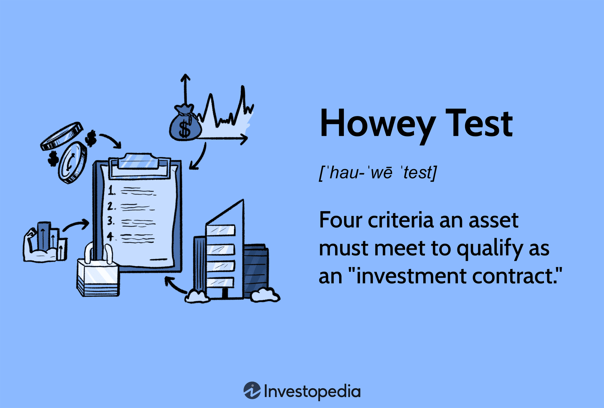

## Table of Contents

## What is the Howey Test?

The Howey Test is a way to figure out if something is an investment contract and counts as a security. It comes from a court case in the United States called SEC v. W.J. Howey Co. in 1946. The test helps the government decide if a deal needs to follow special rules meant to protect people who invest money.

To pass the Howey Test, a deal must have four things: first, there must be money invested; second, the investment must be in a common business; third, there must be an expectation of making a profit; and fourth, the profit must come from the work of others, not just the person who invested. If all these things are true, then the deal is seen as a security and has to follow certain laws.

## Who created the Howey Test and why was it established?

The Howey Test was created by the United States Supreme Court in 1946. It came from a case called SEC v. W.J. Howey Co. The court needed a way to decide if something was an investment contract, which is a type of security. They made the test to help figure this out.

The reason the Howey Test was established was to protect people who invest money. The government wanted to make sure that if someone was selling an investment, it had to follow certain rules. These rules are meant to keep investors safe and make sure they know what they are getting into. The test helps the government decide if a deal needs to follow these special rules.

## How does the Howey Test determine if something is a security?

The Howey Test is a way to figure out if something is a security. It was made by the United States Supreme Court in 1946. The test looks at four things to decide if something is a security. First, there must be money invested. Second, the money must go into a common business. Third, the person investing must expect to make a profit. Fourth, the profit must come from the work of others, not just the person who invested. If all these things are true, then the deal is seen as a security.

The reason the Howey Test is important is to protect people who invest money. The government wants to make sure that if someone is selling an investment, it has to follow certain rules. These rules help keep investors safe and make sure they know what they are getting into. By using the Howey Test, the government can decide if a deal needs to follow these special rules. This helps stop people from being tricked or losing their money in bad investments.

## What are the four prongs of the Howey Test?

The Howey Test has four parts that help decide if something is a security. The first part is that there must be money invested. This means someone is putting their money into something, hoping to get more money back later. The second part is that the money must go into a common business. This means the money is used in a business that many people are part of, not just the person who invested.

The third part is that the person investing must expect to make a profit. This means they think they will get more money back than what they put in. The fourth part is that the profit must come from the work of others, not just the person who invested. This means the success of the investment depends on other people working to make the business do well. If all these parts are true, then the deal is seen as a security and has to follow special rules to protect investors.

## How is the Howey Test applied to cryptocurrencies?

The Howey Test is used to see if a [cryptocurrency](/wiki/cryptocurrency) is a security. People who make or sell cryptocurrencies need to know if their project has to follow special rules meant to protect investors. To figure this out, they use the Howey Test. The test looks at four things: if there is money invested, if the money goes into a common business, if people expect to make a profit, and if that profit comes from other people's work. If all these things are true, then the cryptocurrency is seen as a security.

Applying the Howey Test to cryptocurrencies can be tricky. For example, if someone buys a new cryptocurrency hoping it will go up in value because a team is working on it, that might be seen as a security. But if someone buys a cryptocurrency just to use it to buy things, like Bitcoin, it might not be seen as a security. The rules can be different for each cryptocurrency, so the people who make them need to be careful and might need to talk to lawyers to make sure they are following the law.

## Can you give examples of cryptocurrencies that have been evaluated using the Howey Test?

One example of a cryptocurrency that has been evaluated using the Howey Test is Ripple's XRP. The U.S. Securities and Exchange Commission (SEC) looked at XRP to see if it was a security. They used the Howey Test and decided that XRP was indeed a security because people bought it expecting to make a profit from Ripple's work. This meant that Ripple had to follow special rules to protect investors. The case with XRP shows how the Howey Test can be used to decide if a cryptocurrency needs to follow these rules.

Another example is the case of Telegram's TON (The Open Network) and its cryptocurrency, Gram. The SEC also used the Howey Test to look at Gram. They found that people who bought Gram were investing money into a common business and expected to make a profit from Telegram's work. Because of this, the SEC said that Gram was a security. Telegram had to follow the rules for securities, but they decided to stop the project instead. These examples show how the Howey Test helps decide if cryptocurrencies need to follow special rules to protect people who invest in them.

## What are the implications for a cryptocurrency if it is deemed a security under the Howey Test?

If a cryptocurrency is deemed a security under the Howey Test, it means the people who make and sell it have to follow special rules. These rules are made to protect people who invest money. The people who make the cryptocurrency have to tell investors a lot of information about the project. They have to say how the money will be used, who is in charge, and what risks there are. This helps investors make smart choices and not lose their money in bad investments.

If a cryptocurrency is a security, it can be harder for the people who make it to sell it. They might need to get special permission from the government before they can sell it to people. This can take a long time and cost a lot of money. If they don't follow the rules, they could get in trouble with the law. This is why some people who make cryptocurrencies try to make sure their project does not look like a security under the Howey Test.

## How do regulatory bodies like the SEC use the Howey Test in relation to cryptocurrencies?

Regulatory bodies like the SEC use the Howey Test to decide if a cryptocurrency is a security. They look at four things: if people are investing money, if the money goes into a common business, if people expect to make a profit, and if that profit comes from other people's work. If all these things are true, then the cryptocurrency is seen as a security. The SEC uses this test to make sure that people who make and sell cryptocurrencies follow special rules meant to protect investors.

If a cryptocurrency is found to be a security, the people who make it have to follow strict rules. They need to tell investors a lot of information about the project, like how the money will be used and what risks there are. This helps investors make good choices and avoid losing their money in bad investments. The SEC can also stop people from selling cryptocurrencies that are securities without following these rules. This is why the SEC uses the Howey Test to keep the cryptocurrency market safe for everyone.

## What challenges do cryptocurrency projects face in passing the Howey Test?

Cryptocurrency projects face many challenges when trying to pass the Howey Test. One big challenge is making sure that people who buy the cryptocurrency do not expect to make a profit just from the work of others. If people think they will make money because a team is working on the project, it might be seen as a security. This means the project has to be very clear about what the cryptocurrency is for and how it will be used. If it looks too much like an investment, it might fail the Howey Test.

Another challenge is figuring out if the money people put into the cryptocurrency goes into a common business. If the money is used to build something that everyone who buys the cryptocurrency is part of, it might be seen as a security. This can be hard to avoid because many cryptocurrency projects need money to grow and develop. The people who make the cryptocurrency have to be careful about how they use the money and make sure it does not look like a common business. If they do not, they might have to follow special rules that can be hard and expensive to meet.

## How have court decisions influenced the application of the Howey Test to cryptocurrencies?

Court decisions have played a big role in how the Howey Test is used for cryptocurrencies. One important case was with Ripple's XRP. The court looked at XRP and used the Howey Test to see if it was a security. They decided that XRP was a security because people bought it hoping to make money from Ripple's work. This case showed that even if something is called a cryptocurrency, it can still be seen as a security if it meets the Howey Test's rules. This made people who make cryptocurrencies more careful about how they set up their projects.

Another case that influenced the Howey Test's application was with Telegram's TON and its cryptocurrency, Gram. The court used the Howey Test and found that Gram was a security because people who bought it were investing in a common business and expected to make a profit from Telegram's work. This decision made it clear that if a cryptocurrency project looks too much like an investment, it will be treated as a security. These court decisions have made it harder for new cryptocurrency projects to avoid being seen as securities, and they have to be very careful about how they explain their projects to avoid legal trouble.

## What strategies can cryptocurrency projects employ to avoid being classified as securities under the Howey Test?

Cryptocurrency projects can try to avoid being classified as securities by making sure people who buy their cryptocurrency do not expect to make a profit just from the work of others. They can do this by clearly saying that the cryptocurrency is meant for using in a network or for buying things, not for making money by holding it. For example, if a project says the cryptocurrency is like a tool or a way to pay for services, it might not be seen as a security. The project also needs to make sure that the money people put in does not go into a common business that everyone shares. This means they should be careful about how they use the money and make sure it is not used to build something that all buyers are part of.

Another strategy is to follow the rules for how to sell the cryptocurrency. Some projects use something called a "SAFT" (Simple Agreement for Future Tokens) to raise money before the cryptocurrency is ready. With a SAFT, people agree to buy the cryptocurrency later, not right away, which can help the project avoid being seen as a security at first. But, they still need to be careful when they actually start selling the cryptocurrency. They should talk to lawyers and make sure they are following all the rules. By being clear about what the cryptocurrency is for and how it will be used, and by following the right steps to sell it, cryptocurrency projects can try to stay out of trouble with the Howey Test.

## What are the future implications of the Howey Test for the development and regulation of cryptocurrencies?

The Howey Test will keep playing a big role in how cryptocurrencies are made and watched over. As more and more people get into cryptocurrencies, the government will use the Howey Test to make sure that new projects follow the rules meant to protect people who invest money. This means that people who make new cryptocurrencies will need to be very careful about how they set up their projects. They will have to make sure that their cryptocurrency does not look like an investment that depends on other people's work. If they do not, they might have to follow strict rules that can be hard and expensive to meet.

In the future, we might see more court cases about whether certain cryptocurrencies are securities. These cases will help make the rules clearer for everyone. As the rules get clearer, people who make cryptocurrencies will have a better idea of what they need to do to stay out of trouble. They might need to change how they raise money or explain their projects to make sure they do not get seen as securities. This could slow down some new projects, but it will also help make the cryptocurrency world safer for everyone who wants to use or invest in it.

## References & Further Reading

[1]: Makarov, I., & Schoar, A. (2020). ["Trading and Arbitrage in Cryptocurrency Markets."](https://www.sciencedirect.com/science/article/pii/S0304405X19301746) National Bureau of Economic Research.

[2]: SEC. (2017). ["SEC Issues Investigative Report Concluding DAO Tokens, a Digital Asset, Were Securities."](https://www.sec.gov/files/litigation/investreport/34-81207.pdf) U.S. Securities and Exchange Commission.

[3]: Bodie, Z., Kane, A., & Marcus, A. J. (2014). ["Investments"](https://www.mheducation.com/highered/product/Investments-Bodie.html) (10th ed.). McGraw-Hill Education.

[4]: Gans, J. S., & Gandal, N. (2017). ["More (or Less) Economic Limits of the Blockchain."](https://www.nber.org/system/files/working_papers/w26534/w26534.pdf) NBER Cryptoeconomics.

[5]: De Filippi, P., & Wright, A. (2018). ["Blockchain and the Law: The Rule of Code."](https://www.jstor.org/stable/j.ctv2867sp) Harvard University Press.

[6]: Acheson, N. (2020). ["Ripple Lawsuit: Why It Took So Long for the SEC to Charge the Third-Biggest Cryptocurrency."](https://ripple.com/insights/xrp-is-not-a-security-ripples-landmark-victory-in-sec-lawsuit/) CoinDesk.