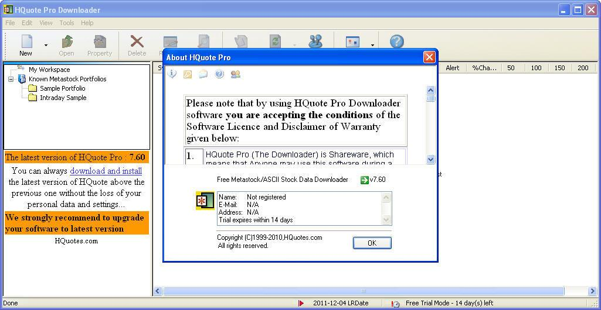

## Table of Contents

## What is HQuotes.com?

HQuotes.com is a website where you can find and share quotes. People use it to get inspiration, motivation, or just to enjoy wise words from famous people. You can search for quotes by topic, author, or keywords, making it easy to find what you need.

The site also lets you create an account to save your favorite quotes and share them with friends. It's a great place for people who love reading and collecting quotes to connect with others who have the same interest. Whether you need a quote for a speech, a social media post, or just for personal reflection, HQuotes.com has a lot to offer.

## Who founded HQuotes.com?

HQuotes.com was founded by a person named Harshvardhan Singh. He started the website because he loved quotes and wanted to share them with others. Harshvardhan thought that quotes could inspire people and make them feel better, so he created a place where everyone could find and enjoy them.

The website began as a small project, but it grew quickly because many people liked the idea. Harshvardhan worked hard to add more quotes and make the site easy to use. Now, HQuotes.com is a popular place for people all over the world to find and share their favorite quotes.

## When was HQuotes.com launched?

HQuotes.com was launched in 2014. It was started by Harshvardhan Singh, who loved quotes and wanted to share them with others. He thought that quotes could help people feel inspired and happy, so he made a website where everyone could find and enjoy them.

The website started small, but it grew quickly because many people liked the idea. Harshvardhan worked hard to add more quotes and make the site easy to use. Now, HQuotes.com is a popular place for people all over the world to find and share their favorite quotes.

## What types of quotes can be found on HQuotes.com?

On HQuotes.com, you can find many different types of quotes. There are quotes about love, life, and happiness. You can also find quotes about success, motivation, and friendship. If you like funny quotes, there are plenty of those too. The website has quotes from famous people like authors, leaders, and celebrities.

You can search for quotes by topic, author, or keywords. This makes it easy to find exactly what you need. Whether you want a quote for a special occasion, to share on social media, or just to read for fun, HQuotes.com has something for everyone. People from all over the world visit the site to find and share their favorite quotes.

## How can users search for quotes on HQuotes.com?

On HQuotes.com, users can search for quotes in different ways. You can type in a topic like 'love' or 'success' to find quotes about those things. If you know the name of the person who said the quote, you can search by the author's name. For example, you could search for quotes by Mahatma Gandhi or Oprah Winfrey.

You can also use keywords to find quotes. If you type in words like 'inspiration' or 'friendship,' the website will show you quotes that have those words in them. This makes it easy to find exactly what you are looking for. Whether you want a quote for a special occasion or just to read for fun, HQuotes.com makes it simple to search and find the perfect quote.

## Is there a mobile app for HQuotes.com?

Yes, there is a mobile app for HQuotes.com. You can download it on your phone from the app store. The app makes it easy to find and read quotes wherever you are. It has all the same features as the website, so you can search for quotes by topic, author, or keywords.

The app also lets you save your favorite quotes and share them with friends. It's great for people who like to read quotes on the go. Whether you're on a bus, waiting in line, or just relaxing at home, the HQuotes.com app is a handy way to enjoy quotes anytime.

## Can users contribute quotes to HQuotes.com?

Yes, users can contribute quotes to HQuotes.com. If you find a quote you like and it's not on the website, you can submit it. All you need to do is go to the 'Submit a Quote' page, type in the quote, and say who said it. The team at HQuotes.com will check the quote to make sure it's correct and then add it to the website.

This feature makes HQuotes.com special because it lets everyone help build the collection of quotes. People from all over the world can share their favorite quotes and help others find inspiration. It's a great way to be part of a community that loves and shares quotes.

## How does HQuotes.com verify the authenticity of quotes?

HQuotes.com checks the quotes to make sure they are real. When someone submits a quote, the team looks at it carefully. They check if the quote is from the person who is said to have said it. They use [books](/wiki/algo-trading-books), websites, and other sources to see if the quote is correct. If they find that the quote is not right, they do not put it on the website.

This way, HQuotes.com makes sure that the quotes on their site are true. They want people to trust the quotes they read. By checking each quote, they help keep the website full of good and real quotes. This makes HQuotes.com a great place for people to find and share quotes they can believe in.

## What are the most popular features of HQuotes.com?

The most popular feature of HQuotes.com is the ability to search for quotes easily. Users love that they can find quotes by typing in a topic, an author's name, or keywords. This makes it simple to find the perfect quote for any situation, whether it's for a speech, a social media post, or just for personal inspiration. The search feature is quick and user-friendly, which is why so many people enjoy using the website.

Another popular feature is the option to save and share quotes. Users can create an account to keep their favorite quotes in one place. They can also share these quotes with friends, which makes it fun and easy to spread inspiration. Many people appreciate this feature because it helps them connect with others who enjoy quotes too. The ability to contribute new quotes is also loved by users, as it lets them be part of the HQuotes.com community.

## How does HQuotes.com generate revenue?

HQuotes.com makes money by showing ads on their website. When people visit the site and see these ads, HQuotes.com gets paid by the companies that put the ads there. This is a common way for websites to make money because it lets them offer their services for free to users while still [earning](/wiki/earning-announcement) income.

The website also has a mobile app, and they can show ads there too. This means more people can see the ads, which helps HQuotes.com make more money. By using ads, HQuotes.com can keep adding new quotes and improving their site without charging users to use it.

## What are the future plans for expanding HQuotes.com?

HQuotes.com wants to grow and become even better. They plan to add more quotes in different languages so people from all over the world can enjoy them. They also want to make the website easier to use on phones and tablets. This way, more people can find and read quotes no matter where they are.

Another big plan is to start a community where users can talk about quotes and share their thoughts. This will help people connect and learn from each other. HQuotes.com also wants to work with schools and libraries to help them use quotes for learning and fun. By doing these things, HQuotes.com hopes to keep growing and helping more people find inspiration every day.

## How does HQuotes.com handle copyright issues related to quotes?

HQuotes.com takes copyright issues very seriously. They know that quotes can be copyrighted, so they are careful about which quotes they put on their website. When someone submits a quote, the team checks to see if it is okay to use. They make sure the quote is not protected by copyright or they get permission from the person who owns the copyright.

If someone says that a quote on HQuotes.com is copyrighted and should not be there, the website will take it down right away. They want to respect the rights of authors and other people who create quotes. By being careful and listening to concerns, HQuotes.com tries to avoid any problems with copyrights and keep their website full of quotes that everyone can enjoy.

## References & Further Reading

[1]: Bergstra, J., Bardenet, R., Bengio, Y., & Kégl, B. (2011). ["Algorithms for Hyper-Parameter Optimization."](https://papers.nips.cc/paper/4443-algorithms-for-hyper-parameter-optimization) Advances in Neural Information Processing Systems 24.

[2]: ["Advances in Financial Machine Learning"](https://www.amazon.com/Advances-Financial-Machine-Learning-Marcos/dp/1119482089) by Marcos Lopez de Prado

[3]: ["Evidence-Based Technical Analysis: Applying the Scientific Method and Statistical Inference to Trading Signals"](https://www.amazon.com/Evidence-Based-Technical-Analysis-Scientific-Statistical/dp/0470008741) by David Aronson

[4]: ["Machine Learning for Algorithmic Trading"](https://github.com/PacktPublishing/Machine-Learning-for-Algorithmic-Trading-Second-Edition) by Stefan Jansen

[5]: ["Quantitative Trading: How to Build Your Own Algorithmic Trading Business"](https://books.google.com/books/about/Quantitative_Trading.html?id=j70yEAAAQBAJ) by Ernest P. Chan