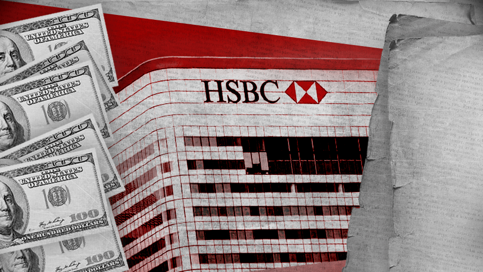

## Table of Contents

## What is HSBC?

HSBC is a big bank that started in Hong Kong and Shanghai a long time ago. It helps people and businesses with their money all over the world. Now, it has offices in many countries and helps people save money, borrow money, and do other banking things.

The name HSBC stands for Hongkong and Shanghai Banking Corporation. It was created to help traders move money between Europe and Asia. Today, HSBC is one of the biggest banks in the world and works in places like Europe, Asia, North America, and more. It helps people from different countries with their money needs.

## What is money laundering?

Money laundering is when people try to hide where their money came from, especially if it was earned by doing something illegal like selling drugs or stealing. They do this by moving the money around in different ways so it looks like it came from a legal business or job. This makes it hard for the police or other people to find out that the money was from bad activities.

To launder money, people might put the money into a bank, buy things like houses or cars, or move it to different countries. They do this to make the money look clean and normal. Banks and governments try to stop money laundering by watching for strange money movements and making rules that people have to follow. But it's still a big problem because people keep finding new ways to hide their money.

## When did the HSBC money laundering controversy occur?

The HSBC money laundering controversy happened around 2012. It was a big problem because people found out that HSBC, a huge bank, was not doing enough to stop criminals from using it to hide their dirty money. The bank was helping people move money around in ways that made it hard to tell where the money came from. This money was sometimes from bad things like selling drugs or helping terrorists.

Because of this, HSBC got into a lot of trouble. They had to pay a big fine of $1.9 billion to the U.S. government. This was one of the biggest fines ever for a bank. HSBC said they were sorry and promised to do better at stopping money laundering. They made new rules and hired more people to watch for bad money movements. But the whole thing made a lot of people worried about how safe their money was in banks.

## Which countries were involved in the HSBC money laundering scandal?

The HSBC money laundering scandal involved many countries. The main countries were the United States and Mexico. In Mexico, drug cartels were using HSBC to move their illegal money. They were sending the money to the U.S. and other places, making it hard to track where it came from.

The scandal also affected other countries like Colombia, where HSBC was used to launder money from drug trafficking. In the United Kingdom, where HSBC is based, the bank was criticized for not doing enough to stop the illegal activities. The U.S. government led the investigation and fined HSBC because the bank broke U.S. laws about money laundering.

Overall, the scandal showed how money laundering can be a big problem across many countries. It involved places like the U.S., Mexico, Colombia, and the UK. The issue made people think more about how banks need to be careful and follow the rules to stop criminals from using them to hide their dirty money.

## What specific actions did HSBC take that led to the money laundering controversy?

HSBC got into trouble because they did not do a good job of watching the money that was moving through their bank. They let drug cartels in Mexico use their bank to send money to the U.S. and other places without checking where the money was coming from. This made it easy for the cartels to hide their illegal money. HSBC also helped move money from Colombia that came from drug trafficking. They were not careful enough and did not follow the rules that are meant to stop money laundering.

Because of these actions, HSBC was fined a lot of money by the U.S. government. They had to pay $1.9 billion, which is one of the biggest fines ever for a bank. HSBC said they were sorry and promised to do better. They made new rules and hired more people to watch for bad money movements. But the whole thing made a lot of people worried about how safe their money was in banks.

## How did the controversy come to light?

The controversy came to light because of a big investigation by the U.S. government. They found out that HSBC was not doing enough to stop criminals from using their bank to hide dirty money. The investigation showed that drug cartels in Mexico were using HSBC to move their illegal money to the U.S. and other places. This made it hard to track where the money came from.

The U.S. government looked at a lot of information and found that HSBC was breaking the rules about money laundering. They also found out that HSBC was helping move money from Colombia that came from drug trafficking. Because of all this, the U.S. government decided to fine HSBC a huge amount of money, $1.9 billion. This fine was one of the biggest ever for a bank, and it made a lot of people worried about how safe their money was in banks.

## What were the legal consequences faced by HSBC due to the money laundering?

HSBC faced big trouble because of the money laundering. The U.S. government found out that HSBC was not doing enough to stop criminals from using their bank to hide dirty money. They were helping drug cartels in Mexico move their illegal money to the U.S. and other places. This made it hard to track where the money came from. Because of this, the U.S. government fined HSBC a huge amount of money, $1.9 billion. This was one of the biggest fines ever for a bank.

After the fine, HSBC said they were sorry and promised to do better. They made new rules and hired more people to watch for bad money movements. But the whole thing made a lot of people worried about how safe their money was in banks. The controversy showed how important it is for banks to be careful and follow the rules to stop criminals from using them to hide their dirty money.

## How did HSBC respond to the allegations and the legal actions?

HSBC said they were sorry for what happened and promised to do better. They knew they did not do a good job of watching the money that was moving through their bank. They let drug cartels in Mexico use their bank to send money to the U.S. and other places without checking where the money was coming from. This made it easy for the cartels to hide their illegal money. HSBC also helped move money from Colombia that came from drug trafficking. They were not careful enough and did not follow the rules that are meant to stop money laundering.

After the U.S. government fined them $1.9 billion, HSBC took action to fix the problem. They made new rules to make sure they were watching the money more closely. They also hired more people to check for bad money movements. HSBC wanted to show that they were serious about stopping money laundering and making sure it did not happen again. They worked hard to rebuild trust with their customers and the public.

## What were the financial penalties imposed on HSBC as a result of the controversy?

HSBC had to pay a big fine because of the money laundering problem. The U.S. government made them pay $1.9 billion. This was one of the biggest fines ever for a bank. They got in trouble because they did not watch the money moving through their bank well enough. Drug cartels in Mexico used HSBC to send their illegal money to the U.S. and other places without being checked. HSBC also helped move money from Colombia that came from drug trafficking.

After the fine, HSBC said they were sorry and promised to do better. They made new rules to watch the money more closely and hired more people to check for bad money movements. HSBC wanted to show that they were serious about stopping money laundering and making sure it did not happen again. They worked hard to rebuild trust with their customers and the public.

## What changes did HSBC implement in their compliance and monitoring systems post-controversy?

After the money laundering controversy, HSBC made big changes to their compliance and monitoring systems. They knew they had to do a better job of watching the money that moved through their bank. So, they made new rules to check where the money was coming from and where it was going. They also started to keep a closer eye on any strange money movements. This was to make sure that no one could use their bank to hide dirty money again.

To help with this, HSBC hired more people to work in their compliance department. These new employees were trained to spot any signs of money laundering. They used special computer programs to watch the money movements and alert them if anything looked suspicious. HSBC wanted to show everyone that they were serious about stopping money laundering and making their bank a safe place for people's money.

## How has the HSBC money laundering controversy impacted the global banking industry's approach to anti-money laundering?

The HSBC money laundering controversy made a big impact on how banks around the world deal with stopping money laundering. Before the controversy, some banks were not as careful as they should have been. They did not always check where the money was coming from or where it was going. But after HSBC got into trouble, banks realized they had to be more careful. They started to make new rules and use better computer programs to watch the money moving through their banks. This was to make sure no one could use their banks to hide dirty money.

Now, banks all over the world are trying harder to stop money laundering. They have more people working to check for any strange money movements. They also work together with governments and other banks to share information about possible money laundering. The HSBC controversy showed everyone that banks need to be very careful and follow the rules to keep their customers' money safe and stop criminals from using them to hide their illegal money.

## What are the ongoing implications and lessons learned from the HSBC money laundering case for financial institutions worldwide?

The HSBC money laundering case taught banks all over the world a big lesson. They learned that they need to be very careful about watching the money that moves through their banks. If they don't, they could get into big trouble like HSBC did. Banks now have stricter rules and use better computer programs to check where money is coming from and where it is going. They also hire more people to look for any strange money movements. This helps them stop criminals from using their banks to hide dirty money.

Another important lesson is that banks need to work together with governments and other banks to share information about possible money laundering. This helps them catch the bad guys faster. The HSBC case showed everyone that money laundering is a big problem that can happen anywhere. So, banks need to keep learning and improving their ways to stop it. This makes the whole banking system safer for everyone who uses it.

## References & Further Reading

[1]: "US Senate Report on HSBC's Money Laundering and Terrorist Financing" - [Permanent Subcommittee on Investigations, United States Senate](https://apnews.com/article/senate-hearing-airlines-fees-seats-bags-3cd4a1fc1b29fc04f9607adea7b5bdf4)

[2]: "Infiltrated: How the Global Business of Banking Made Everybody Richer — Except for the People" by Antoine Pecquet and Yves Gassot

[3]: Bowers, J. (2012). "How HSBC Got Away With Money Laundering While Snubbing U.S. Regulators." [The Guardian](https://en.wikipedia.org/wiki/Kris_Bowers)

[4]: ["The Bank That Lived a Little: Barclays in the Age of the Very Free Market"](https://www.amazon.com/Bank-That-Lived-Little-Barclays/dp/0241335973) by Philip Augar

[5]: "Anti-Money Laundering Regulation and its Issues: A Review by the BIS" [Bank for International Settlements](https://en.wikipedia.org/wiki/Basel_Committee_on_Banking_Supervision) 

[6]: Verhage, A. (2011). "The Anti Money Laundering Complex and the Compliance Industry." [Routledge Studies in Crime and Economics](https://www.semanticscholar.org/paper/The-Anti-Money-Laundering-Complex-and-the-Industry-Verhage/59097f1046a028cada9c0bda52bf6f6832b49a0f)

[7]: "Risk Assessment Approaches and Practices - A Guide to Effective Risk Collaboration" by Alessandro Carretta and Franco Fiordelisi, contributing insights into regulatory compliance in financial operations.