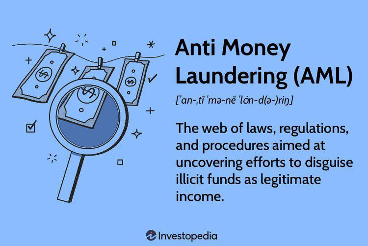

The HSBC financial scandal involving money laundering represents a significant milestone in the banking industry's history, drawing attention to the vulnerabilities in financial systems and regulatory oversights. This high-profile case, which culminated in 2012 with HSBC receiving a $1.9 billion fine, underscores the intricate challenges of managing and mitigating financial crime risks within global banking institutions. At its core, the scandal highlights HSBC’s failure to implement effective anti-money laundering (AML) measures, allowing illegal entities, such as drug cartels, to exploit these weaknesses to cleanse approximately $881 million of illicit funds. The consequences of such financial indiscretions are far-reaching, potentially destabilizing economic and political structures across nations.

As money laundering continues to pose a significant threat to the integrity of financial systems worldwide, understanding this scandal sheds light on two contrasting facets of modern banking: the growing reliance on technological advancements and the need for stringent regulatory frameworks. Technology, particularly algorithmic trading, plays a pivotal role in today's banking landscape. While these advanced algorithms can increase the efficiency and accuracy of financial transactions, they also present new avenues for illicit activities if not adequately supervised and integrated with compliance systems.

In this context, the HSBC case serves as a critical example of the dual-edged nature of technology in financial services. It illustrates not only the potential for misuse when robust controls are absent but also the vital role technological solutions can play in enhancing detection and prevention mechanisms when appropriately managed. Thus, the scandal not only reveals the flaws in existing systems but also emphasizes the continual need to balance technological innovation with ethical and regulatory considerations. Through examining the intricacies of this scandal, there is an opportunity to better comprehend the intricate landscape of financial regulation, ultimately aiding in the development of more resilient and compliant global banking systems.

## Table of Contents

## Background of HSBC's Financial Scandal

In 2012, HSBC Holdings PLC was subjected to a record fine of $1.9 billion by United States authorities, highlighting severe lapses in the bank's anti-money laundering (AML) protocols. This penalty ranks among the most substantial in the annals of banking violations and underscores the serious nature of the infractions involved. At the heart of the scandal was HSBC's inadequate implementation of measures meant to prevent money laundering, a failure that facilitated the movement of approximately $881 million for drug cartels, notably those operating out of Mexico and Colombia.

The core issue identified was a systemic weakness in HSBC's compliance culture, which was found to be skewed towards maximizing profit margins rather than adhering to ethical banking practices. This misalignment led to significant regulatory oversights, allowing illicit financial activities to proceed unchecked. Numerous reports indicated that the bank's policies and practices around AML controls were insufficient, a flaw noted by U.S. regulatory bodies such as the Office of the Comptroller of the Currency (OCC) well before the fine was imposed.

The OCC, among other regulators, had identified several deficiencies within HSBC's AML structures as early as 2003, and subsequent examinations had highlighted a consistent pattern of ineffective action. These included inadequacies in customer due diligence, failure to monitor wire transactions properly, and insufficient oversight of transactions in risk-prone regions. Despite these warnings, the bank did not make the necessary changes, resulting in significant reputational damage and financial penalties.

In the aftermath of the scandal, HSBC embarked on an extensive overhaul of its global operations to enhance its compliance mechanisms and restore institutional credibility. This initiative involved restructuring its compliance framework, particularly focusing on areas and regions identified as high-risk. Moreover, the bank expanded its compliance workforce and invested in advanced technologies to monitor and detect potentially suspicious transactions in real time. These steps were part of a broader strategy to ensure that HSBC could meet and exceed regulatory standards, thereby reassuring both regulators and the public of its commitment to ethical practices.

## The Mechanics of Money Laundering

Money laundering is a financial crime that entails the transformation of illicitly obtained funds into apparently legitimate financial assets. The process is typically divided into three stages: placement, layering, and integration.

1. **Placement**:
   This is the initial stage where illicit funds are introduced into the financial system. This can be achieved through various means, such as depositing cash in banks, purchasing high-value items, or using the money in gambling establishments. The objective is to remove the funds from the direct association with the criminal activity.

2. **Layering**:
   In the layering stage, a series of complex financial transactions are conducted to conceal the origins of the funds. These transactions may include wire transfers across multiple accounts, often in different countries, making extensive use of shell companies and offshore accounts. The aim is to create confusion and cloud the trail of the illicit money, separating it from its criminal source.

3. **Integration**:
   The final stage integrates the now "cleaned" money into the economy as lawful holdings. This may involve investing the funds in legitimate businesses, purchasing real estate, or other financial instruments. The objective is to ensure that the origin of the money appears legitimate, allowing the launderer to use it without raising suspicion.

The broader impact of money laundering extends beyond mere financial losses; it undermines the integrity of financial systems, destabilizes economies, and can have serious political ramifications. When criminal proceeds are legitimized, they can distort financial markets and contribute to the growth of criminal enterprises, thus eroding public trust in financial institutions.

Globally, Anti-Money Laundering (AML) frameworks and regulations have been established to counteract money laundering activities. Key international bodies, such as the Financial Action Task Force (FATF), provide standards and guidelines for countries to implement robust AML measures. These include requirements for financial institutions to maintain detailed records, monitor transactions for suspicious activity, and report such activities to relevant authorities.

Advancements in technology have played a dual role in the landscape of money laundering. On one hand, technologies like blockchain and [cryptocurrency](/wiki/cryptocurrency) offer innovative ways for launderers to conceal illicit funds through anonymity. On the other hand, technological developments have enhanced the ability of institutions and regulators to combat money laundering. Machine learning algorithms and [artificial intelligence](/wiki/ai-artificial-intelligence) are increasingly used to detect unusual patterns indicative of money laundering, thus improving the effectiveness of AML measures.

In summary, while technology presents new challenges in money laundering, it also provides crucial tools for enforcement agencies to enhance detection and prevention efforts, contributing to safer and more transparent financial environments globally.

## HSBC and Algorithmic Trading

Algorithmic trading refers to the use of complex mathematical models and high-speed computing to execute trades rapidly and efficiently. This technology has become prevalent in modern financial markets due to its ability to process large volumes of transactions with minimal human intervention. The principal advantage of [algorithmic trading](/wiki/algorithmic-trading) is its efficiency, providing [liquidity](/wiki/liquidity-risk-premium) and contributing to the stabilization of market prices by executing trades based on predetermined criteria such as price, timing, and [volume](/wiki/volume-trading-strategy).

However, algorithms have a dual nature, as their capabilities can be exploited for illicit purposes. The potential for manipulation within algorithmic systems poses a significant challenge for financial institutions. Malicious actors can design algorithms to hide or [carry](/wiki/carry-trading) out fraudulent activities, such as layering or spoofing, where fake orders are placed to manipulate market prices without the intention of executing trades.

HSBC's integration of algorithmic trading with its compliance systems highlighted these complexities. The bank encountered difficulties in effectively merging advanced algorithmic models with compliance frameworks aimed at detecting suspicious transactions. The challenge lies in ensuring that algorithms, designed primarily for efficiency and speed, can still recognize and flag irregularities that might indicate money laundering or other financial crimes.

The case of HSBC exemplifies the necessity for balance in the adoption of technology within financial contexts. While algorithms present opportunities for innovation and efficiency, they also introduce risks that must be managed proactively. There is an increasing need for enhanced oversight and regulatory frameworks that address these dual-use technologies. Future regulatory measures may focus on improving transparency around algorithmic operations. This could involve stricter requirements for documenting and auditing algorithmic decisions, ensuring they align with ethical and legal standards.

Furthermore, advances in [machine learning](/wiki/machine-learning) and artificial intelligence could assist in building smarter compliance tools capable of analyzing vast datasets to detect anomalies indicative of financial crime. 

In conclusion, as financial institutions continue to contend with the complexities of algorithmic trading, balancing the benefits of technological advancement with the imperative of regulatory compliance and ethical practice will remain a prominent challenge.

## Subsequent Compliance Improvements

Following the financial scandal, HSBC undertook significant restructuring of its global compliance operations, emphasizing high-risk regions that previously exhibited vulnerabilities. A comprehensive overhaul was initiated to address deficiencies in its anti-money laundering (AML) measures, aiming to fortify its defenses against illicit financial activities. 

One of the key steps HSBC took was to significantly increase its compliance staff. By expanding the number of personnel dedicated to compliance and AML duties, HSBC demonstrated a commitment to improving oversight and ensuring that suspicious activities could be identified and addressed more promptly. This move was crucial for handling the vast volume of transactions the bank processes globally and ensuring adequate scrutiny of financial activities.

In addition to bolstering human resources, HSBC invested heavily in real-time transaction monitoring technologies. These systems are designed to detect potentially suspicious transactions by analyzing patterns and anomalies in financial data, thus enabling the bank to act swiftly in preventing money laundering activities. The incorporation of such technologies marked a pivotal advancement in HSBC's compliance infrastructure, underscoring the importance of integrating modern technological solutions in regulatory compliance.

Furthermore, HSBC has implemented advanced algorithms to enhance the monitoring, flagging, and investigation of suspicious activities. These algorithms utilize complex mathematical models to assess transaction data, identify red flags, and provide compliance officers with actionable intelligence. By leveraging machine learning and artificial intelligence, HSBC can improve the accuracy and efficiency of its AML processes, allowing for more effective detection and prevention of fraudulent activities.

The measures taken by HSBC in the wake of the scandal are driven by the bank's objective to restore credibility and rebuild trust with regulators and the public. The proactive steps to improve compliance not only aim to prevent future breaches but also serve to reassure stakeholders of HSBC's dedication to maintaining high ethical standards.

HSBC's experience highlights the critical importance of maintaining a balanced approach to technology and ethics in banking practices. The integration of sophisticated compliance technologies should be matched with a strong ethical framework to ensure that financial institutions can adequately safeguard against money laundering and other forms of financial crime. HSBC emerges as a cautionary tale and a learning opportunity for other banks, emphasizing the necessity for continuous improvement in compliance measures and the responsible use of technology in the financial sector.

## Lessons Learned and Conclusion

The HSBC money laundering scandal emphasizes the critical need for comprehensive and enforceable compliance frameworks in the banking sector. Implementing such frameworks ensures that financial institutions adhere to legal standards and protect the integrity of global financial systems. The scandal highlighted significant lapses in compliance mechanisms, where failures led to the laundering of vast sums by criminal organizations. This serves as a cautionary tale for other financial entities worldwide.

In modern banking, leveraging technology responsibly is paramount. While technological advancements offer improved efficiency and seamless operations, their misuse can facilitate illicit activities. The HSBC case underscores the necessity for banks to integrate ethical conduct within their financial operations, thereby preventing misuse of technology for crimes such as money laundering. The role of technological solutions, like advanced algorithms, should focus on enhancing the detection and prevention of suspicious activities rather than being a tool for exploitation.

Regulatory bodies bear the responsibility of sustaining the integrity of financial institutions. By enforcing stringent standards and holding institutions accountable, these bodies ensure that banks operate transparently and ethically. The HSBC scandal demonstrates the potential consequences when regulatory oversight is inadequate. Therefore, an active and robust regulatory presence is essential in maintaining trust in the financial sector.

For banks worldwide, prioritizing robust anti-money laundering (AML) measures is not just a regulatory requirement but a fundamental operational principle. Transparent operations and verifiable compliance systems mitigate the risk of financial scandals and ensure that banks do not become conduits for illegal activities. The HSBC case is a poignant reminder of the damage that can arise from inadequate AML frameworks.

Ultimately, the scandal serves as a lesson for developing resilient financial systems capable of combating complex criminal tactics. Strengthening compliance frameworks, responsibly utilizing technology, and ensuring rigorous regulatory oversight are crucial steps toward creating a secure financial environment. The global banking industry must learn from past mistakes to build a future where financial crimes are minimized, and trust in financial institutions is restored.

## References & Further Reading

[1]: "US Senate Report on HSBC's Money Laundering and Terrorist Financing" - [Permanent Subcommittee on Investigations, United States Senate](https://apnews.com/article/senate-hearing-airlines-fees-seats-bags-3cd4a1fc1b29fc04f9607adea7b5bdf4)

[2]: "Infiltrated: How the Global Business of Banking Made Everybody Richer — Except for the People" by Antoine Pecquet and Yves Gassot

[3]: Bowers, J. (2012). "How HSBC Got Away With Money Laundering While Snubbing U.S. Regulators." [The Guardian](https://en.wikipedia.org/wiki/Kris_Bowers)

[4]: ["The Bank That Lived a Little: Barclays in the Age of the Very Free Market"](https://www.amazon.com/Bank-That-Lived-Little-Barclays/dp/0241335973) by Philip Augar

[5]: "Anti-Money Laundering Regulation and its Issues: A Review by the BIS" [Bank for International Settlements](https://en.wikipedia.org/wiki/Basel_Committee_on_Banking_Supervision) 

[6]: Verhage, A. (2011). "The Anti Money Laundering Complex and the Compliance Industry." [Routledge Studies in Crime and Economics](https://www.semanticscholar.org/paper/The-Anti-Money-Laundering-Complex-and-the-Industry-Verhage/59097f1046a028cada9c0bda52bf6f6832b49a0f)

[7]: "Risk Assessment Approaches and Practices - A Guide to Effective Risk Collaboration" by Alessandro Carretta and Franco Fiordelisi, contributing insights into regulatory compliance in financial operations.