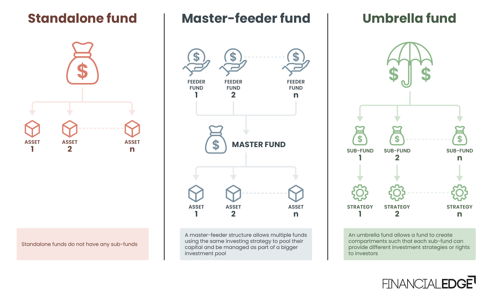

## Table of Contents

## What is the basic concept of the Hub and Spoke Model in portfolio management?

The Hub and Spoke Model in portfolio management is a way to organize and manage different investments. Imagine a wheel with a central hub and several spokes coming out from it. In this model, the hub represents the core investment strategy or the main fund, and the spokes are different sub-strategies or satellite funds. This setup helps investors spread their money across various types of investments, which can reduce risk and potentially increase returns.

The main idea behind the Hub and Spoke Model is to balance stability and growth. The hub, being the central part, usually focuses on safer, more stable investments like bonds or large-cap stocks. This provides a solid foundation for the portfolio. The spokes, on the other hand, can be more diverse and might include riskier investments like small-cap stocks, emerging markets, or alternative assets. By having both the hub and the spokes, investors can aim for growth while still keeping a part of their portfolio safe and steady.

## How does the Hub and Spoke Model differ from other portfolio management strategies?

The Hub and Spoke Model is different from other portfolio management strategies because it has a clear center, or "hub," which is the main part of the investment plan. This hub is usually made up of safe investments, like bonds or big company stocks. Other strategies might not have this central focus and could spread investments more evenly across different types of assets without a clear center. For example, a diversified portfolio might try to balance risk and return by putting money into many different things without having a main part.

Another way the Hub and Spoke Model differs is by using "spokes" to reach out to different kinds of investments. These spokes can be more risky and are meant to help the portfolio grow. In contrast, a strategy like asset allocation might divide investments into categories like stocks, bonds, and cash without the idea of a hub and spokes. It might focus more on keeping the right mix of these categories over time. The Hub and Spoke Model allows for more flexibility because you can change the spokes without messing up the stable hub, which can be harder to do in other strategies where all parts are more connected.

## What are the key components of the 'Hub' in this model?

The 'Hub' in the Hub and Spoke Model is the main part of your investment plan. It's like the center of a wheel, and it's usually made up of safe and steady investments. These can be things like government bonds, high-quality corporate bonds, or stocks from big, stable companies. The idea is to keep this part of your portfolio safe and secure, so it acts like a strong foundation for everything else.

The hub is important because it helps balance out the riskier parts of your portfolio. If the other investments, or the 'spokes,' go up and down a lot, the hub stays more stable. This means that even if some of your investments lose value, the hub can help protect your overall money. By having a strong hub, you can feel more confident in taking chances with the spokes to try and grow your portfolio.

## What roles do the 'Spokes' play in the Hub and Spoke Model?

The 'spokes' in the Hub and Spoke Model are like different paths that lead away from the center, or the 'hub.' They are made up of investments that might be riskier but can help your portfolio grow. These can include things like stocks from smaller companies, investments in new markets, or even things like real estate or commodities. The idea is to spread your money into different areas that might go up in value more than the safe investments in the hub.

The spokes play a big role in balancing the overall risk and reward in your portfolio. While the hub keeps things stable, the spokes can help your money grow faster. If one spoke doesn't do well, the others might make up for it. This way, you can try to get more return on your investment without putting all your money into one risky thing. The spokes give you the chance to explore new opportunities while still having the safety of the hub.

## Can you explain how asset allocation is managed within the Hub and Spoke Model?

In the Hub and Spoke Model, asset allocation is managed by balancing the investments between the hub and the spokes. The hub is where you put the safer investments, like bonds or big company stocks. This part of your portfolio is meant to be stable and protect your money. The spokes, on the other hand, are where you put riskier investments that might grow faster, like small company stocks or investments in new markets. By deciding how much money to put into the hub and how much into the spokes, you can control the overall risk and growth of your portfolio.

When you're managing asset allocation in this model, you need to think about your goals and how much risk you're willing to take. If you want to be safe, you might put more money into the hub. If you're looking for growth, you might put more into the spokes. Over time, as the value of your investments changes, you might need to adjust how your money is split between the hub and the spokes to keep your portfolio in line with your goals. This way, the Hub and Spoke Model helps you manage your investments in a way that fits what you want to achieve.

## What are the advantages of using the Hub and Spoke Model for portfolio management?

The Hub and Spoke Model is good for managing your investments because it helps you balance safety and growth. The hub, which is made up of safe investments like bonds or big company stocks, keeps your money stable. This means even if other parts of your portfolio go down, the hub can help protect your overall money. It's like having a safety net that lets you take chances with other investments without worrying too much.

The spokes in this model let you explore different kinds of investments that might grow faster. These can be things like small company stocks or investments in new markets. By spreading your money into different areas, you can try to get more return on your investment without putting all your money into one risky thing. This way, if one spoke doesn't do well, the others might make up for it, helping your portfolio grow.

Overall, the Hub and Spoke Model gives you a clear way to manage your investments. It's easy to see how your money is split between safe and risky parts, and you can adjust it as needed to match your goals. This model helps you feel more in control and confident about your investments, whether you're looking to protect your money or make it grow.

## What are the potential disadvantages or challenges of implementing the Hub and Spoke Model?

One challenge with the Hub and Spoke Model is that it can be hard to decide how much money to put into the hub and how much into the spokes. If you put too much into the hub, your portfolio might be too safe and not grow as much as you want. But if you put too much into the spokes, your portfolio might be too risky and lose value if the risky investments don't do well. Finding the right balance can take a lot of thought and might need to change over time as your goals or the market changes.

Another disadvantage is that managing the spokes can be more work. Each spoke might need its own plan and watching to make sure it's doing what you want it to do. This means you might need to spend more time or money to keep everything in check. Also, if one spoke does really badly, it can drag down the whole portfolio, even if the hub is doing okay. So, you have to be ready to make quick changes if things start going wrong with any of the spokes.

## How can the Hub and Spoke Model be adapted for different types of investors, such as conservative vs. aggressive?

For conservative investors, the Hub and Spoke Model can be set up with a bigger hub and smaller spokes. The hub would have more safe investments like government bonds or big company stocks. This way, the portfolio stays stable and protects the investor's money. The spokes might still include some riskier investments, but they would be smaller and carefully chosen to not shake up the whole portfolio too much. This setup helps conservative investors feel safe while still giving them a chance to grow their money a little bit.

For aggressive investors, the model can be changed to have a smaller hub and bigger spokes. The hub would still have some safe investments, but not as many. This gives the portfolio a bit of stability but leaves more room for growth. The spokes would be bigger and might include more risky investments like small company stocks or new markets. This setup lets aggressive investors try to make their money grow faster, even if it means taking more chances. They can still use the hub as a safety net, but the focus is more on the potential for big gains from the spokes.

## What are some real-world examples of the Hub and Spoke Model in action?

A real-world example of the Hub and Spoke Model can be seen in a retirement portfolio. Imagine someone saving for retirement who wants to keep their money safe but also hopes to make it grow. They might put most of their money into the hub, which could be made up of safe investments like government bonds or big company stocks. This keeps their retirement savings stable. Then, they might use the spokes to invest a smaller part of their money in things like small company stocks or real estate investment trusts (REITs). These spokes give them a chance to grow their money faster, but they're not too risky because the hub is there to protect the bulk of their savings.

Another example is a young investor who wants to grow their money quickly. They might set up their portfolio with a smaller hub, maybe with some bonds and big company stocks, to give them a bit of safety. But the real focus would be on the spokes, which could include more risky investments like stocks in new technology companies or even cryptocurrencies. This setup lets them take bigger chances to try and make their money grow faster. Even if one of the spokes doesn't do well, the hub can help cushion the blow, and the other spokes might make up for it by doing really well.

## How does risk management integrate into the Hub and Spoke Model?

Risk management is a big part of the Hub and Spoke Model. The hub helps manage risk by holding safe investments like bonds or big company stocks. This part of the portfolio doesn't go up and down as much, so it keeps things stable. If the risky investments in the spokes start to lose money, the hub can help protect the overall value of the portfolio. This way, even if something goes wrong with one of the spokes, the hub acts like a safety net.

The spokes are where you can take more risks to try and grow your money. But managing these risks means [picking](/wiki/asset-class-picking) the right investments for the spokes and keeping an eye on them. If one spoke starts to do badly, you might need to change it or move money around to keep the portfolio balanced. By watching the spokes closely and being ready to make changes, you can manage the risks and try to make the most of the chances to grow your money.

## What advanced strategies can be employed to optimize the performance of a Hub and Spoke portfolio?

To optimize the performance of a Hub and Spoke portfolio, one advanced strategy is to use dynamic asset allocation. This means changing how much money you have in the hub and the spokes based on what's happening in the market. If the market is doing well, you might move more money into the spokes to try and grow your portfolio faster. But if the market starts to go down, you can move more money into the hub to keep things safe. By being ready to shift your money around, you can take advantage of good times and protect yourself during bad times.

Another strategy is to use tactical asset allocation within the spokes. This means picking different investments for the spokes based on short-term opportunities. For example, if you think a certain industry or country is going to do well soon, you can put more money into that spoke. This way, you can try to make more money by being smart about where you invest. It takes more work to keep an eye on these opportunities, but it can help your portfolio do better if you get it right.

## How can the effectiveness of a Hub and Spoke Model be measured and evaluated over time?

To measure and evaluate the effectiveness of a Hub and Spoke Model over time, you need to look at how well the portfolio is doing compared to what you wanted it to do. Start by checking if the portfolio is meeting your goals, like growing your money or keeping it safe. You can do this by looking at the total value of your portfolio and seeing if it's going up or staying steady. Also, compare your portfolio's performance to something like a stock market index to see if it's doing better or worse than the market. This helps you understand if the hub and spokes are working together to give you the results you want.

Another way to evaluate the model is by checking the balance between the hub and the spokes. Make sure the hub is still keeping things stable and the spokes are helping your money grow. You can do this by looking at how each part of the portfolio is doing on its own. If one spoke is doing really badly, it might be time to change it or move some money around. Over time, keep track of these changes and see if they help the portfolio do better. By regularly reviewing and adjusting the hub and spokes, you can make sure the model stays effective and keeps meeting your investment goals.

## References & Further Reading

[1]: Bergstra, J., Bardenet, R., Bengio, Y., & Kégl, B. (2011). ["Algorithms for Hyper-Parameter Optimization."](https://dl.acm.org/doi/10.5555/2986459.2986743) Advances in Neural Information Processing Systems 24.

[2]: ["Advances in Financial Machine Learning"](https://www.amazon.com/Advances-Financial-Machine-Learning-Marcos/dp/1119482089) by Marcos Lopez de Prado

[3]: ["Evidence-Based Technical Analysis: Applying the Scientific Method and Statistical Inference to Trading Signals"](https://www.amazon.com/Evidence-Based-Technical-Analysis-Scientific-Statistical/dp/0470008741) by David Aronson

[4]: ["Machine Learning for Algorithmic Trading"](https://github.com/stefan-jansen/machine-learning-for-trading) by Stefan Jansen

[5]: ["Quantitative Trading: How to Build Your Own Algorithmic Trading Business"](https://www.amazon.com/Quantitative-Trading-Build-Algorithmic-Business/dp/1119800064) by Ernest P. Chan