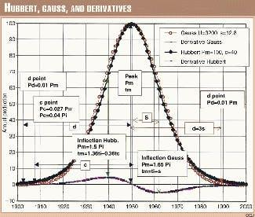

## Table of Contents

## What is the Hubbert Curve?

The Hubbert Curve, also known as the Hubbert Peak Theory, is a way to predict how much oil a country or the world can produce over time. It was created by a man named M. King Hubbert in the 1950s. The curve looks like a bell shape. It starts low when oil production begins, then rises to a peak, and finally falls as the oil runs out. Hubbert used this curve to guess when the United States would reach its peak oil production, and he was right.

This theory is important because it helps people understand that oil is a limited resource. Once we reach the peak, oil production will start to decline, and it will be harder and more expensive to get the remaining oil. This can affect the economy and how we use energy. Even though the Hubbert Curve is a simple model, it has been used to make predictions about oil production in many countries around the world.

## Who developed the Hubbert Curve and when?

The Hubbert Curve was developed by a man named M. King Hubbert. He was a geologist and worked for an oil company. Hubbert came up with this idea in the 1950s. He wanted to find a way to predict how much oil a country could produce over time.

Hubbert's idea was simple but powerful. He thought that oil production would follow a bell-shaped curve. It would start low, rise to a peak, and then fall as the oil ran out. He used this curve to predict when the United States would reach its peak oil production, and he was right. His work helped people understand that oil is a limited resource and that we need to plan for the future.

## What does the Hubbert Curve represent in terms of resource extraction?

The Hubbert Curve shows how much of a resource, like oil, can be taken out of the ground over time. It looks like a bell shape. At first, not much of the resource is taken out because it's hard to find and get to. Then, as more is found and technology gets better, more of the resource is taken out until it reaches a peak. After the peak, less and less of the resource is taken out because there's less left to find and it's harder to get to.

This curve is important because it helps people understand that resources like oil are limited. When we reach the peak, it means we've used up the easy-to-get resources. After the peak, getting the rest of the resource becomes harder and more expensive. This can affect the economy and how we use energy. Knowing about the Hubbert Curve helps us plan for the future and find new ways to use energy.

## How is the Hubbert Curve typically shaped?

The Hubbert Curve looks like a bell. It starts low when people first start taking out a resource like oil. Then, as they find more and get better at getting it, the amount they take out goes up until it reaches a peak. After the peak, the amount they can take out starts to go down because there's less of the resource left and it's harder to get to.

This bell shape is important because it shows that resources like oil are not endless. When the curve reaches its peak, it means we've used up the easy-to-get resources. After the peak, getting the rest becomes harder and more expensive. This can change how much things cost and how we use energy. Knowing about the Hubbert Curve helps us plan for the future and find new ways to use energy.

## What are the key components of the Hubbert Curve?

The Hubbert Curve has three main parts that show how much of a resource like oil can be taken out over time. First, there's the early stage where not much of the resource is taken out. This is because it's hard to find and get to the resource at the start. As time goes on and people find more of the resource and get better at getting it, the amount they take out starts to go up.

The second part of the Hubbert Curve is the peak. This is the highest point on the curve where the most amount of the resource is taken out. The peak happens when people have found a lot of the resource and can get it easily. After the peak, the third part of the curve starts. This is when the amount of the resource taken out starts to go down. There's less of the resource left, and it's harder and more expensive to get to what's left.

Understanding these three parts of the Hubbert Curve helps people see that resources like oil are limited. When we reach the peak, it means we've used up the easy-to-get resources. After the peak, getting the rest becomes harder and more expensive. This can change how much things cost and how we use energy. Knowing about the Hubbert Curve helps us plan for the future and find new ways to use energy.

## Can you explain the mathematical function used to model the Hubbert Curve?

The Hubbert Curve is usually modeled using a mathematical function called the logistic function. This function helps us see how much of a resource, like oil, can be taken out over time. The logistic function looks like this: Q(t) = Q_max / (1 + exp(-k(t - t_peak))), where Q(t) is the amount of the resource taken out at time t, Q_max is the total amount of the resource that can be taken out, k is a number that shows how fast the resource is taken out, and t_peak is the time when the resource reaches its peak.

This function creates a bell-shaped curve. At the start, when t is small, the amount of the resource taken out, Q(t), is low because it's hard to find and get to the resource. As time goes on and t gets closer to t_peak, Q(t) goes up until it reaches Q_max at t_peak. After t_peak, Q(t) starts to go down because there's less of the resource left and it's harder to get to. This simple function helps us understand and predict how resources like oil will be used up over time.

## How is the Hubbert Curve applied to predict peak oil production?

The Hubbert Curve is used to predict when a country or the world will reach its peak oil production. It does this by looking at how much oil has been taken out in the past and using a special math formula called the logistic function. This formula helps guess how much oil will be taken out in the future. People put in numbers like how much oil they think is left and how fast it's being taken out. Then, the curve shows a bell shape that starts low, goes up to a peak, and then goes down.

When the Hubbert Curve is used to predict peak oil, it helps people understand that oil is not endless. The peak on the curve shows the highest amount of oil that can be taken out at one time. After the peak, the amount of oil taken out will start to go down because there's less oil left and it's harder to get to. Knowing when this peak will happen helps people plan for the future. They can start looking for other ways to get energy or use less oil.

## What are the limitations of using the Hubbert Curve for forecasting?

The Hubbert Curve is a helpful tool for guessing when we will reach peak oil production, but it has some problems. One big problem is that it doesn't think about new technology. As time goes on, people might find new ways to get oil that are easier and cheaper. This could change how much oil we can take out and when we reach the peak. Also, the Hubbert Curve doesn't look at things like new oil finds or changes in how much oil people want to use. If a big new oil field is found, it could push the peak further into the future.

Another problem with the Hubbert Curve is that it is based on guesses about how much oil is left in the ground. If these guesses are wrong, the whole prediction can be off. Sometimes, people might think there's less oil left than there really is, or they might think there's more. Either way, it can make the Hubbert Curve not very accurate. Also, the curve doesn't think about things like wars or big changes in the economy, which can change how much oil is taken out.

Even with these problems, the Hubbert Curve is still used because it's a simple way to think about how much oil we can use over time. It helps people see that oil is not endless and that we need to plan for the future. But, because of its limits, it's best to use the Hubbert Curve along with other ways of guessing when we will reach peak oil.

## Can the Hubbert Curve be applied to resources other than oil?

Yes, the Hubbert Curve can be used for resources other than oil. It can be used to predict how much of any resource that we take out of the ground over time. This could be things like natural gas, coal, or even minerals like copper and uranium. The curve helps us see that these resources are not endless. Just like with oil, the amount we take out starts low, goes up to a peak, and then goes down as there's less of the resource left.

Even though the Hubbert Curve can be used for other resources, it still has the same problems. It doesn't think about new technology that could make it easier to get these resources. It also doesn't look at new finds or changes in how much people want to use the resource. If we find a big new deposit of a resource, it could change when we reach the peak. Also, the curve is based on guesses about how much of the resource is left. If these guesses are wrong, the predictions won't be very accurate.

## How accurate have predictions based on the Hubbert Curve been historically?

The Hubbert Curve has had some big wins and some misses when it comes to guessing when we'll reach peak oil. M. King Hubbert used it to predict that the United States would hit its peak oil production in the late 1960s or early 1970s. He was pretty close, as the U.S. actually peaked in 1970. This made a lot of people take the Hubbert Curve seriously. But, when people tried to use it to predict peak oil for the whole world, the guesses were all over the place. Some said it would happen in the early 2000s, but we're still waiting for that to happen.

One reason the Hubbert Curve's predictions can be off is that it doesn't think about new technology or big new oil finds. For example, new ways to get oil from shale rock have changed how much oil the U.S. can produce. This has made some people think the Hubbert Curve isn't as useful anymore. But, even with its problems, the Hubbert Curve still helps us see that oil and other resources are not endless. It's a simple way to think about how we use these resources over time, even if it's not perfect.

## What modifications or alternatives to the Hubbert Curve have been proposed?

Some people have come up with ways to change the Hubbert Curve to make it better. One way is to add more details to the curve to think about new technology and new oil finds. This could help make the guesses more accurate. Another way is to use different math formulas that can handle more things like changes in how much oil people want to use or big changes in the economy. These changes try to make the Hubbert Curve more useful for today's world, where things can change a lot.

There are also other ways to guess when we will reach peak oil that don't use the Hubbert Curve. One way is called the Multi-Cyclic Hubbert Model. This model thinks about how oil production can go up and down in different areas instead of just one big peak. Another way is to use computer models that can think about a lot of different things at once, like new technology, new oil finds, and changes in how much oil people use. These other ways try to give a fuller picture of how oil production will change over time.

## How can the Hubbert Curve be used in energy policy and planning?

The Hubbert Curve can help people who make energy rules and plans. It shows that oil and other resources we take from the ground are not endless. By using the Hubbert Curve, these people can guess when we will reach the peak of oil production. This helps them plan for the future. They can start looking for other ways to get energy, like wind or solar power, before the oil runs out. Knowing when the peak will happen can also help them make rules that make sure we use oil wisely and don't waste it.

Even though the Hubbert Curve has some problems, it's still a useful tool for energy planning. It makes people think about what will happen when oil production starts to go down after the peak. This can help them make plans to keep the economy strong and make sure people have the energy they need. By using the Hubbert Curve along with other ways of guessing when we will reach peak oil, energy planners can make better choices. This helps everyone get ready for a time when oil might be harder to find and more expensive to use.

## What is the Hubbert Curve and how can it be understood?

The Hubbert Curve is a prominent model developed by geophysicist Marion King Hubbert in the 1950s to predict the production rates of finite resources, particularly fossil fuels like oil. Hubbert's pioneering work introduced a method to forecast the lifecycle of resource extraction, emphasizing the inevitable peak and decline of production once resources are exhausted.

The Hubbert Curve is characterized by its bell shape, mathematically represented by a logistic function. It comprises three distinct phases—rise, peak, and decline. Initially, the production rate of a finite resource accelerates as exploration and technology improve, leading to a steep upward trajectory. This is followed by a peak, where maximum production is achieved, and finally, a decline phase as resources become depleted.

Hubbert's model posits that oil production in a given region follows a bell-curved trajectory over time. The curve is derived from the principle that as more of the resource is extracted, the rate of discovery and production eventually diminishes, leading to a reduction in output. Mathematically, the production rate $P(t)$ at any time $t$ can be modeled using a logistic equation:

$$
P(t) = \frac{P_{max}}{1 + e^{-k(t-t_0)}}
$$

Where:
- $P(t)$ is the production rate at time $t$.
- $P_{max}$ is the maximum production rate.
- $k$ is a constant that determines the steepness of the curve.
- $t_0$ is the time at which peak production occurs.

Hubbert initially applied this model to U.S. oil production, accurately predicting that domestic production would peak around the early 1970s. The simplicity and elegance of the Hubbert Curve make it applicable beyond oil to other finite resources, providing a general framework for understanding resource depletion dynamics.

While the Hubbert Curve was initially focused on fossil fuels, its core principles have been adapted to forecast production behaviors of various finite resources. Its predictive capacity serves not only in evaluating the lifespan and extraction rates of natural resources but also in making informed strategic decisions across diverse sectors reliant on non-renewable resources.

## References & Further Reading

[1]: Hubbert, M. King. (1956). ["Nuclear Energy and the Fossil Fuels"](https://www.spec2000.net/freepubs/B1956-Peak-Oil-Hubbert.pdf). Drilling and Production Practice, American Petroleum Institute.

[2]: Campbell, C.J., & Laherrère, J.H. (1998). ["The End of Cheap Oil,"](https://www.jstor.org/stable/26057708) Scientific American.

[3]: Deffeyes, K.S. (2001). ["Hubbert's Peak: The Impending World Oil Shortage,"](https://www.jstor.org/stable/j.ctt7t9r1) Princeton University Press.

[4]: Adelman, M. A., & Lynch, M. C. (1997). ["Fixed View of Resource Limits Creates Undue Pessimism,"](https://www.osti.gov/biblio/462709) Oil and Gas Journal.

[5]: Jaffe, A. M., & Stavins, R. N. (1994). ["The energy efficiency gap What does it mean?"](https://www.sciencedirect.com/science/article/pii/0301421594901384) Energy Policy.

[6]: Greene, D.L. (2000). ["Oil Dependence and National Security: A Market-Based System for Reducing U.S. Vulnerability,"](https://www.semanticscholar.org/paper/Costs-of-Oil-Dependence%3A-A-2000-Update-Greene-Tishchishyna/d9d20072f11aef8c1cb4aa7c468831dd81d1bc4c) Energy Policy.

[7]: ["Twilight in the Desert: The Coming Saudi Oil Shock and the World Economy"](https://www.amazon.com/Twilight-Desert-Coming-Saudi-Economy/dp/0471790184) by Matthew R. Simmons.

[8]: Kilian, L. (2008). ["Exogenous Oil Supply Shocks,"](https://conference.nber.org/confer/2005/mef05/kilian.pdf) The Journal of Business & Economic Statistics.