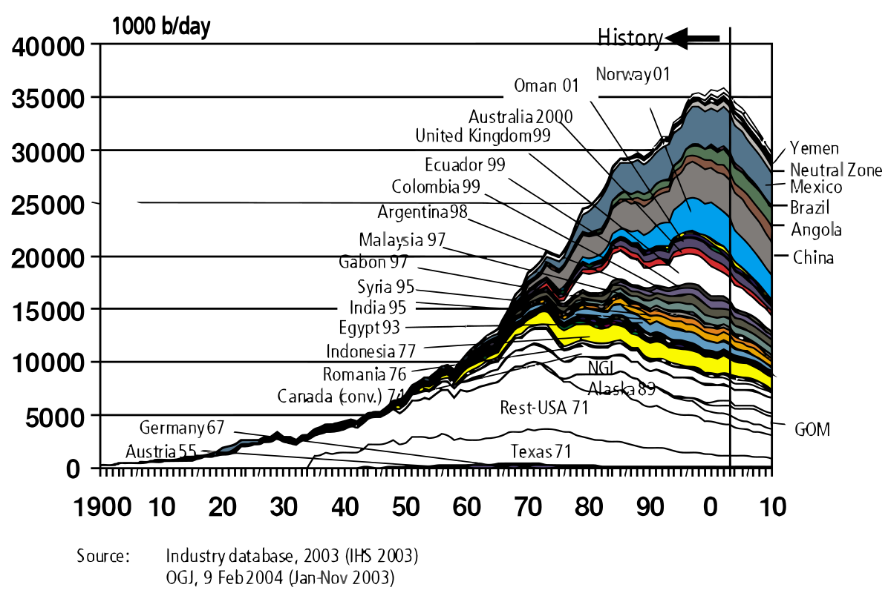

## Table of Contents

## What is the Hubbert Peak Theory?

The Hubbert Peak Theory is a way to predict when the most oil will be produced in a certain area. It was named after a man named M. King Hubbert, who came up with the idea in the 1950s. The theory says that oil production in a region will go up at first as more wells are drilled. But after a while, it will reach a highest point, called the "peak." After the peak, oil production will start to go down because there is less oil left to find and pump out.

This theory is important because it helps people guess when oil supplies might start to run low. If a country or a company knows when the peak will happen, they can plan better for the future. They might look for other kinds of energy or try to use less oil. The Hubbert Peak Theory has been used to predict oil production in places like the United States and the world as a whole. But it's not always exact because new technology and finding new oil can change things.

## Who developed the Hubbert Peak Theory and when?

The Hubbert Peak Theory was developed by a man named M. King Hubbert. He came up with this idea in the 1950s. M. King Hubbert was a geologist and a scientist who worked for an oil company. He wanted to find a way to predict when oil production would be at its highest point in a certain area.

Hubbert's idea was simple but important. He said that oil production in a region would increase at first as more wells were drilled. But after reaching a peak, the amount of oil produced would start to decrease because there would be less oil left to find and pump out. His theory helped people understand that oil supplies could run out and that it was important to plan for the future.

## What does the term 'peak oil' mean in relation to Hubbert's theory?

The term 'peak oil' comes from M. King Hubbert's theory about oil production. It means the point in time when the most oil is produced in a certain area or in the whole world. After reaching this peak, the amount of oil that can be produced starts to go down. This happens because there is less oil left to find and pump out of the ground.

Understanding peak oil is important because it helps people know when oil supplies might start to run low. If a country or a company knows when the peak will happen, they can plan better for the future. They might start looking for other kinds of energy, like solar or wind power, or they might try to use less oil. Even though new technology and finding new oil can change when the peak happens, the idea of peak oil is still a useful way to think about the future of oil.

## How does the Hubbert Curve illustrate oil production over time?

The Hubbert Curve is a way to show how oil production changes over time. It looks like a bell shape on a graph. At the start, when people first start finding and drilling for oil, the amount of oil they produce goes up. This happens because they keep finding new oil and making more wells. The production keeps going up until it reaches the highest point, which is called the peak.

After the peak, the amount of oil produced starts to go down. This happens because there is less oil left to find and pump out of the ground. The Hubbert Curve helps people see that oil production doesn't just keep going up forever. It goes up, reaches a peak, and then goes down. This curve helps people plan for the future by showing them when oil might start to run out.

## What are the basic assumptions behind the Hubbert Peak Theory?

The Hubbert Peak Theory is based on some simple ideas. One big idea is that there is only a certain amount of oil in the ground. This means that no matter how hard people look, they can't find more oil than what's already there. Another idea is that the rate at which people find new oil will slow down over time. At first, it's easy to find big oil fields, but as time goes on, the easy-to-find oil gets used up, and it becomes harder to find more.

Another assumption is that the technology used to find and pump oil won't change much. If new technology comes along that makes it easier to find or pump oil, it could change when the peak happens. But Hubbert's theory assumes that technology stays about the same. The last idea is that once oil production reaches its peak, it will start to go down because there's less oil left. This means that after the peak, it will be harder and harder to keep producing the same amount of oil.

## Can you explain the mathematical model used in the Hubbert Peak Theory?

The mathematical model used in the Hubbert Peak Theory is based on a simple idea: oil production over time can be shown with a bell-shaped curve. This curve is called the Hubbert Curve. To make this curve, Hubbert used a formula that looks a bit like the one used to show how things grow and then die off in nature. The formula he used is called the logistic function. It helps predict when oil production will reach its highest point, or peak, and then start to go down.

In simple terms, the logistic function says that oil production starts small, grows quickly as more wells are drilled and more oil is found, reaches a peak, and then starts to fall as the oil runs out. The formula for the logistic function is Q(t) = Q_max / (1 + exp(-k(t - t_peak))), where Q(t) is the oil production at time t, Q_max is the total amount of oil that can be produced, k is a number that shows how fast the production changes, and t_peak is the time when the peak happens. This model helps people guess when oil will start to run low, so they can plan for the future.

## How accurate has the Hubbert Peak Theory been in predicting oil production peaks?

The Hubbert Peak Theory has had some successes and some misses when it comes to predicting oil production peaks. M. King Hubbert himself made a famous prediction in 1956 that U.S. oil production would peak around 1970. He was pretty close, as the peak actually happened in 1970 or 1971, depending on how you look at the data. This made a lot of people take the theory seriously.

However, the theory hasn't been perfect. It has struggled to predict global oil production peaks accurately. Hubbert predicted that world oil production would peak around the year 2000, but that hasn't happened yet. One reason for this is that new technology and new oil discoveries can change things a lot. For example, fracking and other new ways to get oil out of the ground have made more oil available than Hubbert's model expected. So, while the Hubbert Peak Theory can be useful, it's not always exact because the world of oil is always changing.

## What are the criticisms and limitations of the Hubbert Peak Theory?

The Hubbert Peak Theory has been criticized because it doesn't always predict oil production peaks correctly. One big problem is that it assumes technology and oil discovery rates will stay the same. But new technology, like fracking, has changed how much oil we can get out of the ground. This means the peak can happen later than the theory predicts. Also, the theory doesn't take into account things like politics and economics, which can affect how much oil is produced. For example, if a country decides to produce less oil to keep prices high, that can change when the peak happens.

Another limitation is that the Hubbert Peak Theory is based on the idea that we know how much oil is in the ground. But we don't really know that for sure. New oil fields are still being found, and that can push the peak back. Critics also say the theory is too simple. It doesn't consider different types of oil or how hard it is to get oil out of the ground in different places. So, while the Hubbert Peak Theory can be useful for thinking about the future of oil, it's not perfect and needs to be used carefully.

## How does the theory apply to other non-renewable resources besides oil?

The Hubbert Peak Theory can be used to think about other non-renewable resources, like natural gas or coal, in the same way it's used for oil. The basic idea is that there's only so much of these resources in the ground. At first, we find and use them quickly, but after a while, it gets harder to find more. So, the amount we can get out of the ground goes up at first, reaches a peak, and then starts to go down. This can help us guess when we might run low on these resources and plan for the future.

However, just like with oil, the theory has some problems when we use it for other resources. It assumes that the way we find and use these resources won't change much. But new technology can make it easier to get more out of the ground, which can change when the peak happens. Also, the theory doesn't think about things like laws or money, which can affect how much of a resource we use. So, while the Hubbert Peak Theory can give us a good guess about when we might run out of non-renewable resources, it's not always exact and we need to be careful when we use it.

## What impact does the Hubbert Peak Theory have on energy policy and planning?

The Hubbert Peak Theory has a big effect on how countries and companies plan for the future of energy. It tells them that oil and other non-renewable resources will reach a peak and then start to run out. This means they need to think about what will happen when there's less oil to use. They might start looking for other kinds of energy, like solar or wind power, or try to use less oil. The theory helps them make plans so they won't be surprised when oil production starts to go down.

Even though the Hubbert Peak Theory isn't always exact, it's still useful for energy planning. It makes people think about the future and not just the present. Governments and companies can use the theory to make laws and rules that help save oil and find new ways to get energy. This can help them be ready for when oil gets harder to find and more expensive. So, even if the theory isn't perfect, it's a good tool for thinking about what to do when oil starts to run out.

## How have technological advancements affected the predictions made by the Hubbert Peak Theory?

Technological advancements have had a big impact on the predictions made by the Hubbert Peak Theory. The theory assumes that the way we find and pump oil won't change much. But new technology, like fracking, has made it possible to get more oil out of the ground than people thought before. This means the peak of oil production can happen later than the theory predicted. For example, fracking helped the U.S. produce a lot more oil, which pushed back the peak that Hubbert had predicted.

Even though new technology can change when the peak happens, it doesn't mean the Hubbert Peak Theory is useless. It still helps people think about the future of oil and other non-renewable resources. But it's important to remember that the theory is just a guess, and new technology can make that guess less accurate. So, while the Hubbert Peak Theory can be a good tool for planning, people need to keep an eye on new technology and be ready to change their plans if things turn out differently than expected.

## What are the future implications of the Hubbert Peak Theory for global energy markets?

The Hubbert Peak Theory tells us that one day, oil production will reach a peak and then start to go down. This means that in the future, there might be less oil to use, and it could become more expensive. Countries and companies need to think about what will happen when there's less oil. They might need to find other ways to get energy, like solar or wind power, or try to use less oil. This can change how the global energy market works because everyone will be looking for new ways to get energy.

Even though the Hubbert Peak Theory isn't always exact, it still helps people plan for the future. New technology, like fracking, can make it possible to get more oil out of the ground, which can push back the peak. But the theory still makes people think about what will happen when oil starts to run out. This can lead to new laws and rules that help save oil and find new energy sources. So, the Hubbert Peak Theory can help shape the future of the global energy market by making people ready for when oil gets harder to find and more expensive.

## What is Hubbert Peak Theory and how does it relate to Peak Oil?

Hubbert Peak Theory, formulated by geoscientist M. King Hubbert in 1956, is a model that predicts the production rates of finite resources, particularly oil. Hubbert posited that for any given geographical area, the rate of petroleum production over time would follow a bell-shaped curve. This production trajectory is defined by a rapid increase in output as discoveries are made and exploited, followed by a peak after which production declines as resources become depleted.

The model's bell-shaped curve is derived from the logistic growth model, reflecting the discovery, peak, and subsequent decrease in resource extraction. The curve's peak, known as 'peak oil', represents the point at which half of the total recoverable oil has been extracted. Mathematically, the production rate $P(t)$ can be expressed by the equation:

$$
P(t) = \frac{Pm}{1 + e^{-k(t-tm)}}
$$

where $Pm$ is the maximum production rate, $k$ is the logistic growth rate, and $tm$ is the time at which peak production occurs.

The theory was initially met with skepticism; however, Hubbert successfully predicted the peak of US oil production around 1970, lending credibility to his model. The implications of peak oil are profound, suggesting that once the apex of production is reached, the world will face an inevitable decline in oil availability. This scarcity could significantly impact the global economy by elevating oil prices and increasing the cost of goods and services dependent on oil as a fundamental input.

Peak oil carries broader economic implications; as oil becomes scarcer post-peak, countries heavily reliant on oil may experience economic instability. This potential scenario underscores the critical nature of exploring alternative energy sources and sustainable practices to mitigate the impact of dwindling oil supplies across global markets. The consideration of peak oil remains central to energy policy discussions, economic modeling, and strategic planning within the industry, highlighting the continuing relevance of Hubbert Peak Theory in informing both current and future energy strategies.

## References & Further Reading

[1]: Hubbert, M. K. (1956). ["Nuclear energy and the fossil fuels."](https://www.spec2000.net/freepubs/B1956-Peak-Oil-Hubbert.pdf) Shell Development Company.

[2]: Hamilton, J. D. (2009). ["Causes and Consequences of the Oil Shock of 2007–08."](https://www.brookings.edu/wp-content/uploads/2016/07/2009a_bpea_hamilton-1.pdf) Brookings Papers on Economic Activity, Spring 2009.

[3]: Deffeyes, K. S. (2008). ["Hubbert's Peak: The Impending World Oil Shortage"](https://www.jstor.org/stable/j.ctt7t9r1) Princeton University Press.

[4]: Lopez de Prado, M. (2018). ["Advances in Financial Machine Learning."](https://www.amazon.com/Advances-Financial-Machine-Learning-Marcos/dp/1119482089) Wiley.

[5]: Jansen, S. (2020). ["Machine Learning for Algorithmic Trading."](https://github.com/stefan-jansen/machine-learning-for-trading) Packt Publishing.

[6]: Aronson, D. R. (2007). ["Evidence-Based Technical Analysis: Applying the Scientific Method and Statistical Inference to Trading Signals."](https://www.amazon.com/Evidence-Based-Technical-Analysis-Scientific-Statistical/dp/0470008741) Wiley.

[7]: Laherrère, J., & Soroos, M. (2000). ["The End of Cheap Oil."](https://www.jstor.org/stable/26057708) Scientific American.

[8]: Campbell, C. J., & Laherrère, J. H. (1998). ["The End of Cheap Oil."](https://www.jstor.org/stable/26057708) Scientific American.