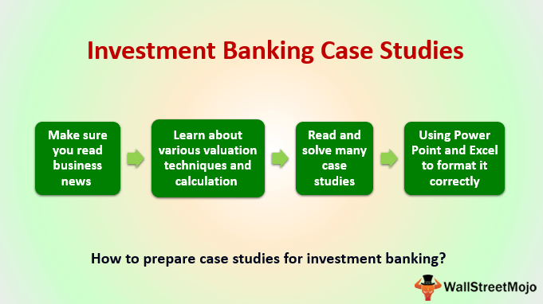

Understanding the psychology of investing is crucial for both novice and experienced investors. Psychological elements significantly influence decision-making processes, often leading to investment mistakes that can have substantial financial repercussions. Among these psychological factors, overconfidence, known as hubris, stands out as a prevalent issue. Hubris refers to an inflated sense of one's abilities and performance, often leading investors to overestimate their competence and make imprudent decisions. This overconfidence can cause investors to ignore potential risks and overcommit to certain investment strategies, culminating in suboptimal outcomes.

Furthermore, technological advancements, especially in the field of algorithmic trading, have brought about a new dimension to these psychological challenges. While algorithmic trading offers tools for optimized and efficient decision-making, it can also magnify existing psychological errors if not carefully managed. The reliance on algorithms can lead to an overestimation of their infallibility, increasing the risk of significant market movements driven by computer-generated trades. The interplay between human psychology and digital systems necessitates a thorough understanding of both to avoid pitfalls associated with modern trading environments.

This article will examine common investment mistakes and analyze the psychological concept of hubris, exploring its roots, manifestations, and impacts on investment behavior. Additionally, it will consider the implications of these factors in the context of algorithmic trading, offering insights into the benefits and potential hazards of incorporating advanced technologies in investment strategies.

## Table of Contents

## Common Investment Mistakes

Investors frequently commit several recurrent mistakes, which can lead to significant monetary losses and reduced opportunities for wealth accumulation. One prevalent error is the lack of diversification, whereby investors allocate their resources into a narrow range of assets or a single market sector. This failure to diversify increases exposure to specific market risks and can exacerbate losses if those particular assets underperform. For example, the financial maxim "do not put all your eggs in one basket" highlights the importance of spreading investments across various assets to mitigate risk.

Emotional decision-making represents another common investment error. Many investors base their trading decisions on emotional reactions rather than logical evaluation, often resulting from market volatility or peer influence. Such behavior can lead to impulsive buying or selling, which may result in untimely market exits or entries, thus potentially diminishing returns.

Several psychological traps further exacerbate investment mistakes. The anchoring trap, for instance, occurs when investors place too much emphasis on an initial figure or piece of information, influencing their subsequent decisions even if new, conflicting data emerges. This cognitive bias can result in investors clinging to outdated assumptions, impacting their ability to evaluate an asset's true value accurately.

The sunk cost fallacy is another psychological trap, wherein investors continue to commit resources to a failing venture based on previously invested capital rather than assessing its current viability. This frequently occurs when investors focus on recovering previous losses rather than making rational decisions based on future prospects. Consequently, they may invest further in poor-performing assets, increasing potential losses.

Confirmation bias also plays a role in flawed investment strategies. Investors often seek information that supports their preconceived notions or existing investments, disregarding contradictory evidence. By favoring confirmatory information, they may overlook emerging risks or alternative opportunities, leading to suboptimal decision making.

These mistakes not only result in direct financial losses but also lead to missed opportunities. By misallocating resources or ignoring valuable information, investors may fail to capitalize on lucrative opportunities in emerging markets or innovative industries. Understanding and mitigating these common investment pitfalls is crucial for enhancing long-term financial outcomes.

## Understanding Hubris in Investing

Hubris, a concept originating from ancient Greek culture, is defined as excessive pride or self-confidence in one's abilities, often leading to downfall. In investing, hubris manifests when an investor overestimates their predictive acumen or market understanding, resulting in poor financial decisions. This psychological pitfall can originate from past successes, leading individuals to believe they possess superior skill or insight, which in truth may have been luck.

Historically, the stock market has witnessed multiple instances where hubris has resulted in substantial investment failures. One notable example is the case of the Long-Term Capital Management (LTCM) [hedge fund](/wiki/hedge-fund-trading-strategies) in the late 1990s. Managed by a group of skilled economists and Nobel laureates, LTCM achieved early success leading to immense confidence in their complex mathematical models. However, this overconfidence failed to account for the market [volatility](/wiki/volatility-trading-strategies) and unexpected events culminating in losses exceeding $4 billion and requiring a Federal Reserve-led bailout to prevent wider market repercussions.

Another pertinent case is the downfall of Enron in the early 2000s. Enron's executives, riding high on the company's success, engaged in ambitious and often unethical accounting practices believing they could outsmart regulatory and market systems. Their hubristic belief in personal and company invulnerability led to catastrophic losses affecting shareholders and employees significantly.

These examples highlight the thin line between healthy confidence and destructive hubris. While a certain degree of confidence is essential for making investment decisions, as it encourages individuals to take calculated risks, unchecked hubris can cloud judgment. Healthy confidence is informed by diligent research, analysis, and a constant reassessment of strategies. In contrast, hubris dismisses critical evaluation and openness to differing views, fostering an environment for errors and significant financial missteps.

Investors can benefit from distinguishing between these two states by maintaining an attitude of humility and acknowledging the market's inherent unpredictability. Constant learning and adaptation, coupled with a well-rounded understanding of one's limitations, can mitigate the harmful effects of hubris and lead to more prudent investment decisions.

## The Financial Psychology Behind Hubris

Behavioral finance provides critical insights into how hubris influences decision-making in investing. Hubris, characterized by excessive pride or self-confidence, often skews judgment and impairs rational decision-making, leading investors to overestimate their abilities and underestimate risks.

Several cognitive biases contribute to overconfidence in investors:

1. **Overconfidence Bias**: Investors often believe they possess superior knowledge, skills, or information, leading them to take greater risks. This bias can cause the underestimation of downside risks and the overestimation of potential returns.

2. **Illusion of Control**: This bias involves the belief that one can control or predict future outcomes in inherently uncertain markets. Such perceived control can lead investors to engage in risky behavior, assuming they can manage or mitigate financial market dynamics.

3. **Self-Attribution Bias**: Investors tend to attribute their successes to personal skill and their failures to external factors. This bias reinforces overconfidence by skewing the perception of one's investment competence.

Comparing hubris to risk-taking highlights its inherent dangers. While risk-taking is a necessary component of investing, hubris introduces irrational risk-taking behaviors. For example, confident risk-takers often employ calculated methods to assess potential gains and losses, whereas hubristic investors may disregard warning signs and fail to establish adequate contingency plans. 

The dangers of hubris in investing are substantial. Excessive self-confidence can lead to the neglect of diversification, resulting in disproportionate exposure to risks associated with specific assets. Moreover, hubris may cause persistence in flawed strategies, even when empirical data suggests a change in [course](/wiki/best-algorithmic-trading-courses) is warranted. The interaction between hubris and cognitive biases ultimately elevates the potential for significant financial misjudgments and losses.

Understanding these psychological elements is crucial for investors seeking to mitigate overconfidence and make more informed, rational decisions. Recognizing one's limitations and actively challenging cognitive biases allows for a more balanced approach to risk management, reducing the detrimental effects of hubris on investment outcomes.

## Algorithmic Trading: A Double-Edged Sword

Algorithmic trading has revolutionized the financial markets, utilizing computer algorithms to automate trading decisions and execute orders. This approach has gained prominence due to its ability to process vast amounts of data at speeds beyond human capacity, leading to increased market efficiency. However, it also presents unique challenges, acting as a double-edged sword in the world of investing. 

Artificial intelligence (AI) and [machine learning](/wiki/machine-learning) (ML) technologies are central to [algorithmic trading](/wiki/algorithmic-trading), capable of analyzing historical data, identifying patterns, and making real-time decisions. These technologies have the potential to mitigate psychological investment mistakes by reducing human biases, such as emotional decision-making and confirmation bias. For instance, through [backtesting](/wiki/backtesting) and optimization, AI models can provide objective insights based on empirical data, thereby enhancing decision-making processes and portfolio diversification.

However, AI and ML can also amplify psychological errors. Algorithms are only as effective as the data and assumptions they are built upon. If embedded with flawed assumptions or biased data, algorithms can perpetuate systemic errors. A notable example is the 2010 Flash Crash, where high-frequency trading algorithms triggered a massive sell-off, causing the Dow Jones Industrial Average to plummet nearly 1,000 points within minutes. The crash was exacerbated by algorithms responding to market anomalies, illustrating how automated systems can contribute to significant market volatility.

Case studies highlight the profound impact algorithmic trading can have on financial markets. In 2012, Knight Capital Group experienced a $440 million loss due to a faulty trading algorithm that executed thousands of unintentional trades, dramatically affecting several stocks' prices. This incident underscores the significant financial risks of algorithm design errors and inadequate risk controls. 

Overall, while algorithmic trading can enhance investment strategies by mitigating human biases, it requires rigorous systems checks, comprehensive data analysis, and robust risk management protocols to prevent it from exacerbating psychological pitfalls. This dual nature necessitates that traders employ these technologies judiciously, integrating human oversight to balance algorithmic precision with strategic foresight.

## Mitigating Hubris and Investment Mistakes

Overcoming hubris and minimizing investment mistakes require deliberate strategies aimed at fostering self-awareness and maintaining humility. It is essential for investors to regularly engage in introspection, analyzing their past decisions to recognize patterns of overconfidence. Acknowledging the limits of one's knowledge and adopting a mindset of continuous improvement can significantly reduce the risk of making investments based on inflated self-belief.

Seeking diverse opinions and engaging in continuous learning play crucial roles in mitigating investment errors. Diverse perspectives can challenge personal biases and broaden understanding, thereby reducing the likelihood of decisions based on incomplete information. Investors should actively seek feedback from peers, financial advisors, or professional forums, fostering a collaborative environment where different viewpoints can lead to more balanced decision-making. Continuous education, whether through financial literature, workshops, or courses, equips investors with the knowledge required to adapt to evolving markets and technologies.

Disciplined decision-making and effective risk management are also vital in curtailing hubris-driven mistakes. Implementing a structured investment plan with predefined criteria for entering and exiting positions can help maintain objectivity and prevent impulsive actions. Risk management techniques such as portfolio diversification, stop-loss orders, and position sizing are critical in safeguarding against large financial losses. Utilizing quantitative methods to assess investment opportunities can add an additional layer of rigor and reduce reliance on intuition or gut feeling.

Incorporating technology wisely, such as using algorithmic tools for analysis and execution, can assist in maintaining discipline. However, investors should remain vigilant about the psychological pitfalls that technological aids cannot address. Regular assessment and recalibration of strategies ensure alignment with long-term financial goals, nudging investors away from decision-making dominated by hubristic tendencies.

## Conclusion

The interplay between psychological factors, such as cognitive biases and hubris, significantly influences investment outcomes. Investors often fall into psychological traps, leading to errors in judgment and decision-making that can result in substantial financial losses or missed opportunities. Particularly, hubris, characterized by excessive self-confidence, can blind investors to risks and cause stubborn adherence to failing strategies. This detrimental pride contrasts sharply with healthy confidence, which supports prudent decision-making and adaptability in the face of changing market conditions.

In the context of modern investing, the integration of technology presents both challenges and opportunities. Algorithmic trading, powered by AI and machine learning, has revolutionized market dynamics by offering enhanced speed and efficiency. However, this same technology can also exacerbate psychological misjudgments if not correctly programmed or monitored. Computers may lack the nuanced understanding of market sentiments and complexities, reinforcing human biases instead of correcting them.

Investors are encouraged to develop an acute awareness of their psychological tendencies. By recognizing biases such as overconfidence and anchoring, individuals can adopt strategies to mitigate their impact. Embracing humility and remaining open to diverse viewpoints can further enhance strategic decision-making. Implementing disciplined approaches to risk management and decision-making, combined with continuous learning, are essential practices for improving investment efficacy.

Technology should be leveraged thoughtfully to amplify the strengths of the investor while mitigating weaknesses. By employing algorithmic tools wisely, investors can harness data-driven insights while maintaining control over emotional and psychological influences. Ultimately, the key to investment success lies in a balanced approach that combines self-awareness, disciplined strategies, and the judicious use of technological advancements.

## References & Further Reading

[1]: Bergstra, J., Bardenet, R., Bengio, Y., & Kégl, B. (2011). ["Algorithms for Hyper-Parameter Optimization."](https://dl.acm.org/doi/10.5555/2986459.2986743) Advances in Neural Information Processing Systems 24.

[2]: ["Advances in Financial Machine Learning"](https://www.amazon.com/Advances-Financial-Machine-Learning-Marcos/dp/1119482089) by Marcos Lopez de Prado

[3]: ["Evidence-Based Technical Analysis: Applying the Scientific Method and Statistical Inference to Trading Signals"](https://www.amazon.com/Evidence-Based-Technical-Analysis-Scientific-Statistical/dp/0470008741) by David Aronson

[4]: ["Machine Learning for Algorithmic Trading"](https://github.com/stefan-jansen/machine-learning-for-trading) by Stefan Jansen

[5]: ["Quantitative Trading: How to Build Your Own Algorithmic Trading Business"](https://github.com/LucindaYa/quant-resources/blob/master/Quantitative%20Trading%20How%20to%20Build%20Your%20Own%20Algorithmic%20Trading%20Business.pdf) by Ernest P. Chan