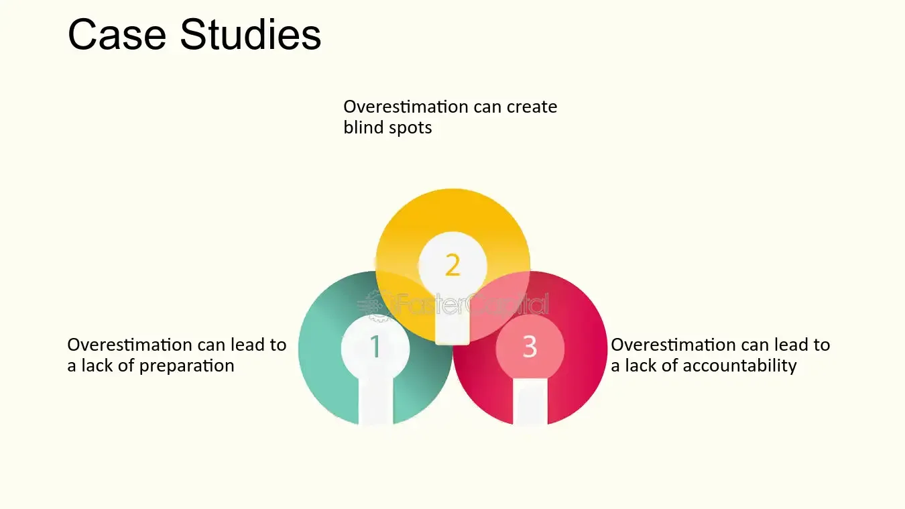

## Table of Contents

## What is hubris in the context of investing?

Hubris in investing refers to when an investor becomes overly confident and thinks they know more than they actually do. This can lead them to make risky decisions, thinking they can't lose. It's like when someone believes they are unbeatable and starts taking big risks without thinking about the possible downsides.

This overconfidence can cause investors to ignore important information or advice, leading to bad investment choices. For example, they might put all their money into one stock, thinking it will always go up. But if the stock falls, they could lose a lot. Being aware of hubris can help investors stay humble and make smarter, more balanced decisions.

## Can you provide a simple example of hubris leading to poor investment decisions?

Imagine a young investor named Sam who recently made a good profit from a tech stock. He starts to think he's really smart about investing and can't lose. Sam hears about a new, untested tech company and decides to put all his money into it, thinking it will be the next big thing. He doesn't do much research because he's so sure of his gut feeling.

But the new company turns out to be a flop. Its product doesn't work well, and the stock price crashes. Sam loses all his money because he was too confident and didn't consider the risks. If he had been more cautious and spread his investments around, he might not have lost everything.

## How does overconfidence contribute to hubris in investing?

Overconfidence can make investors think they know more than they really do. When someone feels too sure of themselves, they might start believing they can predict the market perfectly. This is where hubris comes in. They might think they're smarter than everyone else and stop listening to advice or doing proper research. Instead of seeing the risks, they only see the big wins they're sure they'll get.

This overconfidence can lead to really bad choices. For example, an investor might put all their money into one stock because they're sure it will go up. But the stock market can be unpredictable, and if that stock goes down, they could lose everything. Being overconfident makes them ignore the warnings and the need to spread out their investments. That's how hubris, fueled by overconfidence, can lead to big losses in investing.

## What are some common psychological biases that lead to hubris among investors?

One common psychological bias that leads to hubris among investors is the overconfidence bias. This happens when investors think they know more than they actually do. They might believe they can predict the stock market better than anyone else. This can make them take big risks without thinking about what could go wrong. For example, they might put all their money into one stock because they're so sure it will go up, but if it doesn't, they lose a lot.

Another bias is the confirmation bias. This is when investors only pay attention to information that supports what they already believe. If they think a certain stock will do well, they'll only look at news or data that says it will. They ignore any signs that it might not be a good investment. This can make them even more overconfident and lead to hubris because they're not seeing the full picture.

The illusion of control is another bias that can lead to hubris. Investors with this bias think they can control things that they really can't, like the stock market. They might think their decisions are the reason a stock goes up, not realizing it's just luck or other factors. This false sense of control can make them take bigger risks, thinking they can always make the right move. But the market is unpredictable, and this overconfidence can lead to big losses.

## Can you discuss a historical case study where hubris significantly impacted an investment outcome?

One famous example of hubris in investing is the story of Long-Term Capital Management (LTCM). LTCM was a [hedge fund](/wiki/hedge-fund-trading-strategies) started in the 1990s by some really smart people, including a few Nobel Prize winners. They thought they had figured out a way to make money no matter what happened in the market. They used a lot of borrowed money to make big bets, thinking their models were perfect and they couldn't lose. But in 1998, things didn't go as planned. Russia defaulted on its debt, and the markets went crazy. LTCM's bets went wrong, and they lost a lot of money very quickly. Their hubris made them think they were smarter than the market, but they ended up needing a big bailout to stop their failure from hurting the whole financial system.

Another example is the dot-com bubble of the late 1990s and early 2000s. During this time, a lot of investors got caught up in the excitement about internet companies. They thought any company with ".com" in its name was going to make them rich. People were so sure that the internet was the future that they stopped looking at whether these companies were actually making money. They poured money into stocks without doing proper research, driven by the belief that they couldn't lose. When the bubble burst in 2000, many investors lost a lot of money because the companies they invested in weren't as valuable as they thought. Their hubris blinded them to the risks, and they paid a big price when reality set in.

## How can investors recognize signs of hubris in their decision-making process?

Investors can recognize signs of hubris by paying attention to how they feel about their decisions. If they start feeling overly sure about their investments and think they can't lose, that's a big warning sign. They might ignore advice from others or not do enough research because they believe they already know everything. This overconfidence can make them take big risks, like putting all their money into one stock, without thinking about what could go wrong.

Another way to spot hubris is to notice if they only look at information that supports what they already believe. If an investor only pays attention to news or data that makes them feel good about their choices, they might be falling into the trap of confirmation bias. They need to step back and ask themselves if they're really looking at the whole picture or just what they want to see. Recognizing these signs early can help investors stay humble and make better, more balanced decisions.

## What strategies can investors use to mitigate the effects of hubris?

One way investors can fight hubris is by always doing their homework. Instead of just going with their gut feeling, they should look at all the facts and numbers. This means reading up on the companies they want to invest in, checking out what experts say, and thinking about what could go wrong. By taking the time to really understand their investments, they can make smarter choices and not just rely on overconfidence.

Another strategy is to talk to other people about their investment ideas. Getting advice from friends, family, or financial advisors can help investors see things they might have missed. It's easy to get caught up in your own thoughts and ignore the risks, but other people can point out problems and help keep you grounded. Listening to different opinions can stop investors from making big mistakes because they thought they knew everything.

Lastly, investors should spread out their money instead of putting it all in one place. This is called diversification. If they invest in different kinds of stocks, bonds, or other things, they won't lose everything if one investment goes bad. It's like not putting all your eggs in one basket. By diversifying, investors can protect themselves from the dangers of being too sure about one big bet.

## How do expert investors typically guard against hubris?

Expert investors often use a few key strategies to keep hubris in check. One big thing they do is always do their homework. They don't just go with their gut feeling; they look at all the facts and numbers. They read up on the companies they want to invest in, check what experts are saying, and think about what could go wrong. By taking the time to really understand their investments, they make smarter choices and don't just rely on overconfidence.

Another thing expert investors do is talk to other people about their investment ideas. They get advice from friends, family, or financial advisors to see things they might have missed. It's easy to get caught up in your own thoughts and ignore the risks, but other people can point out problems and help keep you grounded. Listening to different opinions can stop investors from making big mistakes because they thought they knew everything.

Lastly, expert investors spread out their money instead of putting it all in one place. This is called diversification. If they invest in different kinds of stocks, bonds, or other things, they won't lose everything if one investment goes bad. It's like not putting all your eggs in one basket. By diversifying, investors can protect themselves from the dangers of being too sure about one big bet.

## What role does corporate governance play in preventing hubris-driven decisions in large firms?

Corporate governance is super important in stopping hubris-driven decisions in big companies. It's all about the rules and systems that make sure the people running the company do the right thing. Good corporate governance means having a board of directors that keeps an eye on the big bosses and makes sure they're not getting too full of themselves. This board can step in if they see the leaders making risky choices just because they think they can't lose. By having checks and balances, corporate governance helps keep everyone humble and focused on making smart, safe decisions for the company.

Another way corporate governance helps is by making sure there's clear communication and transparency. If everyone in the company knows what's going on and why decisions are being made, it's harder for hubris to take over. Leaders can't just do whatever they want without explaining it to others. This openness means that if a leader starts acting too confident and making risky moves, other people in the company can speak up and stop it before it causes problems. Good corporate governance makes sure the company stays on track and doesn't get thrown off by one person's overconfidence.

## Can you analyze a recent case where hubris affected a major investment firm or individual investor?

A recent example where hubris affected a major investment firm is the case of Archegos Capital Management in 2021. Archegos was run by Bill Hwang, who used a lot of borrowed money to bet big on a few stocks. He thought he knew exactly what would happen in the market and kept making bigger and bigger bets. But when the stocks he bet on started to fall, Archegos couldn't pay back all the money it had borrowed. This led to a huge loss, and the firm collapsed. Hwang's overconfidence made him ignore the risks and think he could control the market, but in the end, his hubris caused a big mess.

Another example is the story of Elizabeth Holmes and her company, Theranos. Holmes started Theranos with the idea of revolutionizing blood testing, but she got carried away with her own hype. She told everyone her technology could do amazing things, even though it didn't really work. Investors poured in money because they believed in her vision, but it was all based on her overconfidence. When the truth came out that the technology was a failure, Theranos fell apart, and Holmes faced legal trouble. Her hubris made her think she could change the world without actually having the goods to back it up, and it led to a huge letdown for everyone involved.

## How does the concept of hubris relate to market bubbles and crashes?

Hubris can really help start and grow market bubbles. When investors get too sure of themselves, they might think they can't lose money. They start buying more and more of something, like stocks or houses, because they believe the prices will keep going up forever. This overconfidence makes more people want to jump in and buy, too. They all think they're smart and can time the market just right. But when everyone is buying and prices are way too high, it creates a bubble. Sooner or later, the bubble pops because the prices can't keep going up without a good reason.

When the bubble bursts, it often leads to a market crash. The same hubris that made investors think they were unbeatable now makes them panic. They see prices falling and think they need to sell everything fast before it gets worse. But when everyone tries to sell at the same time, it makes the prices drop even faster. This is how hubris can turn a bubble into a big crash. Investors who were too confident on the way up are now too scared on the way down, and the whole market feels the pain.

## What advanced tools or methodologies can be employed to quantitatively assess the impact of hubris on investment performance?

To measure how hubris affects investment performance, experts can use something called behavioral finance models. These models look at how people's feelings and mistakes, like being too sure of themselves, can mess up their investment choices. One tool they might use is called a "behavioral alpha" model. This model tries to figure out how much better or worse someone does at investing because of their behavior, not just the ups and downs of the market. By comparing what an investor actually does to what they would do if they were always making the best, most logical choices, this model can show how much hubris is costing them in terms of money.

Another way to check the impact of hubris is by using risk-adjusted performance measures like the Sharpe Ratio or the Sortino Ratio. These tools help see if an investor is taking too many risks because they think they can't lose. If someone's investments are doing well but they're taking huge risks, it might mean they're being overconfident. By looking at how much risk an investor is taking compared to how much they're [earning](/wiki/earning-announcement), these measures can show if hubris is making them take chances they shouldn't. This way, investors can see if their overconfidence is leading them to make bad choices that could hurt their performance in the long run.

## References & Further Reading

[1]: Bergstra, J., Bardenet, R., Bengio, Y., & Kégl, B. (2011). ["Algorithms for Hyper-Parameter Optimization."](https://dl.acm.org/doi/10.5555/2986459.2986743) Advances in Neural Information Processing Systems 24.

[2]: ["Advances in Financial Machine Learning"](https://www.amazon.com/Advances-Financial-Machine-Learning-Marcos/dp/1119482089) by Marcos Lopez de Prado

[3]: ["Evidence-Based Technical Analysis: Applying the Scientific Method and Statistical Inference to Trading Signals"](https://www.amazon.com/Evidence-Based-Technical-Analysis-Scientific-Statistical/dp/0470008741) by David Aronson

[4]: ["Machine Learning for Algorithmic Trading"](https://github.com/stefan-jansen/machine-learning-for-trading) by Stefan Jansen

[5]: ["Quantitative Trading: How to Build Your Own Algorithmic Trading Business"](https://github.com/LucindaYa/quant-resources/blob/master/Quantitative%20Trading%20How%20to%20Build%20Your%20Own%20Algorithmic%20Trading%20Business.pdf) by Ernest P. Chan