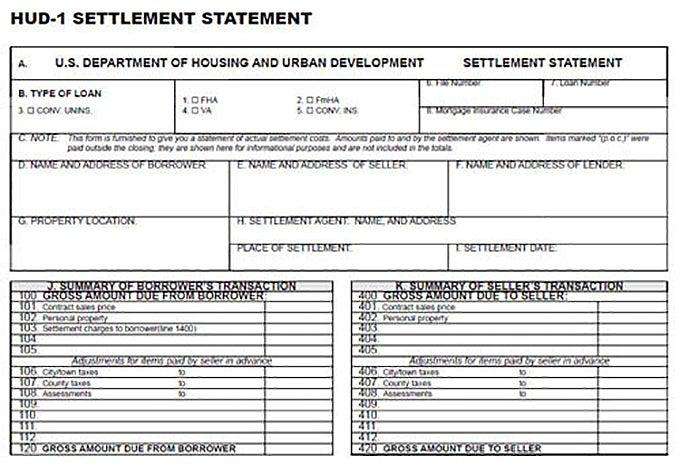

The real estate closing process is often intricate, requiring numerous legal and financial documents to ensure a transparent and seamless transaction. Among these, the Settlement Statement, widely known as the HUD-1 Form, plays a pivotal role. This document itemizes all the fees and credits involved in a real estate transaction, offering a comprehensive overview that both buyers and sellers can rely on for transparency. The HUD-1 Form's significance lies not only in its detailed financial breakdown but also in its historical use in transactions such as reverse mortgages and refinancing.

In recent years, the regulatory landscape has undergone changes, with the Closing Disclosure form being introduced as a modern replacement for the HUD-1 in most transactions. This shift aims to enhance consumer protection under laws such as the Dodd-Frank Act. Despite its replacement, the HUD-1 remains relevant in specific contexts, underscoring its lasting importance.



Furthermore, algorithmic trading has emerged as a transformative tool in real estate. By leveraging advanced algorithms, stakeholders can analyze documents like the HUD-1 and Closing Disclosure forms, optimizing investment decisions and strategies. These technological advancements offer a competitive edge by assessing market trends and transactional data, thus predicting potential investment opportunities in real estate. As we explore the HUD-1 Form, its purpose, and the evolving landscape of real estate transactions, the integration of technology highlights the intersection of traditional documentation and modern innovation.

## Table of Contents

## What is a HUD-1 Form?

The HUD-1 Form, also known as the HUD-1 Settlement Statement, is a comprehensive document used to itemize all fees, charges, and credits involved in a real estate transaction. It provides a detailed breakdown of the financial aspects of the deal, allowing for transparency and clarity in real estate transactions.

Traditionally, the HUD-1 Form was utilized in various real estate dealings, including reverse mortgage and refinance transactions. It meticulously lists each component of the transaction, such as origination fees, appraisal charges, title insurance, and other costs associated with securing a mortgage. The form ensures that all parties—buyers, sellers, and lenders—are fully informed about the allocation of funds and costs incurred during the real estate exchange.

In 2015, the HUD-1 Form was largely replaced by the Closing Disclosure form for most types of real estate transactions due to regulatory changes introduced by the Dodd-Frank Wall Street Reform and Consumer Protection Act. The new form was designed to streamline the closing process and enhance consumer protections. However, the HUD-1 Form still retains its significance in specific situations, particularly in transactions involving reverse mortgages and certain types of refinancing. In these cases, the HUD-1 remains a legal requirement, providing detailed financial information that facilitates a clearer understanding of the deal for all parties involved.

## Understanding the HUD-1 Form

The HUD-1 Form is an integral component of real estate transactions, specifically in its division across two primary sections: the itemized costs and the summary of financial transactions. The reverse side of the form meticulously lists all itemized costs, which encompass categories ranging from loan origination fees, appraisal costs, to title insurance charges. This detailed listing ensures that every financial aspect is transparent and accounted for, reflecting all expenditures and credits for both the buyer and seller.

The front of the form provides a summary of the transaction, offering a succinct view of the financial activities involved. This part of the HUD-1 Form consolidates the itemized costs, presenting a clearer picture of the transaction balance, which includes the gross amount due to the seller and the total amount paid by the buyer. It also displays adjustments for items paid in advance or arrears, providing a comprehensive settlement overview necessary for both parties to understand their financial commitments.

According to federal law, specifically the Real Estate Settlement Procedures Act (RESPA), the HUD-1 is mandated for certain types of real estate settlements. This legal requirement underlines the commitment to transparency in financial dealings, ensuring that all payments and credits are clearly recorded and communicated, thus protecting the interests of both consumers and lenders. 

For buyers, it is crucial to meticulously review the HUD-1 Form before the finalization of the transaction. This careful review process helps in identifying unforeseen charges and clarifying any discrepancies with the transaction details. Ensuring precision in these financial records mitigates risks of future disputes and guarantees a smoother transition through the closing stages of the real estate transaction.

## Components of a HUD-1 Form

The HUD-1 Form is a comprehensive document that details various financial components involved in a real estate transaction. Its primary role is to itemize all the monetary debits and credits applicable to both the buyer and the seller, delivering a transparent financial overview essential for closing a deal.

The key elements of a HUD-1 Form are categorized into multiple sections, each specifying distinct costs related to the mortgage. Noteworthy sections include origination fees, appraisal fees, and title insurance. 

**1. Origination Fees:** These are charges levied by the lender for processing the mortgage application. They are generally expressed as a percentage of the loan amount. For instance, a 1% origination fee on a $200,000 loan would be $2,000. 

**2. Appraisal Fees:** This cost entails the professional assessment of the property's market value by an appraiser, which is crucial for both investors and lenders to ascertain the loan's adequacy relative to the property's worth.

**3. Title Insurance:** This segment covers the expenses required to secure insurance policies that protect against losses arising from disputes over property boundaries or ownership. 

Every financial detail on the HUD-1 is systematically classified for both the buyer and the seller, ensuring clarity and cohesion. The form consists of two sections: 

- **Section J** (Settlement Charges) lists charges paid from the borrower’s funds at settlement by column.
- **Section K** and **Section L** presents a summary of the borrower's and seller's transactions, respectively.

Moreover, in providing a clear aggregation of all transactions, the HUD-1 employs a straightforward methodology, ensuring comprehension of financial obligations and entitlements for both parties involved. This transparency is not only crucial for the effective execution of a real estate transaction but also for preventing any unforeseen financial discrepancies that might arise post-closing. 

Understanding and scrutinizing the HUD-1 Form is vital for all parties, serving as a safeguard against potential errors in financial settlements.

## Special Considerations

The Dodd-Frank Act of 2010 marked a significant shift in mortgage industry practices, notably introducing the Closing Disclosure form to enhance consumer protection by simplifying the information provided during transactions. This form was designed to replace the HUD-1 Settlement Statement for most residential mortgage transactions, ensuring borrowers have a clearer understanding of their financial obligations before closing. Despite this shift, the HUD-1 remains in use for specific loan types, particularly reverse mortgages and certain refinances. These scenarios require HUD-1 due to their unique financial structures and regulatory requirements.

The distinction between the HUD-1 and Closing Disclosure forms is vital. The HUD-1 offers a detailed cost breakdown on a line-by-line basis, while the Closing Disclosure condenses this information into a more streamlined format, focusing on clarity and comprehension. Real estate professionals and buyers must recognize when each form is applicable to ensure compliance with federal regulations and protect consumer interests.

For example, in a reverse mortgage scenario, the HUD-1 is beneficial due to its comprehensive itemization, which outlines every transaction detail, providing transparency crucial for these complex financial arrangements. Understanding these nuances helps avoid potential legal pitfalls and ensures a smooth transaction process. Real estate professionals, therefore, need to be well-versed in both documents to adequately guide their clients through the closing process.

## The Role of Algorithmic Trading in Real Estate

Algorithmic trading has become an integral component of the real estate sector, leveraging its capability to enhance transaction efficiency and provide actionable insights. The advent of sophisticated algorithms allows for the systematic evaluation of real estate financial statements, such as HUD-1 or Closing Disclosure forms, facilitating optimized investment strategies.

Advanced algorithms excel in processing large datasets, which is crucial for identifying patterns and correlations in market trends. By automating the analysis of transactional data, these algorithms enable investors to make data-driven decisions, reducing the reliance on intuition and speculation. For instance, [machine learning](/wiki/machine-learning) models can be employed to forecast property prices and assess investment risks, which are essential factors in real estate investing.

Consider the use of a linear regression model to predict real estate prices based on historical data:

```python
import pandas as pd
from sklearn.model_selection import train_test_split
from sklearn.linear_model import LinearRegression

# Load dataset
data = pd.read_csv('real_estate_data.csv')

# Define features and target variable
X = data[['interest_rate', 'property_size', 'location_score']]
y = data['property_price']

# Split the dataset
X_train, X_test, y_train, y_test = train_test_split(X, y, test_size=0.2, random_state=42)

# Create and train the model
model = LinearRegression()
model.fit(X_train, y_train)

# Predict and evaluate
predictions = model.predict(X_test)
accuracy = model.score(X_test, y_test)
print(f'Model Accuracy: {accuracy*100:.2f}%')
```

This Python script demonstrates how algorithmic analysis can project future market behavior based on existing data, offering a competitive edge to investors by highlighting lucrative opportunities.

Furthermore, algorithms can detect anomalies in financial documents, such as the discrepancies in fees listed on a HUD-1 form. This capability ensures that the integrity of transactions is maintained, safeguarding the interests of both buyers and sellers. Cost outliers, for example, might be flagged using anomaly detection algorithms, prompting further manual review.

In summary, algorithms bring precision and speed to the often complex and data-heavy environment of real estate transactions. They are invaluable for investors seeking to capitalize on market efficiencies and secure profitable ventures, positioning [algorithmic trading](/wiki/algorithmic-trading) as a transformative force in the real estate industry.

## Conclusion

The HUD-1 Form, although largely superseded by the Closing Disclosure form, continues to play a crucial role in specific real estate transactions, such as reverse mortgages. Its comprehensive listing of financial details provides an indispensable tool for buyers and sellers striving for clarity and transparency during the closing process. This level of detail ensures that all parties involved in a transaction can accurately account for and understand every cost and credit, reducing the risk of miscommunication or unexpected expenses.

In today’s rapidly evolving financial landscape, the use of advanced tools like algorithmic trading is becoming increasingly important in strategic planning for real estate investments. Algorithmic trading employs complex mathematical models and automated processes to analyze financial data, allowing investors and real estate professionals to make informed decisions swiftly. By integrating these tools with traditional financial documents like the HUD-1, stakeholders can optimize their approaches to market trends, enhancing their ability to predict and capitalize on lucrative real estate opportunities.

In summary, while new forms have taken precedence in most transactions, the HUD-1 Form retains its significance. Combined with modern analytical technologies, it supports a more strategic and effective handling of real estate investments, ensuring transactions are both transparent and aligned with the latest market insights.

## Frequently Asked Questions (FAQs)

### What are the differences between the HUD-1 and Closing Disclosure forms?

The HUD-1 Form and the Closing Disclosure form serve similar purposes but are applicable in different contexts and with key differences in structure and content. The HUD-1, traditionally used for real estate transactions, provides a comprehensive list of all fees and credits involved, making it crucial for transactions like reverse mortgages. The Closing Disclosure, introduced by the Dodd-Frank Act, replaced the HUD-1 in most consumer mortgage transactions starting in 2015. The Closing Disclosure offers a consumer-friendly layout, presenting the same information but in simpler language and format. This ensures easier understanding and comparison of loan terms, costs, and other essential financial data. Unlike the HUD-1, which can be delivered to the borrower at closing, the Closing Disclosure must be provided at least three business days before closing, giving borrowers more time to review their financial obligations.

### How has algorithmic trading changed the landscape of real estate investing?

Algorithmic trading has significantly transformed real estate investing by introducing automated, data-driven decision-making processes. Advanced algorithms analyze vast sets of market data, including financial statements like the HUD-1 and Closing Disclosure forms, to optimize investment strategies. This technology allows investors to quickly assess property values, predict market trends, and track transaction patterns, thus facilitating timely and informed investment decisions. Algorithms can be customized to [factor](/wiki/factor-investing) in variables such as location, price fluctuations, and economic indicators, providing a competitive edge in property acquisition and portfolio management. Here's an example of a simple Python code snippet to illustrate how one might set up a basic algorithm to analyze real estate pricing trends:

```python
import numpy as np
import pandas as pd
from sklearn.linear_model import LinearRegression

# Sample data (replace with real data)
data = {'Area': [1000, 1500, 2000, 2500, 3000], 
        'Price': [300000, 350000, 400000, 450000, 500000]}
df = pd.DataFrame(data)

# Linear Regression Model
X = df[['Area']]
y = df['Price']
model = LinearRegression().fit(X, y)

# Prediction based on the model
area_to_predict = np.array([[1800]])
predicted_price = model.predict(area_to_predict)

print(f"Predicted price for area {area_to_predict[0][0]} sq. ft.: ${predicted_price[0]:,.2f}")
```

### Is it necessary for buyers to understand every detail on the HUD-1 form?

It is highly recommended for buyers to thoroughly understand the HUD-1 Form, as it contains crucial details about the financial aspects of their real estate transaction. This understanding helps prevent surprises regarding costs at closing, aids in resolving discrepancies, and ensures the accuracy of charges related to the transaction. Buyers should scrutinize sections detailing origination fees, appraisal costs, title insurance, and any other relevant charges, comparing them against initial estimates provided by the lender. Though it may seem complex, gaining a solid understanding of the HUD-1 can safeguard buyers from fiscal misunderstandings and contribute to a smoother transaction process. Assistance from real estate professionals, such as [agents](/wiki/agents) or attorneys, may be beneficial for clarifying any ambiguous terms or figures.

## References & Further Reading

[1]: Consumer Financial Protection Bureau. ["What is a HUD-1 Settlement Statement?"](https://www.consumerfinance.gov/ask-cfpb/what-is-a-hud-1-settlement-statement-en-178/)

[2]: The White House. ["Dodd-Frank Wall Street Reform and Consumer Protection Act."](https://obamawhitehouse.archives.gov/economy/middle-class/dodd-frank-wall-street-reform)

[3]: U.S. Department of Housing and Urban Development. ["HUD-1 Settlement Statement Instructions."](https://www.hud.gov/program_offices/administration/hudclips/forms/hud1)

[4]: Investopedia. ["Algorithmic Trading: Strategies and Considerations."](https://www.investopedia.com/articles/active-trading/101014/basics-algorithmic-trading-concepts-and-examples.asp)

[5]: Fabozzi, F., Focardi, S., & Kolm, P. (2006). ["Financial Modeling of the Equity Market: From CAPM to Cointegration"](https://onlinelibrary.wiley.com/doi/book/10.1002/9781119201236)