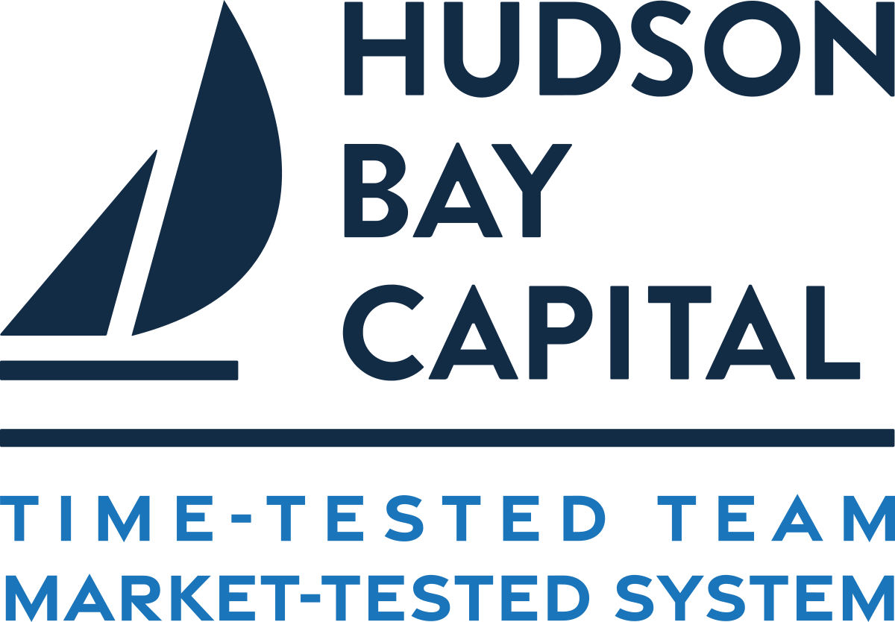

## Table of Contents

## What is Hudson Bay Capital?

Hudson Bay Capital is a big investment company. It started in 2006 and has its main office in New York City. The company helps people and other businesses invest their money in different ways. They work with stocks, bonds, and other types of investments to try to make money for their clients.

The people who run Hudson Bay Capital are very smart about money and investing. They use their knowledge to find good investments that can grow over time. They also try to help their clients reach their financial goals by giving them good advice and managing their money carefully.

## When was Hudson Bay Capital founded?

Hudson Bay Capital was founded in 2006. It is an investment company that helps people and businesses manage their money. They have their main office in New York City.

The company works with different types of investments like stocks and bonds. They try to find good ways to invest money so it can grow over time. The people who run Hudson Bay Capital are smart about money and give good advice to their clients to help them reach their financial goals.

## Who are the founders of Hudson Bay Capital?

Hudson Bay Capital was started by two people named Sander Gerber and George Antonopoulos. They began the company in 2006 and set up their main office in New York City. Sander and George wanted to create a place where they could help people and businesses invest their money wisely.

Sander Gerber and George Antonopoulos are very smart about money and investing. They use their knowledge to find good investments like stocks and bonds. Their goal is to help their clients make more money over time and reach their financial goals. They do this by giving good advice and carefully managing the money people trust them with.

## What is the main investment focus of Hudson Bay Capital?

Hudson Bay Capital focuses on making money for its clients by investing in different things. They look at stocks, bonds, and other types of investments to find the best opportunities. Their main goal is to help their clients' money grow over time.

The people at Hudson Bay Capital are very smart about money and investing. They use their knowledge to pick investments that they think will do well. By doing this, they try to help their clients reach their financial goals and make more money.

## How does Hudson Bay Capital generate returns for its investors?

Hudson Bay Capital makes money for its investors by [picking](/wiki/asset-class-picking) good investments. They look at different things like stocks and bonds to find the best opportunities. They use their knowledge to choose investments that they think will grow over time. By doing this, they help their clients' money increase.

The people at Hudson Bay Capital are very smart about money and investing. They work hard to find investments that will make more money for their clients. Their goal is to help people reach their financial goals by giving them good advice and managing their money carefully.

## What are some notable investments made by Hudson Bay Capital?

Hudson Bay Capital has made some big investments over the years. One example is when they invested in a company called Neiman Marcus. Neiman Marcus is a fancy department store, and Hudson Bay Capital helped it grow by giving it money. Another investment they made was in a company called Party City, which sells party supplies. These investments show how Hudson Bay Capital looks for different kinds of businesses to invest in.

Hudson Bay Capital also invested in a company called Performance Food Group. This company helps restaurants and other places get the food they need. By investing in Performance Food Group, Hudson Bay Capital helped it become bigger and better. These examples show that Hudson Bay Capital likes to invest in different industries, from retail to food service, to help their clients' money grow.

## How has Hudson Bay Capital performed historically?

Hudson Bay Capital has done well over the years. They have made good choices in their investments and have helped their clients make more money. For example, they invested in companies like Neiman Marcus and Party City, which helped those businesses grow. By picking the right investments, Hudson Bay Capital has been able to grow their clients' money over time.

The people at Hudson Bay Capital are smart about money and investing. They look at different kinds of businesses, like retail and food service, to find the best opportunities. Their goal is to help their clients reach their financial goals. By giving good advice and managing money carefully, Hudson Bay Capital has built a strong track record of success.

## What are the different types of funds offered by Hudson Bay Capital?

Hudson Bay Capital offers different types of funds to help people invest their money. One type of fund they offer is called a [hedge fund](/wiki/hedge-fund-trading-strategies). A hedge fund is a way for people to invest their money in a mix of things like stocks and bonds. Hudson Bay Capital uses their knowledge to pick the best investments for these funds, trying to make more money for their clients.

Another type of fund they offer is called a private equity fund. This kind of fund invests in companies that are not publicly traded on the stock market. Hudson Bay Capital looks for businesses that they think will grow and become more valuable over time. By investing in these companies, they help their clients' money grow.

Hudson Bay Capital also offers other types of funds, like real estate funds. These funds invest in properties like buildings and land. They use their expertise to find good real estate investments that can make money for their clients. By offering different types of funds, Hudson Bay Capital helps people find the best way to invest their money based on their goals.

## How does Hudson Bay Capital manage risk in its investment strategies?

Hudson Bay Capital is very careful about managing risk in its investments. They know that investing can be risky, so they use different ways to keep their clients' money safe. One way they do this is by spreading out their investments. Instead of putting all their money into one thing, they invest in many different things like stocks, bonds, and real estate. This way, if one investment does not do well, the others might still make money.

Another way Hudson Bay Capital manages risk is by doing a lot of research before they invest. They look at a company's history, how it is doing now, and what might happen in the future. This helps them pick investments that are more likely to be successful. They also keep a close eye on their investments all the time, so they can make changes if something starts to go wrong. By being careful and smart, Hudson Bay Capital tries to protect their clients' money while still helping it grow.

## What is the global presence of Hudson Bay Capital?

Hudson Bay Capital has offices in different parts of the world. Their main office is in New York City, but they also have places in London and Hong Kong. This helps them work with clients from many different countries and invest in businesses all over the world.

By having offices in these big cities, Hudson Bay Capital can keep a close eye on what is happening in different markets. They can find good investment opportunities in places like Europe and Asia. This global presence helps them help their clients make money from investments around the world.

## How does Hudson Bay Capital contribute to the financial industry?

Hudson Bay Capital helps the financial industry by making smart investments and helping their clients' money grow. They look at different kinds of businesses, like retail and food service, to find the best opportunities. By investing in companies like Neiman Marcus and Party City, they help these businesses grow and become more successful. This not only makes money for their clients but also helps the economy by supporting different industries.

Hudson Bay Capital also contributes by offering different types of funds, like hedge funds, private equity funds, and real estate funds. This gives people more choices for how to invest their money. They use their knowledge to pick the best investments for these funds, which helps their clients reach their financial goals. By managing risk carefully and doing a lot of research, Hudson Bay Capital helps keep their clients' money safe while still helping it grow.

## What are the future plans and strategies of Hudson Bay Capital?

Hudson Bay Capital wants to keep helping their clients make money in the future. They plan to keep looking for good investments all over the world. They will use their offices in New York, London, and Hong Kong to find the best opportunities in different markets. By doing this, they hope to help their clients' money grow even more.

They also plan to keep offering different types of funds like hedge funds, private equity funds, and real estate funds. This way, they can give people more choices on how to invest their money. Hudson Bay Capital will keep doing a lot of research and being careful about risk to make sure they pick the best investments. By staying smart and working hard, they want to keep being a big help to their clients and the financial industry.

## References & Further Reading

[1]: ["Quantitative Trading: How to Build Your Own Algorithmic Trading Business"](https://www.amazon.com/Quantitative-Trading-Build-Algorithmic-Business/dp/0470284889) by Ernest P. Chan

[2]: ["Advances in Financial Machine Learning"](https://www.amazon.com/Advances-Financial-Machine-Learning-Marcos/dp/1119482089) by Marcos Lopez de Prado

[3]: Aldridge, I. (2013). ["High-Frequency Trading: A Practical Guide to Algorithmic Strategies and Trading Systems"](https://www.amazon.com/High-Frequency-Trading-Practical-Algorithmic-Strategies/dp/1118343506). Wiley.

[4]: Kissell, R. (2013). ["The Science of Algorithmic Trading and Portfolio Management"](https://www.sciencedirect.com/book/9780124016897/the-science-of-algorithmic-trading-and-portfolio-management). Academic Press.

[5]: Narang, R. K. (2013). ["Inside the Black Box: A Simple Guide to Quantitative and High Frequency Trading"](https://onlinelibrary.wiley.com/doi/book/10.1002/9781118662717). Wiley.