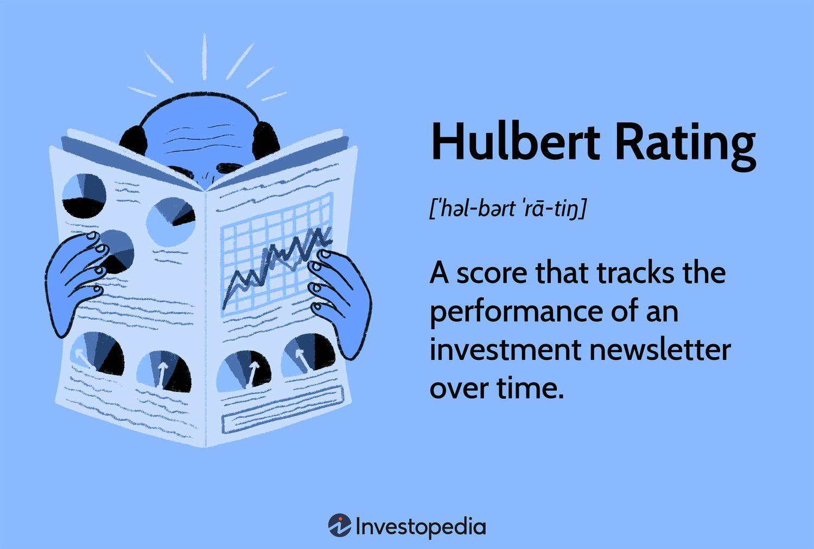

## Table of Contents

## What is the Hulbert Rating?

The Hulbert Rating is a way to measure how well investment newsletters do. It was created by Mark Hulbert, who started tracking these newsletters in the 1980s. The rating looks at how much money the newsletters' advice would have made if someone followed it exactly. It compares this to how the overall stock market did during the same time. This helps people see if the newsletter's tips are better than just investing in the whole market.

The Hulbert Rating is useful because it gives a clear number to show how good a newsletter is. It takes away the guesswork and lets people see the real results. The rating also looks at how risky the advice is. This means it shows if the newsletter's tips could lead to big wins or big losses. By using the Hulbert Rating, people can make smarter choices about which investment newsletters to trust.

## Who developed the Hulbert Rating?

The Hulbert Rating was developed by Mark Hulbert. He started working on it in the 1980s. Mark wanted to help people see how good investment newsletters really were. He did this by tracking the advice given in these newsletters and seeing how it would work if someone followed it exactly.

The Hulbert Rating is important because it gives a clear number to show how well a newsletter does. It compares the newsletter's advice to how the whole stock market did at the same time. This way, people can tell if the newsletter's tips are better than just investing in the market. The rating also shows how risky the advice is, helping people make smarter choices about which newsletters to trust.

## What is the purpose of the Hulbert Rating?

The Hulbert Rating helps people see how good investment newsletters are. It was made by Mark Hulbert to track the advice given in these newsletters and see if following it would make money. The rating compares the newsletter's advice to how the whole stock market did during the same time. This way, people can tell if the newsletter's tips are better than just putting money in the market.

The rating is useful because it gives a clear number to show how well a newsletter does. It helps take away the guesswork and lets people see the real results. The Hulbert Rating also looks at how risky the advice is. This means it shows if the newsletter's tips could lead to big wins or big losses. By using the Hulbert Rating, people can make smarter choices about which investment newsletters to trust.

## How is the Hulbert Rating calculated?

The Hulbert Rating is calculated by looking at how much money you would make if you followed the advice in an investment newsletter exactly. Mark Hulbert takes all the buy and sell suggestions from the newsletter and sees how they would work in real life. He then compares this to how the overall stock market did during the same time. If the newsletter's advice made more money than the market, it gets a higher rating.

The rating also thinks about how risky the advice is. If the newsletter's tips could lead to big wins but also big losses, it might get a lower rating because it's riskier. The Hulbert Rating gives a number that shows how well the newsletter did compared to the market and how safe or risky the advice was. This helps people decide if they should trust the newsletter's tips.

## What types of investments are typically evaluated by the Hulbert Rating?

The Hulbert Rating usually looks at advice from investment newsletters about stocks. These newsletters suggest when to buy and sell different stocks, and the rating checks how well these suggestions would work if someone followed them exactly. It compares the results to how the whole stock market did during the same time, helping people see if the newsletter's tips are better than just investing in the market.

The rating also covers other types of investments sometimes, like mutual funds or bonds, but it focuses mostly on stocks. If a newsletter gives advice on these other investments, the Hulbert Rating will see how that advice would have done in real life. By doing this, the rating helps people understand if the newsletter's advice is good for different kinds of investments, not just stocks.

## How does the Hulbert Rating differ from other investment ratings?

The Hulbert Rating is different from other investment ratings because it focuses on how well investment newsletters do. It looks at the exact advice given in these newsletters and sees how much money you would make if you followed it. Other ratings might just look at how a fund or a stock did, but the Hulbert Rating compares the newsletter's advice to how the whole stock market did at the same time. This way, it shows if the newsletter's tips are better than just putting money in the market.

Another big difference is that the Hulbert Rating thinks about how risky the advice is. Many other ratings just focus on how much money you could make, but the Hulbert Rating also looks at how safe or risky the advice is. If a newsletter's tips could lead to big wins but also big losses, it might get a lower rating because it's riskier. This helps people make smarter choices about which newsletters to trust, by knowing both how much money they could make and how risky it is.

## What are the advantages of using the Hulbert Rating for investment decisions?

Using the Hulbert Rating for investment decisions helps people see how good an investment newsletter really is. It does this by looking at the advice given in the newsletter and comparing it to how the whole stock market did at the same time. If the newsletter's tips made more money than the market, it gets a higher rating. This makes it easy to tell if the newsletter's advice is better than just investing in the market. It takes away the guesswork and gives a clear number to show how well the newsletter did.

Another advantage is that the Hulbert Rating also looks at how risky the advice is. Some newsletters might give tips that could lead to big wins, but also big losses. The Hulbert Rating shows this by giving a lower rating to riskier advice. This helps people make smarter choices about which newsletters to trust. They can see both how much money they could make and how safe or risky the advice is. This way, they can pick newsletters that fit their own comfort with risk.

## Can the Hulbert Rating predict future investment performance?

The Hulbert Rating can't predict the future of investments. It looks at how well investment newsletters did in the past. If a newsletter's advice made more money than the market before, it might seem like it could do well again. But past results don't guarantee future success. The stock market changes a lot, and what worked before might not work next time.

Still, the Hulbert Rating can help you make better choices. It shows you how a newsletter did compared to the market and how risky its advice was. By looking at this, you can see if a newsletter's tips were good in the past and if they were safe or risky. This can guide you in [picking](/wiki/asset-class-picking) newsletters that might be more likely to do well in the future, even though there's no sure way to predict the market.

## What are the limitations or criticisms of the Hulbert Rating?

The Hulbert Rating has some limitations. One big problem is that it only looks at past results. Just because a newsletter did well before doesn't mean it will do well again. The stock market changes all the time, and what worked in the past might not work in the future. Also, the rating can't predict what will happen next. It's like looking in the rearview mirror while driving; it shows where you've been, but not where you're going.

Another criticism is that the Hulbert Rating might not show the full picture. It focuses a lot on how much money you could make, but it might not consider other important things like how often the newsletter gives advice or how easy it is to follow. Some people also think the rating can be too hard on newsletters that take more risks. If a newsletter tries to make big wins but sometimes loses, it might get a lower rating even if it's still good advice. So, while the Hulbert Rating is helpful, it's not perfect and shouldn't be the only thing you look at when deciding about investments.

## How has the Hulbert Rating evolved since its inception?

Since Mark Hulbert started the Hulbert Rating in the 1980s, it has changed a lot to keep up with new ways of investing. At first, it just looked at how well newsletters did with stocks. But as more people started using different kinds of investments like mutual funds and bonds, the rating began to look at those too. It also got better at showing how risky the advice was, not just how much money it could make. This helped people see the whole picture when choosing newsletters.

Over time, the Hulbert Rating has become more detailed and easier to use. It now uses computers to track advice from newsletters more accurately. This means it can look at more data and give a better idea of how good the advice really is. Even though it still can't predict the future, the rating has gotten better at showing how newsletters did in the past compared to the market. This helps people make smarter choices about which newsletters to trust for their investments.

## Where can one find Hulbert Ratings for different investment options?

You can find Hulbert Ratings for different investment options on the Hulbert Financial Digest website. This website keeps track of a lot of investment newsletters and shows how well they did compared to the stock market. If you go to their site, you can see ratings for newsletters that give advice on stocks, mutual funds, and sometimes even bonds. The ratings are updated regularly, so you can see the latest results.

Another place to look is in financial magazines or newspapers that sometimes publish Hulbert Ratings. These sources might not have all the ratings, but they can give you a good idea of how some popular newsletters are doing. Remember, the Hulbert Rating is just one tool to help you decide, so it's good to look at other information too before making choices about your investments.

## What advanced metrics or data does the Hulbert Rating incorporate for expert analysis?

The Hulbert Rating uses a lot of different numbers and data to help experts understand how good investment newsletters are. It looks at how much money you could make if you followed the newsletter's advice exactly. This is called the return. It also compares this return to how the whole stock market did during the same time. This way, it can tell if the newsletter's tips were better than just investing in the market. The rating also thinks about how risky the advice is. If the newsletter's tips could lead to big wins but also big losses, it might get a lower rating because it's riskier.

Besides these main numbers, the Hulbert Rating looks at other things too. It checks how often the newsletter gives advice, which can show if it's easy to follow. It also looks at how the advice worked over different time periods, not just the short term. This helps see if the newsletter's tips are good for the long run. The rating uses computers to track all this data accurately, making it a detailed tool for experts to use when deciding about investments.

## What are Hulbert Ratings and how can they be understood?

A Hulbert Rating serves as a performance scorecard for investment newsletters, tracking both their historical performance and risk-adjusted returns. This system was introduced by Mark Hulbert in 1980, primarily through the Hulbert Financial Digest, with the aim of providing transparent and unbiased evaluations of financial newsletters. The inception of Hulbert Ratings marked a significant advancement in the financial industry by enabling investors to rely on objective data to assess the true efficacy of various investment newsletters.

Hulbert Ratings, LLC, continues the legacy initiated by Mark Hulbert, maintaining the focus on comprehensive and detailed performance insights. The methodology employed involves the use of rigorous financial metrics to evaluate performance, with a specific emphasis on the Sharpe ratio. The Sharpe ratio is a measure of risk-adjusted return on investment, calculated as:

$$
\text{Sharpe Ratio} = \frac{R_p - R_f}{\sigma_p}
$$

where $R_p$ is the expected portfolio return, $R_f$ is the risk-free rate, and $\sigma_p$ is the standard deviation of the portfolio's excess return.

This focus on risk-adjusted returns is crucial as it allows investors to understand not just the total returns, but how much risk was taken to achieve those returns. By utilizing such measures, Hulbert Ratings offers a robust framework for evaluating the quality and consistency of investment advice provided by newsletters. Consequently, investors are better equipped to make informed decisions by examining how well each newsletter's recommendations have performed over time relative to the risks undertaken.

## What is the Calculation Methodology?

Hulbert Ratings are meticulously calculated using hypothetical portfolios derived from the buy and sell recommendations of investment newsletters. These hypothetical portfolios are continuously monitored, allowing for an accurate evaluation of their performance over time. 

The calculation methodology hinges on key performance metrics, such as total return and the Sharpe ratio, to ensure that the ratings reflect a risk-adjusted performance score. The total return is a comprehensive measure of the return on an investment, accounting for capital gains and income generated from the portfolio. On the other hand, the Sharpe ratio provides a more nuanced view by evaluating the return of an investment relative to its risk, calculated as:

$$
\text{Sharpe Ratio} = \frac{\text{Average Portfolio Return} - \text{Risk-Free Rate}}{\text{Standard Deviation of Portfolio Return}}
$$

This ratio aids in understanding how much excess return is received for the extra [volatility](/wiki/volatility-trading-strategies) endured by holding a riskier asset.

To maintain the impartiality of Hulbert Ratings, anonymous subscriptions to investment newsletters are utilized. This anonymity ensures that the newsletters' advice is not influenced by knowledge of being evaluated, preserving the objectivity and integrity of the performance assessments. By simulating real-world investment scenarios without direct influence from newsletter publishers, Hulbert Ratings offer a reliable and unbiased performance appraisal.

## References & Further Reading

[1]: ["The Hulbert Financial Digest"](https://hulbertratings.com/) - A leading source for Hulbert Ratings and financial publishing.

[2]: Lopez de Prado, M. (2018). ["Advances in Financial Machine Learning"](https://www.amazon.com/Advances-Financial-Machine-Learning-Marcos/dp/1119482089). Wiley.

[3]: Aronson, D. (2006). ["Evidence-Based Technical Analysis: Applying the Scientific Method and Statistical Inference to Trading Signals"](https://www.amazon.com/Evidence-Based-Technical-Analysis-Scientific-Statistical/dp/0470008741). Wiley.

[4]: Jansen, S. (2020). ["Machine Learning for Algorithmic Trading - Second Edition"](https://github.com/stefan-jansen/machine-learning-for-trading). Packt Publishing.

[5]: Chan, E. P. (2008). ["Quantitative Trading: How to Build Your Own Algorithmic Trading Business"](https://github.com/ftvision/quant_trading_echan_book). Wiley.