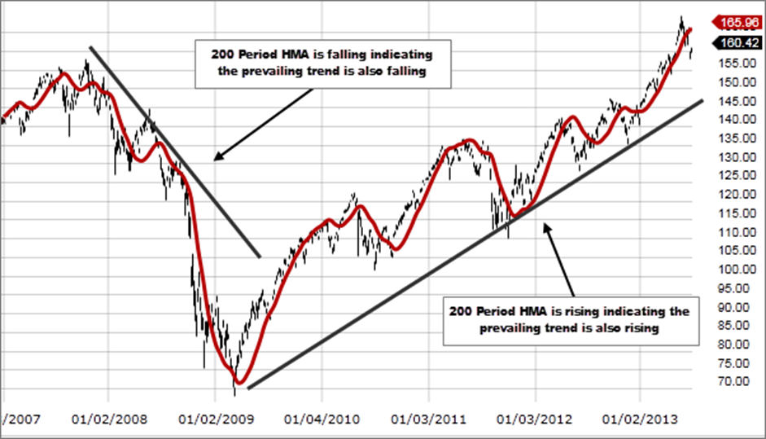

## Table of Contents

## What is a Hull Moving Average (HMA)?

A Hull Moving Average (HMA) is a type of moving average that helps traders see trends in stock prices more clearly and quickly. Unlike simple moving averages, which just take the average of a set number of past prices, HMA uses a special formula to make the average smoother and faster at picking up changes in the market. This makes it very useful for people who want to react quickly to what's happening in the market.

The way HMA works is by taking the weighted average of two other moving averages. It starts by calculating a weighted moving average (WMA) of the closing prices over a certain period. Then, it calculates another WMA, but this time over half that period. Finally, it combines these two averages in a way that doubles the shorter WMA and subtracts the longer one. This special combination helps reduce the lag that you often see with regular moving averages, making HMA a popular choice among traders who need to make fast decisions.

## How does the Hull Moving Average differ from traditional moving averages?

The Hull Moving Average (HMA) is different from traditional moving averages because it is designed to be smoother and faster at showing changes in the market. Traditional moving averages, like the Simple Moving Average (SMA) or the Exponential Moving Average (EMA), can be slow to react to new price movements. They might keep showing an old trend even after the market has started to change. HMA, on the other hand, uses a special formula to catch up with the market more quickly. This makes it easier for traders to see what's happening right now, instead of waiting for the old averages to catch up.

The way HMA works is also different from traditional moving averages. While an SMA just takes the average of a set number of past prices, and an EMA gives more weight to recent prices, HMA uses a combination of weighted moving averages (WMAs). It starts by calculating a WMA over a certain period, then calculates another WMA over half that period, and finally combines them in a way that doubles the shorter WMA and subtracts the longer one. This special method helps reduce the lag that you often see with regular moving averages, making HMA a popular choice for traders who need to make quick decisions based on the latest market trends.

## What is the formula for calculating the Hull Moving Average?

The Hull Moving Average (HMA) is calculated using a special formula that makes it smoother and faster than regular moving averages. To find the HMA, you start by calculating a Weighted Moving Average (WMA) of the closing prices over a certain period, let's call it 'n'. This gives you the first part of the formula. Then, you calculate another WMA, but this time over half of that period, 'n/2'. This shorter WMA helps the HMA react more quickly to changes in the market.

After you have these two WMAs, you combine them in a special way. You take the WMA calculated over the half period ('n/2') and double it. Then, you subtract the WMA calculated over the full period ('n') from this doubled value. This final step is what makes the HMA so good at reducing lag and showing you the current market trend more clearly. The formula looks like this: HMA = WMA(2*WMA(close, n/2) - WMA(close, n), sqrt(n)).

## Why was the Hull Moving Average developed?

The Hull Moving Average (HMA) was created to help traders see market trends more clearly and quickly. Traditional moving averages like the Simple Moving Average (SMA) and the Exponential Moving Average (EMA) can be slow to catch up with new price changes. This means traders might keep seeing an old trend even after the market has started to move in a new direction. The HMA was developed to fix this problem by reacting faster to what's happening in the market right now.

The HMA uses a special formula to make it smoother and quicker than other moving averages. It combines two Weighted Moving Averages (WMAs) in a way that reduces the lag you often see with regular moving averages. By doing this, the HMA helps traders make faster decisions based on the latest market trends. This makes it a popular choice for people who need to react quickly to changes in the market.

## What are the key benefits of using the Hull Moving Average in trading?

The Hull Moving Average (HMA) helps traders see market trends more clearly and quickly. Unlike other moving averages that might be slow to catch up with new price changes, the HMA reacts faster. This means traders can see what's happening in the market right now, instead of waiting for old trends to fade away. This quick reaction time is a big help for making fast decisions based on the latest market moves.

Another key benefit of the HMA is that it's smoother than other moving averages. It uses a special formula that reduces the ups and downs you often see with regular moving averages. This makes it easier for traders to spot the real trends in the market without being distracted by small price changes. By using the HMA, traders can make better choices about when to buy or sell, leading to smarter trading strategies.

## How can the Hull Moving Average be applied in different market conditions?

The Hull Moving Average (HMA) is really useful in different market conditions because it helps traders see trends quickly and clearly. In a market that's moving up and down a lot, the HMA can help traders spot the real direction of the market without getting confused by small price changes. This is because the HMA is smoother than other moving averages, so it's easier to see the big picture. When the market is moving fast in one direction, the HMA can catch up with these changes quickly, helping traders make decisions based on the latest trends.

In a market that's not moving much, the HMA can still be helpful. It can show traders if the market is starting to move in a new direction, even if the changes are small. This can be important for traders who want to get in early on a new trend. Because the HMA reacts faster than other moving averages, it can give traders a heads-up about changes in the market, helping them decide when to buy or sell. Overall, the HMA's quick and smooth nature makes it a good tool for traders in all kinds of market conditions.

## What are the common time frames used for the Hull Moving Average?

Traders often use the Hull Moving Average (HMA) with different time frames, depending on what they're trying to do. For people who want to make quick trades, they might use a short time frame like 9 or 14 periods. This helps them see fast changes in the market and make decisions quickly. On the other hand, if someone is looking at the bigger picture and wants to understand long-term trends, they might use a longer time frame, like 21 or 50 periods. This gives them a smoother view of the market and helps them plan for the future.

Some traders also use multiple HMAs with different time frames together to get a better understanding of the market. For example, they might look at a 9-period HMA along with a 21-period HMA. This can help them see both short-term movements and longer-term trends at the same time. By comparing these different time frames, traders can make more informed decisions about when to buy or sell.

## Can the Hull Moving Average be combined with other technical indicators?

Yes, the Hull Moving Average (HMA) can be combined with other technical indicators to help traders make better decisions. One common way is to use the HMA with the Relative Strength Index (RSI). The HMA helps show the trend of the market, while the RSI can tell if a stock is overbought or oversold. By looking at both, traders can see if it's a good time to buy or sell based on the trend and the strength of the market.

Another popular combination is using the HMA with the Moving Average Convergence Divergence (MACD). The HMA can help identify the direction of the trend, and the MACD can show when the trend might be changing. This can help traders catch the start of a new trend or know when it might be time to get out of a trade. By using these indicators together, traders can get a clearer picture of what's happening in the market and make smarter trading choices.

## What are the potential drawbacks or limitations of using the Hull Moving Average?

Using the Hull Moving Average (HMA) can have some downsides. One issue is that it might give false signals, especially in markets that are moving up and down a lot. The HMA tries to be quick and smooth, but sometimes it can react too fast and make traders think a new trend is starting when it's not. This can lead to bad trades and losses. Also, because the HMA uses a special formula, it can be a bit harder to understand than simpler moving averages like the SMA or EMA. This might make it tricky for new traders to use it correctly.

Another limitation of the HMA is that it might not work well in all market conditions. In markets that are not moving much, the HMA can still show small changes that might not be important. This can make it hard for traders to tell the difference between real trends and just random price movements. Plus, because the HMA tries to be fast, it might miss out on some longer-term trends that other moving averages could catch. So, traders need to be careful and maybe use the HMA along with other tools to get a full picture of what's happening in the market.

## How does the Hull Moving Average perform in comparison to other moving averages in terms of lag and smoothness?

The Hull Moving Average (HMA) is designed to be both smoother and faster than other moving averages like the Simple Moving Average (SMA) and the Exponential Moving Average (EMA). The HMA uses a special formula that combines two Weighted Moving Averages (WMAs) to reduce the lag that you often see with other moving averages. This means the HMA can catch up with changes in the market more quickly, helping traders see new trends sooner. For example, while an SMA might take longer to show that the market is starting to move in a new direction, the HMA can pick up on these changes faster.

In terms of smoothness, the HMA is also better at filtering out small price changes that can make other moving averages look bumpy. This is because the HMA's special formula helps to smooth out the ups and downs, giving traders a clearer view of the market's overall direction. While the EMA is smoother than the SMA because it gives more weight to recent prices, the HMA goes a step further by using a more complex method to reduce noise. This makes the HMA a popular choice for traders who want to see the big picture without being distracted by minor price movements.

## What are some advanced strategies for optimizing the use of the Hull Moving Average?

One advanced strategy for optimizing the use of the Hull Moving Average (HMA) is to use multiple HMAs with different time frames. For example, a trader might use a short-term HMA, like a 9-period one, along with a longer-term HMA, like a 21-period one. By comparing these two, the trader can see both quick changes in the market and the bigger trend. If the short-term HMA crosses above the long-term HMA, it might be a good time to buy because it could mean a new upward trend is starting. On the other hand, if the short-term HMA crosses below the long-term HMA, it might be a signal to sell because the market could be turning downward.

Another strategy is to combine the HMA with other technical indicators to get a fuller picture of the market. For instance, using the HMA with the Relative Strength Index (RSI) can help traders see if a stock is overbought or oversold while also understanding the trend. If the HMA is moving up and the RSI is below 30, it might be a good time to buy because the stock could be undervalued and starting to trend upward. Similarly, using the HMA with the Moving Average Convergence Divergence (MACD) can help traders spot when a trend might be changing. If the HMA is moving up and the MACD line crosses above the signal line, it could be a strong buy signal because it suggests the upward trend is gaining strength.

## How can traders backtest the effectiveness of the Hull Moving Average in their trading strategy?

Traders can backtest the effectiveness of the Hull Moving Average (HMA) by using historical price data to see how well the HMA would have worked in the past. They can set up a trading strategy that uses the HMA to make buy and sell decisions, and then run this strategy on past data to see how it would have performed. For example, a trader might decide to buy when a short-term HMA crosses above a long-term HMA and sell when it crosses below. By looking at how these signals would have worked in the past, traders can see if the HMA helps them make good trades.

To do this, traders can use special software or trading platforms that let them backtest strategies. They can input the rules for their HMA strategy, like the time frames for the HMAs and the conditions for buying and selling. The software will then go through the historical data and show how the strategy would have done. This helps traders see if the HMA is a good tool for their trading and if they need to make any changes to their strategy to make it work better.

## How do you calculate the Hull Moving Average?

The Hull Moving Average (HMA) is designed to reduce the lag found in traditional moving averages while maintaining a smooth curve. The calculation of the HMA involves a structured process that includes the computation of two Weighted Moving Averages (WMAs), followed by adjustments and smoothing.

1. **Calculating the Initial Weighted Moving Averages**:  
   To begin, compute the Weighted Moving Average for both half and full-period values. This can be accomplished using:
$$
   \text{WMA}_n = \frac{\sum_{i=1}^{n} i \cdot p_i}{\sum_{i=1}^{n} i}

$$

   where $n$ is the period, and $p_i$ represents the price at time $i$. 

   - Calculate the WMA with the full-period value $n$.
   - Also calculate the WMA using half of the period value $n/2$.

2. **Forming the Intermediate Value**:  
   After obtaining both WMA values, the next step is to calculate an intermediate WMA. This intermediate step is crucial for adjusting the weight of recent prices and is computed as follows:
$$
   \text{Intermediate WMA} = 2 \times \text{WMA}_{n/2} - \text{WMA}_n

$$

   This adjustment aims to give more weight to recent price movements and decreases as viewed over the full-period domain.

3. **Deriving the Final Hull Moving Average**:  
   The final step involves smoothing out the intermediate WMA using another WMA calculation, specifically applying the square root of the original period $n$. This step emphasizes recent price trends more effectively:
$$
   \text{HMA} = \text{WMA}_{\sqrt{n}} (\text{Intermediate WMA})

$$

The result is a Hull Moving Average that is both smoothed and sensitive to recent price fluctuations. Although the process may appear intricate, contemporary trading platforms often have built-in functions to perform these calculations seamlessly, enabling traders to focus on strategy development and execution.

## What are the differences between Hull Moving Average and other Moving Averages?

The Hull Moving Average (HMA) is distinguishably more responsive compared to the Simple Moving Average (SMA) and the Exponential Moving Average (EMA), making it a preferred tool for traders seeking to enhance their market analysis. Each of these moving averages has distinct characteristics that cater to different trading methodologies.

The Simple Moving Average (SMA) is calculated by taking the arithmetic mean of a set number of past data points. For example, a 5-period SMA of closing prices $[x_1, x_2, x_3, x_4, x_5]$ is:

$$
\text{SMA} = \frac{x_1 + x_2 + x_3 + x_4 + x_5}{5}
$$

The SMA is simple to implement and provides a smooth curve, but it is often criticized for being slow to react to recent price changes since it gives equal weight to each data point.

The Exponential Moving Average (EMA) addresses this by applying more weight to recent prices, thereby providing greater sensitivity to recent price movements. The formula for an EMA at time period $t$ is:

$$
\text{EMA}_t = \left( \frac{2}{N+1} \right) \times x_t + \left( 1 - \frac{2}{N+1} \right) \times \text{EMA}_{t-1}
$$

where $N$ is the number of periods. The EMA's weighting factor makes it more responsive to recent prices compared to the SMA and makes it suitable for traders who need to detect trends quickly.

In contrast, the Hull Moving Average (HMA) offers an even more advanced mechanism for reducing lag. The HMA uses Weighted Moving Averages (WMAs) with an innovative calculation approach to provide a smoother and more responsive trend line. The formula for the HMA involves:

1. Calculating the WMA of half the period.
2. Calculating the WMA of the full period.
3. Taking the difference between these two WMAs and then smoothing it by another WMA with the square root of the selected period.

Mathematically, for $n$ periods, if $\text{WMA}(n/2)$ is the WMA of half periods and $\text{WMA}(n)$ the WMA of the full period, the intermediate step is:

$$
\text{HMA} = \text{WMA}\left( \sqrt{n} \right) \left(2 \times \text{WMA}\left(n/2\right) - \text{WMA}\left(n\right)\right)
$$

The HMA’s ability to mitigate lag while maintaining smoothness often allows traders to react more swiftly to changes compared to SMA and EMA. This feature makes the HMA particularly advantageous for strategies that require timely entry and exit points.

Selecting the appropriate moving average depends on several factors, including the specific objectives of the trading strategy, the behavior of the asset being traded, and prevailing market conditions. While the SMA may be suitable for broader trend analysis due to its smoothing quality, the EMA and HMA are preferable for traders focused on capturing recent market movements and minimizing lag.

## References & Further Reading

[1]: Hull, A. (2005). ["Get the Most Out of Moving Averages"](https://chartschool.stockcharts.com/table-of-contents/technical-indicators-and-overlays/technical-overlays/hull-moving-average-hma) by Alan Hull - This article provides an original description and insight into the development of the Hull Moving Average.

[2]: Murphy, J. J. (1999). ["Technical Analysis of the Financial Markets: A Comprehensive Guide to Trading Methods and Applications"](https://www.amazon.com/Technical-Analysis-Financial-Markets-Comprehensive/dp/0735200661) by John J. Murphy - Offers a broad overview of technical analysis tools, including moving averages.

[3]: Aronson, D. R. (2007). ["Evidence-Based Technical Analysis: Applying the Scientific Method and Statistical Inference to Trading Signals"](https://onlinelibrary.wiley.com/doi/book/10.1002/9781118268315) by David Aronson - Discusses the application of scientific principles to technical trading, relevant for understanding the empirical assessment of indicators like the HMA.

[4]: Chan, E. P. (2009). ["Quantitative Trading: How to Build Your Own Algorithmic Trading Business"](https://github.com/ftvision/quant_trading_echan_book) by Ernest P. Chan - Provides a guide to starting an algorithmic trading business, incorporating tools like the Hull Moving Average.

[5]: Lopez de Prado, M. (2018). ["Advances in Financial Machine Learning"](https://books.google.com/books/about/Advances_in_Financial_Machine_Learning.html?id=oU9KDwAAQBAJ) by Marcos Lopez de Prado - Explores the intersection of machine learning and trading, offering advanced insight that can apply to optimizing indicators like the HMA.