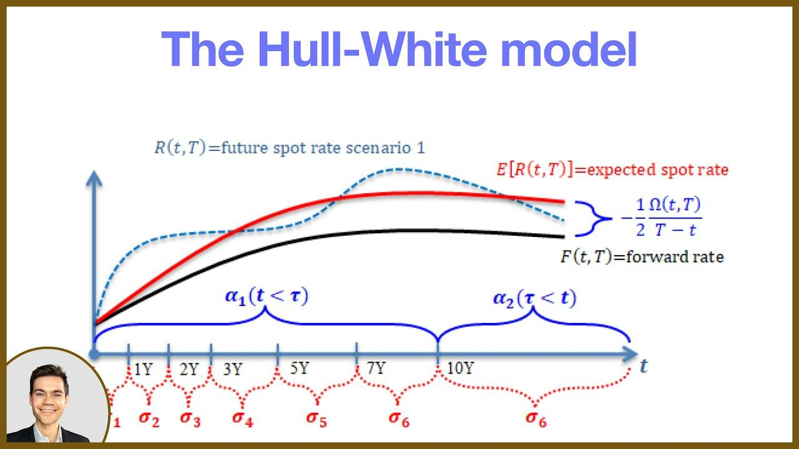

## Table of Contents

## What is the Hull-White model?

The Hull-White model is a type of mathematical model used to predict how interest rates might change over time. It's popular in finance, especially for pricing bonds and other interest rate-related products. The model assumes that interest rates can move up or down, but it also includes a feature where the rates tend to move back towards a long-term average, kind of like a rubber band snapping back to its original shape.

This model is special because it can be adjusted to fit real-world data better than some other models. It does this by using two main parts: one part that decides how fast the interest rates move back to the average, and another part that controls how much the rates can jump around. Because it can be adjusted easily, banks and financial analysts often use the Hull-White model to make better guesses about future interest rates and to manage risks in their investments.

## Who developed the Hull-White model and when?

The Hull-White model was created by John Hull and Alan White. They are both professors and experts in finance. John Hull works at the University of Toronto, and Alan White used to work there too. They came up with this model to help people in finance understand and predict how interest rates might change.

They developed the Hull-White model in the late 1980s and early 1990s. Their work was important because it made it easier for banks and other financial companies to make better guesses about future interest rates. This model is still used today because it can be adjusted to fit real-world situations, making it very useful for people working in finance.

## What are the key features of the Hull-White model?

The Hull-White model is a way to guess how interest rates might change in the future. It's special because it thinks that interest rates can go up or down, but they also have a tendency to go back to a normal level over time. This is like how a rubber band stretches and then snaps back to its original shape. The model uses two main parts to do this: one part decides how quickly the interest rates go back to normal, and the other part decides how much the rates can jump around. This makes the model really good at fitting real-world data.

Another cool thing about the Hull-White model is that it can be easily adjusted to match what's happening in the real world. This means that banks and financial analysts can use it to make better predictions about future interest rates and manage risks in their investments. Because it's so flexible, the Hull-White model is still used today by many people in finance to help them make smart decisions about money and investments.

## How does the Hull-White model differ from other interest rate models?

The Hull-White model is different from other interest rate models because it can be easily adjusted to fit real-world data. Many other models, like the Vasicek model or the Cox-Ingersoll-Ross (CIR) model, have fixed parameters that make them less flexible. The Hull-White model, on the other hand, allows users to change its settings to better match what's happening in the real world. This makes it very useful for banks and financial analysts who need to predict how interest rates might change and make decisions based on those predictions.

Another way the Hull-White model stands out is that it assumes interest rates can move both up and down, but they also tend to move back towards a long-term average. This is different from some other models that might assume interest rates can only move in one direction or don't account for this "mean reversion" effect. The Hull-White model's approach to interest rates makes it more realistic and practical for managing financial risks. Because of its flexibility and realistic approach, the Hull-White model is widely used in the finance industry to help with things like pricing bonds and managing investment portfolios.

## What are the main equations used in the Hull-White model?

The Hull-White model uses a main equation to show how interest rates change over time. This equation says that the change in the interest rate (dr) is made up of two parts: one part pulls the interest rate back to a long-term average, and the other part adds some randomness to it. The equation looks like this: dr = (θ(t) - ar)dt + σdW, where "r" is the interest rate, "θ(t)" is a function that helps set the long-term average, "a" decides how quickly the interest rate goes back to the average, "σ" controls how much the interest rate can jump around, and "dW" is a random part that comes from something called a Wiener process.

Another important part of the Hull-White model is how it figures out the long-term average interest rate. This is done using another equation that looks like this: θ(t) = ∂f(0,t)/∂t + af(0,t) + (σ^2)/(2a)(1 - e^(-2at)), where "f(0,t)" is the initial forward rate curve at time zero for a future time "t". This equation helps the model fit real-world data better by adjusting the long-term average based on what interest rates are expected to be in the future. Both of these equations together make the Hull-White model really good at predicting how interest rates might change and helping people in finance make smart decisions.

## How is the Hull-White model calibrated?

Calibrating the Hull-White model means adjusting its settings so it matches real-world data. This is done by changing the values of "a" and "σ" in the model's equations. "a" decides how fast the interest rates go back to their long-term average, while "σ" controls how much the interest rates can jump around. To calibrate the model, financial analysts use real interest rate data and try different values for "a" and "σ" until the model's predictions match the real data closely.

One common way to calibrate the Hull-White model is by using something called the least squares method. This method tries to find the best values for "a" and "σ" that make the model's predictions as close as possible to the real interest rate data. Analysts might also use other methods like maximum likelihood estimation, which looks at how likely the model's predictions are given the real data. By fine-tuning these settings, the Hull-White model becomes more accurate and useful for making predictions about future interest rates.

## What are the practical applications of the Hull-White model in finance?

The Hull-White model is really useful in finance, especially for figuring out the prices of bonds and other things that depend on interest rates. Banks and financial analysts use it to predict how interest rates might change in the future. This helps them decide how much to charge for loans or how much to pay for bonds. Because the model can be adjusted to fit real-world data, it's a great tool for making these kinds of decisions. It's like having a flexible ruler that can be bent to measure things more accurately.

Another big use of the Hull-White model is in managing risks. When banks lend money or invest in things like bonds, they need to know how changes in interest rates might affect their money. The Hull-White model helps them see different possible futures and plan for them. By using the model, banks can make smarter choices about what risks to take and how to protect themselves from losing money. It's like having a weather forecast for interest rates, helping banks prepare for different financial storms.

## Can you explain the concept of mean reversion in the context of the Hull-White model?

Mean reversion is a key idea in the Hull-White model. It means that interest rates tend to move back to a normal level over time. Imagine you stretch a rubber band; it wants to go back to its original shape. That's what interest rates do in the Hull-White model. They can go up or down, but there's a force pulling them back to an average rate. This is important because it helps the model predict how interest rates might change in the future.

In the Hull-White model, mean reversion is controlled by a parameter called "a." This parameter decides how quickly the interest rates go back to the average. If "a" is big, the rates snap back to the average faster, like a tight rubber band. If "a" is small, the rates take longer to return to the average, like a loose rubber band. By adjusting "a," the model can be fine-tuned to match what's happening in the real world. This makes the Hull-White model really useful for banks and financial analysts who need to predict future interest rates and make smart decisions about money and investments.

## How does the Hull-White model handle negative interest rates?

The Hull-White model can handle negative interest rates because it lets interest rates move up and down without any limits. In the model's main equation, there's a part that adds randomness to the interest rate, which means it can go below zero if the random changes are big enough. This is important because, in the real world, some places have seen negative interest rates, so the model needs to be able to deal with that.

Even though the Hull-White model can handle negative interest rates, it's still important to be careful. Some financial products might not make sense with negative rates, so people using the model need to think about what it means for their specific situation. By adjusting the model's settings, like the part that controls how much rates can jump around, users can make sure the model's predictions match what's happening in the real world, even when interest rates are negative.

## What are the limitations and criticisms of the Hull-White model?

The Hull-White model is really good at predicting how interest rates might change, but it's not perfect. One problem is that it assumes interest rates move in a certain way, but in real life, interest rates can act differently. The model thinks interest rates will always go back to a normal level over time, but sometimes they don't. This can make the model's predictions less accurate if the real world doesn't match what the model expects.

Another issue is that the Hull-White model can be hard to use if you don't have a lot of good data. To make the model work well, you need to adjust its settings to match real-world numbers. If you don't have enough data, or if the data you have isn't very good, the model's predictions might not be very reliable. Some people also say the model is too simple because it only looks at interest rates and doesn't think about other things that can affect them, like the economy or what the government is doing.

## How can the Hull-White model be extended or modified for more complex scenarios?

The Hull-White model can be changed and made more complex to fit different situations better. One way to do this is by adding more factors to the model. Instead of just looking at one interest rate, the model can look at several rates at the same time. This can help the model predict how different kinds of interest rates, like short-term and long-term rates, might change together. Another way to make the model more useful is by including things like credit risk or inflation. By adding these extra parts, the model can give a fuller picture of what might happen in the future.

Another way to improve the Hull-White model is by making it work better with other models. For example, it can be combined with other types of models that look at how the economy is doing or what the government is doing with interest rates. This can help the model predict not just interest rates but also how they might affect other parts of the economy. By making these changes, the Hull-White model can be used in more complicated situations and give more accurate predictions for banks and financial analysts.

## What are some advanced techniques for implementing the Hull-White model in financial software?

To use the Hull-White model in financial software, one advanced technique is to use something called Monte Carlo simulation. This method helps predict how interest rates might change by running many different scenarios. Imagine playing a game where you roll dice many times to see all the possible outcomes. Monte Carlo simulation does something similar but with numbers. It's great for the Hull-White model because it can show how interest rates might move in different ways and help banks and financial analysts see all the possible futures. This technique makes the model more accurate and useful for making decisions about money and investments.

Another advanced technique is to use numerical methods like finite difference methods to solve the Hull-White model's equations. These methods break down the equations into smaller pieces and solve them step by step. It's like solving a big puzzle by working on one piece at a time. This can be really helpful when the model needs to predict how interest rates might change over time in a very detailed way. By using these methods, financial software can handle complex calculations and give more precise predictions about future interest rates. This makes the Hull-White model even more valuable for managing financial risks and making smart investment choices.

## What is the Hull-White Model and how can it be understood?

The Hull-White model is an influential extension of the Vasicek and Cox-Ingersoll-Ross (CIR) models, focusing on incorporating mean-reversion characteristics in forecasting interest rates. By adopting a single-[factor](/wiki/factor-investing) framework, it differentiates itself from multi-factor models by simplifying the process while maintaining essential features for accurate modeling. One of the primary assumptions of the Hull-White model is that the short-term interest rates follow a normal distribution, allowing for more straightforward computation and interpretation.

Mathematically, the Hull-White model is expressed through a stochastic differential equation (SDE) that outlines how the short rate evolves over time. The generic form of the model is:

$$
dr(t) = [\theta(t) - a(t)r(t)]dt + \sigma(t)dW(t)
$$

where:
- $r(t)$ is the instantaneous short rate at time $t$,
- $\theta(t)$ is the time-dependent drift term,
- $a(t)$ represents the mean-reversion speed, dictating how quickly rates revert to the long-term mean,
- $\sigma(t)$ is the volatility term, reflecting changes in interest rate uncertainty,
- $dW(t)$ denotes a Wiener process, introducing randomness.

Key attributes of the model include its ability to adjust the parameters $\theta(t)$, $a(t)$, and $\sigma(t)$ over time, permitting a more accurate representation of actual market conditions and observed volatilities. This flexibility in parameterization makes the Hull-White model particularly adept at aligning with the evolving yield curve, accommodating various [interest rate](/wiki/interest-rate-trading-strategies) environments.

The use of time-dependent parameters allows practitioners to fit the model to current market data effectively, thereby providing more reliable derivative pricing and risk management outcomes. The model's extension to incorporate these variables aids significantly in capturing the dynamics inherent in financial markets, making it a preferred choice among practitioners requiring precision and adaptability.

## What are the applications of the Hull-White Model in Finance?

The Hull-White model has significant applications in finance, particularly in the pricing and management of interest rate derivatives, bonds, and the assessment of interest rate risks. Its ability to model the dynamics of interest rates makes it a preferred choice for financial professionals.

### Interest Rate Derivatives

Interest rate derivatives are financial instruments whose value derives from interest rate fluctuations. The Hull-White model is extensively employed in pricing instruments such as swaptions, interest rate swaps, and caps/floors.

1. **Swaptions:** A swaption is an option granting the holder the right, but not the obligation, to enter into an interest rate swap. The Hull-White model's mean-reversion feature allows it to account for changing interest rate environments effectively, thereby aiding in accurate swaption pricing. By modeling the evolution of interest rates and capturing their potential future movements, the Hull-White model enables a clear valuation of these options.

2. **Interest Rate Swaps:** These are contracts in which two parties agree to exchange cash flows based on different interest rates. The Hull-White model assesses future short rate movements, which are essential for calculating the fixed and floating leg cash flows accurately. Through its adaptability to current yield curves, the model ensures precise valuation and better hedging strategies for interest rate swaps.

3. **Caps/Floors:** Interest rate caps and floors are derivatives that protect against interest rate fluctuations. A cap sets a maximum interest rate, while a floor establishes a minimum rate. The Hull-White model uses its stochastic interest rate framework to price these derivatives efficiently by simulating varying interest rate scenarios.

### Bond Pricing

The Hull-White model contributes significantly to bond pricing, particularly for zero-coupon and coupon-bearing bonds. By integrating the current yield curve and allowing for time-dependent parameters, the model accurately computes bond prices through the adjustment of future interest rate pathways.

Mathematically, the price $P(t, T)$ of a zero-coupon bond maturing at time $T$, given the current time $t$, is derived using the formula:

$$
P(t, T) = \exp\left\{-A(t,T) - B(t,T) \cdot r(t)\right\}
$$

where $A(t,T)$ and $B(t,T)$ are coefficients determined by the model's parameters, and $r(t)$ is the short rate at time $t$.

### Risk Management

In risk management, financial institutions utilize the Hull-White model to assess and mitigate interest rate risks. The model's adaptability and precision in modeling interest rate dynamics make it a valuable tool for stress testing and scenario analysis. By incorporating different rate scenarios and stress-testing under adverse conditions, institutions can derive insights into potential risk exposures.

Overall, the Hull-White model's flexibility, combined with its ability to capture the complex behavior of interest rates, establishes its vital role in the efficient pricing and management of financial instruments, thus bolstering the robustness of financial systems.

## References & Further Reading

[1]: Hull, J., & White, A. (1990). "Pricing interest-rate-derivative securities." Review of Financial Studies, 3(4), 573-592.

[2]: Brigo, D., & Mercurio, F. (2006). "Interest Rate Models – Theory and Practice: With Smile, Inflation and Credit." Springer Finance.

[3]: Glasserman, P. (2003). "Monte Carlo Methods in Financial Engineering." Springer.

[4]: Andersen, L., & Piterbarg, V. (2010). "Interest Rate Modeling." Atlantic Financial Press.

[5]: ["QuantLib: A Software Framework for Quantitative Finance"](https://www.quantlib.org/). QuantLib Project. 

[6]: Rebonato, R. (2002). "Modern Pricing of Interest-Rate Derivatives: The LIBOR Market Model and Beyond." Princeton University Press.

[7]: Jamshidian, F. (1991). "The Multifactor Gaussian Interest Rate Model and International Bond Markets." Applied Mathematical Finance, 1(1), 43-65. 

[8]: ["The Mathematics of Financial Derivatives: A Student Introduction"](https://www.amazon.com/Mathematics-Financial-Derivatives-Paul-Wilmott/dp/0521497892) by Paul Wilmott, Sam Howison, and Jeff Dewynne.