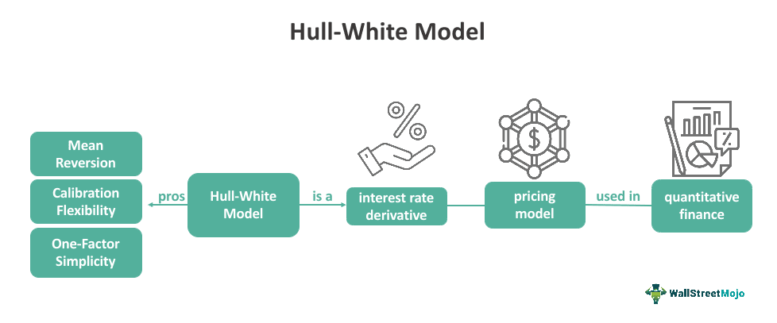

The Hull-White model is a renowned financial tool employed for the valuation of interest rate derivatives. It is categorized under no-arbitrage models, a class that effectively captures interest rate dynamics. The model was architected by John Hull and Alan White during the 1990s, marking a significant advancement in financial modeling due to its remarkable flexibility and adaptability. This model addresses the complexities of interest rate movements, accommodating their stochastic nature through time-dependent parameters and mean-reversion features. This article examines how the Hull-White model is applied in pricing various financial derivatives and its strategic role in algorithmic trading.

## Table of Contents



## Understanding the Hull-White Model

The Hull-White model is an influential extension of the Vasicek and Cox-Ingersoll-Ross (CIR) models, focusing on incorporating mean-reversion characteristics in forecasting interest rates. By adopting a single-factor framework, it differentiates itself from multi-factor models by simplifying the process while maintaining essential features for accurate modeling. One of the primary assumptions of the Hull-White model is that the short-term interest rates follow a normal distribution, allowing for more straightforward computation and interpretation.

Mathematically, the Hull-White model is expressed through a stochastic differential equation (SDE) that outlines how the short rate evolves over time. The generic form of the model is:

$$
dr(t) = [\theta(t) - a(t)r(t)]dt + \sigma(t)dW(t)
$$

where:
- $r(t)$ is the instantaneous short rate at time $t$,
- $\theta(t)$ is the time-dependent drift term,
- $a(t)$ represents the mean-reversion speed, dictating how quickly rates revert to the long-term mean,
- $\sigma(t)$ is the volatility term, reflecting changes in interest rate uncertainty,
- $dW(t)$ denotes a Wiener process, introducing randomness.

Key attributes of the model include its ability to adjust the parameters $\theta(t)$, $a(t)$, and $\sigma(t)$ over time, permitting a more accurate representation of actual market conditions and observed volatilities. This flexibility in parameterization makes the Hull-White model particularly adept at aligning with the evolving yield curve, accommodating various [interest rate](/wiki/interest-rate-trading-strategies) environments.

The use of time-dependent parameters allows practitioners to fit the model to current market data effectively, thereby providing more reliable derivative pricing and risk management outcomes. The model's extension to incorporate these variables aids significantly in capturing the dynamics inherent in financial markets, making it a preferred choice among practitioners requiring precision and adaptability.

## Applications of the Hull-White Model in Finance

The Hull-White model has significant applications in finance, particularly in the pricing and management of interest rate derivatives, bonds, and the assessment of interest rate risks. Its ability to model the dynamics of interest rates makes it a preferred choice for financial professionals.

### Interest Rate Derivatives

Interest rate derivatives are financial instruments whose value derives from interest rate fluctuations. The Hull-White model is extensively employed in pricing instruments such as swaptions, interest rate swaps, and caps/floors.

1. **Swaptions:** A swaption is an option granting the holder the right, but not the obligation, to enter into an interest rate swap. The Hull-White model's mean-reversion feature allows it to account for changing interest rate environments effectively, thereby aiding in accurate swaption pricing. By modeling the evolution of interest rates and capturing their potential future movements, the Hull-White model enables a clear valuation of these options.

2. **Interest Rate Swaps:** These are contracts in which two parties agree to exchange cash flows based on different interest rates. The Hull-White model assesses future short rate movements, which are essential for calculating the fixed and floating leg cash flows accurately. Through its adaptability to current yield curves, the model ensures precise valuation and better hedging strategies for interest rate swaps.

3. **Caps/Floors:** Interest rate caps and floors are derivatives that protect against interest rate fluctuations. A cap sets a maximum interest rate, while a floor establishes a minimum rate. The Hull-White model uses its stochastic interest rate framework to price these derivatives efficiently by simulating varying interest rate scenarios.

### Bond Pricing

The Hull-White model contributes significantly to bond pricing, particularly for zero-coupon and coupon-bearing bonds. By integrating the current yield curve and allowing for time-dependent parameters, the model accurately computes bond prices through the adjustment of future interest rate pathways.

Mathematically, the price $P(t, T)$ of a zero-coupon bond maturing at time $T$, given the current time $t$, is derived using the formula:

$$
P(t, T) = \exp\left\{-A(t,T) - B(t,T) \cdot r(t)\right\}
$$

where $A(t,T)$ and $B(t,T)$ are coefficients determined by the model's parameters, and $r(t)$ is the short rate at time $t$.

### Risk Management

In risk management, financial institutions utilize the Hull-White model to assess and mitigate interest rate risks. The model's adaptability and precision in modeling interest rate dynamics make it a valuable tool for stress testing and scenario analysis. By incorporating different rate scenarios and stress-testing under adverse conditions, institutions can derive insights into potential risk exposures.

Overall, the Hull-White model's flexibility, combined with its ability to capture the complex behavior of interest rates, establishes its vital role in the efficient pricing and management of financial instruments, thus bolstering the robustness of financial systems.

## Algorithmic Trading and the Hull-White Model

The Hull-White model, with its flexibility and adaptability, plays a pivotal role in [algorithmic trading](/wiki/algorithmic-trading), particularly in predicting interest rate movements. It enhances trading strategies by providing precise analytical tools to forecast future interest rate changes. This accuracy is critical in algorithmic trading, where decisions are implemented at high speed and require a robust mathematical foundation to minimize risks and maximize gains.

The integration of the Hull-White model into trading platforms such as QuantLib, Bloomberg Terminal, and MATLAB underscores its versatility. QuantLib, an open-source library for quantitative finance, offers extensive functionality for pricing derivatives and modeling interest rates, including the Hull-White model. By using these tools, traders can simulate interest rate scenarios and assess the potential impact on various financial instruments.

In practical applications, the Hull-White model is leveraged to derive quantitative insights essential for executing trading algorithms. For instance, traders can use the following Python code snippet utilizing QuantLib to set up a Hull-White model and simulate interest rate paths:

```python
import QuantLib as ql

# Define the interest rate term structure
today = ql.Date.todaysDate()
rate_curve = ql.YieldTermStructureHandle(ql.FlatForward(today, 0.05, ql.Actual365Fixed()))

# Set up the Hull-White model
hw_model = ql.HullWhite(rate_curve, a=0.03, sigma=0.01)

# Simulate interest rate paths
times = [i / 4.0 for i in range(1, 21)]
process = hw_model.stateProcess()
simulator = ql.GaussianRandomSequenceGenerator(len(times))
path_generator = ql.GaussianPathGenerator(process, today, times, simulator, False)

# Generate one path
sample_path = path_generator.next()
path = sample_path.value()

# Output the simulated interest rates
for t, rate in zip(times, path):
    print(f"Time: {t}, Rate: {rate}")
```

This script initializes a Hull-White model with specified parameters and simulates the path of future interest rates, which can inform algorithmic trading strategies. 

Additionally, by incorporating the Hull-White model, traders can efficiently manage portfolio risks and optimize returns through data-driven strategies. By predicting how changes in interest rates could affect derivative pricing and market exposure, traders can adjust their strategies dynamically. This application not only improves the precision of trading algorithms but also enhances the ability to achieve more favorable trading outcomes.

The Hull-White model's capacity to integrate seamlessly into popular trading platforms and provide substantial quantitative insights highlights its value in algorithmic trading, enabling traders to execute informed strategies in rapidly changing financial markets.

## Fitting and Calibrating the Hull-White Model

Calibration involves aligning the parameters of the Hull-White model with current market data to ensure that the model prices derivatives accurately. This process is crucial as it determines the model's predictive power and usability in actual trading scenarios. The primary parameters that need calibration are the [volatility](/wiki/volatility-trading-strategies) $\sigma(t)$ and the mean reversion rate $a(t)$, both of which can be time-dependent to better capture the evolving dynamics of interest rates.

A practical approach to calibration can be carried out through numerical optimization techniques. The objective is to minimize the difference between observed market prices and those generated by the model for a set of standard financial instruments, typically swaptions or caps. The calibration process might involve using techniques such as the least squares method to fit the model prices to market prices.

Monte Carlo simulations are frequently used in the Hull-White model for pricing and calibration, leveraging the stochastic nature of interest rates. Monte Carlo methods simulate a large number of potential future paths for interest rates, calculate the associated cash flows for each path, and discount these cash flows to the present to estimate the derivative's price.

Additionally, finite difference methods can be employed to solve the partial differential equations that arise in the Hull-White model. These methods provide a numerical solution to the equations by discretizing them into a grid and iteratively solving for the values at each grid point. This is particularly useful when evaluating derivatives with American-style exercise features, since finite difference methods handle boundary conditions effectively.

The calibration's adaptability to different market environments makes the Hull-White model particularly valuable for data-driven trading strategies. By re-calibrating the model periodically and adjusting its parameters, traders can keep the model aligned with the prevailing market conditions, thus maintaining its relevance and accuracy.

Python offers convenient libraries such as NumPy and SciPy for implementing these numerical techniques. Here's a simple example of using Python to calibrate a basic Hull-White model:

```python
import numpy as np
from scipy.optimize import minimize

# Define the Hull-White short rate model
def hull_white_price(params, market_prices, market_data):
    a, sigma = params
    model_prices = [] 
    # Calculate prices using model with current parameters
    # This is hypothetical and would involve more detailed implementation
    for data_point in market_data:
        model_price = hypothetical_price_calculation(a, sigma, data_point)
        model_prices.append(model_price)
    # Objective: minimize the sum of squared differences
    return np.sum((np.array(model_prices) - np.array(market_prices))**2)

# Market data and prices (hypothetical example)
market_data = np.array([/* some financial instruments data */])
market_prices = np.array([/* observed market prices for these instruments */])

# Initial guess for parameters
initial_params = [0.03, 0.01]

# Calibrate the model
result = minimize(hull_white_price, initial_params, args=(market_prices, market_data), method='L-BFGS-B')

# Optimal parameters
optimal_a, optimal_sigma = result.x
print("Calibrated mean reversion rate a:", optimal_a)
print("Calibrated volatility sigma:", optimal_sigma)
```

The Hull-White model's flexibility, enhanced by its capacity for recalibration, ensures it remains a pivotal tool in navigating the complexities of interest rate markets. Its robust framework supports diverse trading strategies, allowing financial professionals to effectively manage portfolios amid changing economic climates.

## Advantages and Limitations

The Hull-White model is renowned for its ability to incorporate flexibility through its use of time-dependent parameters, a feature that allows the model to adjust to varying interest rate environments realistically. This is an advantageous characteristic, as it provides the model with a significant edge in accurately capturing the dynamics of observed interest rates, particularly the mean reversion phenomenon. Mean reversion refers to the tendency of interest rates to gravitate towards a long-term average over time, a crucial aspect of real-world interest rate movements. The Hull-White model's mathematical formulation adeptly integrates this by employing stochastic differential equations with parameters that evolve across time. This adaptability ensures that the model remains robust across diverse market conditions, accommodating shifts in interest rate volatility.

However, the Hull-White model also has limitations. One notable challenge is the complexity involved in its calibration process. Calibration is the process of adjusting the model parameters so that its outputs are aligned with current market data. This process can be intricate and computationally intensive, often requiring advanced numerical techniques such as Monte Carlo simulations or finite difference methods to achieve accurate results. Furthermore, while the model incorporates normal distribution assumptions for short rates, it may not fully account for extreme market scenarios, such as those characterized by sudden spikes in volatility or other non-linear behaviors.

To address these limitations, extensions of the Hull-White model have been developed. Multi-[factor](/wiki/factor-investing) models, for instance, introduce additional factors beyond the single-factor approach, providing a more granular analysis of the term structure of interest rates. Stochastic volatility variants offer another enhancement by allowing the volatility of interest rates itself to fluctuate in a stochastic manner, thus capturing more complex market phenomena. These extensions enhance the model’s applicability to various market-specific requirements and allow it to better accommodate the nuances of financial markets.

## Conclusion

The Hull-White model is recognized as a fundamental tool in interest rate modeling, serving as an indispensable asset for pricing financial derivatives and informing algorithmic trading strategies. Its analytical tractability and adaptability are particularly advantageous, offering practitioners the flexibility needed to address the complex nature of financial markets. With its foundation in stochastic calculus, the model facilitates accurate pricing and risk management through its capacity to simulate the dynamics of short-term interest rates.

The model is highly esteemed for its ability to accommodate temporal variations in market data, primarily through its time-dependent parameters. This feature allows the Hull-White model to capture the evolving volatility observed within interest rates, providing a realistic framework for practical applications. Whether deployed in the pricing of interest rate derivatives, such as swaptions and interest rate swaps, or in bond pricing, its robustness and precision are well-documented.

Additionally, the Hull-White model's integration into algorithmic trading platforms — such as QuantLib and MATLAB — underscores its significance in enhancing trading strategies and managing investment portfolios. Its compatibility with these platforms allows traders to derive quantitative insights, enabling effective strategy implementation in automated trading environments.

Ongoing research and development efforts target improving the model's accuracy and efficiency, as well as addressing its limitations. These advancements are crucial as market conditions continue to evolve, demanding agile and responsive modeling techniques. Enhancements may involve exploring multi-factor extensions and incorporating stochastic volatility models, which better account for market-specific nuances and extreme movements.

In conclusion, the Hull-White model's continued relevance and applicability lie in its methodological strengths and the ongoing innovation efforts to refine its capabilities. As financial markets grow increasingly complex, the Hull-White model remains a cornerstone, supporting professionals in navigating the dynamic landscape of interest rate derivatives and algorithmic trading.

## References & Further Reading

[1]: Hull, J., & White, A. (1990). "Pricing interest-rate-derivative securities." Review of Financial Studies, 3(4), 573-592.

[2]: Brigo, D., & Mercurio, F. (2006). "Interest Rate Models – Theory and Practice: With Smile, Inflation and Credit." Springer Finance.

[3]: Glasserman, P. (2003). "Monte Carlo Methods in Financial Engineering." Springer.

[4]: Andersen, L., & Piterbarg, V. (2010). "Interest Rate Modeling." Atlantic Financial Press.

[5]: ["QuantLib: A Software Framework for Quantitative Finance"](https://www.quantlib.org/). QuantLib Project. 

[6]: Rebonato, R. (2002). "Modern Pricing of Interest-Rate Derivatives: The LIBOR Market Model and Beyond." Princeton University Press.

[7]: Jamshidian, F. (1991). "The Multifactor Gaussian Interest Rate Model and International Bond Markets." Applied Mathematical Finance, 1(1), 43-65. 

[8]: ["The Mathematics of Financial Derivatives: A Student Introduction"](https://www.amazon.com/Mathematics-Financial-Derivatives-Paul-Wilmott/dp/0521497892) by Paul Wilmott, Sam Howison, and Jeff Dewynne.