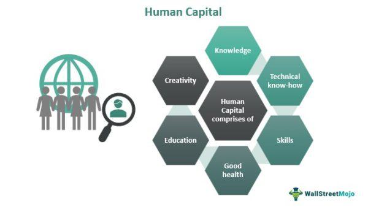

The convergence of human capital development and economic theory with advancements in technology marks a significant evolution in the workforce landscape. At the forefront of this transformation is algorithmic trading (algo trading), which exemplifies how the skills and capabilities of a highly skilled workforce intersect with cutting-edge financial technology. Algo trading leverages complex algorithms and data analysis, automating trading decisions and executions at speeds and frequencies that surpass human capabilities.

This article aims to explore the intricate relationship between human capital, workforce development, economic theories, and algo trading. Each of these elements plays a crucial role in shaping the modern economic environment and financial markets. Human capital, defined as the stock of skills, knowledge, and experience held by individuals, is a critical driver of economic productivity. Workforce development focuses on enhancing these capabilities through education, training, and experiential learning, ensuring that individuals and organizations maintain a competitive edge in an increasingly complex economy.



Economic theories provide essential frameworks to understand how investments in human capital influence economic growth and productivity. Pioneering economists like Gary Becker and Theodore Schultz have argued for the importance of education and training as vital investments. Simultaneously, advancements in technology, particularly in areas like algorithmic trading, demand new skill sets that combine quantitative analysis, programming, and financial knowledge.

Understanding these connections allows businesses and policymakers to leverage synergies between skilled human capital and advancements in technology to foster economic growth and innovation. In a world where markets are continually evolving, recognizing and optimizing these interactions becomes crucial. As technology continues to disrupt traditional practices, these synergies offer a pathway not only for economic resilience but also for sustained advancement and competitive advantage in global markets. Thus, the intersection of human capital development, economic theory, and technology like algo trading presents both a challenge and an opportunity for shaping the future economic landscape.

## Table of Contents

## Understanding Human Capital and Workforce Development

Human capital is a fundamental concept in economics and workforce development, referring to the collective skills, knowledge, and experience possessed by individuals, which enhance their economic productivity and contribute to societal progress. This concept underscores the importance of investing in people as a means to drive economic growth and ensure competitive advantage.

Workforce development, a closely related concept, encompasses the strategies and processes aimed at improving the skill set and capabilities of employees. This is achieved through a variety of methods, including formal education, vocational training, and on-the-job experience. These initiatives ensure that individuals are equipped with the necessary competencies to meet the demands of the ever-evolving job market, promoting both individual success and organizational efficiency.

The human capital theory, articulated by economists like Gary Becker, posits that investments in education and training yield significant returns by enhancing productivity and fostering economic expansion. According to this theory, individuals who acquire more education or training tend to earn higher wages and exhibit increased output. For example, if an individual invests in acquiring new skills, their productivity $P$ can be represented as a function of their human capital $HC$, which grows with each investment:

$$
P = f(HC)
$$

The theory suggests that as $HC$ increases, so does $P$, leading to greater economic outcomes.

In modern economies, developing human capital is not just about formal education but also about acquiring practical skills and experiences that are directly applicable to specific industries. This holistic approach ensures that workforce development aligns with the rapid technological advancements and globalization trends shaping today's market landscape.

Effective workforce development has become increasingly imperative for organizations seeking to maintain a competitive edge and stimulate innovation. Firms that prioritize continuous learning and skill enhancement are better positioned to adapt to changes and capitalize on new opportunities. This is particularly pertinent as businesses confront challenges such as automation and the integration of [artificial intelligence](/wiki/ai-artificial-intelligence), which require a workforce adept in both technical and soft skills.

Consequently, regions and countries that emphasize human capital development tend to exhibit stronger economic performance. They are able to leverage their skilled labor pools to attract investment and drive innovation, ultimately leading to improved living standards and reduced income inequality.

In summary, understanding and investing in human capital and workforce development are critical strategies for organizations and economies aiming to thrive in a competitive global marketplace. These investments not only enhance individual and organizational productivity but also contribute to overall economic prosperity.

## Economic Theory and Its Impact on Workforce Strategies

Economic theories provide essential frameworks for understanding the impact of human capital investments on economic growth. Pioneering economists Gary Becker and Theodore Schultz laid the foundation for human capital theory, which underscores education and training as pivotal investments. Becker articulated that individuals and organizations accrue benefits similar to capital investments when they allocate resources to enhance knowledge and skills. These insights led to the recognition of human capital as a key driver of productivity and economic development.

The theory posits that improvements in education and skill levels can lead to higher earnings for individuals and increased productivity for organizations. The mathematical representation of this can be formulated as follows:

$$
\text{Human Capital Stock (H)} = \int_0^T e^{-\delta t} \left( S(t) + E(t) + T(t) \right) \, dt
$$

Where:  
- $S(t)$ represents the skills acquired over time,
- $E(t)$ denotes the education level,
- $T(t)$ refers to the training received,
- $\delta$ is the depreciation rate of human capital,
- $T$ is the time horizon considered.

Behavioral economics further refines these theories by challenging the conventional assumption of rational actors. It posits that human behavior and motivations are complex and influenced by cognitive biases and emotions. This suggests that workforce strategies should account for diverse human motivations, recognizing that not all employees will react predictably to financial incentives or training opportunities.

Furthermore, economic theory highlights human capital's potential to reduce income inequality and enhance productivity across economies. By empowering individuals through education and skills development, disparities in income distribution can be minimized. Organizations benefit by leveraging a skilled workforce to improve output and innovation capabilities.

By understanding these economic theories, organizations can craft strategic workforce development plans that recognize diverse motivations and maximize their human capital potential. This approach is crucial for driving economic success and ensuring sustainable growth.

## Algorithmic Trading: A New Frontier in Financial Markets

Algorithmic trading, also known as algo trading, represents a significant advancement in financial markets by leveraging computer algorithms to automate trading processes. This technological innovation has transformed traditional trading by enabling the execution of orders at speeds and frequencies far beyond human capability. These systems use pre-defined criteria to make trading decisions, execute transactions, and manage portfolios with precision and speed, thus capitalizing on market opportunities swiftly.

A key driver of [algorithmic trading](/wiki/algorithmic-trading) is human capital, which plays a vital role in the development and refinement of these algorithms. The field demands a diverse set of expertise, including quantitative analysis, programming skills, and a deep understanding of financial theories. Professionals such as data scientists, financial engineers, and IT specialists collaborate to design sophisticated trading strategies that adapt to market dynamics.

The growing reliance on data and technology has positioned algorithmic trading as a dominant force in global markets. By enhancing [liquidity](/wiki/liquidity-risk-premium) and market efficiency, algo trading contributes to more stable and less volatile trading environments. Algorithms can analyze vast swaths of data in real-time to identify patterns and execute trades at an optimal time, which minimizes the impact on market prices.

As a testament to its pervasive influence, algorithmic trading constitutes a substantial segment of market transactions worldwide. The integration of [machine learning](/wiki/machine-learning) and artificial intelligence further drives innovation, enabling algorithms to learn from historical data to improve trading outcomes continually.

This approach is not without its challenges. The complexity of financial markets requires constant algorithm updates and a deep understanding of risk management. However, the benefits of algorithmic trading, such as reduced transaction costs and improved precision, underscore its growing importance in modern financial markets.

For illustration, consider a basic Python example of a moving average crossover strategy, a common algo trading technique:

```python
import numpy as np
import pandas as pd

# Load historical stock data
data = pd.read_csv('stock_data.csv')
data['Moving_Avg_20'] = data['Close'].rolling(window=20).mean()
data['Moving_Avg_50'] = data['Close'].rolling(window=50).mean()

# Define buy/sell signals
data['Signal'] = 0
data['Signal'][20:] = np.where(data['Moving_Avg_20'][20:] > data['Moving_Avg_50'][20:], 1, -1)

# Example of executing trades based on the signals
def execute_trades(data):
    for index, row in data.iterrows():
        if row['Signal'] == 1:
            print(f"Buy signal on {row['Date']}")
        elif row['Signal'] == -1:
            print(f"Sell signal on {row['Date']}")

execute_trades(data)
```

This simple algorithm looks at moving averages to generate buy or sell signals, illustrating the fundamental concept of algorithmic trading strategies. As technology continues to evolve, algorithmic trading is poised to strengthen its role in shaping financial markets and investment strategies.

## Synergizing Human Capital with Algo Trading

The synergy between human capital and algorithmic trading platforms is characterized by an ongoing demand for innovation and optimization. This relationship is vital for adapting to the rapidly changing financial markets, as algorithmic trading (algo trading) requires sophisticated algorithms informed by quantitative analysis, financial theory, and programming knowledge. 

Investment in human capital plays a critical role in the development of algorithms that are able to respond effectively to dynamic market conditions. Skilled professionals in fields such as data science, financial engineering, and information technology are essential to these efforts, as they bring valuable expertise that drives the design and refinement of trading strategies. Continuous training and education in these areas are paramount, enabling practitioners to stay abreast of the latest developments in technology, market trends, and regulatory changes. 

Educational institutions and specialized training programs must evolve to ensure that individuals are equipped with the necessary technical and analytical skills. Curriculum development should focus on emerging technologies such as artificial intelligence, machine learning, and big data analytics, which are becoming increasingly integral to financial models and trading algorithms. By fostering a strong foundation in these areas, educational bodies can help cultivate a workforce capable of spearheading advancements within the algo trading domain.

For companies, an investment in the development of their workforce not only enhances their competitiveness but also contributes to the broader economic landscape. Firms that prioritize employee development are better positioned to innovate and capitalize on new opportunities within this fast-paced industry. They benefit from a team that is adept at both creating novel solutions and optimizing existing processes.

Harnessing the potential of human capital is crucial for leveraging advancements in algo trading technologies to drive economic gains. A well-trained workforce can improve market efficiencies, enhance asset allocation, and ultimately contribute to the stability and growth of financial markets. As such, the synergy between skilled human capital and cutting-edge trading technologies remains a vital component in the pursuit of economic progress and innovation.

## Challenges and Opportunities

The integration of algorithmic trading within financial markets has ushered in numerous challenges and opportunities, demanding a dynamic adaptation of human capital to meet emerging technological needs. A predominant challenge is the skills gap, arising due to the rapid evolution of trading technologies and the resultant demand for professionals equipped with specialized expertise. This necessitates comprehensive education and training in areas such as quantitative analysis, programming, and financial engineering to adequately prepare the workforce for the complexities of algo trading.

In contrast, opportunities abound in leveraging the diverse capabilities of data scientists, financial engineers, and IT professionals to drive innovation within algorithmic trading strategies. By drawing upon the interdisciplinary skills of these specialists, firms can enhance their trading systems to better manage risk, optimize trade execution, and exploit market inefficiencies.

Additionally, the continuous advancement in artificial intelligence (AI), machine learning, and big data analytics poses both challenges and opportunities for workforce development. The challenge lies in the necessity for ongoing learning and skill acquisition to harness these technologies effectively. However, these advancements also offer opportunities for creating more robust and agile trading algorithms that can process vast amounts of data and adapt to evolving market conditions.

Organizations aiming to maintain competitiveness must prioritize continuous learning and adaptability. Investing in ongoing education and professional development programs ensures that the workforce remains proficient and responsive to technological changes. Such strategic focus not only helps close the skills gap but also enhances the capacity for innovation within the field.

By addressing these challenges head-on and embracing the opportunities presented by modern technologies, firms can fully realize the economic potential of both human capital and algo trading. This strategic alignment not only enhances market performance but also contributes to overall economic growth and stability.

## Conclusion

The interconnectedness of human capital, economic theory, workforce development, and algorithmic trading represents a critical nexus in modern financial markets and broader economic growth. Investments in human capital are foundational, empowering organizations to foster innovation and maintain a competitive edge in the global economy. This relationship is underscored by the intersection of skills, knowledge, and technological advancements, where workforce development translates into increased economic productivity.

Algo trading exemplifies the transformative capacity of integrating sophisticated human capital with advanced financial technology. The utilization of complex algorithms, developed by data scientists, financial engineers, and IT professionals, highlights the symbiotic relationship between human expertise and technological innovation. This integration significantly enhances market efficiency and liquidity, underscoring the importance of continuous investment in workforce capabilities.

For policymakers and business leaders, acknowledging and nurturing these synergies is paramount for advancing innovation and economic progress. Strategic policies and organizational practices that prioritize human capital development will position businesses and economies to leverage the full potential of socio-economic and technological advancements. This is especially crucial as AI, machine learning, and big data analytics become increasingly pervasive, demanding an agile and skilled workforce.

As technology continues to evolve, the calculated development and deployment of human capital will remain vital in navigating the intricacies of the modern economy. Investments here not only facilitate immediate gains in economic productivity but also lay the groundwork for sustained growth and adaptability in an ever-changing financial landscape. By championing these connections, stakeholders can drive forward both economic growth and the broader promise of innovation.

## References & Further Reading

[1]: Becker, G. S. (1993). ["Human Capital: A Theoretical and Empirical Analysis, with Special Reference to Education"](https://papers.ssrn.com/sol3/papers.cfm?abstract_id=1496221). University of Chicago Press.

[2]: Schultz, T. W. (1961). ["Investment in Human Capital."](https://academic.oup.com/ej/article-abstract/82/326/787/5233631) The American Economic Review, 51(1): 1-17.

[3]: Lopez de Prado, M. (2018). ["Advances in Financial Machine Learning."](https://www.amazon.com/Advances-Financial-Machine-Learning-Marcos/dp/1119482089) Wiley.

[4]: Nash, J., & Gutierrez, N. (1994). ["Financial Innovation, Technology and Asset Pricing."](https://www.jstor.org/stable/2117530) Journal of Finance, 49(2), 771-792.

[5]: Chan, E. P. (2009). ["Quantitative Trading: How to Build Your Own Algorithmic Trading Business."](https://github.com/ftvision/quant_trading_echan_book) Wiley.

[6]: Jansen, S. (2020). ["Machine Learning for Algorithmic Trading."](https://github.com/stefan-jansen/machine-learning-for-trading) Packt Publishing.

[7]: Aronson, D. R. (2007). ["Evidence-Based Technical Analysis: Applying the Scientific Method and Statistical Inference to Trading Signals."](https://onlinelibrary.wiley.com/doi/book/10.1002/9781118268315) Wiley.