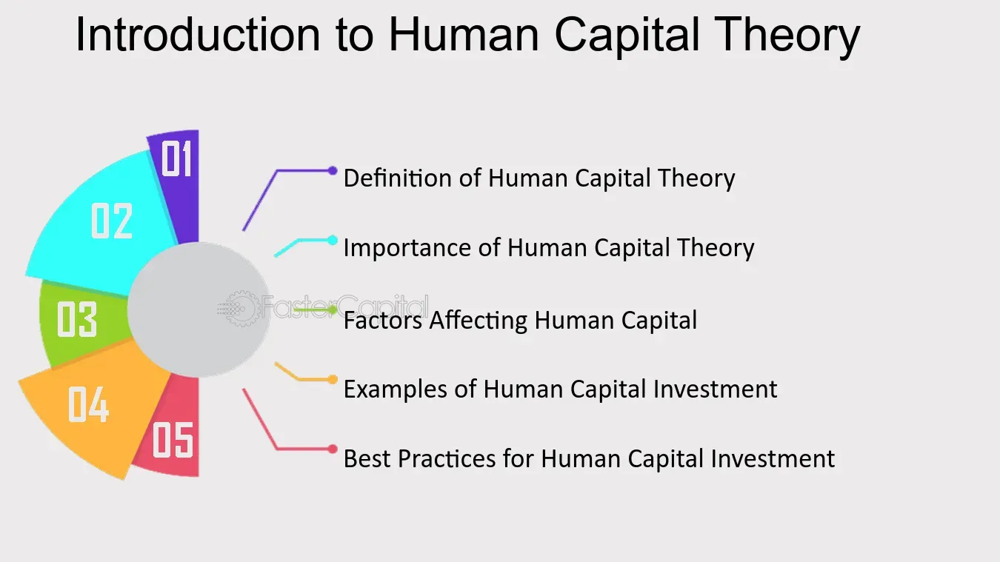

## Table of Contents

## What is Human Capital Theory?

Human Capital Theory is an idea that says people's education, skills, and experience are important parts of a country's wealth. Just like a factory has machines and buildings, a country has people with knowledge and skills. These skills and knowledge help people do their jobs better and make more money. When more people in a country have good education and skills, the whole country can become richer and grow faster.

This theory started becoming popular in the 1960s, thanks to economists like Theodore Schultz and Gary Becker. They said that spending money on education and training is like investing in a business. If you spend money to help people learn new skills, they can earn more money later. This can help not just the people who get the education, but also the whole economy. So, governments and businesses often try to improve education and training programs to make their human capital stronger.

## Who developed the Human Capital Theory?

Human Capital Theory was mainly developed by economists Theodore Schultz and Gary Becker in the 1960s. They believed that a country's wealth isn't just about buildings and machines, but also about the skills and knowledge of its people. They called this "human capital." They thought that if people get a good education and learn new skills, they can do their jobs better and earn more money.

Schultz and Becker said that spending money on education and training is a good investment. Just like a business might buy new machines to make more products, a country can "invest" in its people by helping them learn. When people have better skills, they can help the whole country grow richer. Because of their work, many governments and businesses now focus on improving education and training to make their human capital stronger.

## What are the basic components of human capital?

Human capital is made up of a few important parts. The first part is education. This means going to school, college, or getting other kinds of learning. Education helps people know more and learn new skills. The second part is experience. When people work at jobs, they get better at what they do. This experience makes them more valuable to their employers.

Another part of human capital is skills. These can be things like knowing how to use a computer, speaking another language, or being good at fixing things. Skills can come from school, but also from training or just doing things over and over. The last part is health. If people are healthy, they can work better and learn more easily. So, taking care of health is also important for human capital.

All these parts together make up human capital. When people have good education, lots of experience, useful skills, and good health, they can do their jobs well and help their country grow. That's why it's important for countries to invest in these areas.

## How does education contribute to human capital?

Education is a big part of human capital. It helps people learn new things and get better at doing their jobs. When someone goes to school or takes classes, they learn important stuff like reading, writing, and math. They also learn special skills for jobs, like how to use a computer or fix machines. All this learning makes people more useful at work. Companies like to hire people who know a lot because they can do their jobs well and help the company make more money.

Education also helps people think better and solve problems. When people learn a lot, they can understand things more easily and come up with new ideas. This is good for the whole country because people can find new ways to do things and make life better. That's why countries spend a lot of money on schools and colleges. They know that if more people get a good education, the whole country can grow richer and stronger.

## What is the difference between human capital and physical capital?

Human capital and physical capital are both important for a country's wealth, but they are different. Human capital is about the skills, knowledge, and health of people. It includes things like education, job experience, and training. When people learn new skills or get better at their jobs, they become more valuable to their employers and help the economy grow. Think of human capital as the brains and abilities of the people in a country.

Physical capital, on the other hand, is about the things that people use to make goods and services. This includes buildings, machines, tools, and technology. Physical capital helps workers do their jobs more easily and efficiently. For example, a factory with new machines can make more products faster than a factory with old machines. So, physical capital is like the tools and equipment that help people work better. Both human capital and physical capital are important, but they focus on different parts of what makes a country successful.

## How can human capital be measured?

Measuring human capital can be tricky, but there are some ways to do it. One way is to look at how much education people have. This can be measured by the number of years people spend in school or the highest level of education they complete. Another way is to look at people's job skills and experience. This can be measured by how long people have been working in their jobs or the kinds of skills they have learned. Health is also part of human capital, so things like life expectancy and how often people get sick can be used to measure it.

Another way to measure human capital is by looking at how much money people earn. If people with more education and skills earn more money, it shows that their human capital is valuable. Economists also use surveys and tests to measure people's skills and knowledge directly. For example, they might ask people to solve math problems or read a passage and answer questions about it. All these different ways help give a full picture of a country's human capital and how it's changing over time.

## What are the economic implications of investing in human capital?

When a country spends money on human capital, it can help the whole economy grow. This means putting money into things like schools, training programs, and health care. When people get a good education and learn new skills, they can do their jobs better and earn more money. This makes businesses more successful because they have smarter and more skilled workers. As businesses do better, they can make more products and services, which helps the whole country become richer. So, investing in human capital is like planting seeds that will grow into a stronger economy.

But there are also some challenges. It takes a long time for the benefits of investing in human capital to show up. You can't see the results right away, like you might with buying new machines for a factory. It can take years for people to finish their education and start using their new skills at work. Also, if people move to another country after getting their education, the country that paid for their education might not see all the benefits. Despite these challenges, many experts believe that the long-term gains from investing in human capital are worth it, because a smarter and healthier workforce can lead to a stronger and more prosperous economy.

## How does human capital theory apply to workforce development?

Human capital theory says that the skills, knowledge, and health of people are important for making a country richer. In workforce development, this means helping people learn new things and get better at their jobs. When companies and governments spend money on training programs, they are investing in human capital. This can help workers do their jobs better, which makes businesses more successful. As businesses do better, they can make more products and services, and the whole country can grow richer.

Workforce development programs can include things like job training, apprenticeships, and continuing education. These programs help people learn new skills or improve the ones they already have. For example, a worker might take a [course](/wiki/best-algorithmic-trading-courses) to learn how to use new technology at work. When workers have better skills, they can be more productive and earn more money. This not only helps the workers and their families, but it also helps the company and the economy. So, by focusing on human capital through workforce development, countries can build a stronger and more prosperous future.

## What role does human capital play in economic growth?

Human capital is really important for making a country's economy grow. It's all about the skills, knowledge, and health of the people in a country. When people have good education and learn new skills, they can do their jobs better. This makes businesses more successful because they have smarter and healthier workers. When businesses do well, they can make more products and services, which helps the whole country become richer. So, spending money on things like schools, training programs, and health care is like planting seeds that will help the economy grow bigger and stronger.

But it's not always easy to see the benefits right away. It takes time for people to finish their education and start using their new skills at work. Sometimes, people might even move to another country after getting their education, so the country that paid for it doesn't see all the benefits. Still, many experts believe that the long-term gains from investing in human capital are worth it. A smarter and healthier workforce can lead to a stronger economy, which means more jobs and a better life for everyone in the country.

## How do organizations apply human capital theory in their human resource strategies?

Organizations use human capital theory to make their human resource strategies better. They know that their workers' skills, knowledge, and health are important for the company's success. So, they spend money on things like training programs, education, and health benefits. This helps their employees learn new skills and do their jobs better. When workers are more skilled and healthier, they can be more productive. This makes the company more successful because it can make more products or provide better services.

For example, a company might offer workshops or online courses to help employees learn new technology or improve their skills. They might also have wellness programs to keep their workers healthy. By doing these things, the company is investing in its human capital. This not only helps the workers do better at their jobs, but it also helps the company grow and make more money. So, by focusing on human capital, organizations can build a stronger and more successful business.

## What are the criticisms of human capital theory?

Some people don't agree with everything in human capital theory. They say it focuses too much on how much money people can make from their skills and not enough on other important things. For example, they think that education and training should also be about helping people be good citizens and live happy lives, not just about making them earn more money. They also worry that human capital theory might make people see themselves as just tools for making money, instead of as whole people with many different needs and goals.

Another criticism is that human capital theory doesn't always think about the problems some people face in getting a good education or job training. Not everyone has the same chances to learn new skills or go to school. Things like where you live, how much money your family has, and even what race or gender you are can make it harder for some people to improve their human capital. Critics say that if we really want to help everyone, we need to think about these problems and try to fix them, not just focus on how much money people can make.

## How has human capital theory evolved in response to modern economic challenges?

Human capital theory has changed a lot to fit today's world. In the past, it mainly focused on education and job skills, but now it also looks at things like creativity, teamwork, and being able to learn new things quickly. This is because the world is changing fast, and people need to be able to adapt. For example, with new technology and jobs that didn't exist before, people need to keep learning and be ready to change careers. Also, many jobs now need people to work well with others, so human capital theory includes how to make teams work better together.

Another big change is that human capital theory now pays more attention to things like mental health and well-being. People used to think mostly about how to make workers more productive, but now they know that happy and healthy workers do better work. So, companies and governments are spending more on things like wellness programs and mental health support. They also try to make sure everyone has a fair chance to learn and grow, not just the people who already have a lot of advantages. This way, human capital theory is trying to help everyone in the economy, not just a few people.

## What is the understanding of Human Capital and Workforce Development?

Human capital is a fundamental concept in economics and workforce development, referring to the collective skills, knowledge, and experience possessed by individuals, which enhance their economic productivity and contribute to societal progress. This concept underscores the importance of investing in people as a means to drive economic growth and ensure competitive advantage.

Workforce development, a closely related concept, encompasses the strategies and processes aimed at improving the skill set and capabilities of employees. This is achieved through a variety of methods, including formal education, vocational training, and on-the-job experience. These initiatives ensure that individuals are equipped with the necessary competencies to meet the demands of the ever-evolving job market, promoting both individual success and organizational efficiency.

The human capital theory, articulated by economists like Gary Becker, posits that investments in education and training yield significant returns by enhancing productivity and fostering economic expansion. According to this theory, individuals who acquire more education or training tend to earn higher wages and exhibit increased output. For example, if an individual invests in acquiring new skills, their productivity $P$ can be represented as a function of their human capital $HC$, which grows with each investment:

$$
P = f(HC)
$$

The theory suggests that as $HC$ increases, so does $P$, leading to greater economic outcomes.

In modern economies, developing human capital is not just about formal education but also about acquiring practical skills and experiences that are directly applicable to specific industries. This holistic approach ensures that workforce development aligns with the rapid technological advancements and globalization trends shaping today's market landscape.

Effective workforce development has become increasingly imperative for organizations seeking to maintain a competitive edge and stimulate innovation. Firms that prioritize continuous learning and skill enhancement are better positioned to adapt to changes and capitalize on new opportunities. This is particularly pertinent as businesses confront challenges such as automation and the integration of [artificial intelligence](/wiki/ai-artificial-intelligence), which require a workforce adept in both technical and soft skills.

Consequently, regions and countries that emphasize human capital development tend to exhibit stronger economic performance. They are able to leverage their skilled labor pools to attract investment and drive innovation, ultimately leading to improved living standards and reduced income inequality.

In summary, understanding and investing in human capital and workforce development are critical strategies for organizations and economies aiming to thrive in a competitive global marketplace. These investments not only enhance individual and organizational productivity but also contribute to overall economic prosperity.

## How does Economic Theory Impact Workforce Strategies?

Economic theories provide essential frameworks for understanding the impact of human capital investments on economic growth. Pioneering economists Gary Becker and Theodore Schultz laid the foundation for human capital theory, which underscores education and training as pivotal investments. Becker articulated that individuals and organizations accrue benefits similar to capital investments when they allocate resources to enhance knowledge and skills. These insights led to the recognition of human capital as a key driver of productivity and economic development.

The theory posits that improvements in education and skill levels can lead to higher earnings for individuals and increased productivity for organizations. The mathematical representation of this can be formulated as follows:

$$
\text{Human Capital Stock (H)} = \int_0^T e^{-\delta t} \left( S(t) + E(t) + T(t) \right) \, dt
$$

Where:  
- $S(t)$ represents the skills acquired over time,
- $E(t)$ denotes the education level,
- $T(t)$ refers to the training received,
- $\delta$ is the depreciation rate of human capital,
- $T$ is the time horizon considered.

Behavioral economics further refines these theories by challenging the conventional assumption of rational actors. It posits that human behavior and motivations are complex and influenced by cognitive biases and emotions. This suggests that workforce strategies should account for diverse human motivations, recognizing that not all employees will react predictably to financial incentives or training opportunities.

Furthermore, economic theory highlights human capital's potential to reduce income inequality and enhance productivity across economies. By empowering individuals through education and skills development, disparities in income distribution can be minimized. Organizations benefit by leveraging a skilled workforce to improve output and innovation capabilities.

By understanding these economic theories, organizations can craft strategic workforce development plans that recognize diverse motivations and maximize their human capital potential. This approach is crucial for driving economic success and ensuring sustainable growth.

## References & Further Reading

[1]: Becker, G. S. (1993). ["Human Capital: A Theoretical and Empirical Analysis, with Special Reference to Education"](https://papers.ssrn.com/sol3/papers.cfm?abstract_id=1496221). University of Chicago Press.

[2]: Schultz, T. W. (1961). ["Investment in Human Capital."](https://academic.oup.com/ej/article-abstract/82/326/787/5233631) The American Economic Review, 51(1): 1-17.

[3]: Lopez de Prado, M. (2018). ["Advances in Financial Machine Learning."](https://www.amazon.com/Advances-Financial-Machine-Learning-Marcos/dp/1119482089) Wiley.

[4]: Nash, J., & Gutierrez, N. (1994). ["Financial Innovation, Technology and Asset Pricing."](https://www.jstor.org/stable/2117530) Journal of Finance, 49(2), 771-792.

[5]: Chan, E. P. (2009). ["Quantitative Trading: How to Build Your Own Algorithmic Trading Business."](https://github.com/ftvision/quant_trading_echan_book) Wiley.

[6]: Jansen, S. (2020). ["Machine Learning for Algorithmic Trading."](https://github.com/stefan-jansen/machine-learning-for-trading) Packt Publishing.

[7]: Aronson, D. R. (2007). ["Evidence-Based Technical Analysis: Applying the Scientific Method and Statistical Inference to Trading Signals."](https://onlinelibrary.wiley.com/doi/book/10.1002/9781118268315) Wiley.