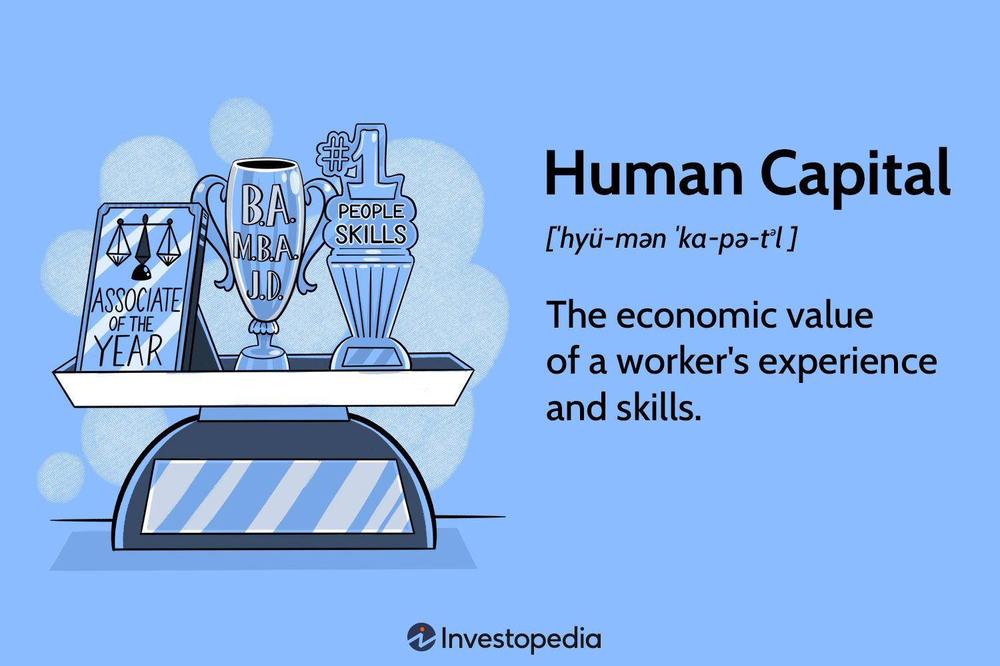

Human capital refers to the stock of skills, knowledge, experience, and attributes embodied in individuals that contribute to their economic productivity. This intangible asset is increasingly recognized as a crucial element in modern economies, where the prowess of a nation's workforce can significantly determine its competitive advantage on the global stage. Advanced skills and education levels bolster innovation, enhance economic resilience, and lead to increased economic output. 

Algorithmic trading, an area where this human capital thrives, refers to the use of algorithms to manage trading decisions automatically. This technology-driven approach to trading has gained considerable traction, enabling market participants to execute orders at speeds and frequencies that a human trader cannot match. The growing influence of algorithmic trading is seen in its robust contributions to market liquidity and efficiency, with estimates suggesting that algorithmic trades account for a substantial portion of market transactions globally.



The relationship between human capital and algorithmic trading is intricate. While algorithms demand precise programming and analytical skills, these tools rely heavily on the intellectual prowess of individuals to design, test, and continually optimize trading strategies. Human capital, therefore, fuels the development and evolution of these sophisticated systems. For instance, data scientists, financial engineers, and IT professionals draw on their expertise to create algorithms capable of processing complex datasets and executing strategic trades on a millisecond scale.

As we turn our focus to exploring different types of human capital within the economy and their implications on algorithmic trading, it becomes evident that the breadth and depth of skills required in successful algorithmic trading are multifaceted. The article will further examine intellectual, social, and creative capital, delving into how these different dimensions collectively contribute to economic advancement and technological innovation. The subsequent sections aim to provide a comprehensive understanding of the synergy between human capital development and the sustained growth of algorithmic trading, illustrating why investing in human capital is paramount for stakeholders eager to leverage technological advancements for economic prosperity.

## Table of Contents

## Understanding Human Capital

Human capital represents the stock of skills, knowledge, and experience possessed by an individual or population, viewed in terms of their value or cost to an organization or country. First introduced by economists such as Adam Smith and later formalized by Gary Becker, human capital has evolved to become a vital component in economic analysis and policy-making. Becker's seminal work in the 1960s emphasized education and training as critical investments in human capital, which can lead to increased productivity and economic growth.

Developing human capital involves acquiring education, skills, and experience. These three elements form the core of human capital:

1. **Education**: Education enhances cognitive abilities and imparts essential analytical and problem-solving skills. It is a primary contributor to economic mobility and can significantly influence earning potential over a person's lifetime. According to OECD studies, higher levels of education correlate strongly with higher employment rates and salaries.

2. **Skills**: Skills refer to specific abilities acquired through practice and learning that support job performance. They can be technical, such as computer programming, or soft skills, like teamwork and communication. The increasing sophistication of the global economy, especially in sectors like technology and finance, has led to a higher demand for specialized skills.

3. **Experience**: Experience constitutes the practical knowledge gained through direct involvement in tasks and activities. It enables individuals to apply theoretical knowledge effectively and adapt to changing work environments. Experienced personnel often contribute more efficiently to productivity and innovation.

The economic impact of a robust human capital base is profound. Businesses benefit from having well-educated and skilled employees who can innovate, improve processes, and increase efficiency. For economies, human capital is linked to higher economic growth rates, improved competitive advantage, and the ability to attract investment. In a study by Hanushek and Woessmann (2010), a direct correlation was observed between the cognitive skills of a country's population and its economic growth rate. The equation for this relationship can be expressed as:

$$
GDP\ Growth = f(Education, Skills, Experience)
$$

Human capital is particularly critical in technical and financial industries. In the technical sector, the rapid pace of innovation demands a workforce capable of developing new technologies and adapting to industry trends. In finance, human capital underpins the sector's ability to create complex financial products, manage risk, and leverage data analytics and [algorithmic trading](/wiki/algorithmic-trading) to optimize market strategies. Investment in human capital development thus becomes indispensable for sectors that are both dynamic and heavily reliant on specialized knowledge and expertise.

## Types of Human Capital in the Economy

Human capital plays a pivotal role in the economic framework by harnessing various forms of skills and knowledge that drive growth and innovation. Among the critical types of human capital influencing the economy are intellectual capital, social capital, and creative capital. Each of these contributes uniquely to economic development.

**Intellectual Capital**

Intellectual capital refers to the intangible assets of an organization or economy, primarily stemming from the knowledge and expertise of its workers. It encompasses an array of elements, including education, skills, patents, and innovations that propel technological advancement and efficiency. In 1990, Thomas A. Stewart brought the concept of intellectual capital to prominence, emphasizing its role in fostering innovation and maintaining competitive advantage. By leveraging intellectual capital, businesses can create new products, optimize processes, and improve service delivery, which in turn drives economic expansion and societal progress. For instance, during the tech boom of the late 20th century, firms like Microsoft and IBM capitalized on their intellectual capital to develop transformative technologies, thereby contributing significantly to economic growth.

**Social Capital**

Social capital pertains to the networks, relationships, and social norms that facilitate coordination and cooperation among individuals or groups. This form of capital is vital for forming partnerships and alliances that can lead to successful business ventures. Robert Putnam, a political scientist, highlighted the significance of social capital in the 1990s by demonstrating how trust and community networks can enhance economic performance. Social capital fosters trust and enhances communication, leading to stronger business relationships and more efficient markets. For example, Silicon Valley’s success as a tech hub can be partly attributed to the dense networks of entrepreneurs, investors, and experts who collaborate and share knowledge, enabling rapid innovation and commercialization of ideas.

**Creative Capital**

Creative capital refers to the capacity of individuals or groups to generate novel ideas, solutions, and artistic expressions that contribute to economic dynamism and cultural enrichment. Richard Florida, an urban studies theorist, coined the term “creative class” in the early 2000s, signifying a segment of the workforce engaged in professions where creativity is crucial. Creative capital powers entrepreneurship by enabling businesses to devise unique products and compelling marketing strategies, thus attracting consumers and achieving economic success. The rise of startups across various sectors, from technology to food services, exemplifies how creative capital stimulates entrepreneurship and paves the way for innovative business models that boost economic diversity and resilience.

These forms of human capital—intellectual, social, and creative—not only bolster individual enterprises but collectively enhance economic growth. Intellectual capital drives technological and process innovations, social capital builds robust business networks and facilitates trust, while creative capital inspires entrepreneurial ventures and diversity. Together, they create a synergistic impact, promoting sustainable economic development and adapting to the continually evolving market requirements. The strategic nurturing and development of these human capital types are thus foundational to both current and future prosperity.

## The Role of Human Capital in Algorithmic Trading

Algorithmic trading, often referred to as algo trading, involves using computer programs to execute trading orders automatically at speeds and frequencies that are impossible for human traders. These algorithms are designed to analyze market data and execute orders based on predetermined trading strategies. Human capital is integral to the development and success of algorithmic trading, as it comprises the knowledge, skills, and expertise necessary for algorithm creation, management, and optimization.

The development and management of trading algorithms require a specialized skill set. Firstly, a strong foundation in quantitative analysis and financial theory is paramount. This includes a deep understanding of market microstructures, pricing theories, and risk management principles. Professionals in this field are often expected to possess advanced degrees in finance, economics, or applied mathematics.

Secondly, proficiency in programming languages is essential. Commonly used languages for writing trading algorithms include Python, R, C++, and Java. For example, Python is favored for its versatility and the vast library ecosystem that includes packages such as pandas for data manipulation, NumPy for numerical computations, and the PyAlgoTrade library for developing trading strategies. Here is a simple example of a moving average crossover strategy implemented in Python:

```python
import pandas as pd

# Load market data
data = pd.read_csv('market_data.csv')

# Calculate moving averages
data['SMA_50'] = data['Close'].rolling(window=50).mean()
data['SMA_200'] = data['Close'].rolling(window=200).mean()

# Generate signals
data['Signal'] = 0
data.loc[data['SMA_50'] > data['SMA_200'], 'Signal'] = 1
data.loc[data['SMA_50'] < data['SMA_200'], 'Signal'] = -1

# Print generated signals
print(data[['Close', 'SMA_50', 'SMA_200', 'Signal']])
```

Data scientists play a crucial role in algorithmic trading by leveraging statistical techniques and [machine learning](/wiki/machine-learning) models to improve trading strategies and predict market trends. They analyze vast amounts of historical data and identify patterns that can inform trading decisions. Moreover, data visualization and interpretation skills help these scientists communicate complex insights in an understandable manner.

Financial engineers, meanwhile, bridge the gap between financial markets and technology. Their expertise in derivative pricing, portfolio management, and stochastic processes allows them to construct sophisticated models that serve as the backbone of trading algorithms. They often use quantitative libraries and tools to simulate trades and assess strategy performance under various market conditions.

IT professionals provide the technological infrastructure necessary for the seamless operation of algorithmic trading systems. They maintain high-frequency trading platforms, ensuring low-latency execution and robust system architecture. Their work involves implementing hardware and software solutions that optimize data processing speeds and enhance system reliability.

In conclusion, human capital is fundamental to the success of algorithmic trading. The synergy between data scientists, financial engineers, and IT professionals enables the design, optimization, and execution of trading strategies that drive financial innovation. Their collective expertise not only advances the efficiency of markets but also pushes the boundaries of what is possible in trading technology.

## Case Studies: Human Capital Shaping Algo Trading

Algorithmic trading has become a cornerstone of modern financial markets, significantly shaped by the human capital behind its development. Several successful firms showcase how diverse skill sets fuel innovation in this fast-paced industry. For instance, Renaissance Technologies, founded by James Simons, exemplifies how a team with robust expertise in mathematics, physics, and data science can drive trading success. The firm's Medallion Fund, renowned for its exceptional returns, capitalizes on advanced mathematical models and computational algorithms, demonstrating the profound impact of specialized human capital.

Similarly, firms like Two Sigma harness the interdisciplinary skills of computer scientists, statisticians, and financial experts to refine their algorithmic strategies continually. Such diversity within teams fosters innovative approaches to problem-solving, enabling these firms to maintain a competitive edge in the market. The integration of different expertise not only enhances algorithmic design but also improves risk management and execution processes.

Educational institutions play a pivotal role in equipping future professionals with the necessary skills for careers in algorithmic trading. Universities and colleges increasingly incorporate data analysis, machine learning, and finance into their curricula, reflecting the changing demands of the industry. Programs that blend traditional finance education with technical skills development are becoming prevalent. For example, Massachusetts Institute of Technology (MIT) offers specialized courses in financial engineering and computational finance, preparing students for the multifaceted challenges of algorithmic trading.

Moreover, initiatives such as hackathons and industry partnerships provide students with practical experience, bridging the gap between academic knowledge and real-world applications. By fostering a learning environment that prioritizes both theoretical understanding and practical skills, these educational programs ensure a steady supply of adept professionals ready to contribute to the evolving landscape of algorithmic trading.

In summary, the strategic use of human capital, characterized by diverse skill sets and comprehensive educational preparation, is critical to the success and innovation within algorithmic trading firms. By continuing to invest in this human capital, the industry can sustain its growth and adaptability amidst technological advancements.

## Challenges and Opportunities in Human Capital for Algo Trading

The rapid evolution of algorithmic trading presents significant challenges and opportunities in developing the requisite human capital. A critical challenge is the skills gap. Algorithmic trading requires a specific skill set that combines expertise in finance, quantitative analysis, computer science, and a deep understanding of financial markets. The scarcity of professionals who possess this unique blend of skills poses a significant hurdle for the industry. 

Training and education must evolve to address these challenges comprehensively. Educational institutions and training providers need to offer curricula that integrate financial theory with practical programming and data analysis skills. Courses in Python, R, and other programming languages, alongside modules in financial engineering and machine learning, can equip professionals with the necessary tools to thrive in algorithmic trading.

Opportunities for upskilling and reskilling are plentiful, particularly in the wake of technological advancements. Online platforms and professional workshops can provide targeted education to help individuals transition from traditional finance roles to algorithmic trading. Initiatives such as coding bootcamps and certification programs can offer intensive training in a short timeframe, thus enabling professionals to acquire new skills efficiently.

Continuous learning and innovation are indispensable in algorithmic trading, a field characterized by rapid technological change and a dynamic market environment. Professionals must stay informed about the latest developments in [artificial intelligence](/wiki/ai-artificial-intelligence), machine learning, and big data analytics to maintain a competitive edge. Regular participation in seminars, webinars, and industry conferences can be instrumental for professionals staying abreast of new trends and methodologies.

In conclusion, the challenges in training human capital for algorithmic trading, notably the skills gap, can be transformed into opportunities through strategic upskilling and reskilling. Continuous learning, supported by innovative educational approaches, is vital in equipping a workforce capable of driving advancements in this evolving field. Stakeholders must emphasize the development of human capital to ensure sustained progress and competitiveness in algorithmic trading.

## Future Trends in Human Capital and Algorithmic Trading

Emerging technologies continue to reshape the landscape of algorithmic trading, significantly impacting the required human capital. As innovations such as artificial intelligence (AI) and machine learning (ML) advance, they promise to transform the skillsets and operational paradigms within the industry.

Machine learning, in particular, is increasingly being integrated into trading strategies due to its ability to process vast datasets and identify patterns unrecognizable to human traders. This integration necessitates proficiency in data science and familiarity with ML frameworks such as TensorFlow or PyTorch, as algorithmic trading teams aim to develop models that can predict market movements with enhanced accuracy.

AI further revolutionizes human capital needs by automating routine tasks. Nevertheless, it concurrently amplifies the demand for professionals capable of designing and supervising advanced algorithms. These professionals must possess not only coding expertise but also deep knowledge of financial markets. The fusion of these domains highlights the rising importance of interdisciplinary skills, blending financial acumen with computational proficiency.

The educational sector is responding to these shifts by broadening curricula to encompass both foundational finance knowledge and cutting-edge technological skills. Universities and training centers now offer specialized programs focused on quantitative finance, data analytics, and AI applications in finance, preparing students for evolving roles in the workforce. These educational advancements are critical as they cultivate the multifaceted human capital required for the future of algorithmic trading.

Looking ahead, the demand for adaptive learning and continuous skill development will grow. This trend emphasizes lifelong learning as a cornerstone for professionals in algorithmic trading, where staying abreast of technological innovations is imperative. As AI and ML tools become more sophisticated, the role of the human capital will evolve, with greater emphasis on strategic oversight, ethical considerations in AI deployment, and creative problem-solving to harness technology's full potential.

## Conclusion

The exploration of human capital and its profound impact on both the broader economy and the specialized field of algorithmic trading has highlighted several key points. Human capital, encapsulating education, skills, and experience, remains a cornerstone of economic development. In contemporary economies, well-developed human capital is vital for stimulating business growth and fostering innovation, particularly within technical and financial industries.

Algorithmic trading, characterized by the use of sophisticated algorithms to automate trading decisions, underscores the reliance on specialized human capital. The critical role of data scientists, financial engineers, and IT professionals underscores the demand for a confluence of diverse skills and expertise in developing and managing these complex systems. Successful algorithmic trading firms consistently demonstrate the value of a multi-disciplinary approach, leveraging a variety of human capital types to drive innovation and maintain competitive advantage.

Despite the challenges, such as bridging the skills gap and ensuring ongoing training in a rapidly evolving field, opportunities abound. Upskilling and reskilling initiatives are imperative to prepare professionals for the demands of algorithmic trading. The continuous evolution within this sector calls for stakeholders to prioritize human capital development, recognizing it as an essential investment for fostering innovation and driving economic growth.

As technological advancements continue to reshape industries, the evolving landscape of human capital needs urgent attention. Emerging technologies such as AI and machine learning are set to further influence the human capital framework, necessitating a forward-thinking approach in education and workforce development. 

Ultimately, the investment in human capital stands as a strategic imperative for fostering sustained economic advancement and innovation. Stakeholders across industries must acknowledge and act upon the critical role human capital plays in navigating the complexities of the modern economy and the specialized practices within fields such as algorithmic trading.

## References & Further Reading

[1]: Bergstra, J., Bardenet, R., Bengio, Y., & Kégl, B. (2011). ["Algorithms for Hyper-Parameter Optimization."](https://papers.nips.cc/paper/4443-algorithms-for-hyper-parameter-optimization) Advances in Neural Information Processing Systems 24.

[2]: ["Advances in Financial Machine Learning"](https://www.amazon.com/Advances-Financial-Machine-Learning-Marcos/dp/1119482089) by Marcos Lopez de Prado

[3]: ["Evidence-Based Technical Analysis: Applying the Scientific Method and Statistical Inference to Trading Signals"](https://www.amazon.com/Evidence-Based-Technical-Analysis-Scientific-Statistical/dp/0470008741) by David Aronson

[4]: ["Machine Learning for Algorithmic Trading"](https://github.com/PacktPublishing/Machine-Learning-for-Algorithmic-Trading-Second-Edition) by Stefan Jansen

[5]: ["Quantitative Trading: How to Build Your Own Algorithmic Trading Business"](https://www.amazon.com/Quantitative-Trading-Build-Algorithmic-Business/dp/0470284889) by Ernest P. Chan