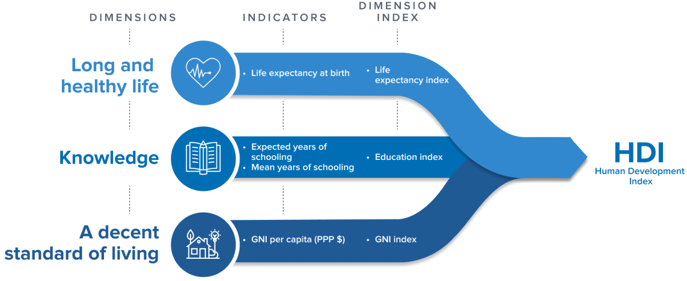

## Table of Contents

## What is the Human Development Index (HDI)?

The Human Development Index (HDI) is a tool used to measure and rank countries based on their level of human development. It was created by the United Nations to provide a broader view of a country's progress than just looking at economic growth. The HDI takes into account three main areas: health, education, and standard of living. By combining these factors, it gives a more complete picture of how well people are living in different countries.

To calculate the HDI, specific indicators are used for each of the three areas. For health, it looks at life expectancy at birth. For education, it considers the average number of years of schooling people receive and the expected years of schooling for children. For standard of living, it uses the Gross National Income (GNI) per capita. Each country gets a score between 0 and 1, with a higher score meaning a higher level of human development. This helps people understand and compare the quality of life across different nations.

## Who developed the Human Development Index and when was it introduced?

The Human Development Index was developed by a Pakistani economist named Mahbub ul Haq. He worked with other economists, including Amartya Sen from India, to create the HDI. They wanted a way to measure how well countries were doing that was not just about money. They thought it was important to look at people's health, education, and living standards too.

The HDI was first introduced in 1990. It was included in the first Human Development Report, which was published by the United Nations Development Programme (UNDP). Since then, the HDI has been used every year to rank countries and show how they are doing in terms of human development. It helps people around the world understand which countries are doing well and which ones need more help.

## What are the three main dimensions used to calculate the HDI?

The Human Development Index, or HDI, uses three main dimensions to measure how well people are doing in different countries. These dimensions are health, education, and standard of living. Each of these areas is important because they show different parts of people's lives and how well they are living.

For health, the HDI looks at how long people are expected to live when they are born. This is called life expectancy at birth. For education, it checks how many years of school people have finished and how many years of school children are expected to get. This helps understand how much people are learning. For standard of living, the HDI uses the Gross National Income (GNI) per person to see how much money people have to live on. By looking at these three things together, the HDI gives a full picture of how well people are doing in a country.

## How is the HDI calculated?

The Human Development Index, or HDI, is calculated by looking at three main areas: health, education, and standard of living. Each of these areas uses specific numbers to measure how well a country is doing. For health, the HDI uses life expectancy at birth, which is how long people are expected to live when they are born. For education, it looks at two things: the average number of years of schooling people have finished and the expected years of schooling for children. For standard of living, it uses the Gross National Income (GNI) per person, which shows how much money people have to live on.

To find the HDI score, each of these areas gets a number between 0 and 1. The numbers are then put together using a special formula to get the final HDI score for a country. This score helps people see how well a country is doing in terms of human development. A higher score means the country is doing better in these areas. By comparing HDI scores, people can understand which countries are doing well and which ones need more help.

## What is considered a high HDI score?

A high HDI score is usually anything above 0.800. Countries with scores in this range are doing well in health, education, and standard of living. For example, countries like Norway, Switzerland, and Australia often have HDI scores above 0.900, which means they are doing very well in these areas.

The HDI score helps people see how different countries are doing. If a country has a high HDI score, it means people there are living longer, getting more education, and have more money to live on. This helps governments and organizations know where to focus their efforts to help people live better lives.

## How does the HDI differ from GDP per capita as a measure of development?

The Human Development Index, or HDI, and Gross Domestic Product (GDP) per capita are two different ways to measure how well a country is doing. GDP per capita looks at how much money people in a country make on average. It's all about the economy and how much money is being made. But, the HDI is different because it looks at more than just money. It also checks how healthy people are, how much education they get, and their overall standard of living. So, while GDP per capita focuses only on economic growth, the HDI gives a fuller picture of how people are living.

Because the HDI looks at health, education, and income together, it can show a more complete view of development. For example, a country might have a high GDP per capita because it makes a lot of money, but if people there don't live long or don't get much education, the HDI score would be lower. This helps us see that money alone doesn't mean people are living well. The HDI helps governments and organizations understand where to focus their efforts to make life better for people, not just to grow the economy.

## Can you explain the significance of the HDI in global policy-making?

The Human Development Index, or HDI, is really important for people who make global policies. It helps them see how well countries are doing in terms of people's health, education, and living standards, not just how much money they make. By using the HDI, policy-makers can see which countries need more help and where they should focus their efforts. For example, if a country has a low HDI score, it might mean people there need better healthcare or more schools. This helps global organizations like the United Nations decide where to send aid and what kind of help to give.

The HDI also helps policy-makers compare different countries and see how they are doing over time. If a country's HDI score goes up, it means things are getting better for people there. This can show that policies are working and help decide what to do next. On the other hand, if the HDI score goes down, it can be a warning that something isn't right and needs to be fixed. By looking at the HDI, people who make global policies can make better choices to help people live better lives around the world.

## What are the limitations and criticisms of the HDI?

The Human Development Index, or HDI, has some problems and people have criticized it. One big problem is that the HDI only looks at three things: health, education, and money. But there are other important things that affect how well people live, like how safe they feel, if they have clean water, and if they have rights and freedoms. The HDI doesn't include these, so it might not show the full picture of how people are doing. Also, the HDI treats all countries the same, but what matters most can be different in different places. For example, in a country where many people don't have enough to eat, having more food might be more important than getting more education.

Another criticism is that the HDI can hide big differences inside a country. Even if a country has a high HDI score, some people might still be very poor or not have good healthcare. The HDI looks at the whole country and doesn't show these differences. Also, the way the HDI is calculated can be tricky. It uses numbers that might not be perfect or up-to-date, which can make the HDI score not completely accurate. People who study development think these problems mean we need to be careful when using the HDI to make decisions about helping countries improve.

## How has the methodology of calculating HDI evolved over time?

The way the Human Development Index, or HDI, is calculated has changed a bit since it first started in 1990. At the beginning, the HDI only looked at three things: life expectancy for health, school years for education, and money per person for living standards. But as people learned more about what makes life good, they wanted to make the HDI better. So, in 2010, they changed how they calculated it. They started using new numbers for education, like the average years of schooling people finished and the expected years of schooling for kids. They also started using a different kind of money measure called Gross National Income (GNI) per person instead of Gross Domestic Product (GDP) per person. This helped make the HDI a better tool to see how people were doing.

Over time, the people who make the HDI also added new ways to look at development. They created things like the Inequality-adjusted HDI, which takes into account how unevenly health, education, and money are spread out in a country. They also made the Gender Development Index to see how men and women are doing differently. These new ways help give a fuller picture of how well people are living. Even though the basic idea of the HDI stays the same, these changes show that the people who make it are always trying to make it better and more useful for understanding how countries are doing.

## What are some examples of countries with significant changes in their HDI scores over the past decade?

Over the past decade, some countries have made big improvements in their HDI scores. For example, Ethiopia has seen a big jump in its HDI score. This is because people there are living longer, more kids are going to school, and the country is making more money. Another country that has improved a lot is Bangladesh. They have worked hard to make sure more people get healthcare and education, which has helped raise their HDI score.

On the other hand, some countries have not done as well. For instance, Venezuela's HDI score has gone down because of problems with their economy and healthcare system. People there are not living as long as before, and it's harder for them to get good education and make money. These examples show that the HDI can go up or down depending on what's happening in a country. It helps us see which places are doing better and which ones need more help.

## How does the HDI correlate with other development indicators like life expectancy and education?

The HDI is closely connected to life expectancy and education because these are two of the three main things it measures. Life expectancy shows how healthy people are, and it's a big part of the HDI. If people in a country are living longer, it usually means they have good healthcare and a good way of life. This makes the HDI score go up. For example, if a country works on making sure everyone can see a doctor and eat healthy food, life expectancy might go up, and the HDI score will get better too.

Education is also really important for the HDI. The HDI looks at how many years of school people have finished and how many years of school kids are expected to get. If a country makes sure more people can go to school and stay in school longer, the education part of the HDI will go up. This can also help the whole HDI score because education helps people get better jobs and make more money, which is the third part of the HDI. So, when countries focus on making education better, they often see their HDI scores improve.

## What are the future prospects and potential improvements for the HDI?

The future of the Human Development Index, or HDI, looks promising as people keep working to make it better. One big thing they might do is add more things to the HDI to make it show a fuller picture of how people are living. Right now, it looks at health, education, and money, but they could add things like how safe people feel, if they have clean water, and if they have rights and freedoms. This would help the HDI show more about what makes life good for people. Also, they might use better numbers and ways to calculate the HDI to make it more accurate and up-to-date.

Another way the HDI could get better is by looking more closely at differences inside countries. Right now, the HDI gives one score for the whole country, but it doesn't show if some people are doing much better or worse than others. By making the HDI show these differences, it could help people see where help is needed the most. Also, as the world changes, the HDI might need to change too. For example, as climate change becomes a bigger problem, the HDI might need to think about how it affects people's lives. By keeping up with these changes, the HDI can stay a useful tool for understanding and improving how people live around the world.

## How is the HDI measured?

The Human Development Index (HDI) is a composite metric that evaluates a country's average achievements in three fundamental dimensions of human development: health, education, and living standards. It is calculated using the geometric mean of normalized indices for these dimensions.

**1. Health** is measured by life expectancy at birth. This indicator reflects the ability to lead a long and healthy life. The life expectancy index is calculated using the formula:

$$
\text{Life Expectancy Index} = \frac{\text{LE} - 20}{85 - 20}
$$

where $\text{LE}$ is the life expectancy at birth. Here, 20 years is the minimum, representing a minimum plausible lifespan, and 85 is the maximum.

**2. Education** is assessed with two metrics: mean years of schooling for adults aged 25 years and older, and expected years of schooling for children entering the school-age cohort. These are used to calculate two sub-indices: 

- $\text{Mean Years of Schooling Index} = \frac{\text{Mean years of schooling}}{15}$
- $\text{Expected Years of Schooling Index} = \frac{\text{Expected years of schooling}}{18}$

15 is the maximum number of actual school years considered, and 18 is the maximum expected years, representing a full education cycle from primary to obtaining a master's degree.

The education index is a simple average of these two sub-indices:

$$
\text{Education Index} = \frac{\text{Mean Years of Schooling Index} + \text{Expected Years of Schooling Index}}{2}
$$

**3. Living Standards** is gauged by Gross National Income (GNI) per capita, adjusted for purchasing power parity (PPP). The income index uses:

$$
\text{Income Index} = \frac{\log(\text{GNI per capita}) - \log(100)}{\log(75000) - \log(100)}
$$

This logarithmic transformation reflects the diminishing returns of income on human development; 100 is the minimum income threshold, while 75,000 represents the maximum threshold.

Finally, the HDI is the geometric mean of the three dimension indices:

$$
\text{HDI} = \left( \text{Life Expectancy Index} \times \text{Education Index} \times \text{Income Index} \right)^{\frac{1}{3}}
$$

Each component is normalized on a scale from 0 to 1, providing a comprehensive measure ranging from 0 (lowest human development) to 1 (highest human development). This normalization allows comparability across countries and over time, facilitating assessments and policy evaluations about human progress.

## References & Further Reading

[1]: Haq, M., & Khadija, A. (1990). ["United Nations Development Programme: Human Development Report."](https://hdr.undp.org/content/human-development-report-1990) Oxford University Press.

[2]: Sen, A. (1999). ["Development as Freedom."](https://books.google.com/books/about/Development_as_Freedom.html?id=NQs75PEa618C) Anchor Books.

[3]: Klugman, J., Rodríguez, F., & Choi, H. J. (2011). ["The HDI 2010: new controversies, old critiques."](https://link.springer.com/article/10.1007/s10888-011-9178-z) Journal of Economic Inequality, 9(2), 249-288.

[4]: Lopez de Prado, M. (2018). ["Advances in Financial Machine Learning."](https://www.amazon.com/Advances-Financial-Machine-Learning-Marcos/dp/1119482089) Wiley.

[5]: Ul Haq, M. (1995). ["Reflections on Human Development."](https://academic.oup.com/book/51844) Oxford University Press.

[6]: Ranis, G., Stewart, F., & Ramirez, A. (2000). ["Economic Growth and Human Development."](http://www.econ.yale.edu/~granis/papers/cp0546.pdf) World Development, 28(2), 197-219.

[7]: Martinez-Alier, J., Pascual, U., Vivien, F. D., & Zaccai, E. (2010). ["Sustainable de-growth: Mapping the context, criticisms and future prospects of an emergent paradigm."](https://www.sciencedirect.com/science/article/abs/pii/S0921800910001606) Ecological Economics, 69(9), 1741-1747.

[8]: Ghemawat, P., & Altman, S. A. (2016). ["The State of Globalization in a Fragile World."](https://onlinelibrary.wiley.com/doi/abs/10.1002/joe.21885) Harvard Business Review.