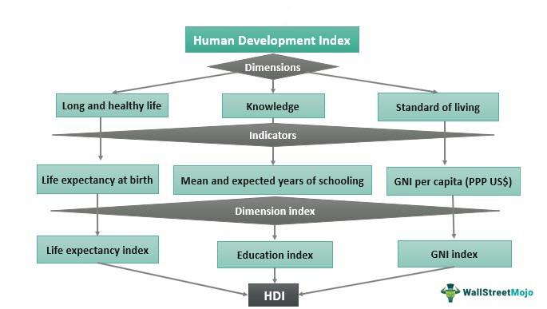

The Human Development Index (HDI) is a comprehensive metric crafted by the United Nations to evaluate and compare economic and social development across the globe. Since its establishment in 1990, the HDI has served to underscore the significance of individual human capabilities in assessing a country's developmental progress, shifting focus from traditional economic assessments that concentrate predominantly on gross domestic product (GDP) or other financial metrics. Through this article, we aim to examine the relevance of the HDI, detail the methodology behind its measurement, and analyze the implications of its rankings and inherent limitations. Additionally, the article will review the intriguing application of indices such as the HDI in algorithmic trading, especially concerning emerging markets and trends in global development.

The HDI's design reflects the belief that development should be more than the accumulation of wealth or economic expansion — it should also incorporate improvements in human well-being. It accomplishes this by integrating multiple dimensions that represent core aspects of human development. These dimensions include access to education, health outcomes, and living standards, which collectively provide a more nuanced picture of development compared to purely economic indicators.



In assessing the index, we will dissect its methodology, which employs a geometric mean to evaluate normalized indices across three primary dimensions: health, education, and living standards. This calculation enables comparative analyses between different countries, sparking critical discussions and policy debates focused on areas with room for enhancement.

The HDI's ranking often provides a telling narrative of global development disparities, with high-ranking nations typically found in Northern Europe exhibiting superior education systems, extended life expectancies, and robust economies. Meanwhile, developing and least developed countries, particularly across Africa, tend to feature lower scores, drawing attention to regions where international aid and well-crafted policy interventions could make a substantial impact.

Despite its widespread utility, the HDI is not without its criticisms. Critics argue that the index's focus on limited indicators results in an oversimplification of the complex nature of development. Significant aspects such as inequalities, human security, and political freedoms remain outside its purview, prompting the employment of supplemental indices to achieve a more rounded understanding of development challenges.

Moreover, the growing utilization of HDI and similar development indices by algorithmic trading entities represents an innovative frontier. Traders are leveraging shifts in HDI metrics to appraise the investment potential and stability of nations, aligning capital flows with socio-economic growth trajectories. This emergent practice calls for advanced algorithms capable of processing complex sets of data to inform financial decision-making robustly.

In conclusion, the HDI continues to be instrumental in assessing international development status. Its influence, extending into fields like algorithmic trading, underscores the evolving interpretation of data beyond traditional financial analysis, illuminating a path for informed policy-making and strategic investment planning.

## Table of Contents

## Understanding the Human Development Index

The Human Development Index (HDI) serves as a composite measure designed to provide a broader perspective on a country's development by considering both economic and social dimensions. It encompasses four main indicators: mean years of schooling, expected years of schooling, life expectancy at birth, and gross national income (GNI) per capita. These indicators collectively enable the HDI to offer a more rounded assessment of development, moving beyond purely economic metrics. 

Mean years of schooling and expected years of schooling form the educational component of the HDI. The mean years of schooling measures the average number of years of education received by people aged 25 and older, whereas expected years of schooling represents the total years of schooling a child of school entrance age can expect to receive if current enrolment rates persist throughout their life. Together, these indicators reflect both the current educational attainment and future educational prospects of a population.

Life expectancy at birth serves as the health dimension indicator, offering insight into the general health and longevity of a country's population. It is a widely recognized measure, often correlated with various social determinants of health, such as access to healthcare, nutrition, and living conditions.

The economic aspect is captured by the gross national income (GNI) per capita, which is adjusted for purchasing power parity (PPP) to account for differences in the cost of living and inflation rates among countries. This adjustment ensures that the income component reflects the real purchasing power of incomes, thus providing a more accurate comparison of living standards across nations.

The HDI is instrumental in facilitating international comparisons, which can drive policy debates and highlight areas requiring improvement. By allowing countries to benchmark their progress against others, the HDI fosters a dialogue about the means to enhance human development. The multidimensional nature of the HDI highlights disparities and encourages strategies that promote balanced improvements in health, education, and standard of living.

## How Is the HDI Measured?

The Human Development Index (HDI) is a composite metric that evaluates a country's average achievements in three fundamental dimensions of human development: health, education, and living standards. It is calculated using the geometric mean of normalized indices for these dimensions.

**1. Health** is measured by life expectancy at birth. This indicator reflects the ability to lead a long and healthy life. The life expectancy index is calculated using the formula:

$$
\text{Life Expectancy Index} = \frac{\text{LE} - 20}{85 - 20}
$$

where $\text{LE}$ is the life expectancy at birth. Here, 20 years is the minimum, representing a minimum plausible lifespan, and 85 is the maximum.

**2. Education** is assessed with two metrics: mean years of schooling for adults aged 25 years and older, and expected years of schooling for children entering the school-age cohort. These are used to calculate two sub-indices: 

- $\text{Mean Years of Schooling Index} = \frac{\text{Mean years of schooling}}{15}$
- $\text{Expected Years of Schooling Index} = \frac{\text{Expected years of schooling}}{18}$

15 is the maximum number of actual school years considered, and 18 is the maximum expected years, representing a full education cycle from primary to obtaining a master's degree.

The education index is a simple average of these two sub-indices:

$$
\text{Education Index} = \frac{\text{Mean Years of Schooling Index} + \text{Expected Years of Schooling Index}}{2}
$$

**3. Living Standards** is gauged by Gross National Income (GNI) per capita, adjusted for purchasing power parity (PPP). The income index uses:

$$
\text{Income Index} = \frac{\log(\text{GNI per capita}) - \log(100)}{\log(75000) - \log(100)}
$$

This logarithmic transformation reflects the diminishing returns of income on human development; 100 is the minimum income threshold, while 75,000 represents the maximum threshold.

Finally, the HDI is the geometric mean of the three dimension indices:

$$
\text{HDI} = \left( \text{Life Expectancy Index} \times \text{Education Index} \times \text{Income Index} \right)^{\frac{1}{3}}
$$

Each component is normalized on a scale from 0 to 1, providing a comprehensive measure ranging from 0 (lowest human development) to 1 (highest human development). This normalization allows comparability across countries and over time, facilitating assessments and policy evaluations about human progress.

## HDI Rankings and Their Implications

Top-ranking countries in the Human Development Index (HDI) consistently demonstrate a combination of high life expectancies, extensive educational opportunities, and strong economic outputs as measured by Gross National Income (GNI) per capita. These nations, often including those from Northern Europe such as Norway, Switzerland, and Ireland, are characterized by advanced healthcare systems, comprehensive education policies, and flourishing economies. For example, Norway has maintained a high HDI ranking due to its substantial investments in health and education, coupled with a robust social welfare system and a prosperous economy.

In contrast, developing and least developed countries frequently display lower HDI scores. This is particularly prominent in African nations such as Nigeria, Chad, and the Central African Republic. Factors contributing to these lower scores include limited access to quality healthcare and education, as well as insufficient economic resources. These challenges highlight potential targets for international development aid and policy improvements. Interventions often focus on improving healthcare access, enhancing educational frameworks, and facilitating economic development to build a sustainable improvement in HDI indicators.

The disparities in HDI rankings emphasize the need for a multifaceted approach in addressing global development challenges. By identifying the lagging areas in health, education, or economic performance, policymakers and international bodies can tailor their strategies to effectively support countries in improving their human development metrics. This targeted approach can foster a more equitable and sustainable global development landscape, where progress in HDI is a reflection of comprehensive social and economic advancements.

## Limitations of the HDI

Critics argue that the Human Development Index (HDI) often oversimplifies the complexities inherent in measuring a nation’s development. This criticism primarily stems from the HDI's reliance on a limited set of indicators: life expectancy, education levels, and Gross National Income (GNI) per capita. While these metrics provide a valuable snapshot of development status, they fall short in reflecting the full spectrum of factors that influence human well-being.

A significant limitation of the HDI is its inability to account for inequalities. The index provides an average value that may mask disparities within a country’s population. For instance, two countries with similar HDI scores could have vastly different internal inequality levels, rendering the comparisons misleading if equity is of central concern. In response to this issue, the United Nations introduced the Inequality-adjusted HDI (IHDI), which considers the distribution of achievements across the population, discounting the HDI according to the extent of inequality.

Another pivotal aspect absent from the HDI is human security, which encompasses elements such as protection from crime and violence, access to clean environments, and personal safety. These factors are crucial for assessing the true quality of life but are not explicitly measured by the HDI. An index called the Human Security Index attempts to fill this gap, incorporating environmental, economic, and social factors to evaluate security levels.

Political freedoms, another dimension missing from the HDI, shape the capabilities and choices available to individuals. Elements such as civil liberties, freedom of expression, and democratic governance are essential to understanding human flourishing as they directly influence how individuals can pursue and achieve their goals. Indices like the Democracy Index and the Political Terror Scale offer insights into these facets of development, providing a more nuanced picture when used in conjunction with the HDI.

To address these critiques, a range of complementary indices has been developed, each aiming to capture aspects of development not covered by the HDI. For policy makers, leveraging these diverse measures alongside HDI can facilitate a more comprehensive understanding of development challenges, fostering informed decision-making tailored to the intricate realities of each country's socio-economic context.

## HDI in Algorithmic Trading: An Emerging Use

Algorithmic trading is increasingly leveraging comprehensive datasets, such as the Human Development Index (HDI), to identify and capitalize on emerging market trends. The HDI's aggregation of health, education, and income indicators provides a multifaceted perspective on a country's developmental status, which can serve as a proxy for assessing potential economic stability and growth. By analyzing changes in HDI, traders aim to predict not only economic conditions but also the broader socio-economic trends that influence market dynamics.

The integration of HDI into [algorithmic trading](/wiki/algorithmic-trading) strategies involves using sophisticated algorithms capable of processing large volumes of socioeconomic data. These algorithms must efficiently analyze HDI fluctuations alongside other relevant variables to assess a country’s market viability. This approach necessitates advanced [machine learning](/wiki/machine-learning) models that can handle complex datasets and discern patterns indicative of financial opportunities.

For instance, an algorithm might incorporate HDI data as follows:

```python
import pandas as pd
import numpy as np
from sklearn.preprocessing import MinMaxScaler
from sklearn.ensemble import RandomForestRegressor

# Load HDI dataset
hdi_data = pd.read_csv("hdi_data.csv")

# Normalize HDI scores between 0 and 1
scaler = MinMaxScaler()
hdi_data['HDI_scaled'] = scaler.fit_transform(hdi_data['HDI'].values.reshape(-1, 1))

# Prepare additional socioeconomic indicators
socioeconomic_data = pd.read_csv("socioeconomic_data.csv")

# Merge datasets for holistic analysis
combined_data = pd.merge(hdi_data, socioeconomic_data, on="Country")

# Define features and target for the model
features = combined_data.drop(columns=["Market_Outcome"])
target = combined_data["Market_Outcome"]

# Initialize and train model
model = RandomForestRegressor(n_estimators=100, random_state=42)
model.fit(features, target)

# Predict market trends based on HDI and other indicators
predicted_trends = model.predict(features)
```

In this example, HDI scores are normalized, ensuring consistency with other data inputs. A Random Forest model is then utilized to predict potential market outcomes. Beyond simply focusing on raw financial indicators, this method places HDI within a broader context, recognizing its correlation with long-term investment viability. As traders refine such models, they stand to gain nuanced insights into how socioeconomic development influences market behavior, providing a strategic edge in global markets.

Incorporating indices like HDI into algorithmic models also highlights the growing intersection between development economics and finance. By doing so, traders not only seek profit but also contribute to a more dynamic understanding of global development impacts, potentially influencing both private and public investment strategies.

## Conclusion

The Human Development Index (HDI) remains a vital metric for evaluating the multifaceted dimensions of global development. It transcends traditional economic indicators by incorporating crucial factors like education and health, thereby offering a more holistic view of a country’s development status. This multidimensional approach underscores the importance of considering human capabilities in the broader development equation. Furthermore, the innovative application of HDI in algorithmic trading exemplifies its utility beyond conventional uses. Traders leveraging HDI data can gain insights into socio-economic trends that affect market dynamics, enabling them to make astute investment decisions in emerging markets. 

The integration of socio-economic indicators like HDI in financial modeling emphasizes the potential for data-driven strategies that are informed by broader developmental patterns. This paradigm shift not only enhances the predictive power of financial analyses but also encourages more nuanced risk assessments in global investments. Understanding both the strengths and limitations of the HDI fosters more informed policy-making and investment strategies. As policy-makers and investors alike navigate the complexities of global development, having a comprehensive grasp of the HDI helps in formulating responses that are equitable and sustainable, ultimately contributing to improved socio-economic outcomes worldwide.

## References & Further Reading

[1]: Haq, M., & Khadija, A. (1990). ["United Nations Development Programme: Human Development Report."](https://hdr.undp.org/content/human-development-report-1990) Oxford University Press.

[2]: Sen, A. (1999). ["Development as Freedom."](https://books.google.com/books/about/Development_as_Freedom.html?id=NQs75PEa618C) Anchor Books.

[3]: Klugman, J., Rodríguez, F., & Choi, H. J. (2011). ["The HDI 2010: new controversies, old critiques."](https://link.springer.com/article/10.1007/s10888-011-9178-z) Journal of Economic Inequality, 9(2), 249-288.

[4]: Lopez de Prado, M. (2018). ["Advances in Financial Machine Learning."](https://www.amazon.com/Advances-Financial-Machine-Learning-Marcos/dp/1119482089) Wiley.

[5]: Ul Haq, M. (1995). ["Reflections on Human Development."](https://academic.oup.com/book/51844) Oxford University Press.

[6]: Ranis, G., Stewart, F., & Ramirez, A. (2000). ["Economic Growth and Human Development."](http://www.econ.yale.edu/~granis/papers/cp0546.pdf) World Development, 28(2), 197-219.

[7]: Martinez-Alier, J., Pascual, U., Vivien, F. D., & Zaccai, E. (2010). ["Sustainable de-growth: Mapping the context, criticisms and future prospects of an emergent paradigm."](https://www.sciencedirect.com/science/article/abs/pii/S0921800910001606) Ecological Economics, 69(9), 1741-1747.

[8]: Ghemawat, P., & Altman, S. A. (2016). ["The State of Globalization in a Fragile World."](https://onlinelibrary.wiley.com/doi/abs/10.1002/joe.21885) Harvard Business Review.