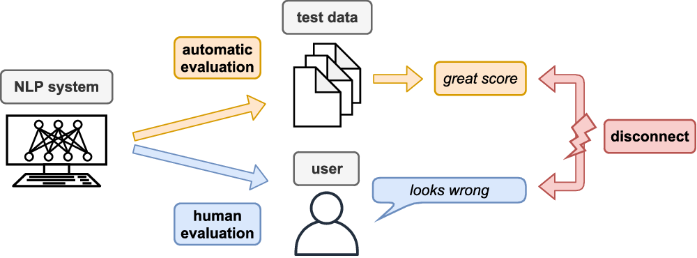

## Table of Contents

## What is human evaluation in the context of machine learning?

Human evaluation in machine learning is when people check how well a computer program is doing its job. This is important because sometimes computers can make mistakes that other computers might not notice, but humans can. For example, if a computer is trying to understand what people are saying in different languages, it might get confused with slang or local expressions. Humans can tell if the computer got it right or wrong.

In many machine learning projects, human evaluation helps to make the computer program better. People look at the results the computer gives and say if they are good or need to be better. This feedback helps the people who are making the program to fix it and make it work better. For example, if a computer is trying to pick out pictures of cats, humans can look at the pictures the computer chose and say if they are really cats or not. This way, the computer learns from its mistakes and gets better over time.

## Why is human evaluation important in machine learning?

Human evaluation is important in machine learning because it helps make sure the computer program is working correctly. Computers can sometimes make mistakes that other computers might not catch, but humans can easily spot these errors. For example, if a computer is trying to translate languages, it might struggle with slang or local expressions. Humans can check the translations and say if they make sense or not. This feedback is crucial for improving the program and making it more accurate.

Additionally, human evaluation helps in refining machine learning models. When humans review the results of a machine learning task, like identifying objects in images, they can tell if the computer made the right choices. For instance, if a computer is supposed to find all the pictures of dogs, humans can look at the selected images and confirm if they are indeed dogs. This process helps the developers understand where the computer is going wrong and how to fix it, leading to better performance over time.

## How does human evaluation differ from automated evaluation methods?

Human evaluation and automated evaluation are two different ways to check how well a [machine learning](/wiki/machine-learning) program is working. Human evaluation involves people looking at the results of the program and deciding if they are correct or not. For example, if a computer is trying to recognize pictures of cats, humans can look at the pictures the computer picked and say if they are really cats or not. This method is good because humans can understand things like slang, local expressions, or subtle differences that computers might miss. However, human evaluation can be slow and expensive because it takes time for people to look at everything.

Automated evaluation, on the other hand, uses other computer programs to check the results of the machine learning program. These programs use specific rules or formulas to decide if the results are correct. For example, if a computer is trying to translate sentences, another program might check if the words are in the right order and if they match a dictionary. Automated evaluation is fast and can handle a lot of data quickly, but it might miss things that only humans can understand. It's like using a calculator to check math homework; it can tell if the numbers are right, but it can't explain if the way you solved the problem makes sense.

Both methods have their place in machine learning. Human evaluation is important for making sure the program understands things the way people do, while automated evaluation is useful for quickly checking a lot of data. Together, they help make machine learning programs better and more accurate.

## What are the common methods used for human evaluation in machine learning?

Human evaluation in machine learning often involves people checking the results of a computer program to see if they are correct. One common method is direct assessment, where people look at the output of the program and rate it on a scale. For example, if the program is translating sentences, humans might read the translations and give a score from 1 to 5 based on how good the translation is. Another method is pairwise comparison, where people are shown two outputs and asked to choose which one is better. This helps to rank different versions of a program to see which one works best.

Another method is error analysis, where humans look at the mistakes the program makes and try to understand why they happened. This can help improve the program by fixing the specific issues that were found. For example, if a program that recognizes pictures of dogs often mistakes cats for dogs, humans can look at these mistakes and suggest ways to tell the difference better. Additionally, crowdsourcing is often used to gather a lot of human evaluations quickly. Platforms like Amazon Mechanical Turk allow many people to evaluate a program's output, making the process faster and more efficient.

These methods help make sure that machine learning programs are working well and understanding things the way people do. Human evaluation is important because it can catch mistakes that other computers might miss, like understanding slang or local expressions. By using these different methods, developers can get valuable feedback to improve their programs and make them more accurate over time.

## Can you explain the role of human evaluators in machine learning projects?

Human evaluators play a crucial role in machine learning projects by checking how well the computer program is doing its job. They look at the results the computer gives and say if they are correct or not. For example, if a computer is trying to translate sentences from one language to another, human evaluators can read the translations and tell if they make sense or if they need to be better. This feedback helps the people who are making the program to fix it and make it work better. Human evaluators can understand things like slang, local expressions, or subtle differences that computers might miss, which is why their input is so important.

In many machine learning projects, human evaluators help refine the models by doing things like direct assessment, where they rate the output on a scale, or pairwise comparison, where they choose the better of two outputs. They also do error analysis, looking at the mistakes the computer makes to understand why they happened and how to fix them. For example, if a program that recognizes pictures of dogs often mistakes cats for dogs, human evaluators can look at these mistakes and suggest ways to tell the difference better. By using these methods, human evaluators provide valuable feedback that helps improve machine learning programs and make them more accurate over time.

## What are the challenges faced when implementing human evaluation?

One challenge with human evaluation is that it can be slow and expensive. It takes a lot of time for people to look at all the results of a machine learning program and decide if they are correct or not. This means it can cost a lot of money to pay people to do this work. For example, if a computer is trying to understand what people are saying in different languages, it might take a long time for humans to check all the translations and make sure they are right. This can slow down the whole project and make it harder to improve the program quickly.

Another challenge is that human evaluators might not always agree with each other. Different people might have different opinions about what is right or wrong. For instance, if a computer is trying to recognize pictures of cats, one person might think a certain picture is a cat, while another person might think it is not. This can make it hard to know if the computer is really doing a good job or not. It's important to have clear rules and guidelines for the evaluators to follow, but even then, getting everyone to agree can be tough.

## How can biases be minimized in human evaluation processes?

One way to minimize biases in human evaluation is to use a diverse group of evaluators. When people from different backgrounds and experiences look at the results of a machine learning program, they can help catch biases that might be missed by a group of similar people. For example, if a computer is trying to recognize pictures of people, having evaluators from different cultures can help make sure the program works well for everyone. It's also important to train the evaluators well and give them clear rules to follow, so they all understand what they are looking for and how to judge the results fairly.

Another way to reduce biases is to use blind evaluation methods. This means that the evaluators do not know any details about the results they are checking, like who made them or what the computer was trying to do. By keeping this information hidden, evaluators can focus just on the results themselves and not be influenced by other factors. For example, if a computer is trying to translate sentences, the evaluators should not know which program made the translation. This helps make sure their judgments are based only on how good the translation is, and not on any other information that might cause bias.

## What metrics are typically used in human evaluation of machine learning models?

In human evaluation of machine learning models, several metrics are commonly used to assess the performance of the model. One of the most straightforward metrics is accuracy, where human evaluators check if the model's output matches the expected result. For example, if a model is trying to recognize pictures of cats, humans will count how many times the model correctly identifies a cat. Another important metric is the quality score, where evaluators rate the output on a scale, like from 1 to 5, to show how good it is. This is often used for tasks like translation, where humans can judge how well a sentence is translated.

Pairwise comparison is another metric used in human evaluation. In this method, evaluators are shown two outputs from the model and asked to choose which one is better. This helps rank different versions of the model to see which one performs the best. Additionally, error analysis is used to identify specific mistakes the model makes. Evaluators look at the errors and try to understand why they happened, which can help improve the model. By using these different metrics, human evaluators can provide detailed feedback to make machine learning models more accurate and effective.

## How do you design an effective human evaluation study for a machine learning model?

Designing an effective human evaluation study for a machine learning model involves several key steps to ensure accurate and useful feedback. First, it's important to define clear objectives for what you want to measure. For example, if your model is a language translator, you might want to assess the accuracy and fluency of the translations. Next, choose the right metrics that align with these objectives, such as accuracy, quality scores, or pairwise comparisons. You should also consider the diversity of your evaluators to minimize bias. Having evaluators from different backgrounds can help ensure the model works well for a wide range of users. Additionally, providing thorough training and clear guidelines for the evaluators is crucial so that everyone understands how to assess the model's output consistently.

Implementing the study requires careful planning to balance efficiency and thoroughness. You might use crowdsourcing platforms like Amazon Mechanical Turk to gather a large number of evaluations quickly, but make sure to include quality control measures, such as hidden test cases, to ensure the feedback is reliable. Blind evaluation methods can also be used to reduce bias by keeping evaluators unaware of which model produced the output they are assessing. Finally, analyze the results carefully, looking for patterns in the feedback that can guide improvements to the model. By following these steps, you can design a human evaluation study that provides valuable insights into the performance of your machine learning model.

## What are the best practices for collecting and analyzing data from human evaluations?

When collecting data from human evaluations, it's important to have clear rules and guidelines for the evaluators to follow. This helps make sure everyone is judging the results the same way. You should also use a diverse group of people to check the results. This can help catch any biases that might be missed if everyone is too similar. For example, if you're checking a program that recognizes pictures of people, having evaluators from different cultures can help make sure the program works well for everyone. It's also a good idea to use blind evaluation methods, where the evaluators don't know which program made the results they are checking. This helps them focus just on the results and not be influenced by other things.

When analyzing the data from human evaluations, you should look for patterns in the feedback. This can help you understand where the machine learning program is doing well and where it needs to be better. For example, if many evaluators say the program often mistakes cats for dogs, you know you need to work on making it better at telling the difference. It's also important to check if the evaluators agree with each other. If they don't, you might need to look at why and maybe change your rules or guidelines. By carefully looking at the feedback, you can make your machine learning program more accurate and useful.

## How can results from human evaluations be used to improve machine learning models?

Results from human evaluations can be used to improve machine learning models by identifying where the model is making mistakes. When humans look at the output of a machine learning program, they can tell if the results are correct or not. For example, if a computer is trying to recognize pictures of cats, human evaluators can look at the pictures the computer picked and say if they are really cats or not. If many evaluators say the program often mistakes cats for dogs, the developers know they need to work on making it better at telling the difference. This feedback helps the developers understand the specific issues with the model, allowing them to adjust the training data or algorithms to fix these problems.

By analyzing the patterns in the feedback from human evaluations, developers can make their machine learning models more accurate and effective. If the evaluators give scores or ratings, these can be used to compare different versions of the model and see which one works best. For example, if a model is translating sentences, evaluators can rate the translations on a scale from 1 to 5. If one version of the model gets higher scores, developers can focus on improving that version. Over time, this process of getting feedback from humans and making changes to the model helps it learn from its mistakes and get better at its job.

## What are some advanced techniques or tools used in human evaluation for expert-level machine learning applications?

For expert-level machine learning applications, advanced techniques like active learning are often used in human evaluation. Active learning involves the machine learning model asking human evaluators for feedback on specific examples where it is unsure or where the feedback could be most beneficial. This helps the model improve more efficiently by focusing on the most challenging or ambiguous cases. For instance, if a model is classifying medical images, it might request human experts to evaluate the most difficult cases, which can then be used to refine the model's performance. Tools like Labelbox or Prodigy can be used to implement active learning, allowing evaluators to provide detailed feedback and annotations on complex data sets.

Another advanced technique is the use of A/B testing, where different versions of a model are evaluated side by side by human experts. This helps in understanding which version performs better in real-world scenarios. For example, if a model is predicting stock market trends, experts might compare the predictions from two different models and choose the one that aligns more closely with actual market movements. Tools like Optimizely or Google Optimize can facilitate A/B testing by managing the distribution of different model outputs to evaluators and collecting their feedback systematically. These advanced techniques and tools help ensure that machine learning models are as accurate and reliable as possible for expert-level applications.