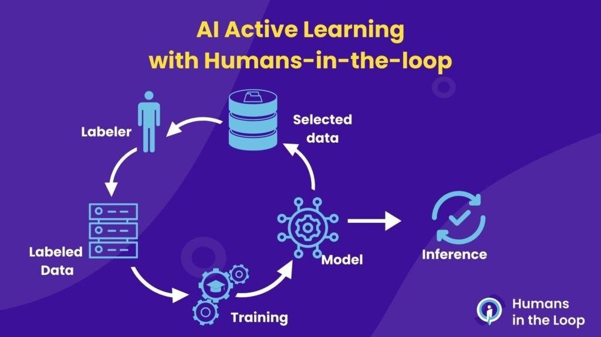

## Table of Contents

## What is Human In The Loop (HITL) in the context of machine learning?

Human In The Loop (HITL) is a process in machine learning where humans and computers work together to improve the performance of a model. In this approach, humans help by providing feedback, making decisions, or correcting the model's outputs. This collaboration helps the machine learning system to learn from real-world data and situations that it might not have encountered before. By incorporating human insights, the model can become more accurate and reliable over time.

HITL is particularly useful in areas where data is complex or when the model needs to make critical decisions. For example, in medical diagnosis, a machine learning model might suggest possible diseases based on symptoms, but a doctor would review and confirm the diagnosis. This ensures that the model benefits from the doctor's expertise and experience. By continuously involving humans in the learning process, the system can adapt and improve, leading to better outcomes in tasks like image recognition, natural language processing, and more.

## How does HITL enhance the performance of machine learning models?

Human In The Loop (HITL) enhances the performance of machine learning models by allowing humans to provide real-time feedback and corrections. When a model makes a prediction or decision, humans can review it and suggest improvements or corrections. This feedback helps the model learn from its mistakes and adjust its algorithms to be more accurate in the future. For example, in a system designed to classify images, if the model incorrectly identifies a cat as a dog, a human can correct this error, and the model can use this information to improve its classification accuracy over time.

Moreover, HITL helps models handle complex or ambiguous data that might be challenging for them to interpret on their own. Humans can provide context and insights that machines might miss, leading to better decision-making and more reliable outcomes. For instance, in natural language processing, a model might struggle to understand the nuances of human language, but with human input, it can learn to recognize sarcasm, idioms, or cultural references more effectively. By continuously involving humans in the learning process, the model can adapt to new situations and improve its overall performance, making it more useful and trustworthy in real-world applications.

## What are the common applications of HITL in machine learning?

One common application of Human In The Loop (HITL) in [machine learning](/wiki/machine-learning) is in the field of image and video analysis. For example, in security systems, a machine learning model can be used to detect unusual activities in video footage. If the model flags something as suspicious, a human can review the footage to confirm whether it is a real threat or a false alarm. This helps the model learn from real-world situations and improve its accuracy over time. Another example is in medical imaging, where a model might analyze X-rays or MRIs to identify potential issues. A doctor can then review the model's findings to confirm or correct them, helping the model become more reliable in diagnosing diseases.

Another application of HITL is in natural language processing (NLP), which involves teaching machines to understand and generate human language. In tasks like sentiment analysis or chatbots, a model might analyze text to determine if it's positive or negative, or to generate responses in a conversation. Humans can review these outputs to correct errors or improve the model's understanding of language nuances, like sarcasm or idioms. This feedback loop helps the model become better at understanding and generating human-like text. Additionally, HITL is used in data labeling tasks, where humans help annotate data that the model uses for training. This ensures that the data is correctly labeled, which is crucial for the model to learn effectively.

In the field of autonomous vehicles, HITL is also crucial. Machine learning models help vehicles navigate roads and make decisions based on sensor data. However, in complex situations, like navigating through a busy city or dealing with unexpected road conditions, human drivers can take over to ensure safety. The human input helps the model learn how to handle these situations better in the future. By continuously involving humans in the learning process, these models can adapt and improve, leading to safer and more reliable autonomous driving systems.

## Can you explain the process of implementing HITL in a machine learning workflow?

Implementing Human In The Loop (HITL) in a machine learning workflow involves setting up a system where humans can interact with the model to provide feedback and corrections. First, you start by training your initial machine learning model with a dataset. Once the model is trained, it begins making predictions or decisions based on new data. At this point, you introduce the human element. Humans review the model's outputs, looking for errors or areas where the model could improve. They can then provide feedback directly into the system, which might involve correcting a misclassified image, adjusting a prediction, or labeling new data more accurately. This feedback is then used to retrain or fine-tune the model, making it more accurate over time.

The second part of implementing HITL involves setting up a continuous feedback loop. After the model has been updated with the human feedback, it goes back to making predictions on new data. Humans continue to monitor these outputs, providing ongoing feedback as needed. This creates a cycle where the model learns from real-world data and human insights, constantly improving its performance. For example, in a system designed to classify images, if the model incorrectly identifies a cat as a dog, a human can correct this error. The corrected data is then used to retrain the model, ensuring that future predictions are more accurate. By maintaining this loop, the machine learning model can adapt to new situations and become more reliable and effective in its tasks.

## What are the benefits of using HITL in machine learning projects?

Using Human In The Loop (HITL) in machine learning projects brings many benefits. One big advantage is that it helps make the model more accurate over time. When humans look at the model's predictions and give feedback, they can spot mistakes and help fix them. This means the model can learn from real-world situations it might not have seen before. For example, if a model is used to tell the difference between pictures of cats and dogs, and it gets it wrong sometimes, a human can correct these errors. The model then uses this feedback to get better at telling cats and dogs apart.

Another benefit of HITL is that it can handle complex or tricky data better. Sometimes, data can be hard for a model to understand, like when it involves human language or unusual situations. Humans can provide context and insights that the model might miss. For instance, in a chatbot, a model might not understand sarcasm or special phrases, but a human can help teach the model these nuances. By working together, the model can learn to deal with these complex situations and become more useful in real-world applications.

## What are some challenges or limitations associated with HITL?

One challenge with Human In The Loop (HITL) is that it can be time-consuming and expensive. When humans are involved, they need to spend time reviewing the model's outputs and providing feedback. This means more work and possibly hiring more people, which can cost a lot of money. Also, if the feedback isn't given quickly, the model might not improve as fast as needed, which can slow down the whole project.

Another limitation is that humans can make mistakes too. Even though humans are good at providing insights, they can still get things wrong. If the feedback they give to the model is incorrect, it can lead the model to learn the wrong things. This can make the model less accurate over time instead of better. So, it's important to make sure that the people giving feedback are well-trained and know what they're doing.

## How can HITL be used to improve data labeling and annotation?

Human In The Loop (HITL) can help make data labeling and annotation better by letting people check and correct the work done by machines. When a machine learning model tries to label data, like pictures or text, it might make mistakes. Humans can look at these labels and fix them if they're wrong. For example, if a model labels a picture of a cat as a dog, a human can change the label to "cat." This corrected data is then used to train the model again, making it better at labeling things correctly next time.

Using HITL also helps when the data is hard to understand or label. Sometimes, data can be tricky, like when it involves understanding human language or recognizing unusual things in pictures. Humans can provide extra information and context that the model might not see. By working together, the model can learn to handle these complex situations better. Over time, this leads to more accurate and reliable data labels, which are very important for training good machine learning models.

## What role does HITL play in active learning and model refinement?

Human In The Loop (HITL) plays a big role in active learning by helping the model pick the best data to learn from. In active learning, the model asks a human to label data that it's not sure about. This helps the model focus on the most important examples, making it learn faster and better. For example, if a model is unsure if a picture is of a cat or a dog, it can ask a human to label it. The human's answer helps the model understand the difference better, and it can use this new information to improve its predictions.

HITL also helps in refining the model over time. After the model makes predictions, humans can check them and give feedback on what's right or wrong. This feedback is used to update the model, making it more accurate with each cycle. For example, if a model wrongly predicts that a picture shows a dog when it's actually a cat, a human can correct this. The model then learns from this mistake and gets better at telling cats and dogs apart. By continuously involving humans in the learning process, the model keeps improving and becomes more reliable in real-world situations.

## How does HITL integrate with automated systems and AI?

Human In The Loop (HITL) integrates with automated systems and AI by allowing humans to work together with machines to make them better. When an AI system makes a decision or prediction, a human can look at it and say if it's right or wrong. For example, in a system that sorts emails into spam or not spam, the AI might make a mistake. A human can then check the email and tell the system it got it wrong. The system learns from this and tries to do better next time. This way, the AI gets smarter and more accurate over time because it's learning from real people.

HITL also helps when the AI is not sure about something. The system can ask a human for help, especially with tricky data or situations. For instance, if an AI is trying to recognize different types of flowers and it's not sure about one, it can show the picture to a human. The human can then tell the AI what kind of flower it is. By working together like this, the AI can learn to handle more complex tasks and become more reliable in the real world. This teamwork makes the AI better at doing its job and helps it adapt to new things it hasn't seen before.

## What are the ethical considerations when implementing HITL in machine learning?

When using Human In The Loop (HITL) in machine learning, it's important to think about the ethical side of things. One big issue is privacy. When humans are involved in checking and correcting the AI's work, they might see personal information. It's really important to make sure this information stays private and is only used to help the AI learn. Also, we need to think about fairness. If the people giving feedback have their own biases, these could get into the AI's decisions. This means the AI might treat some people unfairly. To stop this from happening, we need to train the people giving feedback well and make sure they understand how important it is to be fair.

Another ethical point to consider is the well-being of the people involved in HITL. It can be tiring and stressful to constantly review and correct AI outputs. We need to make sure these workers are treated well and not overworked. They should also be paid fairly for their time and effort. Finally, transparency is key. People using the AI should know that humans are involved in the process. This helps build trust and makes sure everyone understands how the AI makes its decisions. By thinking about these ethical issues, we can use HITL in a way that's good for everyone involved.

## Can you discuss a case study where HITL significantly improved a machine learning model?

A good example of Human In The Loop (HITL) making a big difference is in the field of medical imaging, specifically for diagnosing diseases like cancer. A company called PathAI developed a machine learning model to help pathologists analyze tissue samples more accurately. At first, the model was trained on a large dataset of images, but it still made mistakes. By using HITL, pathologists could review the model's predictions and correct them when they were wrong. For example, if the model incorrectly identified a benign tissue as cancerous, a pathologist could fix this error. Over time, as more pathologists provided feedback, the model learned from these corrections and became much better at identifying cancer correctly. This not only helped doctors make better diagnoses but also saved time and improved patient outcomes.

Another case study involves the use of HITL in improving natural language processing for customer service chatbots. A company called xAI developed a chatbot to handle customer inquiries more efficiently. Initially, the chatbot struggled with understanding the nuances of human language, often misinterpreting customer requests. By implementing HITL, human [agents](/wiki/agents) could review the chatbot's responses and provide corrections or additional training data. For instance, if a customer asked a sarcastic question and the chatbot took it literally, a human could show the chatbot the correct way to respond. As the chatbot learned from these interactions, it became better at understanding and responding to customer queries in a more human-like way. This led to higher customer satisfaction and more efficient customer service operations.

## What are the future trends and potential advancements in HITL for machine learning?

In the future, Human In The Loop (HITL) is likely to become even more important in machine learning. One trend we might see is better tools for humans to give feedback to AI systems. These tools could make it easier for people to check and correct AI's work, even if they're not experts. Another trend could be using HITL to help AI learn from fewer examples. Right now, AI needs a lot of data to learn well, but with humans helping, it might be able to learn from less data. This would save time and money, making AI more useful in more places.

Another potential advancement is making HITL work better with other new technologies, like augmented reality (AR) and virtual reality (VR). Imagine using AR glasses to see and fix what the AI is doing in real time. This could be really helpful in areas like surgery or car driving, where quick and accurate feedback is important. Also, as AI gets better at understanding human emotions and intentions, HITL could become more natural and easy. This means AI and humans could work together more smoothly, leading to smarter and more helpful AI systems in the future.