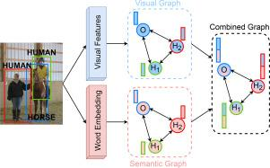

## Table of Contents

## What is a Human Object Interaction Detector in the context of machine learning?

A Human Object Interaction Detector in machine learning is a type of system that can recognize and understand how people interact with objects around them. This technology uses computer vision and artificial intelligence to analyze images or videos and figure out what objects are present and how humans are using them. For example, it can tell if a person is drinking from a cup, reading a book, or using a computer. This is useful in many fields like robotics, where robots need to understand human actions to help or work with them, and in smart homes, where devices can react to what people are doing.

To build a Human Object Interaction Detector, machine learning models are trained on large datasets of images or videos where human-object interactions are labeled. These models learn patterns and features that help them identify and classify different types of interactions. Techniques like deep learning, especially convolutional neural networks (CNNs), are commonly used because they are good at processing visual information. Once trained, the model can be used in real-time applications to detect and interpret human interactions with objects, making it a powerful tool for enhancing human-computer interaction and automation.

## How does a Human Object Interaction Detector differ from general object detection models?

A Human Object Interaction Detector goes beyond just finding objects in a picture or video, which is what general object detection models do. While a general object detection model can spot a cup or a book in an image, it doesn't care about what a person is doing with those objects. A Human Object Interaction Detector, on the other hand, looks at the relationship between the person and the object. It can tell if someone is drinking from the cup or reading the book. This makes it much more useful for understanding what's happening in a scene, not just what's there.

To build a Human Object Interaction Detector, you need to train a [machine learning](/wiki/machine-learning) model with special data that includes both the objects and the actions people take with them. This means the model learns to recognize patterns that show how a person interacts with an object. For example, it might learn that when a hand is near a cup and the cup is tilted, it means someone is drinking. This is different from general object detection, where the model only needs to learn what a cup looks like, not what people do with it. By understanding these interactions, a Human Object Interaction Detector can be used in more advanced ways, like making robots that can help people or smart homes that react to what you're doing.

## What are the main applications of Human Object Interaction Detectors?

Human Object Interaction Detectors have many important uses. One big use is in robotics. Robots can use these detectors to understand what people are doing with objects around them. This helps robots work with people better. For example, if a robot sees a person drinking from a cup, it can wait until the person is done before trying to help with something else. This makes robots more helpful and less likely to get in the way.

Another important use is in smart homes. These detectors can make devices in your home react to what you're doing. If the system sees you reading a book, it might turn on a reading light or adjust the room temperature to make you more comfortable. This makes living at home easier and more enjoyable because the house can help you without you having to do anything.

Human Object Interaction Detectors are also used in security and surveillance. They can help security systems understand if someone is doing something unusual with an object, like using a tool to break into a building. This can make places safer by spotting strange behavior quickly. Overall, these detectors help technology understand and respond to human actions better, making our lives easier and safer.

## Can you explain the basic architecture of a typical Human Object Interaction Detector?

A typical Human Object Interaction Detector uses a [deep learning](/wiki/deep-learning) model, often a [convolutional [neural network](/wiki/neural-network)](/wiki/convolutional-neural-network) (CNN), to analyze images or videos. The basic architecture starts with an input layer that takes in the image data. This data then goes through several convolutional layers, which are designed to detect different features in the image, like edges and textures. These layers help the model understand the shapes and positions of objects and people. After the convolutional layers, there are pooling layers that reduce the size of the data, making the model faster and more efficient. The data then goes through fully connected layers, which combine the features to make sense of the whole image. The final layer outputs the detection results, telling the system what objects are in the image and how they are being used by people.

To specifically detect human-object interactions, the model often uses two main parts: one part for detecting objects and another part for understanding the interactions. The object detection part identifies and locates objects in the image, similar to a general object detector. The interaction part then looks at how these objects are related to people in the scene. It uses the features extracted from the convolutional layers to predict if a person is interacting with an object and what kind of interaction it is. For example, it might look at the position of a person's hand relative to a cup to determine if the person is drinking. By combining these two parts, the model can accurately detect and classify human-object interactions, making it useful for applications like robotics and smart homes.

## What role does VSGNet play in the field of Human Object Interaction Detection?

VSGNet, or Visual Semantic Graph Network, is a special kind of model used in Human Object Interaction Detection. It helps computers understand how people interact with objects by looking at both the visual parts of an image and the meaning behind those parts. VSGNet uses a graph to connect different parts of an image, like a person's hand and a cup, and then figures out if the person is drinking from the cup. This makes it easier for the computer to understand complex scenes where people are doing different things with objects.

The way VSGNet works is by first breaking down the image into smaller parts and then using a graph to show how these parts are related. For example, if there's a person holding a book, VSGNet will connect the person's hand to the book in the graph and then use this connection to understand that the person is reading. This method is very helpful because it can handle many different kinds of interactions and make sense of them in a way that's easy for other systems to use. By using VSGNet, technologies like robots and smart homes can better understand what people are doing and react in helpful ways.

## How does VSGNet improve upon previous Human Object Interaction Detection models?

VSGNet improves upon previous Human Object Interaction Detection models by using a graph to better understand how people interact with objects. Older models might just look at the whole image and try to guess what's happening, but VSGNet breaks the image into smaller parts and connects them in a graph. This graph shows how different parts, like a person's hand and a cup, are related. By doing this, VSGNet can understand more complex scenes and figure out many different kinds of interactions. For example, it can tell if someone is drinking from a cup or just holding it, which is harder for older models to do.

Another way VSGNet improves is by combining visual information with the meaning behind it. Older models might only look at what they see in the image, but VSGNet also thinks about what those visual parts mean. This helps it understand the context of the scene better. For instance, if it sees a person's hand near a book, it can use the graph to connect the hand and the book and then understand that the person is reading. This makes VSGNet more accurate and helpful for technologies like robots and smart homes, which need to understand what people are doing to assist them properly.

## What are the key components of VSGNet and how do they function?

VSGNet, or Visual Semantic Graph Network, has two main parts that help it understand how people interact with objects. The first part is the visual feature extraction, which uses a [convolutional neural network](/wiki/convolutional-neural-network) (CNN) to look at the image and find important parts like a person's hand or a cup. These parts are turned into numbers that the computer can understand. The second part is the semantic graph, which connects these parts together to show how they are related. For example, if the visual part finds a hand and a cup, the graph will connect them to show that the hand is holding the cup. This graph helps VSGNet understand the whole scene better.

The way VSGNet works is by first breaking down the image into smaller pieces and then using the graph to link these pieces together. This helps VSGNet see how different parts of the image are connected, which is important for understanding what's happening. For instance, if VSGNet sees a hand near a book, it will use the graph to connect the hand and the book and then figure out that the person is reading. By using both the visual parts and the graph, VSGNet can understand complex scenes and many different kinds of interactions, making it better at helping technologies like robots and smart homes understand what people are doing.

## How is the performance of Human Object Interaction Detectors like VSGNet evaluated?

The performance of Human Object Interaction Detectors like VSGNet is evaluated using several key measures. One common way is to check how accurate the detector is at identifying different interactions between people and objects. This is often done by comparing what the detector says with what is actually happening in the image or video. Scientists use measures like accuracy, precision, recall, and F1 score to see how well the detector works. Accuracy tells us how often the detector gets it right overall. Precision shows how many of the interactions the detector says are correct actually are correct. Recall shows how many of the real interactions the detector finds. The F1 score is a way to balance precision and recall, giving a single number that shows overall performance.

Another way to evaluate these detectors is by looking at how fast they can process images or videos. This is important because in real-life uses, like in robotics or smart homes, the detector needs to work quickly to be helpful. Scientists measure the time it takes for the detector to analyze an image and give a result. They also look at how much computer power the detector needs, which is called computational efficiency. By testing these things, researchers can see if the detector can work well in real-time situations and if it can be used on different kinds of computers or devices.

## What datasets are commonly used for training and evaluating Human Object Interaction Detectors?

Common datasets for training and evaluating Human Object Interaction Detectors include the V-COCO (Verbs in COCO) dataset and the HICO-DET (Humans Interacting with Common Objects Dataset). The V-COCO dataset is based on the popular COCO (Common Objects in Context) dataset but adds labels for human-object interactions. It includes images where people are doing things like holding, eating, or drinking with different objects. This makes it a good choice for training models to understand a variety of interactions. The HICO-DET dataset is larger and has more types of interactions. It includes over 600 different human-object interaction classes, which helps models learn to recognize many different actions people can do with objects.

These datasets are important because they provide the labeled images needed to train machine learning models. When training a model like VSGNet, researchers use these images to teach the model what different interactions look like. After training, the model's performance is evaluated using parts of these datasets that were not used during training. This helps make sure the model can work well with new images it hasn't seen before. By using these datasets, researchers can improve the accuracy and reliability of Human Object Interaction Detectors, making them useful for real-world applications like robotics and smart homes.

## What are the challenges faced when developing Human Object Interaction Detectors?

Developing Human Object Interaction Detectors comes with several challenges. One big challenge is the variety of interactions that people can have with objects. People can do many different things with the same object, like holding a cup, drinking from it, or even using it as a prop in a game. This means the detector needs to learn a lot of different patterns to understand all these actions. Also, the way people interact with objects can change based on the situation or the person's mood, making it even harder for the detector to always get it right.

Another challenge is the need for large, well-labeled datasets. To train a good Human Object Interaction Detector, you need a lot of images or videos where the interactions are clearly marked. Collecting and labeling this data takes a lot of time and effort. Plus, the data needs to cover many different situations and types of interactions to make sure the detector can work well in the real world. If the dataset is not diverse enough, the detector might not recognize all the different ways people can interact with objects.

## How can Human Object Interaction Detectors be integrated into real-world systems?

Human Object Interaction Detectors can be integrated into real-world systems like robots and smart homes to make them more helpful and responsive. In robotics, these detectors help robots understand what people are doing with objects around them. For example, a robot in a home could use a Human Object Interaction Detector to see if someone is eating or reading. This way, the robot can wait until the person is done before offering help or starting a task. This makes the robot more useful and less likely to interrupt.

In smart homes, Human Object Interaction Detectors can make the home react to what people are doing without them having to do anything. For instance, if the system sees someone reading a book, it might turn on a reading light or adjust the room temperature to make the person more comfortable. This makes living at home easier and more enjoyable because the house helps out automatically. By using these detectors, both robots and smart homes can better understand and respond to human actions, improving how they assist people in everyday life.

## What are the future directions and potential advancements in Human Object Interaction Detection?

The future of Human Object Interaction Detection looks promising with several exciting advancements on the horizon. One potential direction is improving the accuracy and speed of these detectors. Researchers are working on new deep learning models that can understand more complex scenes and interactions faster. This could make these detectors more useful in real-time applications like robotics, where quick responses are needed. Another advancement is the development of more diverse and comprehensive datasets. By collecting more data from different situations and cultures, detectors can learn to recognize a wider range of human-object interactions, making them more reliable and versatile.

Another area of focus is integrating Human Object Interaction Detectors with other technologies like natural language processing and augmented reality. For example, a robot could not only see what a person is doing but also understand spoken commands and provide visual feedback through AR glasses. This could lead to more interactive and helpful systems that can assist people in more ways. Additionally, there is a growing interest in making these detectors more energy-efficient so they can be used in smaller devices like smartphones and wearables. By improving efficiency, Human Object Interaction Detectors can become more accessible and widely used, enhancing our daily lives in many new ways.

## References & Further Reading

[1]: Lin, T.-Y., Maire, M., Belongie, S., Hays, J., Perona, P., Ramanan, D., Dollár, P., & Zitnick, C. L. (2014). ["Microsoft COCO: Common Objects in Context."](https://arxiv.org/abs/1405.0312) arXiv preprint arXiv:1405.0312.

[2]: Gupta, S., & Malik, J. (2015). ["Visual Semantic Role Labeling: A Benchmark for Image-based Semantic Understanding."](https://arxiv.org/abs/1505.04474) In Proceedings of the IEEE Conference on Computer Vision and Pattern Recognition (CVPR).

[3]: Gkioxari, G., Girshick, R., Dollár, P., & He, K. (2018). ["Detecting and Recognizing Human-Object Interactions."](https://arxiv.org/abs/1704.07333) In Proceedings of the IEEE Conference on Computer Vision and Pattern Recognition (CVPR).

[4]: Chao, Y.-W., Liu, Y., Liu, X., Zeng, H., & Deng, J. (2015). ["HICO: A Benchmark for Recognizing Human-Object Interactions in Images."](https://www.sciencedirect.com/science/article/pii/S1674205225001364) In Proceedings of the IEEE International Conference on Computer Vision (ICCV).

[5]: Qi, S., Wang, W., Jia, B., Zhu, Y., & Zhu, S.-C. (2018). ["Learning Human-Object Interactions by Graph Parsing Neural Networks."](https://arxiv.org/abs/1808.07962) In Proceedings of the AAAI Conference on Artificial Intelligence.

[6]: Gu, C., Sun, C., Ross, D., Vondrick, C., Pantofaru, C., Sukthankar, R., & Schmid, C. (2018). ["AVA: A Video Dataset of Spatio-temporally Localized Atomic Visual Actions."](https://arxiv.org/abs/1705.08421) In Proceedings of the IEEE Conference on Computer Vision and Pattern Recognition (CVPR).

[7]: Tamura, M., Ohara, K., & Ando, S. (2020). ["Classification of Human-Object Interactions via Transfer Learning and Natural Language Processing."](https://pmc.ncbi.nlm.nih.gov/articles/PMC11943685/) In Advances in Image and Graphics Technologies. Springer.