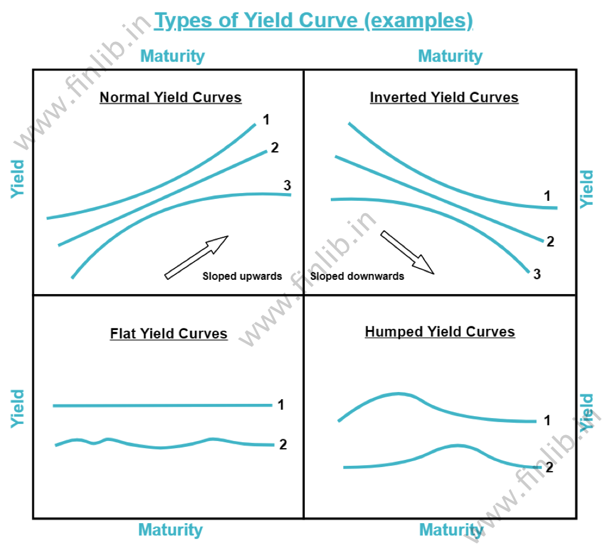

## Table of Contents

## What is a humped yield curve?

A humped yield curve is a type of yield curve that looks like a bump or a hill. It shows that the interest rates for medium-term bonds are higher than the rates for both short-term and long-term bonds. Imagine a graph where the x-axis shows the time until the bond matures, and the y-axis shows the interest rate. In a humped yield curve, the line goes up from short-term to medium-term bonds, then goes down again for long-term bonds.

This shape can happen for different reasons. Sometimes, it means that people expect interest rates to go up in the medium term but then go down again in the long term. Other times, it might show that there is some uncertainty in the market about what will happen with interest rates. Investors and economists watch the yield curve closely because it can give clues about what might happen in the economy in the future.

## How does a humped yield curve differ from other yield curves?

A humped yield curve is different from other yield curves because of its unique shape. It looks like a bump or a hill, where the interest rates for medium-term bonds are higher than those for both short-term and long-term bonds. In contrast, a normal yield curve slopes upward, showing that longer-term bonds have higher interest rates than shorter-term ones. This happens because investors usually want more return for lending their money over a longer time. An inverted yield curve, on the other hand, slopes downward, with short-term rates higher than long-term rates, which can signal that people expect the economy to slow down.

The humped yield curve stands out because it suggests a different kind of expectation about future interest rates. While a normal yield curve might show steady growth expectations and an inverted one might show fears of a downturn, a humped curve can indicate uncertainty or a belief that rates will rise in the medium term but then fall again. This shape can be a sign that the market is unsure about what will happen next, making it a unique indicator among yield curves.

## What causes a humped yield curve to form?

A humped yield curve forms when the interest rates on medium-term bonds are higher than the rates on both short-term and long-term bonds. This can happen because of what people expect will happen with the economy and interest rates in the future. If people think that interest rates will go up in the medium term but then go down again in the long term, they might want more return on medium-term bonds. This can make the yield curve look like a bump or a hill.

Another reason for a humped yield curve is uncertainty in the market. When people are not sure about what will happen with the economy, they might buy more medium-term bonds. This demand can push the interest rates for these bonds higher than for short-term and long-term bonds. Economists and investors watch for these changes because they can give clues about what might happen next in the economy.

## Can you explain the basic functionality of a humped yield curve?

A humped yield curve is a special kind of graph that shows how much interest you get from different bonds. It looks like a bump or a hill because the interest rates for medium-term bonds are higher than the rates for both short-term and long-term bonds. Imagine you have a graph where the bottom shows how long you have to wait for your money back, and the side shows how much interest you get. In a humped yield curve, the line goes up from short-term to medium-term bonds, then goes down again for long-term bonds.

This shape happens because people think that interest rates will go up in the middle time but then go down again later. Or, it can mean that people are not sure about what will happen with the economy. When people are unsure, they might buy more medium-term bonds, which can make the interest rates for these bonds go up. Economists and people who invest money watch this curve because it can tell them what might happen next in the economy.

## What are the economic implications of a humped yield curve?

A humped yield curve can mean that people think interest rates will go up in the middle time but then go down again later. This can show that the economy might grow faster in the medium term but slow down after that. When people see a humped yield curve, they might start to plan for these changes. For example, businesses might decide to borrow money now when the rates are lower, knowing that they'll go up soon.

The humped yield curve can also show that people are not sure about what will happen with the economy. When there's a lot of uncertainty, people might buy more medium-term bonds because they think these are safer. This can make the interest rates for these bonds go up. Economists and people who invest money watch this curve closely because it can give them clues about what might happen next. If the economy is unsure, they might be more careful with their money and investments.

## How do investors interpret a humped yield curve?

Investors see a humped yield curve as a sign that something interesting might be happening with the economy. It means that the interest rates for medium-term bonds are higher than the rates for both short-term and long-term bonds. This can happen because people think that interest rates will go up in the medium term but then go down again later. So, investors might think that the economy will grow faster in the middle time but slow down after that. They might decide to borrow money now when the rates are lower, knowing that they'll go up soon.

The humped yield curve can also show that investors are not sure about what will happen with the economy. When there's a lot of uncertainty, people might buy more medium-term bonds because they think these are safer. This can make the interest rates for these bonds go up. Investors watch this curve closely because it can give them clues about what might happen next. If they see a humped yield curve, they might be more careful with their money and investments, trying to protect themselves from any big changes that might come.

## What are the different types of humped yield curves?

There are two main types of humped yield curves: the positive humped yield curve and the negative humped yield curve. A positive humped yield curve happens when the interest rates on medium-term bonds are higher than the rates on both short-term and long-term bonds. It looks like a bump or a hill on the graph. This type of curve can show that people think interest rates will go up in the middle time but then go down again later. It might also mean that people are unsure about what will happen with the economy.

A negative humped yield curve is the opposite. It happens when the interest rates on medium-term bonds are lower than the rates on both short-term and long-term bonds. This makes the curve look like a dip or a valley. A negative humped yield curve can show that people think interest rates will go down in the middle time but then go up again later. It might also mean that people are expecting some big changes in the economy, but they're not sure when these changes will happen. Both types of humped yield curves give investors and economists clues about what might happen next in the economy.

## How can a humped yield curve be used in investment strategies?

A humped yield curve can help investors make smart choices about their money. If they see a positive humped yield curve, where the interest rates for medium-term bonds are higher than for short-term and long-term bonds, they might decide to buy these medium-term bonds. They do this because they think the interest rates will go up in the middle time but then go down again later. This can be a good time to borrow money too, because the rates are lower now and will go up soon. Investors might also be more careful with their money because the humped curve can show that people are not sure about what will happen with the economy.

On the other hand, if investors see a negative humped yield curve, where the interest rates for medium-term bonds are lower than for short-term and long-term bonds, they might choose to buy short-term or long-term bonds instead. This is because they think the interest rates will go down in the middle time but then go up again later. They might also change their plans for borrowing money, waiting for the rates to go down before they borrow. Both types of humped yield curves give investors clues about what might happen next in the economy, helping them decide the best way to use their money.

## What historical examples illustrate the impact of a humped yield curve?

One historical example of a humped yield curve happened in the United States during the late 1990s. At that time, the economy was growing fast, but people were worried about what might happen next. The interest rates for medium-term bonds were higher than for short-term and long-term bonds, making a positive humped yield curve. This showed that people thought interest rates would go up in the middle time but then go down again later. Many investors decided to buy medium-term bonds and also borrowed money at the lower rates, expecting the rates to rise soon. This helped them make more money during that time.

Another example was in the early 2000s, when the U.S. economy faced uncertainty because of the dot-com bubble bursting and the September 11 attacks. During this period, a negative humped yield curve appeared, with the interest rates for medium-term bonds lower than for short-term and long-term bonds. This showed that people thought interest rates would go down in the middle time but then go up again later. Investors reacted by buying more short-term and long-term bonds, expecting the rates to fall and then rise. This helped them protect their money during a time when the economy was shaky.

## How do central banks respond to the emergence of a humped yield curve?

When central banks see a humped yield curve, they pay close attention because it can tell them about what people think will happen with the economy. If they see a positive humped yield curve, where the interest rates for medium-term bonds are higher, it might mean that people think the economy will grow faster in the middle time but slow down later. Central banks might decide to keep interest rates steady or even raise them a little bit to make sure the economy doesn't grow too fast and cause problems like inflation. They might also talk to people in the market to understand why they are buying more medium-term bonds and what they expect will happen next.

If central banks see a negative humped yield curve, where the interest rates for medium-term bonds are lower, it might mean that people think the economy will slow down in the middle time but then pick up later. Central banks might lower interest rates to help the economy keep going during the tough middle time. They might also use other tools, like buying bonds, to make sure there is enough money in the economy. By watching the humped yield curve, central banks can make better choices to help keep the economy stable.

## What are the mathematical models used to analyze a humped yield curve?

To understand a humped yield curve, economists and analysts use different math models. One common model is called the Nelson-Siegel model. This model helps break down the yield curve into different parts that show short-term, medium-term, and long-term interest rates. By using this model, people can see why the yield curve looks like a bump and what it might mean for the economy. Another model is the Svensson model, which is like the Nelson-Siegel model but has more parts to it. This can give a more detailed look at the yield curve and help people understand it better.

These models use special math formulas to fit a curve to the data points on a graph. They help people predict what might happen with interest rates in the future. For example, if the model shows that the medium-term part of the curve is high, it might mean that people expect interest rates to go up in the middle time. By using these models, investors and central banks can make better choices about their money and the economy.

## How does a humped yield curve predict future interest rate movements?

A humped yield curve can give us clues about what people think will happen with interest rates in the future. If the curve looks like a bump or a hill, with higher rates for medium-term bonds, it might mean that people expect interest rates to go up in the middle time but then go down again later. This kind of curve can show that the economy might grow faster in the medium term but slow down after that. People who invest money watch this curve closely because it helps them decide when to buy or sell bonds and when to borrow money.

On the other hand, if the humped yield curve looks like a dip or a valley, with lower rates for medium-term bonds, it might mean that people expect interest rates to go down in the middle time but then go up again later. This can show that the economy might slow down in the medium term but pick up after that. Investors use this information to plan their money moves, like buying short-term or long-term bonds instead of medium-term ones. By understanding the humped yield curve, people can make smarter choices about their money and prepare for what might happen next in the economy.

## What is a Humped Yield Curve?

A humped yield curve, also known as a bell-shaped yield curve, represents an unusual configuration in financial markets where medium-term interest rates surpass those at both the short and long ends of the spectrum. This particular formation indicates a rise in yields that reach a peak at medium-term maturities before descending. Such a curve emerges under distinct market environments and sentiments, typically prompted by expectations of future economic shifts such as variations in inflation rates or alterations in central bank monetary policies.

Mathematically, if we denote the yield curve $Y(t)$, where $t$ represents time to maturity, a humped yield curve can be described by a function that initially increases to a maximum point before decreasing. This can be modeled by a quadratic or another polynomial function, constrained by:

$$
\frac{dY}{dt} > 0 \quad \text{for} \quad t < t_{peak}
$$
$$
\frac{dY}{dt} < 0 \quad \text{for} \quad t > t_{peak}
$$

where $t_{peak}$ is the maturity at which the yield reaches its maximum.

The occurrence of a humped yield curve is often influenced by specific market conditions. For instance, it may arise if investors expect significant inflationary pressures in the medium-term, which taper off in the long term, leading to higher yields in the medium-term. Conversely, it could be a response to anticipated economic instability in the short term with predictions of stabilizing conditions in the long term. Central banks play a part in sculpting these expectations through their monetary policies, such as adjusting interest rates or implementing quantitative easing or tightening measures.

Understanding the factors that contribute to the formation of a humped yield curve is critical. Investors and analysts who comprehend these dynamics are better positioned to forecast market movements and make informed investment decisions. By examining the causes behind such yield curve configurations, financial professionals can anticipate changes in market conditions, potentially leveraging the information for strategic advantage.

## References & Further Reading

[1]: Fabozzi, F. J., Mann, S. V., & Choudhry, M. (2003). ["The Yield Curve & the Government Bond Market."](https://www.mhebooklibrary.com/doi/book/10.1036/9781260473902) The George Washington University.

[2]: James, J., & Webber, N. (2000). ["Interest Rate Modelling."](https://archive.org/details/interestratemode0000jame) Wiley Finance.

[3]: Malkiel, B. G. (1962). ["Expectations, Bond Prices, and the Term Structure of Interest Rates."](https://academic.oup.com/qje/article-abstract/76/2/197/1904062) The Quarterly Journal of Economics, 76(2), 197-218.

[4]: Gürkaynak, R. S., Sack, B., & Wright, J. H. (2007). ["The US Treasury Yield Curve: 1961 to the Present."](https://www.federalreserve.gov/pubs/feds/2006/200628/200628pap.pdf) National Bureau of Economic Research.

[5]: Hull, J. C. (2018). ["Options, Futures, and Other Derivatives."](https://www.semanticscholar.org/paper/Options%2C-Futures%2C-and-Other-Derivatives-Hull/89bdee500c8623864fc9eb7a471546aa713acc44) Pearson.