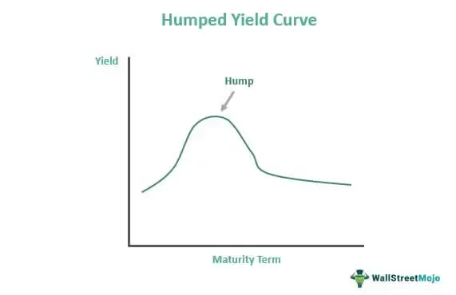

The financial landscape is complex, and understanding the yield curve's nuances plays a vital role in navigating this landscape. Amidst various types of yield curves, the humped yield curve presents unique characteristics that challenge and enhance financial analysis. Unlike the more common upward or downward sloping yield curves, a humped yield curve, often described as bell-shaped, exhibits higher medium-term interest rates compared to both short- and long-term rates. This peculiar shape emerges under specific market conditions and reflects the interplay of various economic factors, including interest rates and investor expectations.

The discussion about humped yield curves extends beyond traditional financial analysis into the innovative sphere of algorithmic trading. With the increasing adoption of automated trading systems, understanding the subtleties of the yield curve has become more critical. Algorithmic trading leverages financial models to make data-driven decisions at speeds and frequencies that far exceed human capabilities. Within this context, the configuration of the yield curve, including the humped shape, can significantly affect trading strategies and outcomes.



In this article, we will explore the definition and formation of a humped yield curve and its emergence in financial markets. Moreover, we will assess the implications of this yield curve formation on investors' strategies and its critical role in shaping algorithmic trading approaches. By analyzing how humped yield curves influence economic predictions and investment strategies, financial practitioners can refine their methodologies to better anticipate and respond to market dynamics. In doing so, they fortify their ability to manage risks and seize opportunities in the ever-evolving financial ecosystem.

## Table of Contents

## What is a Humped Yield Curve?

A humped yield curve, also known as a bell-shaped yield curve, represents an unusual configuration in financial markets where medium-term interest rates surpass those at both the short and long ends of the spectrum. This particular formation indicates a rise in yields that reach a peak at medium-term maturities before descending. Such a curve emerges under distinct market environments and sentiments, typically prompted by expectations of future economic shifts such as variations in inflation rates or alterations in central bank monetary policies.

Mathematically, if we denote the yield curve $Y(t)$, where $t$ represents time to maturity, a humped yield curve can be described by a function that initially increases to a maximum point before decreasing. This can be modeled by a quadratic or another polynomial function, constrained by:

$$
\frac{dY}{dt} > 0 \quad \text{for} \quad t < t_{peak}
$$
$$
\frac{dY}{dt} < 0 \quad \text{for} \quad t > t_{peak}
$$

where $t_{peak}$ is the maturity at which the yield reaches its maximum.

The occurrence of a humped yield curve is often influenced by specific market conditions. For instance, it may arise if investors expect significant inflationary pressures in the medium-term, which taper off in the long term, leading to higher yields in the medium-term. Conversely, it could be a response to anticipated economic instability in the short term with predictions of stabilizing conditions in the long term. Central banks play a part in sculpting these expectations through their monetary policies, such as adjusting interest rates or implementing quantitative easing or tightening measures.

Understanding the factors that contribute to the formation of a humped yield curve is critical. Investors and analysts who comprehend these dynamics are better positioned to forecast market movements and make informed investment decisions. By examining the causes behind such yield curve configurations, financial professionals can anticipate changes in market conditions, potentially leveraging the information for strategic advantage.

## Economic Implications of a Humped Yield Curve

The formation of a humped yield curve reflects complex investor expectations and can have significant economic implications. This atypical curve shape, where medium-term interest rates exceed both short- and long-term rates, often indicates varied market anticipations regarding future economic conditions.

Firstly, an intermediate peak in rates can suggest market anticipation of short-term economic instability, followed by longer-term stability. Investors might expect short-term fluctuations due to fiscal uncertainties or transient shocks, such as geopolitical events or abrupt shifts in commodity prices. As a result, medium-term rates increase, reflecting the premium investors require for bearing near-term risks. However, the subsequent decline in long-term rates might reflect confidence in future economic stabilization and growth.

Furthermore, a humped yield curve could signal projections of medium-term inflationary pressures that wane over more extended periods. Investors, influenced by economic indicators or commodity price forecasts, may predict transient inflation spikes due to factors like supply chain disruptions or temporary fiscal stimuli. Consequently, medium-term bonds require higher yields to compensate for anticipated inflation risks, while the expectation of subsequent macroeconomic adjustments or monetary tightening by central banks encourages lower long-term yields.

Central banks play a pivotal role in shaping these expectations through monetary policy, particularly [interest rate](/wiki/interest-rate-trading-strategies) adjustments. For instance, if a central bank signals a cautious approach to raising rates due to impending economic fluctuations, it can solidify investor beliefs that medium-term economic conditions will be turbulent. Moreover, other fiscal measures, such as quantitative easing or changes in government spending, can influence yield curve shapes by altering [liquidity](/wiki/liquidity-risk-premium) conditions and inflationary forecasts.

In conclusion, the economic implications of a humped yield curve provide valuable insights into investor sentiment and anticipated economic dynamics. It serves as a barometer for short- to medium-term uncertainties and long-term stability, shaped significantly by central bank policies and market perceptions. Understanding these implications aids investors and policymakers in navigating potential economic transitions.

## Humped Yield Curve and Algorithmic Trading

Yield curves are vital for [algorithmic trading](/wiki/algorithmic-trading) strategies, with humped yield curves offering unique insights and opportunities. Analyzing these curves allows algorithms to assess risk premiums by understanding the interest rate differentials that present during different maturities. For instance, medium-term rates might be higher than short- or long-term rates, suggesting potential short-term economic instability or other market conditions that algorithms can exploit.

Algorithmic trading systems frequently capitalize on shifts in interest rates. By incorporating the data from a humped yield curve, algorithms can automatically adjust portfolios to optimize returns. Here is a simple example of Python pseudo-code that illustrates how an algorithm might adjust its portfolio based on yield curve data:

```python
def adjust_portfolio(yield_curve):
    # Assuming yield_curve is a dictionary with maturity periods as keys 
    # and interest rates as values
    short_term_rate = yield_curve['short']
    medium_term_rate = yield_curve['medium']
    long_term_rate = yield_curve['long']

    if medium_term_rate > max(short_term_rate, long_term_rate):
        # Indicate a humped curve
        # Strategy: Invest in short- and long-term, avoid medium-term.
        strategy = "barbell"
    else:
        # Strategy: Balanced investment across all terms
        strategy = "normal"

    return execute_strategy(strategy)

def execute_strategy(strategy):
    if strategy == "barbell":
        print("Allocating to short and long-term bonds.")
    else:
        print("Allocating evenly across all durations.")
```

These algorithms analyze data beyond mere interest rates; they integrate economic indicators such as inflation predictions and fiscal policies, thereby enhancing decision-making accuracy. For example, algorithms can hedge against potential economic transitions by utilizing derivatives like swaps or options, which are informed by the yield curve configuration.

The integration of a humped yield curve into algorithmic trading provides enhanced responsiveness. By continuously processing and analyzing market data, these algorithms can detect subtle market shifts and adjust trading strategies dynamically. This ensures that the portfolio is always aligned with current market conditions, offering traders a competitive edge. 

Through modeling, forecasting, and swift reaction to the humped yield curve indications, algorithmic trading not only manages potential risks but also capitalizes on inherent opportunities to optimize financial outcomes.

## Practical Applications and Strategies

Investors can adopt tailored strategies to navigate the unique challenges presented by a humped yield curve, optimizing their portfolios by considering both the different maturities and instruments available in the financial markets.

One well-regarded strategy in this context is the barbell strategy. This involves allocating investments predominantly into short-term and long-term bonds while avoiding medium-term bonds where yields are less attractive due to the humped nature of the curve. The idea is to capitalize on the generally higher returns from short and long duration bonds compared to the medium ones, which are at the peak of the yield curve and hence, potentially overvalued. This approach balances the portfolio by diversifying risk across both ends of the maturity spectrum, thereby mitigating potential losses from the less favorable mid-range yields. 

In addition to the barbell strategy, companies can adjust their debt issuance strategies in response to a humped yield curve. When the yield curve suggests that medium-term rates are relatively high, corporations may opt to issue shorter or longer-term bonds, aligning their debt offerings to periods where interest rates are lower. This timing of bond issuance facilitates lower costs of capital, enabling corporations to manage debt more efficiently.

For traders, yield curve derivatives, such as swaps and options, provide mechanisms to hedge against the risks associated with the peculiarities of a humped yield curve. For instance, an interest rate swap can help manage exposure by swapping expected interest payments on a bond for those that align more favorably with the curve's shape. By integrating options, traders can set boundaries on risk—protecting against adverse rate shifts while maximizing potential opportunities. For example, employing a cap can set an upper limit on rates paid, ensuring that even if the yield curve further escalates, the financial outcome remains controlled.

These strategies underscore the necessity for investors and corporations to remain vigilant and adaptive to shifts in yield curve configurations, optimizing financial outcomes through strategic planning and derivative instruments.

## Historical and Recent Examples

The humped yield curve, also known as a bell-shaped curve, has historically appeared during periods of significant economic transition and uncertainty. One notable instance of such a curve emerged in the early 1980s when financial markets were adjusting to sharp shifts in monetary policy. During this era, central banks, particularly the Federal Reserve under Chairman Paul Volcker, implemented aggressive interest rate hikes to combat rampant inflation. As a result, medium-term rates temporarily exceeded both short- and long-term rates, resulting in a humped yield curve. This occurred alongside high economic [volatility](/wiki/volatility-trading-strategies), reflecting conflicting investor expectations of inflation control and potential recession.

In recent times, humped yield curves have occasionally been observed following central bank interventions aimed at stabilizing financial markets amidst economic disturbances. For instance, in the aftermath of the 2008 financial crisis, unprecedented monetary easing measures were adopted, including quantitative easing and near-zero interest rates. These interventions occasionally led to humped yield curves, as market participants adjusted their expectations for future economic conditions and monetary policy paths.

Furthermore, fluctuating investor sentiment, driven by geopolitical tensions or unexpected economic data, can result in humped yield curves. For example, amidst ongoing debates over fiscal stimulus measures and pandemic recovery strategies in recent years, yield curves have occasionally exhibited a humped shape. This reflects market uncertainties regarding short-term economic recovery versus long-term growth prospects.

These historical and recent occurrences underscore the significance of humped yield curves as indicators of evolving market dynamics. By examining the economic contexts in which these curves appear, analysts and investors can gain insights into changing macroeconomic conditions and effectively strategize their investment decisions.

## Conclusion

The humped yield curve, though rare, plays a critical role in signaling potential economic transitions and shaping investor expectations. As an unconventional form of yield curve, it can reveal unique insights into market dynamics that are invaluable to investors, analysts, and policymakers. By grasping the implications of a humped yield curve, stakeholders are better equipped to navigate the intricate landscape of financial markets, where expectations of inflation, interest rate movements, and economic stability are constantly shifting.

In the context of algorithmic trading, the nuanced understandings gleaned from a humped yield curve can provide a significant competitive advantage. By incorporating these insights into trading algorithms, traders can develop more responsive strategies that adapt to the anomalies and opportunities inherent in such yield curves. This includes optimizing risk management practices, exploiting shifts in yield that may not be readily apparent in more typical upward or downward-sloping curves, and fine-tuning portfolios to better align with emerging market conditions.

Moreover, the integration of a humped yield curve's tendencies into financial models allows stakeholders to better manage risks, optimize portfolios, and anticipate market trends with greater accuracy. This foresight is crucial in an era where financial markets are increasingly driven by complex data and instantaneous trading decisions. By managing these dynamics proactively, investors can maximize returns while minimizing exposure to unexpected economic shifts, ensuring that their strategies remain robust in the face of evolving market conditions.

## References & Further Reading

[1]: Fabozzi, F. J., Mann, S. V., & Choudhry, M. (2003). ["The Yield Curve & the Government Bond Market."](https://www.mhebooklibrary.com/doi/book/10.1036/9781260473902) The George Washington University.

[2]: James, J., & Webber, N. (2000). ["Interest Rate Modelling."](https://archive.org/details/interestratemode0000jame) Wiley Finance.

[3]: Malkiel, B. G. (1962). ["Expectations, Bond Prices, and the Term Structure of Interest Rates."](https://academic.oup.com/qje/article-abstract/76/2/197/1904062) The Quarterly Journal of Economics, 76(2), 197-218.

[4]: Gürkaynak, R. S., Sack, B., & Wright, J. H. (2007). ["The US Treasury Yield Curve: 1961 to the Present."](https://www.federalreserve.gov/pubs/feds/2006/200628/200628pap.pdf) National Bureau of Economic Research.

[5]: Hull, J. C. (2018). ["Options, Futures, and Other Derivatives."](https://www.semanticscholar.org/paper/Options%2C-Futures%2C-and-Other-Derivatives-Hull/89bdee500c8623864fc9eb7a471546aa713acc44) Pearson.