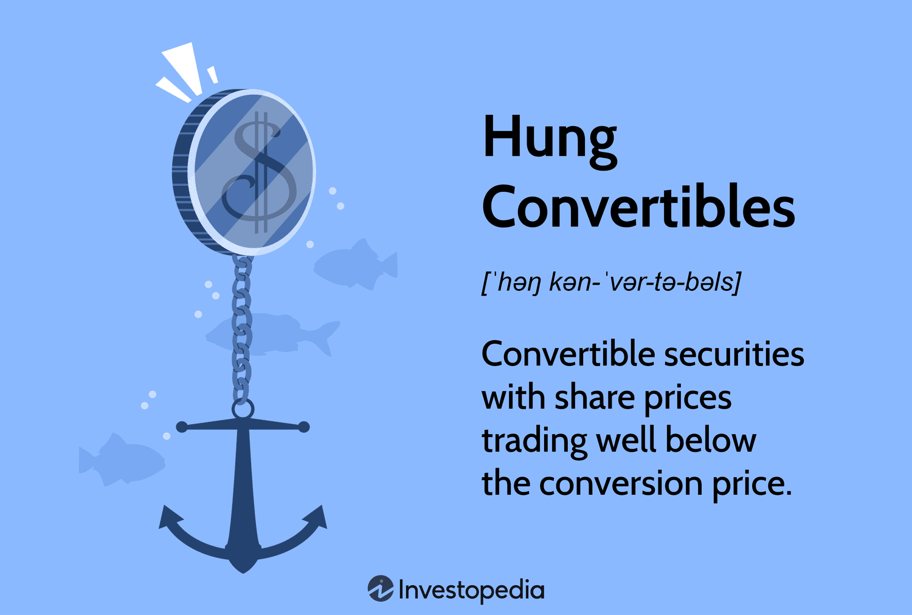

## Table of Contents

## What are Hung Convertible Bonds?

Hung Convertible Bonds are a type of financial instrument that companies can use to raise money. They are called "convertible" because they can be changed into a set number of the company's common stock shares. The term "hung" refers to a situation where the bonds are issued but not fully sold or subscribed to by investors. This can happen if there is less interest from investors than the company expected.

These bonds are attractive to some investors because they offer the potential for higher returns if the company's stock price goes up. If the stock price increases, the investor can convert the bond into shares and sell them at a profit. However, if the stock price does not rise as expected, the investor still has the safety of receiving regular interest payments from the bond. This dual nature makes Hung Convertible Bonds a unique but sometimes risky investment option.

## How do Hung Convertible Bonds differ from traditional convertible bonds?

Hung Convertible Bonds and traditional convertible bonds are similar because they both can be changed into company stock. The main difference is about how they are sold. Traditional convertible bonds are fully sold to investors when they are first offered. Hung Convertible Bonds, on the other hand, are not fully sold right away. This means that the company has issued the bonds, but some of them are still waiting for buyers.

This situation can happen if fewer people want to buy the bonds than the company thought. It can be a problem for the company because they might not get all the money they expected. For investors, Hung Convertible Bonds might be riskier because it shows that not everyone thinks the bonds are a good investment. But if an investor does buy them, they still get the same benefits as traditional convertible bonds, like the chance to convert them into stock if the stock price goes up.

## What are the key features of Hung Convertible Bonds?

Hung Convertible Bonds are a type of bond that companies use to get money. They are special because they can be changed into the company's stock if the investor wants to. But, they are called "hung" because not all of them get sold right away when the company offers them. This happens when fewer people want to buy them than the company thought.

This situation can be tough for the company because they might not get all the money they planned on. For people thinking about buying these bonds, it can be a bit riskier because it shows that not everyone thinks they are a good investment. But, if someone does decide to buy them, they still get the benefits of a convertible bond. This means they can get regular interest payments and also have the chance to turn the bond into stock if the stock price goes up.

## Who typically issues Hung Convertible Bonds?

Hung Convertible Bonds are usually issued by companies that need to raise money but find it hard to sell all their bonds right away. These companies might be smaller or newer, or they might be going through a tough time where investors are not sure about buying their bonds. When a company issues these bonds, they hope that investors will eventually buy them, but at first, some of the bonds stay unsold.

The companies that issue Hung Convertible Bonds often do so because they want to give investors a chance to buy into the company at a lower price, with the hope that the stock price will go up later. This can be attractive to some investors who are willing to take a bit more risk for the chance of a bigger reward. However, it also shows that the company might be struggling to find enough people who believe in their future success.

## What are the benefits of investing in Hung Convertible Bonds?

Investing in Hung Convertible Bonds can be good because they offer a chance to get a higher return if the company's stock price goes up. If the stock does well, you can turn your bond into shares and sell them for more money than you paid for the bond. This means you could make more money than if you just bought the stock at the beginning. Also, even if the stock price doesn't go up, you still get regular interest payments from the bond, which gives you some safety.

Another benefit is that you might be able to buy these bonds at a lower price because not everyone wants them right away. This can be a good deal if you believe the company will do better in the future. But remember, because not everyone wants to buy these bonds, it might mean the company is having some problems. So, you need to think carefully and do your research before deciding to invest.

## What are the risks associated with Hung Convertible Bonds?

Investing in Hung Convertible Bonds can be risky because they are not fully sold when they are first offered. This means that the company might be having trouble finding people who want to buy their bonds. If a lot of people do not want to buy them, it could be a sign that they think the company might not do well in the future. This can make the bonds less valuable and harder to sell if you need to get your money back quickly.

Another risk is that the company might not be able to pay back the bond if things go badly. If the company runs into financial trouble, they might not have enough money to make the interest payments or return your investment when the bond is due. This is a bigger risk with Hung Convertible Bonds because the company might already be struggling to sell them. So, you need to think carefully about whether the company is likely to do well before you decide to invest.

## How does the conversion mechanism work in Hung Convertible Bonds?

The conversion mechanism in Hung Convertible Bonds works by letting the investor turn their bond into shares of the company's stock. This happens at a certain price, called the conversion price, which is set when the bond is issued. If the stock price goes above this conversion price, it might be a good idea for the investor to convert the bond into shares. They can then sell those shares for more money than they paid for the bond.

The decision to convert depends on how the stock price is doing. If the stock price stays below the conversion price, it usually makes more sense for the investor to keep the bond and get the regular interest payments. But if the stock price goes up a lot, converting the bond into stock can give the investor a chance to make more money. This makes Hung Convertible Bonds a bit like a bet on the company's future success.

## What are the tax implications of investing in Hung Convertible Bonds?

When you invest in Hung Convertible Bonds, you need to think about taxes. If you get interest payments from the bond, you usually have to pay tax on that money. The interest is seen as income, so you will pay income tax on it. If you decide to convert the bond into stock, there might not be any tax right away. But if you sell the stock later and make a profit, you will have to pay capital gains tax on that profit.

The tax rules can be different depending on where you live and the specific rules of the bond. It's a good idea to talk to a tax advisor to understand exactly how much tax you might have to pay. They can help you figure out the best way to handle your taxes when investing in Hung Convertible Bonds.

## How do market conditions affect the value of Hung Convertible Bonds?

Market conditions can have a big impact on the value of Hung Convertible Bonds. If the stock market is doing well and people think the company's stock price will go up, the value of the bond can go up too. This is because more people might want to buy the bond, hoping to convert it into stock later and make a profit. On the other hand, if the market is not doing well or if people are worried about the company's future, the value of the bond can go down. This is because fewer people will want to buy the bond, and it might be harder for the company to sell the ones that are still "hung."

Another thing that can affect the value of Hung Convertible Bonds is interest rates. If interest rates go up, the value of the bond might go down because new bonds might offer higher interest payments. This makes the older bonds with lower interest rates less attractive to investors. Also, if the market is very unsure or if there is a lot of risk, people might not want to buy Hung Convertible Bonds because they are already seen as riskier than other types of bonds. So, the value of these bonds can change a lot depending on what is happening in the market.

## What historical examples illustrate the use of Hung Convertible Bonds?

One historical example of Hung Convertible Bonds is from the early 2000s when tech companies were trying to raise money during the dot-com bubble. Many of these companies issued convertible bonds, hoping to attract investors with the promise of turning the bonds into stock if the company did well. However, when the bubble burst, some of these bonds did not sell as well as expected, leaving them "hung." This situation showed how risky these bonds could be, especially when market conditions changed quickly.

Another example comes from the financial crisis of 2008. During this time, many companies were struggling to get money, and some turned to Hung Convertible Bonds. For instance, a company might issue these bonds but find that investors were too worried about the economy to buy them all. This left the company with unsold bonds and made it harder for them to get the money they needed. It also showed investors that even though these bonds could offer high returns, they were also very risky during tough economic times.

## How do Hung Convertible Bonds fit into a diversified investment portfolio?

Hung Convertible Bonds can be a good choice for a diversified investment portfolio because they offer a mix of safety and the chance for higher returns. These bonds give you regular interest payments, which can be a safe way to get some money back from your investment. But they also let you turn the bond into stock if the company does well, which could mean more money for you. This mix of safety and potential for growth can help balance out other investments that might be riskier or not grow as much.

However, because Hung Convertible Bonds are not fully sold when they are first offered, they can be riskier than other types of bonds. This means you need to think carefully about how much of your money you want to put into them. If you believe in the company's future and are okay with taking a bit more risk, these bonds can add some excitement to your portfolio. But if you are more worried about safety, you might want to keep them as a smaller part of your investments.

## What advanced strategies can investors use to optimize returns from Hung Convertible Bonds?

Investors can use several smart strategies to get the most out of Hung Convertible Bonds. One way is to keep a close eye on the company's stock price and convert the bond into stock at the right time. If the stock price goes above the conversion price, it might be a good idea to convert and sell the shares for a profit. Another strategy is to buy these bonds when they are first offered and not fully sold, as they might be cheaper than other bonds. This can be a good deal if you think the company will do better in the future.

Another advanced strategy is to use Hung Convertible Bonds as part of a bigger plan to balance risk and reward in your investment portfolio. For example, you might use these bonds to offset riskier investments, like stocks, because the bonds give you regular interest payments. You can also use them to take advantage of market changes. If you think the market is going to get better, buying these bonds can be a way to get into the market at a lower price. But remember, because these bonds are not fully sold right away, they can be riskier, so you need to do your homework and understand the company's situation before you invest.

## References & Further Reading

- Calamos, N. P. (2003). "Convertible Arbitrage: Insights and Techniques." This work explores the strategies and methodologies associated with convertible arbitrage, providing detailed insights into executing these strategies within financial markets.

- Ammann, M., Kind, A., & Wilde, C. (2003). "Are convertible bonds underpriced? An analysis of the French market." This study analyzes the pricing dynamics of convertible bonds within the French market, evaluating whether these financial instruments are often underpriced and the implications of such pricing on investment strategies.

- Lhabitant, F. S. (2002). "Hedge Funds: Myths and Limits." This book discusses various hedge fund strategies, myths associated with hedge fund operations, and the limitations faced by these investment vehicles. It offers a broader context on how hedge funds, including those utilizing convertible arbitrage strategies, fit into the financial landscape.

These references provide a foundational understanding of convertible bonds, convertible [arbitrage](/wiki/arbitrage), and the broader [hedge fund](/wiki/hedge-fund-trading-strategies) strategies, aiding in a comprehensive analysis of the market dynamics and investment opportunities associated with hung convertibles.

