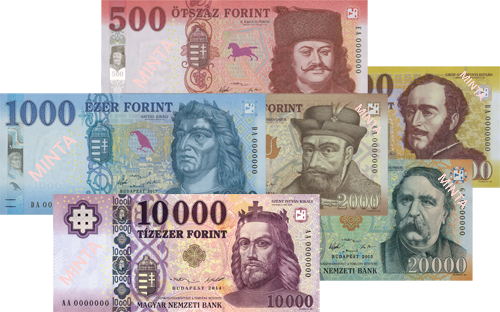

## Table of Contents

## What is the Hungarian Forint?

The Hungarian Forint is the official currency of Hungary. It is used every day by people in Hungary to buy things like food, clothes, and other goods. The symbol for the Forint is 'Ft', and it is divided into 100 smaller units called fillér. However, fillér coins are no longer used because of inflation.

The Forint was first introduced in 1946, after World War II, to replace the previous currency, the pengő. The pengő had become nearly worthless because of very high inflation. The Forint helped to stabilize Hungary's economy. Today, the Forint is managed by the Magyar Nemzeti Bank, which is Hungary's central bank. They work to keep the value of the Forint stable so that it can be used reliably by everyone in the country.

## When was the Hungarian Forint introduced?

The Hungarian Forint was first introduced in 1946. This was after World War II when the old currency, the pengő, had become almost worthless because of very high inflation. The Forint was brought in to help make Hungary's money stable again.

Today, the Forint is the official currency of Hungary. It is used by people to buy things they need every day. The Forint is managed by the Magyar Nemzeti Bank, which is Hungary's central bank. They make sure the Forint stays stable so people can use it reliably.

## What is the symbol and abbreviation of the Hungarian Forint?

The symbol for the Hungarian Forint is 'Ft'. This symbol is used every day by people in Hungary when they buy things like food or clothes.

The abbreviation for the Hungarian Forint is also 'Ft'. This abbreviation is used in a similar way to the symbol, making it easy for everyone in Hungary to recognize and use their currency.

## How is the Hungarian Forint used in everyday transactions in Hungary?

In Hungary, people use the Hungarian Forint every day to buy things they need. When someone goes to a shop, they might pay with Forint coins or banknotes. For example, if someone buys a loaf of bread, they might hand over a 500 Forint note to the shopkeeper. The shopkeeper will then give back any change in Forint, maybe a few coins or smaller notes. People also use Forint to pay for services, like a haircut or a bus ride, making it a key part of daily life.

Many people in Hungary also use electronic payments with Forint. They might use a card or a mobile app to pay for things online or in stores. For example, someone might use their bank card to buy something from a website, and the money will be taken from their Forint account. This makes shopping easier and faster. Whether it's paying with cash or electronically, the Hungarian Forint is what everyone in Hungary uses to buy the things they need every day.

## What are the different denominations of Hungarian Forint banknotes and coins?

In Hungary, Forint banknotes come in several different amounts. You can find banknotes worth 500 Forint, 1000 Forint, 2000 Forint, 5000 Forint, 10,000 Forint, and 20,000 Forint. These banknotes have pictures of famous people or important places in Hungary on them, which makes them interesting to look at.

Forint coins are also used a lot in Hungary. The coins come in amounts of 5 Forint, 10 Forint, 20 Forint, 50 Forint, 100 Forint, and 200 Forint. These coins are handy for buying small things or getting change back when you shop. Together, the banknotes and coins make it easy for people in Hungary to pay for what they need every day.

## How does the exchange rate of the Hungarian Forint affect the Hungarian economy?

The exchange rate of the Hungarian Forint is how much it is worth compared to other currencies, like the US dollar or the Euro. When the Forint is strong, meaning its value is high, it can make things from other countries cheaper for Hungarians to buy. But it can also make Hungarian products more expensive for people in other countries, which might make it harder for Hungarian businesses to sell their goods abroad. On the other hand, when the Forint is weak, meaning its value is low, Hungarian products become cheaper for foreigners to buy, which can help Hungarian businesses sell more. But it also means that things from other countries become more expensive for people living in Hungary.

The exchange rate can affect the overall economy of Hungary in big ways. If the Forint is weak, it can make prices go up for things like food or fuel that Hungary needs to import. This can make life more expensive for people in Hungary. But a weak Forint can also make Hungarian products more competitive in the global market, helping businesses grow and create jobs. The Magyar Nemzeti Bank, which is Hungary's central bank, works hard to keep the Forint's value stable so that it doesn't change too much and cause problems for the economy.

## What are the factors that influence the value of the Hungarian Forint?

The value of the Hungarian Forint can change because of many things. One big thing is how well Hungary's economy is doing. If the economy is doing well, with lots of people working and businesses making money, the Forint can become stronger. But if the economy is not doing so well, with fewer jobs and businesses struggling, the Forint can become weaker. Another thing that can affect the Forint is what is happening in other countries. If big economies like the US or countries in Europe are doing well, their currencies might become stronger, which can make the Forint weaker in comparison.

Interest rates set by the Magyar Nemzeti Bank also play a big role. If the bank decides to make interest rates higher, it can make the Forint stronger because people from other countries might want to invest their money in Hungary to get a better return. But if interest rates go down, it can make the Forint weaker because people might take their money out of Hungary to invest it somewhere else. Political events and decisions can also change the value of the Forint. If there is a lot of uncertainty or if people think the government is making bad decisions, it can make the Forint weaker. But if people feel good about what the government is doing, it can help the Forint stay strong.

## How does the Hungarian National Bank manage the Forint's monetary policy?

The Hungarian National Bank, which is also called the Magyar Nemzeti Bank, is in charge of managing the Forint's monetary policy. This means they control things like interest rates and the amount of money in the economy. One of the main tools they use is setting the interest rate. If they want to make the Forint stronger, they might raise the interest rate. This can attract people from other countries to invest their money in Hungary because they can earn more interest. On the other hand, if they want to make the Forint weaker, they might lower the interest rate, which can encourage people to spend more money within Hungary.

The bank also uses other ways to keep the Forint stable. They might buy or sell Forints in the foreign exchange market to control its value. If the Forint is getting too weak, the bank can buy Forints to make it stronger. If the Forint is getting too strong, they can sell Forints to make it weaker. They also keep an eye on how much money is circulating in the economy. If there's too much money, it can lead to inflation, which makes prices go up. So, the bank might take steps to reduce the amount of money, like raising interest rates or using other financial tools, to keep prices stable and the economy healthy.

## What role does the Hungarian Forint play in international trade?

The Hungarian Forint is important for Hungary's international trade. When Hungarian businesses want to buy things from other countries, they need to change their Forints into the currency of the country they are buying from. This can affect how much they have to pay. If the Forint is strong, it can make imports cheaper, which is good for Hungarian companies and people who want to buy things from abroad. But if the Forint is weak, it can make imports more expensive, which can be a problem.

The Forint also matters when Hungarian companies sell things to other countries. If the Forint is weak, it can make Hungarian products cheaper for people in other countries to buy. This can help Hungarian businesses sell more abroad and make more money. But if the Forint is strong, it can make Hungarian products more expensive for foreigners, which might make it harder for Hungarian companies to sell their goods in other countries. The value of the Forint can really affect how well Hungary does in international trade.

## How has the value of the Hungarian Forint changed historically against major currencies like the Euro and the US Dollar?

The Hungarian Forint has had ups and downs in its value against major currencies like the Euro and the US Dollar over the years. Since the Forint was introduced in 1946, its value has been affected by many things, like how well Hungary's economy is doing and what is happening in the rest of the world. For example, after Hungary joined the European Union in 2004, the Forint became stronger against the Euro for a while because people thought Hungary's economy would do better. But then, during the global financial crisis in 2008, the Forint got weaker against both the Euro and the US Dollar because the crisis made people worried about Hungary's economy.

In more recent years, the Forint has continued to change against the Euro and the US Dollar. For instance, during times when there is a lot of uncertainty in the world, like during the COVID-19 pandemic, the Forint has often become weaker. This is because people tend to move their money to bigger, safer economies like those of the US or the countries using the Euro. But when things are more stable, the Forint can become stronger again. The Magyar Nemzeti Bank, which is Hungary's central bank, tries to keep the Forint's value steady by using tools like changing interest rates and buying or selling Forints in the foreign exchange market.

## What are the potential future challenges for the Hungarian Forint?

In the future, the Hungarian Forint might face some challenges. One big challenge could be how well Hungary's economy is doing. If the economy struggles, the Forint might become weaker. This can happen if there are fewer jobs or if businesses are not making as much money. Another challenge could come from what is happening in other countries. If big economies like the US or countries using the Euro are doing well, their currencies might become stronger, which can make the Forint weaker in comparison. This can make things from other countries more expensive for people in Hungary.

Political events can also affect the Forint. If there is a lot of uncertainty or if people think the government is making bad decisions, it can make the Forint weaker. But if people feel good about what the government is doing, it can help the Forint stay strong. The Magyar Nemzeti Bank, which is Hungary's central bank, will have to keep working hard to manage the Forint's value. They will need to use tools like changing interest rates and buying or selling Forints in the foreign exchange market to keep the Forint stable and help Hungary's economy stay healthy.

## How might Hungary's potential adoption of the Euro impact the Hungarian Forint?

If Hungary decides to adopt the Euro, it would mean that the Hungarian Forint would no longer be used. Instead, everyone in Hungary would start using the Euro for buying things, paying bills, and saving money. This change would happen after a lot of planning and preparation. The Forint would slowly be taken out of use, and the Euro would take its place. This could make it easier for Hungary to trade with other countries that use the Euro, but it would also mean that Hungary would no longer control its own currency. The value of money in Hungary would then depend on what happens in the whole Eurozone, not just in Hungary.

Switching to the Euro could have big effects on the Hungarian economy. On one hand, it might help make prices more stable and make it easier for Hungarian businesses to sell things in other Euro countries. But on the other hand, if the Euro becomes weaker or stronger, it could affect Hungary in ways that are out of its control. Hungary would also lose the ability to use tools like changing interest rates to manage its own economy. This could be a challenge because Hungary would need to adjust to these changes and find new ways to keep its economy strong and healthy.

## What are the strategies for HUF Algo Trading?

Algorithmic trading strategies tailored to the Hungarian Forint (HUF) harness a variety of techniques to navigate the currency's unique market dynamics. Three prominent strategies include [trend following](/wiki/trend-following), [arbitrage](/wiki/arbitrage), and [machine learning](/wiki/machine-learning)-based approaches.

### Trend Following

Trend following leverages the [momentum](/wiki/momentum) of price movements within the forex market, aiming to capitalize on long-term trends identified through statistical indicators such as moving averages. Moving averages smooth out price data to highlight the direction of a trend. In forex trading, this might involve calculating the moving average over a specific period, such as 50 or 200 days, to determine whether the HUF is exhibiting a bullish or bearish trend. The strategy is based on the assumption that asset prices follow a trajectory and that past performance can indicate future movement.

Mathematically, a simple moving average (SMA) is calculated as follows:

$$
\text{SMA} = \frac{P_1 + P_2 + \ldots + P_n}{n}
$$

where $P$ represents the price at each day, and $n$ is the number of days.

By employing technical indicators like the SMA, traders can optimize entry and exit points, minimizing losses incurred due to market volatility and enhancing profitability.

### Arbitrage

Arbitrage exploits price discrepancies across different markets or platforms to achieve risk-free profit. This strategy requires advanced algorithms capable of pinpointing fleeting price differentials before competitors or market adjustments nullify the opportunity. In the context of HUF trading, arbitrage might involve discrepancies between the HUF quoted on international forex exchanges and regional financial institutions or differences arising in cross-currency exchange pairs.

Arbitrage opportunities generally disappear rapidly, highlighting the necessity for algorithmic systems that execute trades at high speeds and volumes. Despite the potential for profit, arbitrage strategies must consider transaction costs and the liquidity of HUF to remain viable and profitable.

### Machine Learning

Machine learning (ML) approaches enhance traditional algorithmic strategies by employing data-driven insights to predict market movements and adapt strategies in real-time. By analyzing historical price data and macroeconomic indicators, ML models can uncover patterns that might elude human traders or traditional algorithms. These models can range from simple linear regression techniques to complex neural networks.

For instance, a supervised learning model can be trained using historical HUF data to forecast future price movements. Python, a popular programming language for machine learning, offers a wide range of libraries such as pandas, scikit-learn, and TensorFlow to assist in developing these predictive models:

```python
from sklearn.model_selection import train_test_split
from sklearn.ensemble import RandomForestRegressor

# Example: Predicting HUF price using historical data
X_train, X_test, y_train, y_test = train_test_split(features, target, test_size=0.2, random_state=42)

model = RandomForestRegressor(n_estimators=100, random_state=42)
model.fit(X_train, y_train)

predictions = model.predict(X_test)
```

Machine learning enables the continuous refinement of strategies as market conditions evolve, thus providing a robust framework for maintaining a competitive edge in trading the Hungarian Forint. By integrating these technological advancements, traders can achieve a higher degree of precision and adaptability in their trading endeavors.

## References & Further Reading

[1]: Bergstra, J., Bardenet, R., Bengio, Y., & Kégl, B. (2011). ["Algorithms for Hyper-Parameter Optimization."](https://papers.nips.cc/paper/4443-algorithms-for-hyper-parameter-optimization) Advances in Neural Information Processing Systems 24.

[2]: ["Advances in Financial Machine Learning"](https://www.amazon.com/Advances-Financial-Machine-Learning-Marcos/dp/1119482089) by Marcos Lopez de Prado

[3]: ["Evidence-Based Technical Analysis: Applying the Scientific Method and Statistical Inference to Trading Signals"](https://www.amazon.com/Evidence-Based-Technical-Analysis-Scientific-Statistical/dp/0470008741) by David Aronson

[4]: ["Machine Learning for Algorithmic Trading"](https://github.com/stefan-jansen/machine-learning-for-trading) by Stefan Jansen

[5]: ["Quantitative Trading: How to Build Your Own Algorithmic Trading Business"](https://www.amazon.com/Quantitative-Trading-Build-Algorithmic-Business/dp/1119800064) by Ernest P. Chan