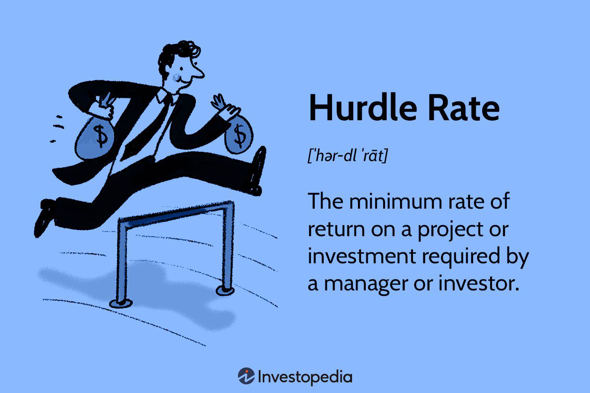

Investment strategies are essential frameworks designed to maximize returns while minimizing risks, facilitating investors' ability to make informed decisions in the dynamic financial markets. These strategies are formulated based on individual or institutional goals and risk appetites, providing a structured approach to achieving financial objectives. One pivotal component in assessing the viability of business investments is understanding the concept of the hurdle rate, which serves as the minimum acceptable rate of return required by investors before committing to an investment opportunity. This rate acts as a critical benchmark, guiding decision-making by ensuring that resources are directed toward projects that promise sufficient returns relative to their risks.

In recent years, algorithmic trading has markedly transformed investment strategies, harnessing the power of technology to execute trades with unparalleled speed and precision. By leveraging sophisticated algorithms, investors can capitalize on market fluctuations within fractions of a second, optimizing the timing and pricing of trades. This technological advancement has not only enhanced the efficiency of executing trades but also introduced new levels of accuracy in financial analyses and predictions.

This article explores the synergy between traditional investment principles and modern technological advancements, focusing on key elements such as investment strategy formulation, the role of hurdle rates, and the impact of algorithmic trading. By examining these components, we aim to equip investors with the knowledge and tools necessary to navigate the complexities of contemporary markets and make well-informed business investment decisions.

## Table of Contents

## Understanding Investment Strategy

An investment strategy is a comprehensive plan designed to guide investment decisions, tailored to align with an investor's financial goals and risk tolerance. It serves as a crucial framework that helps investors identify suitable financial instruments and asset classes while maintaining focus and discipline in their investment endeavors.

There are various investment strategies, each catering to different investment objectives and risk appetites. Growth investing seeks to identify companies expected to grow at an above-average rate compared to their industry or the overall market. Investors employing this strategy often prioritize capital appreciation over dividends, targeting firms with strong earnings potential, innovative products, or disruptive technologies.

Value investing, on the other hand, involves identifying undervalued securities within the market. This strategy is based on the premise that the market occasionally misprices securities, offering opportunities to purchase them at a discount to their intrinsic value. Value investors conduct thorough [fundamental analysis](/wiki/fundamental-analysis) to discover stocks that trade for less than their perceived worth, often looking for stable companies with strong financials and a history of steady earnings.

Index investing is a passive investment strategy that aims to replicate the performance of a specific market index, such as the S&P 500 or the NASDAQ Composite. Investors adopting this approach typically use exchange-traded funds (ETFs) or index funds to achieve broad market exposure, benefiting from diversification and reduced management fees compared to actively managed funds.

Diversification plays a pivotal role in managing investment risk, as it allows investors to spread their capital across different asset classes, sectors, or geographical regions. By constructing a diversified portfolio, investors can mitigate the impact of poorly performing investments, thereby reducing overall portfolio [volatility](/wiki/volatility-trading-strategies) and potential losses. Modern portfolio theory, introduced by Harry Markowitz, provides a mathematical framework to optimize portfolio diversification by examining the relationship between risk and return.

Aligning an investment strategy with one's financial goals and prevailing market conditions is essential for long-term success. Investors must regularly review and adjust their strategies in response to changes in economic indicators, interest rates, or personal financial circumstances. This adaptability ensures that the investment strategy remains relevant and aligned with the investor's objectives, allowing for efficient allocation of resources and maximization of potential returns.

In conclusion, a well-crafted investment strategy serves as a roadmap for navigating the complexities of the financial markets. By understanding different strategies and the importance of diversification, investors can make informed decisions that harmonize with their financial aspirations and risk tolerance, ultimately achieving their investment goals.

## The Concept of Hurdle Rate

The hurdle rate is a crucial concept in the evaluation of investment opportunities, representing the minimum rate of return that a company expects to earn when investing its resources. Often referred to as the company's required rate of return, it serves as a threshold that potential projects must exceed to be considered viable investments. The hurdle rate is determined by a variety of factors, including the cost of capital, market conditions, and the level of risk associated with the investment.

To effectively assess potential investments, businesses utilize the hurdle rate as a benchmark. Projects that promise returns above the hurdle rate are likely to enhance shareholder value, whereas those that fall below may not justify the inherent risks. Consequently, the hurdle rate helps firms prioritize investment projects by comparing expected project returns against this predetermined standard.

Several factors influence the hurdle rate, two of which are market conditions and risk levels. Market conditions, such as economic trends and interest rates, can alter a company’s cost of capital, impacting the hurdle rate. Furthermore, risk levels associated with different projects warrant varying hurdle rates; riskier projects typically require higher hurdle rates to compensate for increased uncertainty.

The hurdle rate is closely linked to the internal rate of return (IRR), another pivotal metric in investment evaluation. The IRR is the discount rate at which the net present value (NPV) of all cash flows (both positive and negative) from a particular project equals zero. For an investment to be deemed favorable, its IRR must surpass the hurdle rate. When IRR > Hurdle Rate, the project is generally considered a worthwhile investment, as it promises returns that exceed the firm’s minimum acceptable threshold.

In mathematical terms, if we denote the hurdle rate as $r_h$ and the IRR as $r$, the decision rule can be expressed as follows:

$$

\text{Accept the project if } r > r_h 
$$

This relationship underscores the synergy between the hurdle rate and IRR in guiding investment decisions, ensuring that capital is allocated towards projects that are expected to generate satisfactory returns while aligning with corporate risk tolerance.

## Business Investment Considerations

Evaluating investment opportunities involves a thorough analysis of potential returns against benchmarks such as the hurdle rate. The hurdle rate, often synonymous with the required rate of return, serves as a critical tool in determining the feasibility of investment projects. It reflects the minimum return an investor expects in exchange for taking on a particular level of risk. Thus, projects yielding returns above the hurdle rate are typically deemed acceptable, while those falling below are reconsidered or rejected.

Risk assessment in business investments is paramount, as it directly influences decision-making processes. Investors and companies must evaluate various types of risk, including market, credit, and operational risks. This assessment helps in understanding the potential impact of risk on expected returns and informs strategies to mitigate or manage these risks effectively. Decisions are often based on a balance between expected returns and the associated level of risk, with the aim of maximizing returns relative to risk exposure.

Cash flow projections and comprehensive financial analysis play a central role in investment considerations. Reliable cash flow projections provide insight into the anticipated financial performance of an investment, allowing investors to foresee and plan for future financial requirements. These projections, encompassing revenues, expenses, and net cash flows, assist in evaluating an investment's potential to meet or exceed the hurdle rate over its lifespan. Financial analysis further supports this process by offering a quantitative assessment of [liquidity](/wiki/liquidity-risk-premium), profitability, and financial stability, thereby informing investment viability.

Balancing short-term and long-term investment goals is essential for a coherent investment strategy. While short-term investments may focus on immediate returns, they often [carry](/wiki/carry-trading) higher volatility. Long-term investments, on the other hand, tend to emphasize sustained growth and stability. Investors must align their strategies with their financial goals, risk tolerance, and market outlook, ensuring a diversified approach that accommodates both immediate needs and future aspirations.

The use of data and analytics in investment decision processes has become increasingly critical. Advanced data analytics tools enable investors to extract meaningful insights from vast amounts of financial data, enhancing the accuracy of forecasts and the identification of investment opportunities. Techniques such as predictive analytics, [machine learning](/wiki/machine-learning), and [artificial intelligence](/wiki/ai-artificial-intelligence) facilitate the evaluation of complex variables, allowing for more informed decisions. These technological advancements empower investors to navigate the uncertainties of financial markets with greater precision and confidence.

## The Rise of Algorithmic Trading

Algorithmic trading refers to the use of computer algorithms to automate trading processes in financial markets. These algorithms are designed to execute trades at speeds and frequencies that are impossible for human traders. The advent of high-frequency trading ([HFT](/wiki/high-frequency-trading-strategies)), which is a subset of [algorithmic trading](/wiki/algorithmic-trading), has significantly transformed the way trades are conducted, contributing to enhanced efficiency and reduced transaction costs in the markets.

One of the primary advantages of algorithmic trading is its unparalleled speed. Algorithms can process and act on market data within milliseconds, allowing traders to capitalize on fleeting opportunities that would otherwise be missed. This speed is accompanied by a high degree of accuracy, minimizing errors that are often associated with manual trading processes. Furthermore, algorithmic trading is cost-effective, as it reduces the need for large trading teams and can optimize the timing of trades to benefit from the smallest of price variations.

Algorithmic trading has a profound impact on market liquidity and volatility. By providing continuous bid and ask quotes, algorithms contribute to enhanced liquidity, facilitating smoother and more efficient markets. However, the same technology can also lead to increased volatility, especially during periods of economic uncertainty or technical glitches, as seen in events like the 2010 "Flash Crash" where rapid algorithmic trades led to a significant one-day market drop.

Algorithms also play a critical role in identifying market trends and opportunities. By analyzing vast datasets, algorithms can detect patterns and predict market movements that are not readily apparent to human traders. This predictive power is often enhanced through machine learning techniques, where algorithms learn from historical data to improve their decision-making processes.

However, the rise of algorithmic trading is not without challenges. Regulatory bodies worldwide have been scrutinizing algorithmic trading practices to ensure market integrity and prevent manipulative behaviors. Regulations vary by jurisdiction but generally focus on ensuring algorithms do not disrupt market fairness or stability. Ethical considerations also arise in algorithm development, particularly related to transparency and accountability in algorithmic decision-making.

As algorithmic trading continues to grow, it is essential for stakeholders to balance the benefits of technology with prudent oversight and ethical responsibility, to harness its full potential while safeguarding the interests of all market participants.

## Integrating Algorithmic Trading into Investment Strategies

Algorithmic trading, often known as algo trading, represents a critical intersection between traditional investment strategies and modern computational techniques. This synergy enhances the efficacy of portfolio management and asset allocation. 

Algorithms analyze vast datasets to identify price patterns, market trends, and [arbitrage](/wiki/arbitrage) opportunities, enabling optimized portfolio management. For example, they assist in constructing and rebalancing portfolios in accordance with risk parameters. An algorithm could ensure that a portfolio maintains a pre-defined proportion of asset classes, like 60% equities and 40% bonds, by automatically executing trades that adhere to this allocation model. 

Modern trading algorithms often incorporate machine learning (ML) and artificial intelligence (AI) to improve decision-making processes. These algorithms learn from historical data, refining their strategies to maximize returns. An ML algorithm might use regression models or neural networks to predict future price movements based on historical price and [volume](/wiki/volume-trading-strategy) data. 

The challenges associated with algorithm-driven strategies include data accuracy, model overfitting, and unforeseen market changes. Algorithms depend heavily on high-quality, real-time data. Any discrepancies can lead to flawed decisions. Additionally, over-reliance on historical data may result in overfitting, where the algorithm becomes tailored to past data but performs poorly in future markets. 

Future trends in investment management will likely see greater reliance on advanced technologies. Developments in AI, such as [deep learning](/wiki/deep-learning) and [reinforcement learning](/wiki/reinforcement-learning), could further refine trading strategies. Moreover, quantum computing has the potential to revolutionize the speed and complexity of algorithmic operations, enabling the resolution of problems that are currently unsolvable via classical computing methods. 

The integration of algorithmic trading in investment strategies necessitates vigilance concerning regulatory and ethical considerations. As technology evolves, maintaining fairness and transparency in financial markets remains paramount.

## Conclusion

Having a clear investment strategy is crucial in today's dynamic markets. The financial landscape is marked by rapid technological advancements and shifting economic conditions, necessitating a well-defined approach to navigate these complexities effectively.

Understanding the hurdle rate is fundamental for informed business investment decisions. The hurdle rate, which represents the minimum acceptable return on investment, acts as a critical benchmark for evaluating potential projects. By setting this benchmark against the risk profile and market conditions, investors can better prioritize projects that meet or exceed their required return, thus optimizing resource allocation and maximizing returns.

Algorithmic trading offers significant advantages, including enhanced speed, accuracy, and cost-effectiveness. This innovative technology enables investors to execute trades instantly, based on complex algorithms that can identify trends and opportunities that may not be visible through traditional trading methods. However, this precision and speed bring challenges, such as increased market volatility and the need for robust regulatory frameworks to ensure ethical practices.

As the era of digital transformation continues to unfold, integrating technology into investment processes becomes increasingly essential. Advanced technologies, such as artificial intelligence and machine learning, play a pivotal role in reshaping how investment strategies are developed and executed. These technologies enable more sophisticated data analysis and predictive modeling, enhancing decision-making capabilities.

To succeed in the evolving investment landscape, investors must stay informed and adaptable. This requires a commitment to continuous learning and adaptation to new tools and methodologies. By embracing innovation while maintaining a clear strategic focus, investors can effectively manage risks and capitalize on emerging opportunities.

In summary, the integration of a well-formulated investment strategy, an informed understanding of the hurdle rate, and the strategic use of algorithmic trading are crucial factors in navigating the complexities of modern financial markets. As technology continues to evolve, it is imperative for investors to remain agile and responsive to maintain a competitive edge.

## References & Further Reading

[1]: Frank J. Fabozzi (Editor). ["Handbook of Quantitative Finance and Risk Management."](https://link.springer.com/book/10.1007/978-0-387-77117-5) Springer, 2010.

[2]: ["Trading and Exchanges: Market Microstructure for Practitioners"](https://www.amazon.com/Trading-Exchanges-Market-Microstructure-Practitioners/dp/0195144708) by Larry Harris

[3]: Basel Committee on Banking Supervision. ["High-frequency trading in the foreign exchange market."](https://www.bis.org/publ/mktc05.htm) Markets Committee Publications, 2011.

[4]: ["Efficiently Inefficient: How Smart Money Invests and Market Prices Are Determined"](https://www.amazon.com/Efficiently-Inefficient-Invests-Market-Determined/dp/0691166196) by Lasse Heje Pedersen

[5]: Harry Markowitz. ["Portfolio Selection."](https://www.math.hkust.edu.hk/~maykwok/courses/ma362/07F/markowitz_JF.pdf) The Journal of Finance, Vol. 7, No. 1 (1952), pp. 77-91.

[6]: Aldridge, Irene. ["High-Frequency Trading: A Practical Guide to Algorithmic Strategies and Trading Systems."](https://www.amazon.com/High-Frequency-Trading-Practical-Algorithmic-Strategies/dp/1118343506) Wiley Finance, 2013. 

[7]: Andrew W. Lo and A. Craig MacKinlay. ["The Econometrics of Financial Markets."](https://archive.org/details/econometricsoffi0000camp) Princeton University Press, 1997.