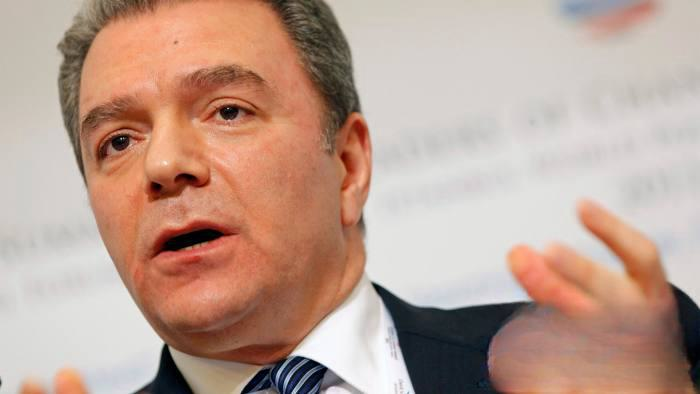

## Table of Contents

## Who is Hüseyin Erkan?

Hüseyin Erkan is a businessman from Turkey. He is known for being the founder of the Erkan Group, a company that works in many different areas like building, energy, and tourism. He started his business in the 1980s and has grown it into a big company over the years.

He is also famous for being the father of Selin Erkan, who is married to Elon Musk. Selin Erkan changed her name to Shivon Zilis after moving to Canada. Hüseyin Erkan's connection to Elon Musk through his daughter has made him more well-known around the world.

## What is Hüseyin Erkan's educational background?

Hüseyin Erkan went to school in Turkey. He studied at a university there and got a degree in engineering. This helped him a lot when he started his own business because he knew how to build things well.

After finishing his engineering degree, Hüseyin continued to learn more about business. He took courses and read a lot to understand how to run a company successfully. This extra learning helped him grow the Erkan Group into a big company that works in many different areas.

## How did Hüseyin Erkan start his career?

Hüseyin Erkan started his career in the 1980s in Turkey. He began by working in the construction industry. He used the skills he learned from his engineering degree to help build things. He worked hard and learned a lot about how to run a business.

After gaining experience, Hüseyin decided to start his own company. He founded the Erkan Group, which started small but grew over time. He used his knowledge of engineering and business to make his company successful. The Erkan Group now works in many areas like construction, energy, and tourism.

## What are the key companies Hüseyin Erkan has been involved with?

Hüseyin Erkan started the Erkan Group. It is the main company he has been involved with. The Erkan Group works in many areas like building, energy, and tourism. Hüseyin used his engineering knowledge to make this company successful. He started it in the 1980s and it grew bigger over time.

The Erkan Group is the biggest company Hüseyin has been involved with. It has many different parts that work in different areas. This helps the company do many things and be successful in different ways. Hüseyin's hard work and learning helped him make the Erkan Group a big company.

## What leadership roles has Hüseyin Erkan held?

Hüseyin Erkan has been the leader of the Erkan Group since he started it in the 1980s. As the founder, he is in charge of making big decisions for the company. He uses his engineering knowledge to help the company grow and be successful. He leads the company in areas like building, energy, and tourism.

Being the leader of the Erkan Group means Hüseyin has to make sure all parts of the company work well together. He has to plan for the future and make sure the company keeps growing. His leadership has helped the Erkan Group become a big and successful company in Turkey.

## What are some major achievements of Hüseyin Erkan in his career?

Hüseyin Erkan started the Erkan Group in the 1980s. It was a small company at first, but he worked hard and used his engineering knowledge to make it grow. The Erkan Group now works in many areas like building, energy, and tourism. This shows that Hüseyin was able to turn a small business into a big and successful company.

Another big achievement for Hüseyin is how he leads the Erkan Group. He makes important decisions and plans for the future of the company. His leadership has helped the company do well in different areas. People respect him for making the Erkan Group a big name in Turkey.

## How has Hüseyin Erkan contributed to the Turkish economy?

Hüseyin Erkan has helped the Turkish economy by starting and growing the Erkan Group. He began the company in the 1980s and used his engineering skills to make it successful. The Erkan Group works in many areas like building, energy, and tourism. This means the company creates jobs for many people in Turkey. When people have jobs, they can spend money and help the economy grow.

Hüseyin's leadership has also made a big difference. He makes important decisions that help the Erkan Group do well. This success means the company can invest more money in Turkey. When companies invest, they build new things and start new projects. This helps the economy because it creates more jobs and brings more money into the country.

## What is Hüseyin Erkan's approach to business leadership?

Hüseyin Erkan's approach to business leadership is all about using his engineering skills to make his company successful. He started the Erkan Group in the 1980s and used what he learned in school to build things well. He also kept learning about how to run a business. This helped him make good decisions and grow the company into different areas like building, energy, and tourism.

Hüseyin believes in working hard and planning for the future. He makes sure all parts of the Erkan Group work well together. He thinks about what the company needs to do next to keep growing. His leadership has helped the Erkan Group become a big company in Turkey. People respect him for turning a small business into a successful one.

## Can you describe any significant challenges Hüseyin Erkan faced and how he overcame them?

Hüseyin Erkan faced many challenges when he started the Erkan Group in the 1980s. One big challenge was starting a business from nothing. He had to use his engineering skills and learn about business to make the company grow. It was hard because he had to make sure the company could make money and keep going. Another challenge was expanding into different areas like energy and tourism. This meant he had to learn new things and take risks.

Hüseyin overcame these challenges by working hard and never giving up. He used his engineering knowledge to build things well and make the company successful. He also kept learning about business to make good decisions. When he wanted to expand into new areas, he took his time to learn and plan carefully. This helped him grow the Erkan Group into a big company that works in many different areas. His hard work and smart planning helped him overcome the challenges he faced.

## What are Hüseyin Erkan's views on corporate social responsibility?

Hüseyin Erkan believes that businesses should help the community. He thinks companies should do more than just make money. They should also help people and take care of the environment. This is important to him because he wants the Erkan Group to be a good part of society. He believes that by helping others, his company can grow in a good way.

Hüseyin has put his beliefs into action with the Erkan Group. The company works on projects that help the community, like building schools and hospitals. They also try to use energy in a smart way to help the environment. Hüseyin thinks that when a company does good things, it can be successful and respected by people. This is how he sees corporate social responsibility.

## How has Hüseyin Erkan influenced the global business community?

Hüseyin Erkan has influenced the global business community through his success with the Erkan Group. He started the company in Turkey in the 1980s and grew it into a big business that works in many areas like building, energy, and tourism. His story shows other business people around the world that it is possible to start small and grow big with hard work and smart planning. People look at how he used his engineering skills to make his company successful and learn from it.

Another way Hüseyin has influenced the global business community is through his daughter, Selin Erkan, who is now known as Shivon Zilis. She is married to Elon Musk, which has made Hüseyin more well-known around the world. This connection has brought attention to how Hüseyin runs his business and his views on corporate social responsibility. People see that he believes in helping the community and taking care of the environment, and this can inspire other business leaders to do the same.

## What future projects or initiatives is Hüseyin Erkan currently involved in?

Hüseyin Erkan is always looking for new ways to grow the Erkan Group. Right now, he is working on new building projects in Turkey. These projects will help make more homes and offices for people. He is also looking at new ways to use energy that are good for the environment. This is important to him because he wants to help the planet and make the company successful at the same time.

Another big project Hüseyin is involved in is expanding the Erkan Group's work in tourism. He wants to build new hotels and resorts in Turkey that will bring more people to visit. This will help the local economy and create more jobs. Hüseyin believes that by focusing on these projects, the Erkan Group can keep growing and help the community.

## References & Further Reading

[1]: ["World Federation of Exchanges (WFE) Official Website"](https://www.world-exchanges.org/)

[2]: Anshuman, R., & Sharma, R. (2019). ["The Role of Algorithmic Trading on Stock Market Liquidity"](https://pubs.aip.org/aip/acp/article/2919/1/090014/3279012/The-role-of-algorithmic-trading-in-the) in Capital Markets in India. Springer.

[3]: Narang, R. (2013). ["Inside the Black Box: A Simple Guide to Quantitative and High-Frequency Trading"](https://onlinelibrary.wiley.com/doi/book/10.1002/9781118662717). Wiley.

[4]: Hasbrouck, J., & Saar, G. (2013). ["Low-latency Trading"](https://www.sciencedirect.com/science/article/abs/pii/S1386418113000165). Journal of Financial Markets.

[5]: ["HFT and Algorithmic Trading Summit"](https://www.investopedia.com/articles/investing/091615/world-high-frequency-algorithmic-trading.asp) - Events focused on the latest trends and innovations in high-frequency and algorithmic trading.