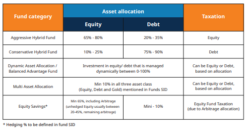

## Table of Contents

## What is a hybrid fund?

A hybrid fund is a type of investment fund that mixes different types of assets, like stocks, bonds, and sometimes even cash. This mix helps spread out the risk because if one type of asset does not do well, the other types might balance it out. People who invest in hybrid funds are looking for a balance between growing their money and keeping it safe.

Hybrid funds can be good for people who want to invest but don't want to pick and manage different investments themselves. The fund managers do that work for them. There are different kinds of hybrid funds, and they can have different mixes of assets. Some might have more stocks for people who want to grow their money faster, while others might have more bonds for those who want to keep their money safer.

## How do hybrid funds differ from other types of funds?

Hybrid funds are different from other types of funds because they mix different kinds of investments, like stocks and bonds, all in one fund. Other funds might focus only on one type of investment. For example, a stock fund only invests in stocks, and a bond fund only invests in bonds. Hybrid funds let investors have a mix without needing to buy separate stock and bond funds.

Another way hybrid funds differ is in how they balance risk and reward. Because they have a mix of investments, they can be less risky than funds that only invest in stocks, which can go up and down a lot. But they might also offer more growth than funds that only invest in bonds, which are usually safer but grow more slowly. This makes hybrid funds a good choice for people who want a bit of both growth and safety in their investments.

## What are the main benefits of investing in hybrid funds?

One big benefit of investing in hybrid funds is that they help spread out risk. Because hybrid funds mix different types of investments like stocks and bonds, if one part doesn't do well, the other parts might help balance it out. This means your money is less likely to go up and down a lot compared to if you only invested in stocks. It's like not putting all your eggs in one basket, which can make investing feel safer.

Another benefit is that hybrid funds can save you time and effort. Instead of having to pick and manage different types of investments yourself, the fund managers do that work for you. They decide how much to invest in stocks, bonds, or other assets based on what they think will do well. This can be really helpful if you don't have a lot of time to keep track of your investments or if you're new to investing and want some help.

Lastly, hybrid funds offer a good balance between growing your money and keeping it safe. Some hybrid funds might have more stocks if you want to grow your money faster, while others might have more bonds if you want to keep your money safer. This flexibility means you can choose a hybrid fund that fits your goals and how much risk you're comfortable with.

## What are the risks associated with hybrid funds?

Even though hybrid funds mix different types of investments to spread out risk, they still have risks. One risk is that the value of the fund can go up and down. This happens because the stocks and bonds in the fund can change in value. If the stock market goes down a lot, the part of the fund that's in stocks will lose value, which can affect the whole fund. Also, if interest rates go up, the value of the bonds in the fund might go down.

Another risk is that the fund managers might not make good choices about what to invest in. They decide how much to put into stocks, bonds, and other things, and if they make bad choices, the fund might not do well. This means you could lose money if the investments they pick don't perform as expected. It's important to remember that even though hybrid funds try to balance risk and reward, there's no guarantee that you'll make money or that you won't lose any.

Lastly, hybrid funds can have fees that can eat into your returns. These fees pay for the fund managers and other costs of running the fund. If the fees are high, they can make it harder for your investment to grow. So, it's a good idea to look at the fees before you decide to invest in a hybrid fund.

## Can you explain the asset allocation in a typical hybrid fund?

In a typical hybrid fund, the money is split between different types of investments, mainly stocks and bonds. The idea is to have a mix that can help grow your money while also keeping it safe. Usually, a hybrid fund might put about 60% of its money into stocks and 40% into bonds. But this can change depending on what the fund manager thinks will do well. Some hybrid funds might have more stocks if they want to grow faster, while others might have more bonds if they want to be safer.

The exact mix can change over time too. Fund managers keep an eye on the markets and might shift more money into stocks if they think the stock market will do well, or into bonds if they think the bond market will be better. This way, they try to make the most of the opportunities they see while still keeping the overall risk in check. It's all about finding a balance that works for the people who invest in the fund.

## What are some common types of assets found in hybrid funds?

Hybrid funds usually include a mix of different types of assets to help balance risk and reward. The most common assets you'll find in a hybrid fund are stocks and bonds. Stocks are pieces of ownership in companies, and they can grow a lot but can also go down in value. Bonds are like loans to companies or governments, and they usually grow slower but are safer than stocks. By having both, hybrid funds try to grow your money while also keeping it safer.

Sometimes, hybrid funds might also include other types of assets. These can be things like cash, which is very safe but doesn't grow much, or commodities like gold, which can be a good way to protect against inflation. Some hybrid funds might even invest in real estate or other special types of investments. The mix of these assets can change over time as the fund managers look for the best ways to help the fund grow and stay safe.

## How does the performance of hybrid funds compare to equity or bond funds?

Hybrid funds usually perform somewhere in the middle when you compare them to equity funds and bond funds. Equity funds, which only invest in stocks, can grow a lot more than hybrid funds because stocks can go up a lot. But they can also lose a lot more if the stock market goes down. On the other hand, bond funds, which only invest in bonds, are usually safer and don't go up and down as much as equity funds. But they also don't grow as fast as equity funds. Hybrid funds, with their mix of stocks and bonds, try to find a middle ground. They might not grow as fast as equity funds, but they're usually safer than equity funds because they also have bonds.

The performance of hybrid funds can change a lot depending on how much they invest in stocks versus bonds. If a hybrid fund has more stocks, it might perform more like an equity fund and grow faster, but it will also be riskier. If it has more bonds, it might perform more like a bond fund and be safer, but it won't grow as fast. So, when you look at how hybrid funds do compared to equity or bond funds, it really depends on the mix of assets in the hybrid fund. Fund managers keep an eye on the markets and might change the mix to try to get the best performance they can.

## What should investors consider when choosing a hybrid fund?

When [picking](/wiki/asset-class-picking) a hybrid fund, investors should first think about their goals and how much risk they're okay with. If you want your money to grow a lot but are okay with more risk, you might want a hybrid fund with more stocks. But if you want to keep your money safer and don't mind slower growth, a fund with more bonds might be better. It's also good to look at the fund's past performance to see how it's done before. But remember, past performance doesn't always mean the same will happen in the future.

Another thing to consider is the fees the fund charges. High fees can eat into your returns, so it's smart to choose a fund with lower fees if you can. Also, check who manages the fund and how they've done in the past. Good fund managers can make a big difference in how well the fund does. Finally, think about how the fund's mix of stocks and bonds might change over time. Some funds might shift their mix a lot, while others might keep it more steady. Knowing this can help you pick a fund that fits with what you want from your investment.

## Can you provide examples of successful hybrid funds?

One example of a successful hybrid fund is the Vanguard Balanced Index Fund (VBIAX). This fund tries to keep a steady mix of about 60% stocks and 40% bonds. It's done well over the years because it gives investors a good balance of growth and safety. The fund is easy to invest in, and its low fees help keep more money in the pockets of the people who invest in it. Many people like it because it's simple and does a good job at what it's meant to do.

Another example is the T. Rowe Price Capital Appreciation Fund (PRWCX). This fund focuses more on stocks, usually around 70%, and the rest in bonds. It's been successful because the fund managers are really good at picking stocks that do well. They also keep an eye on the markets and change the mix when they need to. This fund has helped a lot of investors grow their money while still keeping things pretty safe. People who want a bit more growth but still some safety often choose this fund.

## How do fees and expenses impact the returns of hybrid funds?

Fees and expenses can really affect how much money you make from a hybrid fund. When you invest in a fund, you have to pay fees to cover the costs of running the fund, like paying the fund managers and other expenses. These fees are usually taken out of the fund's returns, which means the more you pay in fees, the less money you get to keep. If a fund has high fees, it can eat into your returns a lot, making it harder for your investment to grow as much as it could.

It's important to look at the fees before you choose a hybrid fund. Some funds have lower fees, which can help you keep more of your returns. For example, index funds often have lower fees than actively managed funds because they don't need as much work to run. By picking a fund with lower fees, you can help make sure more of your money stays in your pocket and grows over time. So, always check the fees and think about how they might affect your returns when you're deciding on a hybrid fund.

## What role do hybrid funds play in a diversified investment portfolio?

Hybrid funds are a great way to mix things up in your investment portfolio. They have a mix of stocks and bonds, which means they can help you spread out your risk. Instead of putting all your money into just stocks or just bonds, a hybrid fund gives you a bit of both. This can make your investments safer because if the stock market goes down, the bonds in the fund might help balance it out. It's like not putting all your eggs in one basket, which is a smart way to invest.

Adding hybrid funds to your portfolio can also make things easier for you. Instead of having to pick and manage different types of investments yourself, the fund managers do that work for you. They decide how much to put into stocks and bonds based on what they think will do well. This can save you time and help you feel more confident about your investments. So, hybrid funds can be a good choice if you want to keep things simple while still having a mix of investments.

## How can advanced investors use hybrid funds for strategic asset allocation?

Advanced investors can use hybrid funds to fine-tune their asset allocation strategy. They can choose hybrid funds with different mixes of stocks and bonds to match their investment goals and risk levels. For example, if they want to grow their money faster but still want some safety, they might pick a hybrid fund with more stocks. If they want to keep their money safer and don't mind slower growth, they might go for a fund with more bonds. By using different hybrid funds, advanced investors can create a mix that fits exactly what they're looking for.

Hybrid funds also let advanced investors adjust their portfolios easily. If they think the stock market will do well, they can move more money into hybrid funds with higher stock allocations. If they think the bond market will be better, they can shift more into funds with higher bond allocations. This flexibility helps them take advantage of market changes without having to buy and sell a lot of different investments themselves. It's a smart way to keep their portfolio balanced and working towards their goals.

## References & Further Reading

[1]: Bergstra, J., Bardenet, R., Bengio, Y., & Kégl, B. (2011). ["Algorithms for Hyper-Parameter Optimization."](https://dl.acm.org/doi/10.5555/2986459.2986743) Advances in Neural Information Processing Systems 24.

[2]: ["Advances in Financial Machine Learning"](https://www.amazon.com/Advances-Financial-Machine-Learning-Marcos/dp/1119482089) by Marcos Lopez de Prado

[3]: ["Evidence-Based Technical Analysis: Applying the Scientific Method and Statistical Inference to Trading Signals"](https://www.amazon.com/Evidence-Based-Technical-Analysis-Scientific-Statistical/dp/0470008741) by David Aronson

[4]: ["Machine Learning for Algorithmic Trading"](https://github.com/stefan-jansen/machine-learning-for-trading) by Stefan Jansen

[5]: ["Quantitative Trading: How to Build Your Own Algorithmic Trading Business"](https://github.com/LucindaYa/quant-resources/blob/master/Quantitative%20Trading%20How%20to%20Build%20Your%20Own%20Algorithmic%20Trading%20Business.pdf) by Ernest P. Chan