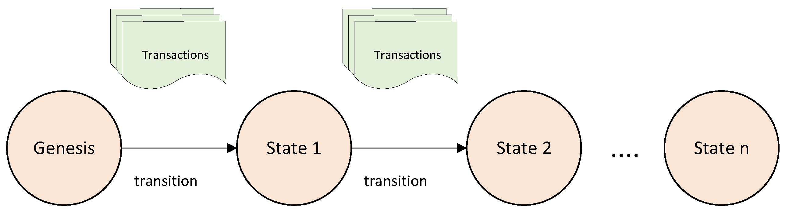

## Table of Contents

## What is hybrid fuzzing and how does it differ from traditional fuzzing?

Hybrid fuzzing is a method that combines different fuzzing techniques to find more bugs in software. It mixes the strengths of various fuzzing approaches, like using both random and smart ways to test software. This helps find problems that might be missed if only one type of fuzzing is used. For example, hybrid fuzzing might use both black-box fuzzing, where the software is tested without knowing how it works inside, and white-box fuzzing, where the internal workings of the software are known and used to guide the testing.

Traditional fuzzing, on the other hand, usually sticks to one approach. It might use random inputs to test a program, hoping to stumble upon a bug, or it might use some knowledge about the program to create more targeted tests. While traditional fuzzing can be effective, it often misses bugs that a different approach might find. Hybrid fuzzing tries to solve this by using multiple methods at once, making it more likely to find a wider range of bugs. This can be more complex to set up and run, but the payoff can be worth it in terms of finding more and different kinds of software issues.

## How does machine learning enhance the effectiveness of hybrid fuzzing?

Machine learning helps make hybrid fuzzing better by learning from past tests to make smarter choices about what to test next. It can look at the results of earlier tests and figure out which parts of a program are more likely to have bugs. This means it can focus on testing those parts more, instead of just trying random things. For example, if machine learning sees that a certain type of input often causes problems, it can make more inputs like that to test the program more thoroughly.

Using [machine learning](/wiki/machine-learning) also helps hybrid fuzzing adapt to different kinds of software. It can learn what works best for different programs and change its approach accordingly. This makes the fuzzing process more efficient because it doesn't waste time on tests that are less likely to find bugs. By combining different fuzzing methods and using machine learning to guide them, hybrid fuzzing can find more bugs faster and with less effort than traditional fuzzing.

## What are the basic components of a hybrid fuzzing system?

A hybrid fuzzing system usually has a few key parts that work together to find bugs in software. One important part is the fuzzer itself, which creates and sends different inputs to the software being tested. This fuzzer can use different methods, like random inputs or more targeted ones based on what it knows about the software. Another part is the coverage analysis tool, which keeps track of which parts of the software are being tested. This helps the fuzzer know where to focus its efforts. The system also needs a way to detect when something goes wrong, like a crash or an unexpected behavior, so it can report these issues as potential bugs.

Machine learning can be another component in a hybrid fuzzing system. It helps the system learn from past tests to make better choices about what to test next. By analyzing the results of previous tests, the machine learning part can guide the fuzzer to focus on areas of the software that are more likely to have bugs. This makes the whole process more efficient and effective. Together, these components work to test the software thoroughly and find as many bugs as possible.

## Can you explain the concept of MEUZZ and its role in hybrid fuzzing?

MEUZZ is a special kind of hybrid fuzzing that uses machine learning to make the testing process better. It stands for "Machine Learning Enhanced Universal Zero-day Vulnerability Fuzzer." The main idea behind MEUZZ is to use what the fuzzer learns from past tests to find new bugs more quickly. It does this by looking at the results of earlier tests and figuring out which parts of the software are more likely to have problems. Then, it focuses on testing those parts more, which helps find bugs that might be missed by other methods.

In MEUZZ, the machine learning part helps guide the fuzzer to create better test inputs. It does this by learning patterns from the software's behavior and using that knowledge to make smarter choices about what to test next. This makes the whole process more efficient because it doesn't waste time on tests that are less likely to find bugs. By combining different fuzzing methods and using machine learning to guide them, MEUZZ can find more bugs faster and with less effort than traditional fuzzing.

## What types of machine learning algorithms are commonly used in hybrid fuzzing?

In hybrid fuzzing, machine learning algorithms help make the testing process smarter and more efficient. Common types of machine learning used include supervised learning and [reinforcement learning](/wiki/reinforcement-learning). Supervised learning algorithms, like decision trees and random forests, are used to predict which parts of the software are more likely to have bugs based on past test results. These algorithms learn from examples of what has worked before to guide the fuzzer in creating new test inputs.

Reinforcement learning is another popular choice for hybrid fuzzing. This type of learning involves an agent that learns to make better decisions over time by getting rewards or penalties based on its actions. In the context of fuzzing, the agent tries different inputs and learns which ones are more likely to find bugs. This helps the fuzzer adapt its strategy to focus on the most promising areas of the software. By using these machine learning techniques, hybrid fuzzing can find more bugs faster and with less effort than traditional methods.

## How does hybrid fuzzing improve code coverage compared to other fuzzing techniques?

Hybrid fuzzing improves code coverage by using different methods together to test more parts of the software. It combines random testing with smarter, more targeted testing. This means it can explore paths in the code that other fuzzing methods might miss. For example, while a traditional fuzzer might focus on one type of input, hybrid fuzzing can use what it learns from past tests to try different kinds of inputs. This helps it reach deeper into the software and find bugs in places that are hard to reach.

By using machine learning, hybrid fuzzing can also get better at finding new parts of the code to test. It looks at the results of earlier tests and figures out which parts of the software are not being tested enough. Then, it focuses on those areas, making sure to test them more thoroughly. This way, hybrid fuzzing can cover more of the code and find more bugs than other fuzzing techniques that don't adapt their approach based on what they learn.

## What are the challenges faced when implementing machine learning in hybrid fuzzing?

One challenge in using machine learning for hybrid fuzzing is the need for a lot of data. Machine learning works best when it has many examples to learn from. In fuzzing, this means running lots of tests to collect enough data about what works and what doesn't. This can take a long time and use a lot of computer power. Also, the data needs to be good quality, which means the tests have to be set up well to make sure the machine learning part gets useful information.

Another challenge is making sure the machine learning model fits well with the fuzzing process. The model needs to be able to learn quickly and make good predictions about where to look for bugs. This can be hard because software can be very complex, and what works for one program might not work for another. The model also needs to be able to adapt as it learns more, which can be tricky to set up. If the model is not right for the job, it might not help the fuzzing process much, or it could even make it worse by focusing on the wrong things.

## How can hybrid fuzzing be used to detect vulnerabilities in software?

Hybrid fuzzing helps find weaknesses in software by using different testing methods together. It mixes random testing with smarter, more targeted tests. This way, it can find problems that might be missed if only one kind of test is used. For example, it can try lots of different inputs to see if any of them make the software crash or do something unexpected. By using machine learning, hybrid fuzzing can also learn from past tests to focus on the parts of the software that are more likely to have bugs. This makes it more likely to find new weaknesses that other testing methods might not see.

The process starts with the fuzzer sending different inputs to the software to see how it reacts. If the software crashes or behaves in a strange way, the fuzzer knows it might have found a bug. The machine learning part of hybrid fuzzing helps by looking at the results of these tests and figuring out which parts of the software need more testing. It can then guide the fuzzer to try new inputs that are more likely to find problems. By doing this, hybrid fuzzing can cover more of the software and find more bugs than other methods, making the software safer and more reliable.

## What are some practical examples or case studies where hybrid fuzzing has been successfully applied?

One practical example of hybrid fuzzing being successfully applied is in the development of the Google's OSS-Fuzz project. This project uses hybrid fuzzing to find bugs in open-source software. By combining different fuzzing techniques, including coverage-guided fuzzing and machine learning, OSS-Fuzz has been able to find thousands of bugs in various programs. For instance, it found critical vulnerabilities in popular software like OpenSSL and Libjpeg. The use of hybrid fuzzing in OSS-Fuzz has made it easier to test large amounts of code quickly and effectively, helping to make open-source software safer for everyone.

Another case study involves the use of hybrid fuzzing by Microsoft in their security testing processes. Microsoft uses a combination of black-box and white-box fuzzing, enhanced with machine learning algorithms, to test their software products. This approach has helped them discover and fix many security issues before the software is released to the public. For example, hybrid fuzzing was instrumental in finding bugs in Windows operating systems and Office applications. By using this method, Microsoft can cover more code and find more subtle bugs, improving the overall security of their products.

## How do you measure the performance and efficiency of a hybrid fuzzing system?

To measure the performance and efficiency of a hybrid fuzzing system, you look at how many bugs it finds and how quickly it finds them. One way to do this is by counting the number of bugs found over time. If the system finds more bugs in less time, it's working well. Another way is to look at code coverage, which means how much of the software the fuzzer has tested. A good hybrid fuzzing system should cover a lot of the code, especially the parts that are hard to reach. You can also measure how much computer power and time the system uses. If it finds a lot of bugs without using too many resources, it's efficient.

Another important measure is the quality of the bugs found. Not all bugs are the same; some are more serious and need to be fixed right away. A good hybrid fuzzing system should find these serious bugs more often. To see if the system is getting better over time, you can use machine learning metrics like accuracy or precision. These show how well the system is learning from past tests to make better choices about what to test next. By looking at all these things together, you can get a good idea of how well a hybrid fuzzing system is working and how it can be improved.

## What future developments can we expect in the field of hybrid fuzzing with machine learning?

In the future, we can expect hybrid fuzzing to become even smarter with the help of machine learning. As machine learning gets better, it will help fuzzers find bugs more quickly and accurately. This means that the fuzzers will be able to learn from more tests and make better guesses about where to look for bugs. They might use new types of machine learning, like [deep learning](/wiki/deep-learning), to understand the software even better. This could make fuzzing faster and help find bugs that are hard to see now.

Another thing we might see is hybrid fuzzing being used more in different kinds of software. Right now, it's mostly used for things like web browsers and operating systems. But in the future, it could be used for all sorts of programs, even the ones that are very complex or run on special kinds of computers. This would make all software safer and more reliable. Also, as computers get faster and can handle more data, hybrid fuzzing will be able to test even more parts of the software at once, making it even more effective.

## How can one begin to implement a hybrid fuzzing system with machine learning for their own software testing?

To start using hybrid fuzzing with machine learning for your own software testing, you first need to pick the right tools. Look for fuzzing tools that can use different methods, like both random and smart testing. Some popular tools are AFL (American Fuzzy Lop) and libFuzzer. You'll also need a machine learning library like TensorFlow or scikit-learn to help your fuzzer learn from past tests. Start by setting up your fuzzer to test your software with different inputs. Then, use the machine learning library to collect data from these tests and learn which parts of your software are more likely to have bugs.

Once you have your tools set up, you can begin the fuzzing process. Run your fuzzer and let it try lots of different inputs on your software. As it runs, the machine learning part will start to learn from the results. It will figure out which kinds of inputs are more likely to find bugs and guide the fuzzer to focus on those. Over time, this will help your fuzzer test more parts of your software and find more bugs. Keep an eye on how well it's working by looking at how many bugs it finds and how much of your code it covers. If you see it's not working well, you might need to adjust your machine learning model or try different fuzzing methods.