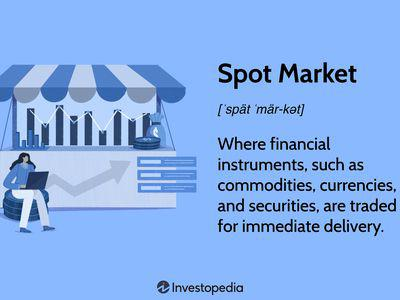

Understanding the evolution of market structures in financial trading is crucial, especially as the integration of technology transforms traditional systems. Financial markets have undergone significant changes influenced by technological advancements, leading to the development of more sophisticated and efficient trading systems. Among these progressions is the emergence of hybrid markets, which combine the traditional floor trading methods with advanced electronic systems, offering a versatile and efficient trading environment.

Hybrid markets have become a pivotal development in the financial trading sector. They are designed to meet the diverse needs of market participants by merging the benefits of human expertise and judgement with the speed and efficiency of electronic systems. This model provides various advantages, such as enhanced flexibility and the ability to cater to both large institutional investors and those engaging in smaller, faster transactions. As such, hybrid markets are viewed as a key evolution, providing solutions to the limitations found in purely manual or automated trading systems.



Furthermore, the role of algorithmic trading has become increasingly significant within hybrid markets. Algorithmic trading utilizes complex algorithms to execute trades at high speed and efficiency, which enhances the overall functionality of hybrid systems. This approach not only optimizes execution times but also helps in risk management and strategy development, making it an indispensable component in modern financial trading.

The evolution of electronic trading has brought about important trends, which have implications for all market participants. This transformation primarily involves automation and the use of algorithmic strategies to trade various asset classes, thereby reshaping market structures. Such advancements allow participants to benefit from systematic and strategic advantages in trading, ensuring better liquidity and pricing.

Overall, these financial trading developments highlight the ongoing evolution that markets are experiencing due to technological integration. Understanding these changes is essential for market participants who aim to make informed and strategic trading decisions. As technology continues to innovate and integrate into market structures, further evolution in trading practices is expected.

## Table of Contents

## What is a Hybrid Market?

A hybrid market is a financial exchange system that integrates traditional manual trading practices conducted by human brokers with automated electronic trading platforms. This dual-functionality setup provides a versatile trading environment. It is designed to accommodate the detailed and often subjective judgments that human traders bring to complex transactions, while also catering to the demand for quick and efficient execution of smaller, routine trades through automated systems.

A prominent example of a hybrid market is the New York Stock Exchange (NYSE), which adopted a hybrid trading model in 2007. This transition was part of a broader strategy to enhance the exchange's flexibility and efficiency. The hybrid model allows the NYSE to serve a diverse clientele, from large institutional investors who benefit from the expertise and nuanced judgment of human brokers, to individual traders and smaller institutions that prioritize the speed and cost-effectiveness afforded by electronic trading.

Hybrid markets are designed to provide flexibility by enabling participants to select the most suitable trading mechanism for their needs. For instance, large institutional trades that require personalized service and negotiation can be handled by human brokers. These trades often involve high-stakes decisions that benefit from human intuition and experience. Conversely, smaller transactions that require rapid execution can be processed swiftly by electronic systems, minimizing delays and reducing transaction costs.

The primary objective of a hybrid market is to integrate the best features of human and electronic trading, thereby enhancing the overall efficiency and attractiveness of the trading platform. This integration helps create a robust market infrastructure that addresses a wide range of trading needs, promoting an inclusive market environment. As a result, hybrid markets offer a comprehensive solution that caters to both traditional and modern trading preferences, ensuring scalability and resilience in the evolving landscape of financial trading.

## Understanding Hybrid Markets

Hybrid markets offer a bifurcated trading framework primarily characterized by two distinct methods: traditional floor brokers and computer-automated trading systems. This dual system aims to leverage the advantages of human judgment alongside the speed and efficiency of electronic systems. 

Traditional floor brokers are instrumental in managing large and complex trades. They operate on the trading floor and use their expertise and judgment to execute trades that may benefit from nuanced decision-making processes. For instance, in scenarios requiring negotiation or the assessment of non-quantifiable factors, human brokers can offer insights and strategic advantages that electronic systems might overlook. This personalized approach can be particularly valuable for institutional clients handling substantial transactions where the price and execution strategy may require human intervention.

Conversely, computer-automated trading systems are designed for rapid execution, often essential in taking advantage of fleeting market opportunities where time is of the essence. These systems can execute trades in fractions of a second, a capability critical for capturing small price differences or engaging in high-frequency trading strategies. The inherent speed and precision of computer-automated systems allow for cost-effective management of smaller, standard trades, making them appealing to a broad swath of market participants.

The trend towards electronic trading is increasingly evident, driven by the benefits it offers over manual methods. One significant advantage is cost-effectiveness; electronic systems lower transaction costs through automation and reduced human involvement. Additionally, the speed of execution minimizes market impact costs, providing an edge in competitive trading environments. 

This bifurcated trading structure enables clients to choose trading methods best suited to their specific needs. For sensitive trades that are complex or non-standard, leveraging the expertise of floor brokers can provide a strategic edge. On the other hand, for trades where execution speed and cost are prioritized, automated systems offer an optimal solution. This flexibility ensures that hybrid markets can cater to a diverse range of trading requirements, aligning execution methods with the particular complexities and sensitivities of each trade.

## Advantages of Electronic Trades

Electronic trading offers unmatched advantages in the financial markets due to its exceptional speed and efficiency. Trades executed electronically are completed in fractions of a second, enabling traders to take advantage of market movements in real time. This capability is crucial in financial environments where price changes can happen in milliseconds, affecting the profitability of trades. The speed of electronic trading systems allows market participants to respond almost instantaneously to market news and trends, creating opportunities that are out of reach for manual trading methods.

Cost-efficiency is another significant advantage of electronic trading. By reducing the need for physical infrastructure and human intermediaries, electronic systems minimize transaction costs. This lower cost structure benefits a broad range of investors, from large institutional entities to individual traders, by enhancing profitability and allowing for more frequent trading. The automation inherent in electronic platforms reduces the need for manual oversight, leading to lower operational expenses and improved scalability.

Perhaps the most important advantage of electronic trading is the elimination of various human inefficiencies. Traditional trading methods often fall prey to delayed decision-making caused by emotional biases, miscommunication, or slower manual processes. Electronic systems remove these hurdles, offering consistent, data-driven trading decisions that are not hindered by human emotions or errors. This ensures that trades are executed based on strategic calculations rather than subjective judgments, providing a more streamlined and effective trading process.

By harnessing the power of cutting-edge technology, electronic trading not only enhances the speed and cost-effectiveness of transactions but also offers a robust solution to the inherent limitations of human inefficiencies in trading practices.

## Hybrid Market Example: NYSE

The New York Stock Exchange (NYSE), established in 1792, has long stood as a beacon of traditional floor trading, where human brokers once executed trades in a dynamic and bustling environment. However, with the advent of advanced technology and the increasing demands for speed and efficiency in the financial markets, the NYSE transitioned to a hybrid market model in 2007. This transformation marked a significant pivot from its historical reliance on floor-based trading to embracing sophisticated electronic systems.

This hybrid framework allows the NYSE to offer a versatile trading environment. Electronic trading systems now handle a substantial portion of daily transactions, significantly improving speed and cost-efficiency. This development has led to enhanced accessibility for traders, enabling them to execute trades rapidly and capitalize on market opportunities as they arise. Electronic trades are executed with a level of precision and speed that manual methods cannot match, often completing transactions in fractions of a second.

Despite the shift towards electronic trading, the NYSE continues to recognize the intrinsic value that human brokers bring to the table. Human brokers are indispensable for handling large institutional trades that require a nuanced understanding of complex market dynamics, judgment, and negotiation skills. These brokers provide specialized services for institutional clients, ensuring that their large-scale and intricate orders are executed with the required discretion and expertise.

The coexistence of electronic and human elements within the NYSE's hybrid market model allows the exchange to capitalize on the strengths of both systems. This integration has paved the way for enhanced efficiency and effectiveness in trading operations, maintaining the NYSE's status as a pioneering force in the global financial markets. By continuously adapting to technological advancements while preserving the value of human judgment, the NYSE remains a leading example of how traditional exchange systems can evolve to meet the needs of modern traders.

## The Electronic Trading Evolution

The emergence and evolution of electronic trading have significantly altered market structures by integrating automation and algorithmic strategies. These advancements have brought about increased efficiency and innovation, particularly in asset classes such as fixed income, currencies, and commodities. The transition to electronic trading platforms has facilitated real-time data analysis and enhanced decision-making processes.

One key aspect of this transformation is the adoption of systematic strategies such as price streaming, parametric trading, and portfolio trading. Price streaming enables continuous updating of bid and offer prices, allowing traders to respond swiftly to market changes. Parametric trading refers to strategies that involve algorithmically driven trades based on specific parameters, thereby enhancing precision and execution speed. Portfolio trading facilitates simultaneous trading of multiple securities, optimizing portfolio performance through controlled risk and improved [liquidity](/wiki/liquidity-risk-premium) management.

The proliferation of systematic funds, which use algorithmic models to manage investment portfolios, has further fueled the evolution of electronic trading. The availability of vast amounts of market data enables the implementation of complex algorithms that optimize trading decisions. Python, widely recognized for its robust libraries such as NumPy and Pandas, is often employed for data analysis and algorithm development in this context. For example, a simple Python snippet to calculate moving average might look like this:

```python
import pandas as pd

data = pd.Series([120, 125, 130, 128, 122, 132, 134])
moving_average = data.rolling(window=3).mean()
print(moving_average)
```

In this code, the `pandas` library is used to compute the moving average over a rolling window of size 3, which can be an essential component in developing trading signals.

Ultimately, the growth of electronic trading continues to transform financial markets by enhancing liquidity and optimizing pricing. These developments offer traders strategic advantages, reduce latency, and minimize human intervention errors, leading to more robust and dynamic market activity.

## Role of Algorithmic Trading in Hybrid and Electronic Markets

Algorithmic trading, commonly called 'algo trading', has become crucial in enhancing efficiency within hybrid and electronic markets. By utilizing sophisticated algorithms, it allows for the automation of trade processes, offering a significant edge in speed and cost-effectiveness while minimizing human-induced errors.

Algos employ large sets of market data to execute trades with minimal human intervention. They efficiently manage risk by applying pre-determined criteria and quantitative models to analyze market conditions and develop strategies. Through this automation, algo trading significantly reduces response times to market changes, often executing trades within milliseconds.

The growing preference for low-touch and fast execution methods has broadened the appeal of [algorithmic trading](/wiki/algorithmic-trading), pushing its application into asset classes beyond traditional equities. Exchange-Traded Funds (ETFs) and stock indices have emerged as prominent areas where algo trading is increasingly utilized. This expansion reflects a market shift towards maximizing transaction speed and minimizing costs, a necessity in the highly competitive trading environment.

Algorithmic trading also supports strategic advantages by offering the ability to process vast quantities of data and make precise predictions based on this information. These capabilities allow institutional investors to implement complex strategies, such as statistical [arbitrage](/wiki/arbitrage) and market-making, efficiently and with reduced risk exposure.

In essence, algorithmic trading is transforming trading practices by enhancing execution efficiency and broadening the scope of automated strategies. This progression aligns with the continuous integration of technology in market structures aimed at achieving optimal transaction conditions.

## Conclusion

Hybrid markets represent a significant evolution in financial trading by effectively integrating the strengths of both human and electronic systems. This dual approach allows for a more versatile trading environment that can meet the diverse needs of market participants. The incorporation of algorithmic trading has further enhanced the capabilities of these markets, offering speed and precision that were previously unattainable.

As algorithmic trading continues to expand, it underscores the ongoing transformation within market structures. Algorithms utilize complex mathematical models and vast datasets to execute trades with minimal latency, offering traders substantial strategic advantages. The growth of electronic markets has accelerated this change, highlighting a shift towards more automated and data-driven trading practices.

For market participants, understanding these developments is crucial. As financial markets become increasingly sophisticated, being able to navigate and leverage these technological advancements is essential for strategic decision-making. The ability to analyze and interpret market trends using algorithmic tools can provide a competitive edge, ensuring more informed and timely trading actions.

The integration of technology in trading systems is expected to continue evolving, leading to further structural changes and innovations. This ongoing transformation will likely foster even greater efficiency and transparency in markets. As these changes unfold, traders and institutions must adapt and develop strategies that incorporate both human judgment and technological prowess to effectively navigate this dynamic environment.

## References & Further Reading

[1]: Hendershott, T., Jones, C. M., & Menkveld, A. J. (2011). ["Does Algorithmic Trading Improve Liquidity?"](https://onlinelibrary.wiley.com/doi/full/10.1111/j.1540-6261.2010.01624.x) The Review of Financial Studies, 24(5), 1460-1489.

[2]: Angel, J. J., Harris, L. E., & Spatt, C. S. (2010). ["Equity Trading in the 21st Century."](https://papers.ssrn.com/sol3/papers.cfm?abstract_id=1584026) The Journal of Finance, 65(5), 2237-2273.

[3]: Hasbrouck, J., & Saar, G. (2013). ["Low-Latency Trading."](https://papers.ssrn.com/sol3/papers.cfm?abstract_id=1695460) The Review of Financial Studies, 26(9), 2355-2384.

[4]: Domowitz, I., & Steil, B. (2001). ["Automation, Trading Costs, and the Structure of the Trading Services Industry."](https://www.semanticscholar.org/paper/Automation%2C-Trading-Costs%2C-and-theStructure-of-the-Domowitz-Steil/27c2fd34c4240ac61f15de7959a5f6ea28ea36e5) Brookings-Wharton Papers on Financial Services, 1, 33-81.

[5]: Aldridge, I. (2013). ["High-Frequency Trading: A Practical Guide to Algorithmic Strategies and Trading Systems."](https://books.google.com/books/about/High_Frequency_Trading.html?id=8QpIsVUMhmEC) Wiley Trading Series.