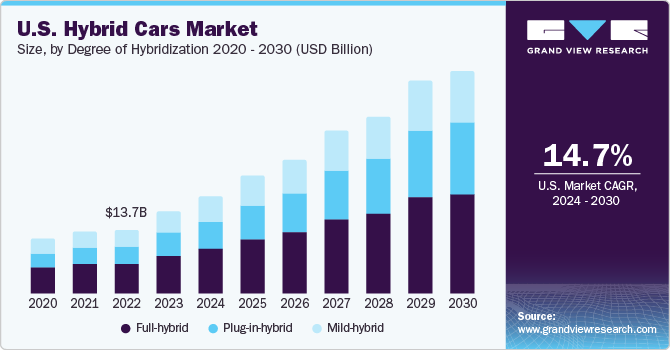

## Table of Contents

## What is a hybrid market?

A hybrid market is a type of market that combines elements of both traditional, physical markets and modern, electronic markets. In a hybrid market, you can find a mix of in-person trading and online trading. This means that people can buy and sell things either by meeting face-to-face or by using computers and the internet. This combination allows for more flexibility and can cater to different preferences and needs of buyers and sellers.

Hybrid markets are often used in stock exchanges, where traders can choose to trade stocks either on the trading floor or through electronic systems. This setup helps to increase efficiency and speed up transactions. It also helps to reduce costs because electronic trading can be cheaper than traditional methods. Overall, hybrid markets try to take the best parts of both worlds to create a more effective and user-friendly trading environment.

## How do hybrid markets differ from traditional markets?

Hybrid markets are different from traditional markets because they mix old and new ways of trading. In traditional markets, people meet in person to buy and sell things. They might go to a store or a market place where they can see and touch the products. Everything happens face-to-face, and people often build relationships with each other. But in hybrid markets, you can do some of this in person, but you can also use computers and the internet to trade. This means you don't always have to be in the same place as the person you're trading with.

Another big difference is that hybrid markets can be faster and cheaper than traditional markets. When you use electronic trading in a hybrid market, you can buy and sell things much quicker because everything is done with a few clicks. It can also be cheaper because you don't have to pay for things like travel or a physical store. Traditional markets don't have these electronic options, so they might take more time and cost more money. Hybrid markets try to use the best parts of both traditional and electronic markets to make trading easier and more efficient.

## What are the key components of a hybrid market?

The first key component of a hybrid market is the physical trading floor. This is where people come together to buy and sell things in person, just like in a traditional market. They can see and touch the products, and they often build relationships with each other. This part of the hybrid market keeps the old ways of trading alive, where people can meet face-to-face and make deals.

The second key component is the electronic trading system. This is where people use computers and the internet to buy and sell things. They don't have to be in the same place as the person they're trading with. This part of the hybrid market makes trading faster and cheaper because everything can be done with a few clicks. It's like shopping online but for buying and selling stocks or other products.

The third key component is the integration of these two systems. In a hybrid market, the physical and electronic parts work together smoothly. This means people can choose how they want to trade, either in person or online, and the market can handle both ways at the same time. This integration helps make the market more flexible and efficient, taking the best parts of both traditional and modern trading methods.

## Can you explain the role of technology in hybrid markets?

Technology plays a big role in hybrid markets. It helps make trading faster and easier. In a hybrid market, people can use computers and the internet to buy and sell things without having to meet in person. This is called electronic trading, and it's a lot quicker than the old way of trading where people had to be in the same place. With technology, you can make a trade with just a few clicks, and it can be done from anywhere in the world.

Technology also helps to make hybrid markets cheaper. When you trade electronically, you don't have to pay for things like travel or a physical store. This can save a lot of money. Plus, technology helps to keep everything organized and safe. It can track all the trades and make sure everything is done correctly. This makes people feel more confident about trading in a hybrid market.

Overall, technology is what makes hybrid markets work so well. It combines the old way of trading in person with the new way of trading online. This gives people more choices and makes the market more flexible. By using technology, hybrid markets can take the best parts of both worlds and create a better trading environment for everyone.

## What are some examples of hybrid markets in operation today?

One example of a hybrid market is the New York Stock Exchange (NYSE). At the NYSE, traders can choose to buy and sell stocks either on the trading floor or through electronic systems. On the trading floor, people meet in person to make deals, just like in old times. But they can also use computers to trade stocks quickly and easily from anywhere. This mix of old and new ways helps the NYSE work better and faster.

Another example is the NASDAQ. While it's known for being fully electronic, it also has a hybrid model. NASDAQ lets people trade stocks online, but it also has a physical presence where traders can meet and make deals face-to-face. This combination makes NASDAQ flexible and efficient, allowing traders to choose the method that suits them best. Both the NYSE and NASDAQ show how hybrid markets can use technology to improve trading while keeping some traditional methods.

## How do hybrid markets benefit consumers?

Hybrid markets help consumers by giving them more choices. In a hybrid market, people can choose to buy and sell things either in person or online. This means they can pick the way that works best for them. If someone likes to see and touch the products before buying, they can go to the physical market. But if they want to buy something quickly and easily from home, they can use the internet. This flexibility makes shopping easier and more convenient for everyone.

Another way hybrid markets help consumers is by making trading faster and cheaper. When people use the electronic part of a hybrid market, they can buy and sell things with just a few clicks. This is much quicker than going to a store or meeting someone in person. Plus, it can be cheaper because there are no extra costs like travel or a physical store. This means consumers can save time and money, making their shopping experience better overall.

## What challenges do businesses face when entering a hybrid market?

When businesses want to enter a hybrid market, they face some challenges. One big challenge is figuring out how to use both the physical and electronic parts of the market. They need to set up a good system for trading in person, but also make sure their online system works well. This can be hard because it takes a lot of time and money to build and maintain both systems. Businesses also need to train their workers to use these systems and make sure everything runs smoothly.

Another challenge is keeping customers happy in both parts of the market. People who like to shop in person might want a different experience than those who shop online. Businesses need to make sure they are meeting everyone's needs. They also have to deal with competition from other businesses that might be better at one part of the market or the other. It can be tough to stand out and attract customers when you're trying to do well in both the physical and electronic parts of the market.

## How do regulations affect the operation of hybrid markets?

Regulations play a big role in how hybrid markets work. They are rules that businesses and traders have to follow to make sure the market is fair and safe for everyone. For example, regulations can set limits on how much people can trade or what kind of information they need to share. This helps to stop fraud and protect consumers. But following these rules can be hard for businesses because they have to keep up with changes and make sure they are doing everything right. If they don't, they might get in trouble or have to pay fines.

Regulations also affect how fast and easy it is to trade in a hybrid market. Sometimes, rules can slow things down because businesses have to do extra checks or fill out more paperwork. This can make trading less efficient, especially in the electronic part of the market where speed is important. But on the other hand, good regulations can help build trust in the market. When people know that there are strong rules in place, they feel more confident about trading. This can make the market more stable and attract more people to buy and sell things.

## What strategies can businesses use to succeed in hybrid markets?

To succeed in hybrid markets, businesses need to focus on making their physical and electronic trading systems work well together. They should invest in good technology to make sure their online trading is fast and easy to use. At the same time, they need to keep their physical stores or trading floors attractive and helpful for customers who like to shop in person. Training workers to use both systems is also important. This way, businesses can offer a smooth experience no matter how people choose to trade.

Another key strategy is to understand and meet the needs of different customers. Some people might want a personal touch and like to see and touch products before buying. Others might prefer the speed and convenience of online trading. Businesses should listen to their customers and make changes to their services based on what people want. By doing this, they can keep both groups of customers happy and loyal. This can help them stand out in a competitive market and grow their business.

## How do hybrid markets impact the global economy?

Hybrid markets help the global economy by making trading easier and faster. They mix the old way of trading in person with the new way of trading online. This means people from all over the world can buy and sell things more easily. When trading is quicker and cheaper, more people want to trade. This can help businesses grow and create more jobs. It also makes it easier for countries to trade with each other, which can help the global economy grow.

But hybrid markets can also bring some challenges to the global economy. They need good technology and rules to work well. If a country doesn't have the right technology or strong regulations, its hybrid market might not work as well. This can slow down trading and make it harder for businesses to grow. Also, if one country's hybrid market is doing really well, it might take business away from other countries. This can create competition and affect how the global economy works.

## What future trends are predicted for hybrid markets?

In the future, hybrid markets are expected to grow even more. People will use new technology like [artificial intelligence](/wiki/ai-artificial-intelligence) and blockchain to make trading even faster and safer. These technologies can help keep track of trades and make sure everything is done correctly. More businesses will start using hybrid markets because they can reach more customers and save money. This will make hybrid markets a bigger part of the global economy.

Another trend is that hybrid markets will become more user-friendly. They will use things like virtual reality so people can feel like they are shopping in person, even if they are at home. This can make the shopping experience better for everyone. Also, rules and regulations will get better to make sure hybrid markets are fair and safe. This will help build trust and make more people want to use hybrid markets. Overall, hybrid markets will keep changing and improving to meet the needs of businesses and consumers.

## How can data analytics be used to enhance performance in hybrid markets?

Data analytics can help businesses in hybrid markets by giving them important information about how people are trading. By looking at data, businesses can see what products are popular, when people like to buy things, and how they like to shop. This can help them make better decisions about what to sell and how to sell it. For example, if data shows that more people are buying things online, a business might focus more on making their online system better. This can help them attract more customers and make more money.

Data analytics can also help businesses understand their customers better. By studying data, they can learn about what different groups of people want and need. This can help them make their services better for everyone. For example, if data shows that some customers like to shop in person, a business might make their physical stores more attractive. By using data analytics, businesses can make smart choices that help them do well in both the physical and electronic parts of a hybrid market.

## References & Further Reading

[1]: Hendershott, T., Jones, C. M., & Menkveld, A. J. (2011). ["Does Algorithmic Trading Improve Liquidity?"](https://onlinelibrary.wiley.com/doi/full/10.1111/j.1540-6261.2010.01624.x) The Review of Financial Studies, 24(5), 1460-1489.

[2]: Angel, J. J., Harris, L. E., & Spatt, C. S. (2010). ["Equity Trading in the 21st Century."](https://papers.ssrn.com/sol3/papers.cfm?abstract_id=1584026) The Journal of Finance, 65(5), 2237-2273.

[3]: Hasbrouck, J., & Saar, G. (2013). ["Low-Latency Trading."](https://papers.ssrn.com/sol3/papers.cfm?abstract_id=1695460) The Review of Financial Studies, 26(9), 2355-2384.

[4]: Domowitz, I., & Steil, B. (2001). ["Automation, Trading Costs, and the Structure of the Trading Services Industry."](https://www.semanticscholar.org/paper/Automation%2C-Trading-Costs%2C-and-theStructure-of-the-Domowitz-Steil/27c2fd34c4240ac61f15de7959a5f6ea28ea36e5) Brookings-Wharton Papers on Financial Services, 1, 33-81.

[5]: Aldridge, I. (2013). ["High-Frequency Trading: A Practical Guide to Algorithmic Strategies and Trading Systems."](https://books.google.com/books/about/High_Frequency_Trading.html?id=8QpIsVUMhmEC) Wiley Trading Series.