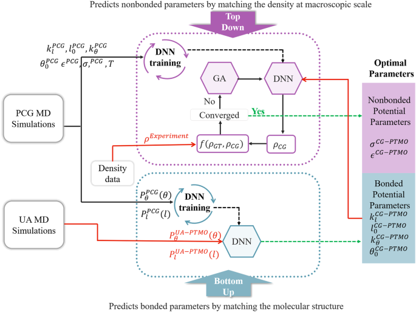

## Table of Contents

## What is hybrid optimization in the context of machine learning?

Hybrid optimization in machine learning refers to the combination of different optimization techniques to improve the training of machine learning models. This approach is used when a single optimization method might not be effective enough on its own. By blending various methods, hybrid optimization aims to leverage the strengths of each technique to achieve better performance, faster convergence, and more robust solutions. For instance, a common hybrid approach might combine gradient-based methods, which are good at finding local optima, with heuristic methods that are better at exploring the broader solution space.

A practical example of hybrid optimization could involve using a genetic algorithm to explore a wide range of potential solutions in the early stages of training, followed by a gradient descent method to fine-tune the parameters around the most promising solutions. This combination allows the model to benefit from the global search capabilities of the genetic algorithm and the precision of gradient descent. By doing so, hybrid optimization can help machine learning models find better solutions more efficiently than using a single optimization method alone.

## How does hybrid optimization differ from traditional optimization methods?

Hybrid optimization is different from traditional optimization methods because it combines different techniques to solve a problem, while traditional methods usually stick to one approach. Traditional optimization might use a single method like gradient descent, which follows the steepest path down a slope to find the best solution. This can work well for some problems, but it might get stuck in a local minimum and miss the overall best solution. Hybrid optimization, on the other hand, might start with a method that looks at many different solutions, like a genetic algorithm, and then switch to a more precise method like gradient descent to fine-tune the best solutions found.

In simpler terms, think of traditional optimization as using one tool to fix a problem, while hybrid optimization is like using a toolbox with different tools for different parts of the job. For example, if you're trying to find the lowest point in a hilly area, traditional optimization might start at one point and walk downhill until it can't go any lower. But hybrid optimization might first use a helicopter to survey the whole area and then send someone to walk down from the most promising spots. This way, hybrid optimization can explore more possibilities and often find better solutions faster than traditional methods.

## What are the key components of a hybrid optimization algorithm?

The key components of a hybrid optimization algorithm include different optimization methods that work together to solve a problem. One part of the algorithm might use a global search method, like a genetic algorithm, to explore many different solutions. This part helps the algorithm look at the big picture and find areas that might have good solutions. Another part might use a local search method, like gradient descent, to fine-tune the solutions found by the global search. This helps the algorithm get very precise and find the best solution within a smaller area.

The way these different methods work together is also important. The algorithm needs a way to switch between the global and local search methods. For example, it might start with the global search to find promising areas and then switch to the local search to focus on those areas. The algorithm might also go back and forth between the two methods, using the local search to improve solutions and then using the global search to find new areas to explore. This back-and-forth helps the algorithm balance exploring new solutions and improving the solutions it already has.

## Can you explain the basic principles behind MEUZZ and how it applies to hybrid optimization?

MEUZZ is a hybrid optimization approach specifically designed for fuzzing, which is a technique used to find bugs in software by feeding it random or unexpected inputs. The basic principle behind MEUZZ is to combine two different optimization methods to make fuzzing more effective. It uses a genetic algorithm to explore a wide range of possible inputs, which helps find new and diverse inputs that might trigger bugs. At the same time, MEUZZ uses gradient-based optimization to fine-tune these inputs, making them more likely to find bugs by focusing on the most promising areas.

In the context of hybrid optimization, MEUZZ applies these principles by first using the genetic algorithm to generate a diverse set of inputs. This step helps in exploring the entire input space and finding inputs that are likely to be interesting. Once these inputs are identified, MEUZZ switches to gradient-based optimization to make small changes to these inputs, aiming to increase their effectiveness in finding bugs. This combination of global and local search methods allows MEUZZ to both explore new areas and exploit the most promising ones, making it a powerful tool for software testing.

## What role does HFPSO play in hybrid optimization, and how does it work?

HFPSO, which stands for Hybrid Fuzzy Particle Swarm Optimization, is a method used in hybrid optimization that combines two techniques: particle swarm optimization (PSO) and fuzzy logic. In PSO, a group of particles move around in a search space to find the best solution. Each particle remembers its best position and the best position found by any particle in the group. They adjust their movement based on these memories to explore the space better. Fuzzy logic, on the other hand, helps deal with uncertainty and makes decisions based on imprecise data. In HFPSO, fuzzy logic is used to adjust the parameters of PSO, making it more flexible and effective in finding good solutions.

In HFPSO, the fuzzy logic system helps tune the PSO by adjusting how much each particle learns from its own experience and the experience of others. This tuning makes the search more efficient because it can adapt to different problems. For example, if the problem has many local optima, the fuzzy logic can help the particles avoid getting stuck and keep exploring. By combining the strengths of PSO's ability to search a space and fuzzy logic's ability to handle uncertainty, HFPSO becomes a powerful tool in hybrid optimization, helping to find better solutions faster and more reliably.

## What are the advantages of using hybrid optimization techniques in machine learning?

Hybrid optimization techniques in [machine learning](/wiki/machine-learning) bring together different methods to solve problems better than using just one method. By combining global search methods like genetic algorithms with local search methods like gradient descent, hybrid optimization can explore a wide range of solutions and then fine-tune the best ones. This approach helps find the best solution faster and more reliably, especially in complex problems where a single method might get stuck or take too long.

Using hybrid optimization can also make machine learning models more robust. Since these techniques use different methods together, they can handle different types of problems and adapt to changing conditions. For example, if a model is training on data that changes over time, a hybrid approach can switch between methods to keep finding the best solutions. This flexibility and adaptability make hybrid optimization a powerful tool for improving the performance of machine learning models.

## How can hybrid optimization improve the performance of machine learning models?

Hybrid optimization can improve the performance of machine learning models by combining different optimization methods to find the best solution more efficiently. For example, a hybrid approach might use a genetic algorithm to explore a wide range of possible solutions in the early stages of training. This global search helps the model find promising areas to focus on. Then, the hybrid method can switch to a more precise technique like gradient descent to fine-tune these solutions. By using both global and local search methods, hybrid optimization can avoid getting stuck in local optima and find better solutions faster than using just one method.

Another way hybrid optimization boosts performance is by making models more adaptable to different types of problems and changing data. If the data the model is training on changes over time, a hybrid approach can switch between different optimization methods to keep finding the best solutions. This flexibility helps the model stay effective even when conditions change. By combining the strengths of various optimization techniques, hybrid optimization ensures that machine learning models can perform well across a wide range of scenarios, making them more robust and reliable.

## What are some common challenges faced when implementing hybrid optimization algorithms?

One common challenge when implementing hybrid optimization algorithms is finding the right balance between different optimization methods. Hybrid algorithms combine global and local search techniques, and it can be tricky to decide when to switch between them. If the algorithm switches too early to a local search method like gradient descent, it might miss better solutions in other parts of the search space. On the other hand, if it spends too much time on global search methods like genetic algorithms, it might not fine-tune the best solutions quickly enough. Finding the right timing and balance is crucial for the hybrid algorithm to work well.

Another challenge is the increased complexity of hybrid algorithms. They involve more steps and parameters than traditional optimization methods, which can make them harder to understand and implement. For example, setting up a hybrid algorithm might require tuning not just one set of parameters but several, each for different parts of the optimization process. This complexity can make it more difficult to debug the algorithm and ensure it's working correctly. Additionally, the computational cost of running a hybrid algorithm can be higher because it uses multiple methods, which might require more processing power and time.

## Can you provide examples of successful applications of hybrid optimization in machine learning?

One successful application of hybrid optimization in machine learning is in the field of [neural network](/wiki/neural-network) training. Researchers have used hybrid methods to improve the training of deep neural networks, which can be challenging due to their complex structure and the large number of parameters. For instance, a hybrid approach might start with a genetic algorithm to explore different network architectures and initial weights. This global search helps find promising starting points. Then, the algorithm switches to gradient descent to fine-tune the weights and improve the network's performance. This combination allows the neural network to learn more effectively and achieve better results on tasks like image recognition and natural language processing.

Another example is in the area of hyperparameter tuning for machine learning models. Hybrid optimization can be used to find the best hyperparameters, such as learning rates and regularization parameters, which can significantly impact a model's performance. A common approach is to use a genetic algorithm to search a wide range of hyperparameter values, followed by a local search method like Bayesian optimization to fine-tune the most promising ones. This hybrid method helps find the optimal hyperparameters more efficiently than using a single method, leading to better model performance. For instance, in a study on support vector machines, hybrid optimization was shown to improve the accuracy of the model by finding the best combination of hyperparameters more quickly and reliably.

## How do you choose the right hybrid optimization method for a specific machine learning problem?

Choosing the right hybrid optimization method for a specific machine learning problem involves understanding the nature of the problem and the strengths of different optimization techniques. If the problem has a complex search space with many local optima, a hybrid method that combines a global search technique like a genetic algorithm with a local search technique like gradient descent can be very effective. The genetic algorithm can explore a wide range of solutions to find promising areas, while gradient descent can fine-tune these solutions to find the best one. It's important to consider the computational resources available, as hybrid methods can be more demanding than single-method approaches.

Another [factor](/wiki/factor-investing) to consider is the specific requirements of the machine learning task. For example, if the task involves training a neural network, a hybrid method that starts with a global search to find good initial weights and then switches to a local search for fine-tuning might be ideal. On the other hand, if the task is hyperparameter tuning, a hybrid approach that uses a genetic algorithm to explore a wide range of hyperparameters followed by Bayesian optimization to refine the best ones could be more suitable. By carefully evaluating the problem and the available optimization techniques, you can select a hybrid method that balances exploration and exploitation to achieve the best results.

## What are the latest advancements in hybrid optimization techniques for machine learning?

Recent advancements in hybrid optimization for machine learning have focused on improving efficiency and adaptability. One significant development is the integration of [reinforcement learning](/wiki/reinforcement-learning) with traditional optimization methods. For instance, researchers have developed hybrid algorithms that use reinforcement learning to dynamically choose between different optimization techniques based on the current state of the search. This approach helps the algorithm adapt to the problem's complexity and find better solutions more quickly. Another advancement is the use of meta-heuristics, which are high-level strategies that guide other heuristics to find solutions more effectively. These meta-heuristics, when combined with local search methods, can explore the search space more thoroughly and avoid getting stuck in local optima.

Another exciting development is the application of hybrid optimization in federated learning, where data is distributed across multiple devices or servers. Hybrid methods that combine decentralized optimization with centralized fine-tuning have shown promising results in improving the performance of models trained on such distributed data. These hybrid approaches can balance the need for privacy and data security with the need for effective model training. Additionally, advancements in quantum computing have led to the exploration of quantum-inspired hybrid optimization algorithms. These algorithms leverage quantum principles to enhance the search process, potentially offering significant speed-ups and better solutions for certain types of problems.

## How can one evaluate the effectiveness of a hybrid optimization approach in machine learning?

To evaluate the effectiveness of a hybrid optimization approach in machine learning, you can look at how well it improves the model's performance compared to using just one method. This means checking things like accuracy, speed, and how well the model can handle different types of data. For example, if the hybrid method finds a better solution faster than a single method, it's likely more effective. You can also use metrics like the loss function to see if the hybrid approach leads to a lower loss, which means the model is doing a better job at learning from the data. Another way to evaluate effectiveness is by comparing the results of different hybrid methods to see which one works best for your specific problem.

Another important aspect to consider is how the hybrid optimization approach affects the model's robustness and adaptability. This means seeing if the model can still perform well when the data changes or when it's used in different situations. You can test this by using different datasets or changing the conditions during training and seeing how the model responds. If the hybrid method helps the model stay effective even when things change, it's a good sign that the approach is working well. By looking at these different factors, you can get a good idea of how effective a hybrid optimization approach is for your machine learning task.

## References & Further Reading

[1]: Karaboga, D., & Basturk, B. (2007). ["A powerful and efficient algorithm for numerical function optimization: artificial bee colony (ABC) algorithm."](https://link.springer.com/article/10.1007/s10898-007-9149-x) Journal of global optimization, 39(3), 459-471.

[2]: Holland, J. H. (1992). ["Genetic algorithms."](https://www.jstor.org/stable/24939139) Scientific American, 267(1), 66-73.

[3]: Kennedy, J., & Eberhart, R. (1995). ["Particle swarm optimization."](https://ieeexplore.ieee.org/abstract/document/488968) Proceedings of ICNN'95-International Conference on Neural Networks, 4, 1942-1948.

[4]: Mirjalili, S. (2015). ["The Ant Lion Optimizer."](https://www.sciencedirect.com/science/article/pii/S0965997815000113) Advances in Engineering Software, 83, 80-98.

[5]: Deb, K., Pratap, A., Agarwal, S., & Meyarivan, T. (2002). ["A fast and elitist multiobjective genetic algorithm: NSGA-II."](https://ieeexplore.ieee.org/document/996017) IEEE Transactions on Evolutionary Computation, 6(2), 182-197.

[6]: Liu, Y., & Lampinen, J. (2005). ["A fuzzy adaptive differential evolution algorithm."](https://link.springer.com/article/10.1007/s00500-004-0363-x) Information Sciences, 176(12), 2043-2067.

[7]: Goodfellow, I., Bengio, Y., & Courville, A. (2016). ["Deep Learning."](https://link.springer.com/article/10.1007/s10710-017-9314-z) MIT Press.